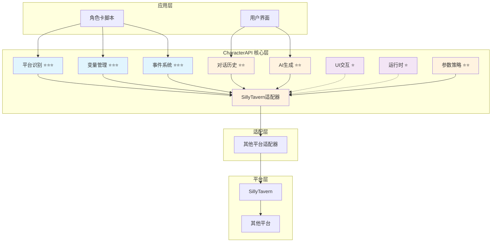
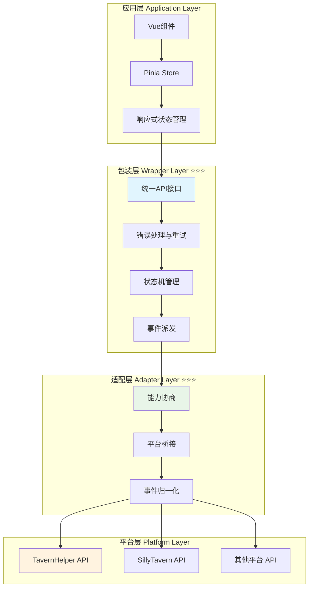
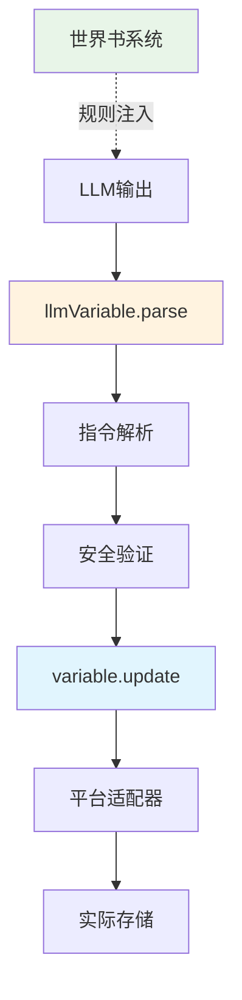
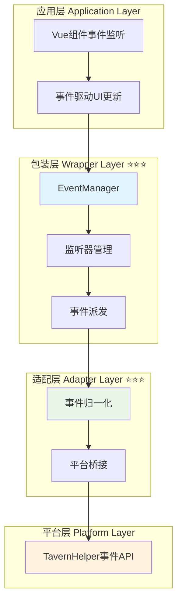
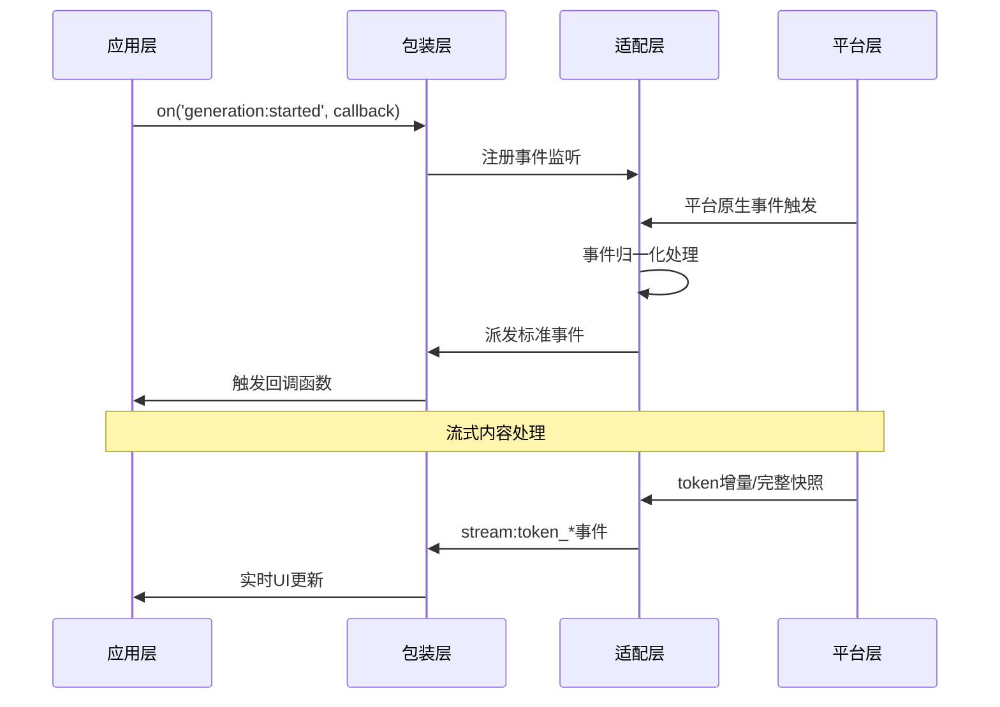

# 🎯 角色卡跨平台 API 规范 (RFC) v0.2

## 📋 快速导航

| 组件 | 职责 | 推荐度 | 适用场景 | 章节 |
|------|------|--------|----------|------|
| **平台识别** | 环境检测与初始化 | ⭐⭐⭐ **必需** | 所有场景 | [§3](#_3-基础-平台识别-⭐⭐⭐) |
| **变量管理** | 变量操作与数据管理 | ⭐⭐⭐ **必需** | 所有场景 | [§4.1](#_4-1-变量管理-characterapi-variable-⭐⭐⭐) |
| **LLM变量** | LLM驱动的变量更新 | ⭐⭐ **推荐** | LLM交互场景 | [§4.1.1](#_4-1-1-llm变量-characterapi-llmvariable-⭐⭐) |
| **事件系统** | 跨模块通信总线 | ⭐⭐⭐ **必需** | 所有场景 | [§4.2](#_4-2-事件系统-characterapi-events-⭐⭐⭐) |
| **对话历史** | 上下文访问与操作 | ⭐⭐ **推荐** | 对话场景 | [§4.3](#_4-3-对话历史-characterapi-chat-⭐⭐) |
| **AI 生成** | 文本生成与流式处理 | ⭐⭐ **推荐** | 生成场景 | [§4.4](#_4-4-ai-生成-characterapi-generation-⭐⭐) |
| **UI 交互** | 用户界面通知 | ⭐ **可选** | 交互场景 | [§4.5](#_4-5-ui-交互-characterapi-ui-⭐) |
| **运行时** | 代码执行与后端交互 | ⭐ **可选** | 高级场景 | [§4.6](#_4-6-运行时与后端交互-characterapi-runtime-⭐) |
| **参数策略** | 配置管理与降级 | ⭐⭐ **推荐** | 复杂场景 | [§4.7](#_4-7-参数策略-characterapi-parameters-⭐⭐) |
| **正则系统** | 文本匹配与替换 | ⭐⭐ **推荐** | 文本处理场景 | [§4.8](#_4-8-正则系统-characterapi-regex-⭐⭐) |

## 🏗️ 架构概览



## 🎯 摘要与设计理念

> **核心使命**：为 LLM 角色扮演平台间角色卡的互操作性与可移植性提供统一抽象层

### 💡 **设计理念更新**

CharacterAPI 作为"统一抽象层"继续保持平台无关与最小可用接口。基于工程落地需要，本版将"底层包装层等于规范"的理念前置：

- ✅ **规范驱动**：不仅定义接口，也定义事件与能力协商的最小约束
- ✅ **行为一致性**：确保"适配器 → 包装层 → 应用层"在行为上保持一致
- ✅ **参考实现**：TavernHelper 相关能力作为基线，通过"可选扩展"与"能力发现"纳入规范
- ✅ **平台中立**：不强制平台绑定，保持最大兼容性


## 🔧 核心原则

### 🎯 **设计原则**

| 原则 | 说明 | 实施策略 |
|------|------|----------|
| **🌐 平台无关** | 保持最小、稳定的接口与语义 | 杜绝平台特定耦合，使用抽象接口 |
| **📦 包装层等于规范** | 包装层的事件、日志与状态行为纳入RFC约束 | 成为兼容性判断依据 |
| **🤝 能力协商与降级** | 通过`capabilities`与特性检测声明支持能力 | 不支持时进行可预期降级 |
| **🎨 简单易用** | 默认参数保持简洁 | 可选扩展字段向后兼容 |
| **🔒 类型安全** | 以TypeScript定义接口 | 复杂对象采用可扩展通用schema |
| **👁️ 可观察性** | 标准化事件名与日志结构 | 支持生成链路的过程化观测与重放 |
| **🌊 流式策略规范化** | 统一增量/完整快照两种流式语义 | 允许实现选择"增量/快照/二者并发" |
| **📋 版本与兼容** | 通过语义化版本与能力检测 | 共同控制兼容范围 |

## 3. 基础：平台识别 ⭐⭐⭐

> **职责**：环境检测与初始化，为所有后续操作提供基础
> **必要性**：**绝对必需** - 一切交互的基础，无此无法进行任何操作

### ✅ 核心特性

- ✅ 自动检测宿主平台类型和版本
- ✅ 获取平台支持的功能特性列表
- ✅ 为适配器选择提供决策依据

### 🔧 接口定义

```typescript
interface PlatformInfo {
  name: string;            // e.g., "SillyTavern"
  version: string;         // e.g., "1.11.0"
  features: string[];      // e.g., ["GroupChat", "WorldInfo"]
}

window.platformAndInformation = function(): PlatformInfo {
  // ... platform-specific implementation
};
```

### 💡 **实施策略**

各平台需要实现`window.platformAndInformation()`方法，CharacterAPI库在初始化时首先调用此方法识别宿主环境。

## 4. API 规范详述

> **架构说明**：`CharacterAPI`为全局对象，按功能模块化组织

### 4.1 变量管理 (`CharacterAPI.variable`) ⭐⭐⭐

> **职责**：提供统一、可扩展的变量操作接口，封装平台差异，支持作用域管理、批量操作、数据校验等高级特性
> **必要性**：**绝对必需** - 所有变量操作的核心入口，角色卡数据存储的统一抽象层

#### ✅ 核心特性

- ✅ 统一的 get/set/update 接口
- ✅ 多作用域支持（chat/global/character/message/script/default）
- ✅ 批量操作与事务支持
- ✅ 数据校验与类型安全
- ✅ 自动错误处理与重试
- ✅ 变量监听与响应式更新
- ✅ 智能缓存策略（LRU 缓存）
- ✅ 平台能力自动检测与协商
- ✅ 事件驱动的状态同步

#### 🏗️ 四层架构设计

变量管理模块遵循标准的四层架构，每层职责清晰：



**层次职责说明**：

- **应用层** ⭐⭐：Vue/Pinia 集成，响应式状态管理（[详见应用层文档](./landing/variable/application.md)）
- **包装层** ⭐⭐⭐：统一 API 接口、错误处理、缓存策略、事件派发（[详见包装层文档](./landing/variable/wrapper.md)）
- **适配层** ⭐⭐⭐：平台差异封装、能力协商、事件桥接（[详见适配层文档](./landing/variable/adapter.md)）
- **平台层** ⭐⭐：TavernHelper、LocalStorage 等原生 API（[详见平台层文档](./landing/variable/platform.md)）

#### 🔧 核心类型定义

##### 作用域枚举

```typescript
enum VariableScope {
  CHAT = 'chat',           // 对话级别变量
  GLOBAL = 'global',       // 全局变量
  CHARACTER = 'character', // 角色变量
  MESSAGE = 'message',     // 消息级别变量
  SCRIPT = 'script',       // 脚本变量
  DEFAULT = 'default'      // 默认作用域（兜底）
}
```

##### 操作配置

```typescript
interface VariableConfig {
  scope?: VariableScope;    // 作用域
  validation?: boolean;     // 数据校验
  backup?: boolean;         // 备份原始数据
  encryption?: boolean;     // 数据加密
  ttl?: number;            // 生存时间（毫秒）
}
```

##### 结果封装

```typescript
interface VariableResult<T = any> {
  success: boolean;
  data?: T;
  error?: string;
  metadata: {
    scope: VariableScope;
    timestamp: number;
    operation: 'get' | 'set' | 'delete' | 'batch';
    affectedKeys: string[];
    platform: string;      // 平台标识
  };
}
```

##### 能力协商

```typescript
interface VariableCapabilities {
  supports: {
    scopes: {
      chat: boolean;
      global: boolean;
      character: boolean;
      message: boolean;
      script: boolean;
      default?: boolean;   // 默认作用域支持
    };
    features: {
      batch: boolean;        // 批量操作
      backup: boolean;       // 数据备份
      validation: boolean;   // 数据校验
      encryption: boolean;   // 数据加密
      ttl: boolean;         // 生存时间
      watch: boolean;       // 变量监听
      persistence: boolean; // 持久化能力
      async: boolean;       // 异步操作
    };
  };
}
```

#### 🔧 包装层接口概览

##### 核心管理器 (VariableManager) ⭐⭐⭐

```typescript
export class VariableManager {
  // 基础操作
  async get(key: string, scope?: VariableScope): Promise<string | undefined>
  async set(key: string, value: string, scope?: VariableScope): Promise<void>
  async delete(key: string, scope?: VariableScope): Promise<void>
  async exists(key: string, scope?: VariableScope): Promise<boolean>
  
  // 批量操作
  async getMany(keys: string[], scope?: VariableScope): Promise<Record<string, string | undefined>>
  async setMany(variables: Record<string, string>, scope?: VariableScope): Promise<void>
  async deleteMany(keys: string[], scope?: VariableScope): Promise<void>
  
  // 高级操作
  async getAll(scope?: VariableScope): Promise<Record<string, string>>
  async clear(scope?: VariableScope): Promise<void>
  async getKeys(scope?: VariableScope): Promise<string[]>
  
  // 缓存管理
  clearCache(): void
  getCacheStats(): { size: number; maxSize: number }
  
  // 事件系统
  addEventListener(type: string, listener: EventListener): void
  removeEventListener(type: string, listener: EventListener): void
  
  // 平台信息
  getPlatform(): string
  getCapabilities(): any
  getSupportedScopes(): VariableScope[]
}
```

##### 类型安全封装 (TypedVariableManager) ⭐⭐⭐

提供基于 schema 的类型安全、验证和转换功能：

```typescript
const gameSchema = {
  playerName: {
    type: 'string' as const,
    required: true,
    validator: (value: string) => value.length > 0
  },
  playerLevel: {
    type: 'number' as const,
    default: 1,
    validator: (value: number) => value >= 1 && value <= 100
  }
};

const gameVars = new TypedVariableManager(gameSchema);
await gameVars.set('playerName', '张三');     // ✅ 类型正确
const level = await gameVars.get('playerLevel'); // number 类型
```

##### 响应式封装 (ReactiveVariableManager) ⭐⭐

Vue 响应式系统集成（可选扩展）：

```typescript
const reactiveVars = new ReactiveVariableManager();

// 响应式变量
const playerName = reactiveVars.useVariable('playerName', VariableScope.CHAT, '未命名');

// 双向绑定
const playerGold = reactiveVars.useTwoWayBinding('playerGold', VariableScope.CHAT, 0);

// 计算属性
const playerPower = reactiveVars.useComputedVariable('playerPower', () => {
  return playerLevel.value * 100;
});
```

#### 🔧 适配层接口概览

##### 适配器标准合同 (VariableAdapter) ⭐⭐⭐

```typescript
export interface VariableAdapter {
  readonly platform: string;
  readonly capabilities: PlatformCapabilities;
  
  // 生命周期
  initialize(): Promise<void>;
  dispose(): Promise<void>;
  
  // 基础操作
  get(key: string, scope?: VariableScope): Promise<VariableResult<string>>;
  set(key: string, value: string, scope?: VariableScope): Promise<VariableResult<void>>;
  delete(key: string, scope?: VariableScope): Promise<VariableResult<void>>;
  exists(key: string, scope?: VariableScope): Promise<VariableResult<boolean>>;
  
  // 批量操作
  getMany(keys: string[], scope?: VariableScope): Promise<BatchResult<string>>;
  setMany(variables: Record<string, string>, scope?: VariableScope): Promise<BatchResult<void>>;
  deleteMany(keys: string[], scope?: VariableScope): Promise<BatchResult<void>>;
  
  // 高级操作
  getAll(scope?: VariableScope): Promise<VariableResult<Record<string, string>>>;
  clear(scope?: VariableScope): Promise<VariableResult<void>>;
  getKeys(scope?: VariableScope): Promise<VariableResult<string[]>>;
  
  // 能力查询
  getSupportedScopes(): VariableScope[];
  isScopeSupported(scope: VariableScope): boolean;
}
```

##### 工厂模式 (AdapterFactory) ⭐⭐⭐

```typescript
// 自动检测最佳适配器
const adapter = adapterFactory.create();
await adapter.initialize();

// 指定平台适配器
const tavernAdapter = adapterFactory.create('tavernHelper');

// 查询可用平台
const platforms = adapterFactory.getRegisteredPlatforms();
```

#### 🚀 使用示例

##### 基础使用

```typescript
// 初始化
await CharacterAPI.init();

// 获取变量
const result = await CharacterAPI.state.get<string>('playerName', 'character');
if (result !== null) {
  console.log('玩家名称:', result);
}

// 设置变量
await CharacterAPI.state.set('playerLevel', 10, 'character');

// 批量更新
await CharacterAPI.state.update({
  playerGold: 2000,
  playerExp: 1500
}, 'character');
```

##### 高级用法（使用包装层）

```typescript
import { VariableManager, TypedVariableManager, VariableScope } from '@/wrappers/variable-manager';

// 使用类型安全管理器
const typedManager = new TypedVariableManager(gameSchema, {
  enableCache: true,
  enableEvents: true
});

await typedManager.initialize();

// 类型安全操作
await typedManager.set('playerName', '张三');
const name = await typedManager.get('playerName'); // string 类型
```

##### Vue 组件集成

```vue
<script setup>
import { useVariableStore } from '@/stores/variableStore';
import { computed } from 'vue';

const store = useVariableStore();

// 从 Store 读取
const playerName = computed(() => store.getValue('player.name', 'character') ?? '未命名');
const playerLevel = computed(() => Number(store.getValue('player.level', 'character') ?? 1));
</script>

<template>
  <div>
    <div>玩家：{{ playerName }}</div>
    <div>等级：{{ playerLevel }}</div>
  </div>
</template>
```

#### 🔄 事件系统集成

变量操作会触发标准事件，便于监控和日志记录：

```typescript
// 变量变化事件
CharacterAPI.events.on('state:changed', (payload) => {
  console.log('变量变化:', {
    scope: payload.scope,
    key: payload.key,
    oldValue: payload.oldValue,
    newValue: payload.newValue,
    metadata: payload.metadata
  });
});

// 错误事件
CharacterAPI.events.on('variable:error', (error) => {
  console.error('变量操作错误:', error);
});
```

**事件负载结构**：

```typescript
interface StateChangedPayload {
  scope: 'chat' | 'global' | 'character' | 'message' | 'script';
  key: string;
  oldValue?: any;
  newValue?: any;
  metadata: {
    operation: 'get' | 'set' | 'delete' | 'batch' | 'clear';
    timestamp: number;
    affectedKeys: string[];
    platform: string;
  };
}
```

#### ⚠️ 平台兼容性

| 平台 | 作用域支持 | 批量操作 | 持久化 | 类型检查 | 推荐度 |
|------|-----------|---------|--------|---------|--------|
| **TavernHelper** | ✅ 完整支持 | ✅ 原生支持 | ✅ 自动持久化 | ✅ 原生支持 | ⭐⭐⭐ |
| **LocalStorage** | ⚠️ 部分支持 | ❌ 模拟实现 | ✅ 原生支持 | ❌ 不支持 | ⭐⭐ |
| **其他平台** | 🔧 通过适配器扩展 | 🔧 可配置 | 🔧 可配置 | 🔧 可配置 | ⭐ |

**能力降级策略**：

| 不支持的能力 | 降级策略 | 日志记录 |
|-------------|----------|----------|
| **批量操作** | 循环单次操作 | 记录降级原因和性能影响 |
| **特定作用域** | 使用命名空间前缀 | 记录作用域映射关系 |
| **验证** | 跳过验证步骤 | 警告数据一致性风险 |
| **加密** | 明文存储 | 警告安全风险 |

#### 💡 最佳实践

**性能优化**：
- ✅ 优先使用批量操作提升性能
- ✅ 合理使用缓存机制（LRU 策略）
- ✅ 避免频繁的全量获取
- ✅ 使用 `getMany` 代替多次 `get` 调用

**安全建议**：
- ✅ 敏感数据启用加密选项
- ✅ 合理设置 TTL 避免数据泄露
- ✅ 使用数据校验防止注入
- ✅ 在包装层进行统一的数据验证

**架构建议**：
- ✅ 生产环境使用 `TypedVariableManager`（类型安全）
- ✅ Vue 项目使用 Pinia Store + 事件桥接模式
- ✅ 确保调用 `initialize()` 和 `dispose()` 生命周期方法
- ✅ 使用工厂模式自动选择最佳适配器

#### 📚 详细文档

**核心实现文档**：
- [`index.md`](./landing/variable/index.md) - 变量模块总览与快速开始
- [`wrapper.md`](./landing/variable/wrapper.md) ⭐⭐⭐ - 包装层实现（核心管理器、类型安全、响应式）
- [`adapter.md`](./landing/variable/adapter.md) ⭐⭐⭐ - 适配层实现（SPI 合同、平台适配器、工厂模式）
- [`platform.md`](./landing/variable/platform.md) ⭐⭐ - 底层平台特性（能力对比、平台检测）

**应用集成文档**：
- [`application.md`](./landing/variable/application.md) ⭐⭐ - 应用层集成（业务场景、组件范例）
- [`advanced-application.md`](./landing/variable/advanced-application.md) ⭐ - 高级应用（Vue + Pinia 深度集成）

> 💡 **快速上手**：建议从 [`index.md`](./landing/variable/index.md) 开始，了解整体架构后再深入具体层次的文档。

### 4.1.1 LLM变量 (`CharacterAPI.llmVariable`) ⭐⭐

> **职责**：LLM驱动的变量更新机制，通过解析LLM输出的结构化指令自动更新变量
> **必要性**：**推荐使用** - LLM交互场景下的高级功能，简化变量管理

#### ✅ 核心特性

- ✅ 解析LLM输出的结构化指令（支持JSON和MVU两种格式）
- ✅ 规则驱动设计（通过世界书向LLM注入操作规则）
- ✅ 安全的变量路径验证
- ✅ JavaScript回调函数支持
- ✅ 自动初始化系统
- ✅ 完全基于 [`CharacterAPI.variable`](#_4-1-变量管理-characterapi-variable-⭐⭐⭐) 构建

#### 📋 指令格式规范

##### **推荐：JSON格式** ✨（黄金标准）

**为什么选择JSON？**
- ✅ **解析简单**：原生`JSON.parse()`，零解析成本
- ✅ **类型明确**：支持所有JSON类型，无需推断
- ✅ **结构清晰**：易于理解和调试
- ✅ **LLM友好**：LLM最擅长生成JSON格式

```json
// 单条指令
{
  "op": "assign",
  "path": ["player", "level"],
  "value": 2,
  "old": 1,
  "reason": "升级"
}

// 批量指令
[
  {"op": "assign", "path": ["player", "level"], "value": 2},
  {"op": "assign", "path": ["player", "hp"], "value": 120},
  {"op": "callback", "path": ["showMessage"], "value": ["恭喜升级！"]}
]
```

**支持的操作类型**：
- `assign` - 赋值操作
- `get` - 获取值
- `delete` - 删除
- `merge` - 深度合并对象
- `push` - 数组追加
- `callback` - 触发回调函数


#### 🔧 核心类型定义

##### 解析结果

```typescript
interface ParseResult {
  success: boolean;
  operations: Operation[];
  errors: ParseError[];
  metadata: {
    totalInstructions: number;
    successCount: number;
    failureCount: number;
    timestamp: number;
  };
}

interface Operation {
  type: 'assign' | 'get' | 'delete' | 'merge' | 'push' | 'pop' | 'callback';
  path: string;
  oldValue?: any;
  newValue?: any;
  reason?: string;
  success: boolean;
  error?: string;
  result?: any;
}
```

##### 初始化规则

```typescript
interface InitRule {
  path: string;
  value: any;
  condition: 'always' | 'once' | 'missing' | ((current: any) => boolean);
  scope?: VariableScope;
}

interface InitResult {
  success: boolean;
  initialized: string[];
  skipped: string[];
  errors: InitError[];
}
```

#### 🔧 接口概览

```typescript
interface LLMVariableManager {
  /** 解析并执行LLM输出的指令 */
  parse(llmOutput: string): Promise<ParseResult>;
  
  /** 注册JavaScript回调函数 */
  registerCallback(name: string, callback: Function): void;
  
  /** 配置初始化规则 */
  setInitRules(rules: InitRule[]): Promise<void>;
  
  /** 手动触发初始化 */
  initialize(): Promise<InitResult>;
  
  /** 获取解析统计信息 */
  getStats(): ParseStats;
}
```

#### 🚀 使用示例

##### 基础使用（JSON格式）

```typescript
// LLM输出（JSON格式）
const llmOutput = `
好的，我已经记录下来了。

\`\`\`json
[
  {
    "op": "assign",
    "path": ["player", "name"],
    "value": "张三",
    "reason": "设置玩家名字"
  },
  {
    "op": "assign",
    "path": ["player", "level"],
    "value": 1,
    "reason": "初始等级"
  },
  {
    "op": "assign",
    "path": ["player", "hp"],
    "value": 100,
    "reason": "初始生命值"
  }
]
\`\`\`
`;

// 解析并执行
const result = await CharacterAPI.llmVariable.parse(llmOutput);

// 内部调用 CharacterAPI.variable.update()
console.log('操作结果:', result.operations);
```

##### 回调函数与初始化

```typescript
// 1. 注册回调函数
CharacterAPI.llmVariable.registerCallback('onPlayerLevelUp', (player) => {
  console.log(`玩家升级到 ${player.level} 级！`);
});

CharacterAPI.llmVariable.registerCallback('showMessage', (msg) => {
  alert(msg);
});

// 2. 设置初始化规则
await CharacterAPI.llmVariable.setInitRules([
  {
    path: 'player',
    value: { name: '未命名', level: 1, hp: 100 },
    condition: 'missing'  // 变量不存在时才初始化
  },
  {
    path: 'game.started',
    value: true,
    condition: 'once'  // 只初始化一次
  }
]);

// 3. 手动初始化
await CharacterAPI.llmVariable.initialize();

// 4. LLM输出会自动解析
// LLM可以使用回调：
// {"op":"callback","path":["onPlayerLevelUp"],"value":[{"level":6}]}
```

#### 🏗️ 架构关系



**关键设计**：
- ✅ **不重复造轮**：复用 [`variable`](#_4-1-变量管理-characterapi-variable-⭐⭐⭐) 的所有能力
- ✅ **专注核心**：只做"LLM指令解析"这一增量功能
- ✅ **透明传递**：所有 [`variable`](#_4-1-变量管理-characterapi-variable-⭐⭐⭐) 的配置选项都可使用
- ✅ **规则驱动**：通过世界书系统向LLM注入操作规则

#### 🔄 事件系统集成

```typescript
// LLM指令解析完成事件
CharacterAPI.events.on('llm:instruction:parsed', (payload) => {
  console.log('指令解析完成:', {
    operations: payload.operations.length,
    errors: payload.errors.length,
    parseTime: payload.metadata.parseTime
  });
});

// 指令执行事件
CharacterAPI.events.on('llm:instruction:executed', (payload) => {
  console.log('指令执行:', payload.operation);
});

// 初始化完成事件
CharacterAPI.events.on('llm:initialized', (payload) => {
  console.log('变量初始化完成:', {
    initialized: payload.initialized,
    skipped: payload.skipped
  });
});

// 错误事件
CharacterAPI.events.on('llm:instruction:error', (payload) => {
  console.error('指令执行错误:', payload.error);
});
```

#### ⚠️ 平台兼容性

| 平台 | 世界书支持 | 规则注入 | 推荐度 |
|------|-----------|---------|--------|
| **MVU** | ✅ 完整支持 | ✅ 原生支持 | ⭐⭐⭐ |
| **其他平台** | ⚠️ 需确认 | 🔧 适配器扩展 | ⭐⭐ |

#### 💡 MVU机制传承

本模块传承自MagVarUpdate (MVU)工具，保持其核心理念：
- ✅ **规则驱动**：通过世界书向LLM注入规则
- ✅ **结构化输出**：LLM按格式输出变量操作指令
- ✅ **自动解析**：脚本自动解析并执行指令

同时进行了全面增强：
- ✅ **双格式支持**：JSON（推荐）+ MVU（兼容）
- ✅ **跨平台支持**：统一的适配层
- ✅ **类型安全**：完整TypeScript类型定义
- ✅ **完整集成**：融入CharacterAPI体系
- ✅ **事件驱动**：完整的事件系统
- ✅ **初始化系统**：自动化变量初始化

#### 📚 详细文档

**核心实现文档**：
- [`index.md`](./landing/llm-variable/index.md) - LLM变量模块总览与快速开始
- [`wrapper.md`](./landing/llm-variable/wrapper.md) ⭐⭐⭐ - 包装层实现（指令解析、回调系统）
- [`adapter.md`](./landing/llm-variable/adapter.md) ⭐⭐⭐ - 规则注入系统（世界书集成）
- [`platform.md`](./landing/llm-variable/platform.md) ⭐⭐ - 平台特性分析（世界书能力、MVU机制）

**应用集成文档**：
- [`application.md`](./landing/llm-variable/application.md) ⭐⭐ - 应用层集成（Vue/Pinia集成、UI响应式更新）
- [`advanced-application.md`](./landing/llm-variable/advanced-application.md) ⭐ - 高级应用（复杂场景、性能优化）

> 💡 **快速上手**：建议从 [`index.md`](./landing/llm-variable/index.md) 开始，了解整体架构后再深入具体实现文档。

### 4.2 事件系统 (`CharacterAPI.events`) ⭐⭐⭐

> **职责**：标准事件总线，统一平台事件与模块间通信，支持生成过程和流式token事件
> **必要性**：**绝对必需** - 模块解耦和异步通信的基础设施

#### ✅ 核心特性

- ✅ 标准化事件名称和负载格式
- ✅ 支持生成过程事件（started/progress/ended/error）
- ✅ 支持流式token事件（incremental/full）
- ✅ 事件监听器的生命周期管理
- ✅ 自定义事件派发机制
- ✅ 事件优先级与错误隔离
- ✅ 完整的事件链路追踪

#### 🏗️ 四层架构设计

事件系统遵循标准的四层架构，每层职责清晰：



**层次职责说明**：

- **应用层** ⭐⭐：Vue组件集成、响应式处理（[详见应用层文档](./landing/event/application.md)）
- **包装层** ⭐⭐⭐：统一事件API、监听器管理、错误处理（[详见包装层文档](./landing/event/wrapper.md)）
- **适配层** ⭐⭐⭐：事件归一化、平台桥接、事件映射（[详见适配层文档](./landing/event/adapter.md)）
- **平台层** ⭐⭐：TavernHelper原生事件系统（[详见平台层文档](./landing/event/platform.md)）

#### 🔧 核心类型定义

##### 标准事件名称

```typescript
/** 标准事件名称枚举 */
type StandardEventName =
  // 消息事件
  | 'message:sent'
  | 'message:received'
  
  // 状态变化事件
  | 'state:changed'
  
  // 生成过程事件
  | 'generation:started'
  | 'generation:progress'
  | 'generation:ended'
  | 'generation:error'
  
  // 流式内容事件
  | 'stream:token_incremental'  // 增量片段
  | 'stream:token_full';         // 完整快照
```

##### 事件管理器接口

```typescript
interface EventManager {
  /**
   * 监听标准事件（返回取消函数）
   * @param eventName 标准事件名称
   * @param callback 回调函数
   * @returns 取消监听函数
   */
  on(eventName: StandardEventName, callback: (payload: any) => void): () => void;
  
  /**
   * 一次性监听事件
   * @param eventName 标准事件名称
   * @param callback 回调函数
   * @returns 取消监听函数
   */
  once(eventName: StandardEventName, callback: (payload: any) => void): () => void;
  
  /**
   * 取消监听事件
   * @param eventName 标准事件名称
   * @param callback 可选的具体回调函数
   */
  off(eventName: StandardEventName, callback?: (payload: any) => void): void;
  
  /**
   * 派发自定义事件
   * @param eventName 事件名称
   * @param detail 事件数据
   */
  emit(eventName: string, detail: any): void;
  
  /**
   * 清除所有监听器
   */
  clear(): void;
}
```

#### 📋 事件负载结构

##### 生成事件负载

```typescript
/** 生成事件负载接口 */
interface GenerationEventPayload {
  generation_id?: string;
  prompt?: string;
  options?: any;
  progress?: {
    tokens?: number;
    elapsed_ms?: number;
  };
  result?: string;
  error?: {
    code?: string;
    message: string;
  };
  timestamp: number;
}
```

##### 流式Token负载

```typescript
/** 流式Token负载接口 */
interface StreamTokenPayload {
  generation_id?: string;
  token?: string;          // 增量单token或小片段
  full?: string;           // 完整快照（当stream:token_full时）
  index?: number;          // 序号（可选）
  timestamp: number;
}
```

##### 状态变化负载

```typescript
/** 状态变化负载接口 */
interface StateChangedPayload {
  scope: string;
  key: string;
  oldValue: any;
  newValue: any;
  metadata: {
    operation: string;
    timestamp: number;
    affectedKeys: string[];
    platform: string;
  };
}
```

#### 🚀 使用示例

##### 基础使用

```typescript
// 初始化
await CharacterAPI.init();

// 监听生成开始事件
const unsubscribe = CharacterAPI.events.on('generation:started', (payload) => {
  console.log('生成开始:', payload.generation_id);
});

// 监听流式内容
CharacterAPI.events.on('stream:token_incremental', (payload) => {
  console.log('增量内容:', payload.token);
});

// 监听生成完成
CharacterAPI.events.on('generation:ended', (payload) => {
  console.log('生成完成:', payload.result);
});

// 清理监听器
unsubscribe();
```

##### 完整事件处理

```typescript
// 创建生成任务并监听所有事件
async function generateWithFullObservability() {
  const generationId = 'gen-' + Date.now();
  let fullText = '';
  
  // 监听开始
  const offStarted = CharacterAPI.events.on('generation:started', (p) => {
    if (p.generation_id === generationId) {
      console.log('开始生成:', p.prompt);
    }
  });
  
  // 监听进度
  const offProgress = CharacterAPI.events.on('generation:progress', (p) => {
    if (p.generation_id === generationId) {
      console.log('进度:', p.progress);
    }
  });
  
  // 监听增量内容
  const offIncremental = CharacterAPI.events.on('stream:token_incremental', (p) => {
    if (p.generation_id === generationId) {
      fullText += p.token;
      console.log('当前内容:', fullText);
    }
  });
  
  // 监听完成
  const offEnded = CharacterAPI.events.on('generation:ended', (p) => {
    if (p.generation_id === generationId) {
      console.log('最终结果:', p.result);
    }
  });
  
  // 监听错误
  const offError = CharacterAPI.events.on('generation:error', (p) => {
    if (p.generation_id === generationId) {
      console.error('生成错误:', p.error);
    }
  });
  
  try {
    // 执行生成
    const result = await CharacterAPI.generation.generateWithPreset({
      user_input: '你好',
      stream: true,
      generation_id: generationId
    });
    
    return result;
  } finally {
    // 清理监听器
    offStarted();
    offProgress();
    offIncremental();
    offEnded();
    offError();
  }
}
```

##### Vue组件集成

```vue
<template>
  <div>
    <div v-if="isGenerating">生成中... {{ progress }}%</div>
    <div>{{ generatedText }}</div>
  </div>
</template>

<script setup>
import { ref, onMounted, onUnmounted } from 'vue';

const isGenerating = ref(false);
const progress = ref(0);
const generatedText = ref('');
const unsubscribers = [];

onMounted(() => {
  // 监听生成开始
  unsubscribers.push(
    CharacterAPI.events.on('generation:started', () => {
      isGenerating.value = true;
      progress.value = 0;
      generatedText.value = '';
    })
  );
  
  // 监听流式内容
  unsubscribers.push(
    CharacterAPI.events.on('stream:token_incremental', (payload) => {
      generatedText.value += payload.token;
    })
  );
  
  // 监听完成
  unsubscribers.push(
    CharacterAPI.events.on('generation:ended', () => {
      isGenerating.value = false;
      progress.value = 100;
    })
  );
});

onUnmounted(() => {
  // 清理所有监听器
  unsubscribers.forEach(unsub => unsub());
});
</script>
```

#### 📡 事件流程图



#### 📋 事件分类与优先级

##### 生命周期事件 ⭐⭐⭐

| 事件名称 | 触发时机 | 数据载荷 | 必要性 |
|----------|----------|----------|--------|
| `generation:started` | 生成开始 | `{ generation_id, prompt, options, timestamp }` | ⭐⭐⭐ |
| `generation:progress` | 生成进度更新 | `{ generation_id, progress, timestamp }` | ⭐⭐⭐ |
| `generation:ended` | 生成完成 | `{ generation_id, result, timestamp }` | ⭐⭐⭐ |
| `generation:error` | 生成错误 | `{ generation_id, error, timestamp }` | ⭐⭐⭐ |

##### 流式内容事件 ⭐⭐⭐

| 事件名称 | 触发时机 | 数据载荷 | 必要性 |
|----------|----------|----------|--------|
| `stream:token_incremental` | 增量内容到达 | `{ generation_id, token, index, timestamp }` | ⭐⭐⭐ |
| `stream:token_full` | 完整快照更新 | `{ generation_id, full, timestamp }` | ⭐⭐ |

##### 状态与消息事件 ⭐⭐

| 事件名称 | 触发时机 | 数据载荷 | 必要性 |
|----------|----------|----------|--------|
| `state:changed` | 变量状态改变 | `{ scope, key, oldValue, newValue, metadata }` | ⭐⭐⭐ |
| `message:sent` | 消息发送 | `{ message, timestamp }` | ⭐⭐ |
| `message:received` | 消息接收 | `{ message, timestamp }` | ⭐⭐ |

#### ⚠️ 平台兼容性

| 平台 | 事件系统 | 流式支持 | 自定义事件 | 推荐度 |
|------|---------|---------|-----------|--------|
| **TavernHelper** | ✅ 完整支持 | ✅ 增量+快照 | ✅ 原生支持 | ⭐⭐⭐ |
| **其他平台** | 🔧 通过适配器 | 🔧 可配置 | 🔧 可配置 | ⭐⭐ |

**平台特性说明**：

- **TavernHelper**：提供完整的 `eventOn/eventOff/eventOnce/eventEmit` API
- **流式模式**：同时支持增量（`STREAM_TOKEN_RECEIVED_INCREMENTALLY`）和快照（`STREAM_TOKEN_RECEIVED_FULLY`）
- **生命周期**：完整的 `GENERATION_STARTED` 和 `GENERATION_ENDED` 事件
- **错误处理**：需在适配层补充错误事件（平台无专用错误事件）

#### 💡 最佳实践

**事件监听**：
- ✅ 总是在组件卸载时清理监听器
- ✅ 使用 `generation_id` 追踪特定生成任务
- ✅ 处理所有错误事件，提供友好提示
- ✅ 在 Vue 组件中使用 `onUnmounted` 自动清理

**性能优化**：
- ✅ 对高频事件使用节流或防抖
- ✅ 使用条件监听减少不必要的事件处理
- ✅ 批量处理流式内容更新
- ❌ 避免在事件回调中执行耗时同步操作

**错误处理**：
- ✅ 每个监听器都应有独立的错误处理
- ✅ 错误不应阻止其他监听器执行
- ✅ 使用统一的错误日志记录
- ✅ 提供用户友好的错误提示

#### 📚 详细文档

**核心实现文档**：
- [`index.md`](./landing/event/index.md) - 事件系统总览与快速开始
- [`wrapper.md`](./landing/event/wrapper.md) ⭐⭐⭐ - 包装层实现（EventManager、监听器管理）
- [`adapter.md`](./landing/event/adapter.md) ⭐⭐⭐ - 适配层实现（事件归一化、平台桥接）
- [`platform.md`](./landing/event/platform.md) ⭐⭐ - 底层平台特性（TavernHelper事件系统分析）

**应用集成文档**：
- [`application.md`](./landing/event/application.md) ⭐⭐ - 应用层集成（Vue组件、响应式处理）

> 💡 **快速上手**：建议从 [`index.md`](./landing/event/index.md) 开始，了解整体架构后再深入具体层次的文档。

### 4.3 对话历史 (`CharacterAPI.chat`) ⭐⭐

> **职责**：访问与操作对话上下文
> **必要性**：**推荐使用** - 对话场景下的上下文管理

::: warning 
暂未实现
:::

#### ✅ 核心特性

- ✅ 灵活的历史记录获取选项
- ✅ 支持文本和JSON格式输出
- ✅ 消息插入和位置控制

#### 🔧 接口概览

```typescript
interface ChatManager {
  getHistory(options?: { count?: number; format?: 'text' | 'json' }): Promise<any>;
  addMessage(message: object, position?: 'last' | 'first' | number): Promise<void>;
}
```

### 4.4 AI 生成 (`CharacterAPI.generation`) ⭐⭐

> **职责**：封装AI文本生成请求，支持流式处理和能力协商
> **必要性**：**推荐使用** - 生成场景下的核心功能

#### ✅ 核心特性

- ✅ 预设模式和原始模式生成
- ✅ 流式处理和增量/快照双模式
- ✅ 能力发现和自动降级
- ✅ 自定义API后端支持

#### 🔧 基础类型定义

```typescript
interface Overrides { [key: string]: any }
interface InjectionPrompt { id: string; content: string }
interface CustomApiConfig { 
  endpoint: string; 
  headers?: Record<string, string>; 
  body?: any 
}

interface PromptEntry {
  type: 'builtin' | 'role' | 'custom';
  content: string;
  role?: 'system' | 'user' | 'assistant' | 'tool';
  id?: string;
}
```

#### 🌊 流式分发策略

```typescript
interface StreamDeliveryOptions {
  /** 是否转发增量内容（默认 true） */
  stream_use_incremental?: boolean;
  /** 是否转发完整快照（默认 false） */
  stream_use_full?: boolean;
}
```

#### ⚙️ 生成选项

```typescript
interface BaseGenerationOptions {
  stream?: boolean;
  generation_id?: string;
  delivery?: StreamDeliveryOptions;
}

interface PresetGenerationOptions extends BaseGenerationOptions {
  user_input?: string;
  image?: File | string | (File | string)[];
  overrides?: Overrides;
  injects?: Omit<InjectionPrompt, 'id'>[];
  max_chat_history?: 'all' | number;
  custom_api?: CustomApiConfig;
}

interface RawGenerationOptions extends PresetGenerationOptions {
  ordered_prompts?: PromptEntry[];
}
```

#### 🔍 能力发现

```typescript
interface GenerationCapabilities {
  supports: {
    stream: { incremental: boolean; full: boolean };
    image: boolean;
    overrides: boolean;
    injects: boolean;
    stop: boolean;
  };
}
```

#### 🎛️ 生成管理器

```typescript
interface GenerationManager {
  /** 预设模式生成（映射平台当前启用预设） */
  generateWithPreset(prompt: string, options?: PresetGenerationOptions): Promise<string>;

  /** 原始模式生成（完全自定义提示词） */
  generateRaw(ordered_prompts: PromptEntry[], options?: RawGenerationOptions): Promise<string>;

  /** 停止所有进行中的生成任务 */
  stop(): Promise<void>;

  /** 能力发现（可选实现，用于协商与UI提示） */
  getCapabilities?(): Promise<GenerationCapabilities>;
}
```

### 4.5 UI 交互 (`CharacterAPI.ui`) ⭐

> **职责**：用户界面通知和交互
> **必要性**：**可选扩展** - 增强用户体验的辅助功能

::: warning 
暂未实现
:::

#### 🔧 接口概览

```typescript
interface UIManager {
  notify(message: string, type: 'info' | 'success' | 'warning' | 'error'): Promise<void>;
}
```

### 4.6 运行时与后端交互 (`CharacterAPI.runtime`) ⭐

> **职责**：代码执行与后端交互
> **必要性**：**可选扩展** - 高级场景下的扩展能力

::: warning 
暂未实现
:::

#### 🔧 接口概览

```typescript
interface RuntimeManager {
  executeCode<T>(code: string, context?: object): Promise<T>;
  getFinalPrompt(prompt: string): Promise<string>;
}
```

### 4.7 参数策略 (`CharacterAPI.parameters`) ⭐⭐

> **职责**：配置管理与降级策略
> **必要性**：**推荐使用** - 复杂场景下的参数管理和能力协商

::: warning 
暂未实现
:::

#### ✅ 核心特性

- ✅ 多作用域默认参数管理
- ✅ 能力协商与显式降级
- ✅ 参数校验与归一化
- ✅ 策略决策与日志记录

#### 🔧 接口概览

```typescript
interface ParameterPolicyManager {
  /** 获取指定作用域的默认参数集合 */
  getDefaults(scope?: 'character' | 'chat' | 'global'): Promise<Partial<PresetGenerationOptions & RawGenerationOptions>>;

  /** 设置/合并默认参数集合（作用域可选） */
  setDefaults(defaults: Partial<PresetGenerationOptions & RawGenerationOptions>, scope?: 'character' | 'chat' | 'global'): Promise<void>;

  /** 预设模式：按能力协商与规范进行归一化（默认值 + 校验 + 显式降级） */
  normalizePreset(input: PresetGenerationOptions, caps?: GenerationCapabilities): Promise<PresetGenerationOptions>;

  /** 原始模式：按能力协商与规范进行归一化（默认值 + 校验 + 显式降级） */
  normalizeRaw(input: RawGenerationOptions, caps?: GenerationCapabilities): Promise<RawGenerationOptions>;

  /** 参数校验（范围/类型/互斥关系等），返回问题列表而非抛错，便于UI告警与日志记录 */
  validate(options: PresetGenerationOptions | RawGenerationOptions): { ok: boolean; issues: string[] };
}
```

#### 💡 **协作策略**

- **包装层**：发起生成前调用`parameters.normalizePreset/normalizeRaw`，合并状态偏好并依据`generation.getCapabilities()`做能力协商
- **适配层**：仅做平台形状转换，不承担策略决策
- **状态模块**：持久化参数偏好
- **事件/日志模块**：记录校验与降级行为

### 4.8 正则系统 (`CharacterAPI.regex`) ⭐⭐

> **职责**：统一的正则表达式管理与文本处理接口
> **必要性**：**推荐使用** - 文本处理和内容过滤场景下的核心功能

#### ✅ 核心特性

- ✅ 统一的正则表达式CRUD操作
- ✅ 灵活的匹配规则配置（source/destination双维度）
- ✅ 作用域控制（全局/角色级别）
- ✅ 深度过滤支持
- ✅ 实时文本格式化
- ✅ 批量规则管理

#### 🔧 核心类型定义

##### 正则规则

```typescript
interface RegexRule {
  id: string;                    // 规则唯一标识
  name: string;                  // 规则名称
  enabled: boolean;              // 是否启用
  scope: 'global' | 'character'; // 作用域
  pattern: string;               // 正则表达式模式
  replacement: string;           // 替换字符串
  flags?: string;                // 正则标志
  
  source: {
    user_input: boolean;         // 应用于用户输入
    ai_output: boolean;          // 应用于AI输出
    slash_command: boolean;      // 应用于斜杠命令
    world_info: boolean;         // 应用于世界书
  };
  
  destination: {
    display: boolean;            // 应用于显示
    prompt: boolean;             // 应用于提示词
  };
  
  min_depth?: number | null;     // 最小深度
  max_depth?: number | null;     // 最大深度
  run_on_edit?: boolean;         // 编辑时是否执行
}
```

##### 格式化选项

```typescript
interface FormatTextOptions {
  source: 'user_input' | 'ai_output' | 'slash_command' | 'world_info';
  destination: 'display' | 'prompt';
  depth?: number;
  character_name?: string;
  apply_rules?: string[];        // 仅应用指定规则
  skip_rules?: string[];         // 跳过指定规则
}
```

##### 能力发现

```typescript
interface RegexCapabilities {
  supports: {
    scopes: {
      global: boolean;
      character: boolean;
    };
    features: {
      depth_filter: boolean;
      run_on_edit: boolean;
      batch_update: boolean;
      real_time_format: boolean;
    };
    sources: {
      user_input: boolean;
      ai_output: boolean;
      slash_command: boolean;
      world_info: boolean;
    };
  };
}
```

#### 🔧 接口概览

```typescript
interface RegexManager {
  /** 获取正则规则列表 */
  getRegexes(options?: RegexConfig): Promise<RegexRule[]>;
  
  /** 添加正则规则 */
  addRegex(rule: Omit<RegexRule, 'id'>): Promise<RegexRule>;
  
  /** 更新正则规则 */
  updateRegex(id: string, updates: Partial<RegexRule>): Promise<RegexRule>;
  
  /** 删除正则规则 */
  deleteRegex(id: string): Promise<void>;
  
  /** 批量更新正则规则 */
  updateRegexes(updater: (rules: RegexRule[]) => RegexRule[]): Promise<RegexRule[]>;
  
  /** 完全替换正则规则列表 */
  replaceRegexes(rules: RegexRule[], options?: { scope?: 'global' | 'character' }): Promise<void>;
  
  /** 对文本应用正则处理 */
  formatText(text: string, options: FormatTextOptions): Promise<string>;
  
  /** 检查角色正则是否启用 */
  isCharacterRegexEnabled(): Promise<boolean>;
  
  /** 校验正则表达式 */
  validatePattern(pattern: string, flags?: string): { valid: boolean; error?: string };
  
  /** 能力发现 */
  getCapabilities?(): Promise<RegexCapabilities>;
}
```

#### 🚀 使用示例

```typescript
// 添加隐藏动作描述的正则
const regex = await CharacterAPI.regex.addRegex({
  name: '隐藏动作描述',
  enabled: true,
  scope: 'global',
  pattern: '\\*[^*]+\\*',
  replacement: '',
  source: {
    user_input: false,
    ai_output: true,
    slash_command: false,
    world_info: false
  },
  destination: {
    display: true,
    prompt: false
  }
});

// 对文本应用正则处理
const processed = await CharacterAPI.regex.formatText(
  '*微笑* 你好！',
  {
    source: 'ai_output',
    destination: 'display'
  }
);
// 结果: " 你好！"

// 批量启用包含关键词的正则
await CharacterAPI.regex.updateRegexes((rules) => {
  return rules.map(rule => {
    if (rule.name.includes('过滤')) {
      return { ...rule, enabled: true };
    }
    return rule;
  });
});
```

#### 🔄 事件系统集成

```typescript
// 正则规则变化事件
CharacterAPI.events.on('regex:changed', (payload) => {
  console.log('正则规则已更新:', payload.rules);
});

// 正则应用事件
CharacterAPI.events.on('regex:applied', (payload) => {
  console.log('已应用正则:', {
    original: payload.original,
    processed: payload.processed
  });
});
```

#### ⚠️ 平台兼容性

- **TavernHelper**：完整支持所有特性
- **其他平台**：通过适配器实现基础功能，可能不支持深度过滤

#### 💡 最佳实践

- ✅ 合理使用作用域（全局 vs 角色）
- ✅ 启用深度过滤避免重复处理
- ✅ 使用批量更新提升性能
- ✅ 校验正则表达式合法性
- ❌ 避免过于复杂的正则模式
- ❌ 避免频繁调用 replaceRegexes

> 📖 **详细文档参考**：[正则系统完整规范](./landing/regex/index.md)

## 5. 生成事件标准 📋

### 🔄 事件分类

#### **过程事件**

- `generation:started` - 生成开始
- `generation:progress` - 生成进度更新
- `generation:ended` - 生成完成
- `generation:error` - 生成错误

#### **流式事件**

- `stream:token_incremental` - 增量片段
- `stream:token_full` - 完整快照

### ⚠️ **语义要求**

- ✅ 同一`generation_id`的事件应可串联复盘
- ✅ 启用`delivery.stream_use_incremental`时至少派发增量事件
- ✅ 启用`delivery.stream_use_full`时至少派发快照事件
- ✅ 两种流式模式可并发使用
- ✅ 非流式时，过程事件仍建议派发（至少started/ended）

## 6. 能力发现与降级约定 🤝

### 💡 **实施建议**

- **能力发现**：建议实现`generation.getCapabilities()`，用于UI与调用方做运行时协商
- **降级策略**：当目标能力不支持时进行优雅降级

### 📋 **降级规则**

| 不支持能力 | 降级策略 | 记录方式 |
|------------|----------|----------|
| `stream_use_full` | 降级为仅增量或关闭流式 | 日志/警告记录 |
| `image` | 忽略`image`字段 | 日志/警告记录 |
| `overrides/injects` | 忽略相关字段 | 日志/警告记录 |
| `stop` | `stop()`返回no-op | 日志记录 |

### 📊 **协商结果记录**

建议包装层统一记录"协商结果"，便于诊断与一致性校验。

## 7. 实现与使用指南 🚀

### 🏗️ 核心库架构

```typescript
// CharacterAPI.js（示意）
const adapters = {};
const CharacterAPI = { 
  state: {}, 
  events: {}, 
  generation: {}, 
  ui: {},
  
  registerAdapter(platformName, adapter) { 
    adapters[platformName] = adapter; 
  },
  
  async init() {
    if (typeof window.platformAndInformation !== 'function') {
      throw new Error('Platform identification missing.');
    }
    
    const platform = window.platformAndInformation();
    const adapter = adapters[platform.name];
    
    if (!adapter) {
      throw new Error(`Adapter for ${platform.name} not found.`);
    }
    
    this.state = adapter.state; 
    this.events = adapter.events; 
    this.generation = adapter.generation; 
    this.ui = adapter.ui;
    
    console.log(`CharacterAPI initialized for ${platform.name} v${platform.version}.`);
  }
};

window.CharacterAPI = CharacterAPI;
```

### 🎯 **最小使用流程**

```typescript
// 1. 初始化
await CharacterAPI.init();

// 2. 能力发现（可选）
const caps = await CharacterAPI.generation.getCapabilities?.();

// 3. 执行生成
const reply = await CharacterAPI.generation.generateWithPreset(
  '请给出今日修炼建议',
  {
    stream: true,
    generation_id: 'gen-001',
    delivery: { stream_use_incremental: true, stream_use_full: false },
    overrides: { temperature: 0.7 },
    injects: [{ content: '请以导师口吻作答。' }],
    max_chat_history: 10
  }
);
```

### 📊 **事件监听最佳实践**

```typescript
// 生成过程监听
const offStarted = CharacterAPI.events.on('generation:started', 
  (p) => Logger.record({ type: 'generation', stage: 'started', payload: p })
);

const offProgress = CharacterAPI.events.on('generation:progress', 
  (p) => Logger.record({ type: 'generation', stage: 'progress', payload: p })
);

const offEnded = CharacterAPI.events.on('generation:ended', 
  (p) => Logger.record({ type: 'generation', stage: 'ended', payload: p })
);

// 流式内容收集
const offStreamInc = CharacterAPI.events.on('stream:token_incremental', 
  (p) => StreamCollector.push(p)
);

// 清理监听器
function cleanup() {
  offStarted();
  offProgress();
  offEnded();
  offStreamInc();
}
```

## 8. 版本控制与扩展性 📋

### 🔖 **版本管理**

- ✅ 在`window.CharacterAPI.version`暴露语义化版本
- ✅ 通过`getCapabilities()`与特性检测决定启用范围
- ✅ 高级能力（GroupChat、WorldInfo等）通过`features`暴露

### 🔧 **扩展机制**

- ✅ 对复杂对象（如世界信息）定义通用schema
- ✅ 提供转换工具以屏蔽平台差异
- ✅ 支持自定义适配器注册

### 💡 **实施策略**

```typescript
// 版本检查示例
if (CharacterAPI.version >= '0.2.0') {
  // 使用新功能
  const caps = await CharacterAPI.generation.getCapabilities();
} else {
  // 降级处理
  console.warn('CharacterAPI version too old, some features unavailable');
}
```

## 9. 开放性问题与未来规划 🔮

### ❓ **当前开放性问题**

- **API版本控制**：多版本共存与兼容策略的细化（建议引入最低能力矩阵）
- **复杂数据结构**：跨平台schema的标准与扩展点
- **权限管理**：角色卡脚本对后端/运行时能力的访问边界与安全模型

### 🚀 **未来发展方向**

- **能力矩阵标准化**：建立更精细的能力发现和兼容性判断机制
- **插件生态系统**：支持第三方扩展和插件开发
- **性能优化**：流式处理和大数据场景的性能优化

---
