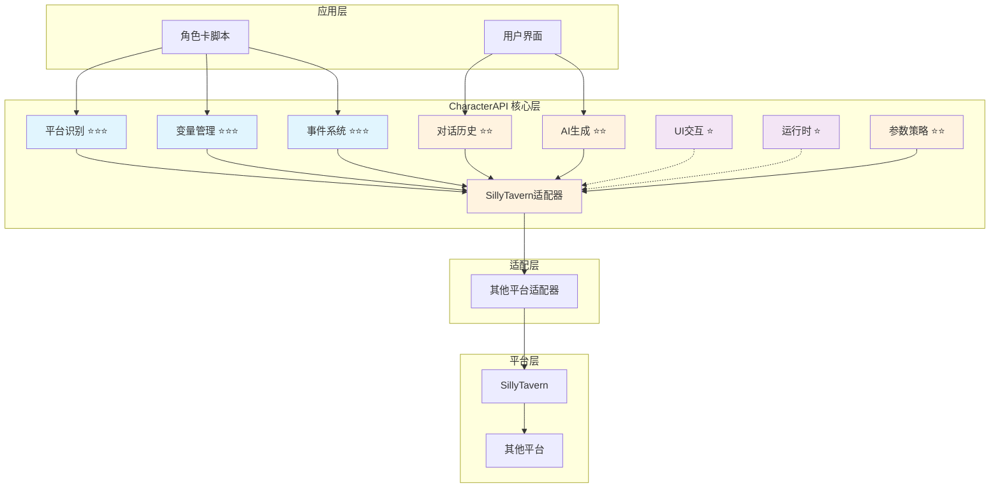

# 🎯 角色卡跨平台 API 规范 (RFC) v0.2

## 📋 快速导航

| 组件 | 职责 | 推荐度 | 适用场景 | 章节 |
|------|------|--------|----------|------|
| **平台识别** | 环境检测与初始化 | ⭐⭐⭐ **必需** | 所有场景 | [§3](#_3-基础-平台识别-⭐⭐⭐) |
| **变量管理** | 变量操作与数据管理 | ⭐⭐⭐ **必需** | 所有场景 | [§4.1](#_4-1-变量管理-characterapi-variable-⭐⭐⭐) |
| **LLM变量** | LLM驱动的变量更新 | ⭐⭐ **推荐** | LLM交互场景 | [§4.1.1](#_4-1-1-llm变量-characterapi-llmvariable-⭐⭐) |
| **事件系统** | 跨模块通信总线 | ⭐⭐⭐ **必需** | 所有场景 | [§4.2](#_4-2-事件系统-characterapi-events-⭐⭐⭐) |
| **对话历史** | 上下文访问与操作 | ⭐⭐ **推荐** | 对话场景 | [§4.3](#_4-3-对话历史-characterapi-chat-⭐⭐) |
| **AI 生成** | 文本生成与流式处理 | ⭐⭐ **推荐** | 生成场景 | [§4.4](#_4-4-ai-生成-characterapi-generation-⭐⭐) |
| **UI 交互** | 用户界面通知 | ⭐ **可选** | 交互场景 | [§4.5](#_4-5-ui-交互-characterapi-ui-⭐) |
| **运行时** | 代码执行与后端交互 | ⭐ **可选** | 高级场景 | [§4.6](#_4-6-运行时与后端交互-characterapi-runtime-⭐) |
| **参数策略** | 配置管理与降级 | ⭐⭐ **推荐** | 复杂场景 | [§4.7](#_4-7-参数策略-characterapi-parameters-⭐⭐) |
| **正则系统** | 文本匹配与替换 | ⭐⭐ **推荐** | 文本处理场景 | [§4.8](#_4-8-正则系统-characterapi-regex-⭐⭐) |

## 🏗️ 架构概览



## 🎯 摘要与设计理念

> **核心使命**：为 LLM 角色扮演平台间角色卡的互操作性与可移植性提供统一抽象层

### 💡 **设计理念更新**

CharacterAPI 作为"统一抽象层"继续保持平台无关与最小可用接口。基于工程落地需要，本版将"底层包装层等于规范"的理念前置：

- ✅ **规范驱动**：不仅定义接口，也定义事件与能力协商的最小约束
- ✅ **行为一致性**：确保"适配器 → 包装层 → 应用层"在行为上保持一致
- ✅ **参考实现**：TavernHelper 相关能力作为基线，通过"可选扩展"与"能力发现"纳入规范
- ✅ **平台中立**：不强制平台绑定，保持最大兼容性


## 🔧 核心原则

### 🎯 **设计原则**

| 原则 | 说明 | 实施策略 |
|------|------|----------|
| **🌐 平台无关** | 保持最小、稳定的接口与语义 | 杜绝平台特定耦合，使用抽象接口 |
| **📦 包装层等于规范** | 包装层的事件、日志与状态行为纳入RFC约束 | 成为兼容性判断依据 |
| **🤝 能力协商与降级** | 通过`capabilities`与特性检测声明支持能力 | 不支持时进行可预期降级 |
| **🎨 简单易用** | 默认参数保持简洁 | 可选扩展字段向后兼容 |
| **🔒 类型安全** | 以TypeScript定义接口 | 复杂对象采用可扩展通用schema |
| **👁️ 可观察性** | 标准化事件名与日志结构 | 支持生成链路的过程化观测与重放 |
| **🌊 流式策略规范化** | 统一增量/完整快照两种流式语义 | 允许实现选择"增量/快照/二者并发" |
| **📋 版本与兼容** | 通过语义化版本与能力检测 | 共同控制兼容范围 |

## 3. 基础：平台识别 ⭐⭐⭐

> **职责**：环境检测与初始化，为所有后续操作提供基础
> **必要性**：**绝对必需** - 一切交互的基础，无此无法进行任何操作

### ✅ 核心特性

- ✅ 自动检测宿主平台类型和版本
- ✅ 获取平台支持的功能特性列表
- ✅ 为适配器选择提供决策依据

### 🔧 接口定义

```typescript
interface PlatformInfo {
  name: string;            // e.g., "SillyTavern"
  version: string;         // e.g., "1.11.0"
  features: string[];      // e.g., ["GroupChat", "WorldInfo"]
}

window.platformAndInformation = function(): PlatformInfo {
  // ... platform-specific implementation
};
```

### 💡 **实施策略**

各平台需要实现`window.platformAndInformation()`方法，CharacterAPI库在初始化时首先调用此方法识别宿主环境。

> 📖 **完整实现参考**：[附录A - 平台识别实现](#附录a-平台识别实现)

## 4. API 规范详述

> **架构说明**：`CharacterAPI`为全局对象，按功能模块化组织

### 4.1 变量管理 (`CharacterAPI.variable`) ⭐⭐⭐

> **职责**：提供统一、可扩展的变量操作接口，封装平台差异，支持作用域管理、批量操作、数据校验等高级特性
> **必要性**：**绝对必需** - 所有变量操作的核心入口，角色卡数据存储的统一抽象层

#### ✅ 核心特性

- ✅ 统一的 get/set/update 接口
- ✅ 多作用域支持（chat/global/character/message/script）
- ✅ 批量操作与事务支持
- ✅ 数据校验与类型安全
- ✅ 自动错误处理与重试
- ✅ 变量监听与响应式更新

#### 🔧 核心类型定义

##### 作用域枚举

```typescript
enum VariableScope {
  CHAT = 'chat',           // 对话级别变量
  GLOBAL = 'global',       // 全局变量
  CHARACTER = 'character', // 角色变量
  MESSAGE = 'message',     // 消息级别变量
  SCRIPT = 'script'        // 脚本变量
}
```

##### 操作配置

```typescript
interface VariableConfig {
  scope?: VariableScope;    // 作用域
  validation?: boolean;     // 数据校验
  backup?: boolean;         // 备份原始数据
  encryption?: boolean;     // 数据加密
  ttl?: number;            // 生存时间（毫秒）
}
```

##### 结果封装

```typescript
interface VariableResult<T = any> {
  success: boolean;
  data?: T;
  error?: string;
  metadata: {
    scope: VariableScope;
    timestamp: number;
    operation: 'get' | 'set' | 'delete' | 'batch';
    affectedKeys: string[];
  };
}
```

##### 能力协商

```typescript
interface VariableCapabilities {
  supports: {
    scopes: {
      chat: boolean;
      global: boolean;
      character: boolean;
      message: boolean;
      script: boolean;
    };
    features: {
      batch: boolean;        // 批量操作
      backup: boolean;       // 数据备份
      validation: boolean;   // 数据校验
      encryption: boolean;   // 数据加密
      ttl: boolean;         // 生存时间
      watch: boolean;       // 变量监听
    };
  };
}
```

#### 🔧 接口概览

```typescript
interface VariableManager {
  /** 获取单个或多个变量 */
  get<T>(keys: string | string[], scope?: VariableScope): Promise<VariableResult<T>>;

  /** 更新变量（支持深度合并） */
  update(variables: Record<string, any>, options?: VariableConfig): Promise<VariableResult>;

  /** 批量操作 */
  batch(operations: VariableOperation[]): Promise<VariableResult[]>;

  /** 监听变量变化 */
  watch(key: string, callback: (newValue: any, oldValue: any) => void): () => void;

  /** 能力发现 */
  getCapabilities?(): Promise<VariableCapabilities>;
}

interface VariableOperation {
  type: 'get' | 'set' | 'delete';
  key: string;
  value?: any;
  scope?: VariableScope;
}
```

#### 🚀 使用示例

##### 基础使用

```typescript
// 初始化
await CharacterAPI.init();

// 获取变量
const result = await CharacterAPI.variable.get<{ name: string; level: number }>('player');
if (result.success) {
  console.log('玩家数据:', result.data);
}

// 更新变量
await CharacterAPI.variable.update({
  player: { name: '张三', level: 10 }
}, { scope: VariableScope.CHAT, backup: true });

// 批量操作
await CharacterAPI.variable.batch([
  { type: 'set', key: 'hp', value: 100 },
  { type: 'set', key: 'mp', value: 50 },
  { type: 'delete', key: 'temp_data' }
]);
```

##### 变量监听

```typescript
// 监听变量变化
const unwatch = CharacterAPI.variable.watch('player', (newValue, oldValue) => {
  console.log('玩家数据变化:', { newValue, oldValue });
});

// 取消监听
unwatch();
```

#### 🔄 事件系统集成

变量操作会触发标准事件，便于监控和日志记录：

```typescript
// 变量变化事件
CharacterAPI.events.on('state:changed', (payload) => {
  console.log('变量变化:', {
    scope: payload.scope,
    key: payload.key,
    oldValue: payload.oldValue,
    newValue: payload.newValue,
    metadata: payload.metadata
  });
});

// 错误事件
CharacterAPI.events.on('variable:error', (error) => {
  console.error('变量操作错误:', error);
});
```

#### 🎯 四层架构设计

变量管理模块遵循标准的四层架构：

- **应用层**：Vue/Pinia 集成，响应式状态管理
- **包装层** ⭐⭐⭐：统一 API 接口、错误处理、状态管理
- **适配层** ⭐⭐⭐：平台差异封装、能力协商、事件桥接
- **平台层**：TavernHelper、SillyTavern 等原生 API

> 📖 **详细文档参考**：[变量操作完整规范](./landing/variable/index.md)

#### ⚠️ 平台兼容性

- **TavernHelper**：完整支持所有特性
- **SillyTavern**：部分特性需要降级（如 message/script 作用域）
- **其他平台**：通过适配器扩展支持

#### 💡 最佳实践

- ✅ 优先使用批量操作提升性能
- ✅ 合理使用缓存机制
- ✅ 避免频繁的全量获取
- ✅ 敏感数据启用加密选项
- ✅ 合理设置 TTL 避免数据泄露
- ✅ 使用数据校验防止注入

> 📖 **完整实现参考**：[附录B - 变量管理实现](#附录b-变量管理实现)

### 4.1.1 LLM变量 (`CharacterAPI.llmVariable`) ⭐⭐

> **职责**：LLM驱动的变量更新机制，通过解析LLM输出的结构化指令自动更新变量
> **必要性**：**推荐使用** - LLM交互场景下的高级功能，简化变量管理

#### ✅ 核心特性

- ✅ 解析LLM输出的结构化指令（`_.set()`, `_.get()`, `_.merge()` 等）
- ✅ 安全的变量路径验证
- ✅ JavaScript回调函数支持
- ✅ 自动初始化系统
- ✅ 完全基于 [`CharacterAPI.variable`](#_4-1-变量管理-characterapi-variable-⭐⭐⭐) 构建

#### 🔧 核心类型定义

##### 指令格式

```typescript
// LLM输出的指令格式
_.set('path', oldValue, newValue); // reason
_.get('path');
_.delete('path');
_.merge('path', oldObj, newProps);
_.push('arrayPath', item);
_.callback('functionName', ...args);
```

##### 解析结果

```typescript
interface ParseResult {
  success: boolean;
  operations: Operation[];
  errors: ParseError[];
  metadata: {
    totalInstructions: number;
    successCount: number;
    failureCount: number;
    timestamp: number;
  };
}

interface Operation {
  type: 'set' | 'get' | 'delete' | 'merge' | 'push' | 'callback';
  path: string;
  oldValue?: any;
  newValue?: any;
  reason?: string;
  success: boolean;
  error?: string;
}
```

#### 🔧 接口概览

```typescript
interface LLMVariableManager {
  /** 解析并执行LLM输出的指令 */
  parse(llmOutput: string): Promise<ParseResult>;
  
  /** 注册JavaScript回调函数 */
  registerCallback(name: string, callback: Function): void;
  
  /** 配置初始化规则 */
  setInitRules(rules: InitRule[]): Promise<void>;
  
  /** 执行初始化 */
  initialize(): Promise<InitResult>;
  
  /** 获取解析统计信息 */
  getStats(): ParseStats;
}
```

#### 🚀 使用示例

##### 基础使用

```typescript
// LLM输出包含变量操作指令
const llmOutput = `
好的，我已经记录下来了。
_.set('player.name', null, '张三'); // 设置玩家名字
_.set('player.level', null, 1); // 初始等级
_.set('player.hp', null, 100); // 初始生命值
`;

// 解析并执行
const result = await CharacterAPI.llmVariable.parse(llmOutput);

// 内部调用 CharacterAPI.variable.update()
console.log('操作结果:', result.operations);
```

##### 回调函数

```typescript
// 注册回调
CharacterAPI.llmVariable.registerCallback('onLevelUp', (player) => {
  console.log(`恭喜升级！当前等级：${player.level}`);
});

// LLM可以调用
// _.callback('onLevelUp', {level: 6});
```

#### 🏗️ 架构关系

```typescript
// llmVariable 完全依赖 variable 模块
CharacterAPI.llmVariable → CharacterAPI.variable → PlatformAdapter

// 所有变量操作都通过 variable API 完成
_.set('player.hp', 100, 80)
  → llmVariable.parse()
  → variable.update({player: {hp: 80}})
  → PlatformAdapter.set()
```

**关键设计**：
- ✅ **不重复造轮**：复用 [`variable`](#_4-1-变量管理-characterapi-variable-⭐⭐⭐) 的所有能力
- ✅ **专注核心**：只做"LLM指令解析"这一增量功能
- ✅ **透明传递**：所有 [`variable`](#_4-1-变量管理-characterapi-variable-⭐⭐⭐) 的配置选项都可使用

#### 🔄 事件系统集成

```typescript
// LLM指令解析事件
CharacterAPI.events.on('llm:instruction:parsed', (payload) => {
  console.log('指令解析完成:', payload.operations);
});

// 指令执行事件
CharacterAPI.events.on('llm:instruction:executed', (payload) => {
  console.log('指令执行:', payload.operation);
});

// 初始化事件
CharacterAPI.events.on('llm:initialized', (payload) => {
  console.log('变量初始化完成:', payload);
});
```

#### ⚠️ 平台兼容性

- **TavernHelper**：完整支持（通过世界书注入规则）
- **SillyTavern**：完整支持（通过世界书注入规则）
- **其他平台**：需要世界书或类似机制支持

#### 💡 MVU机制传承

本模块传承自"酒馆助手"的MagVarUpdate (MVU)工具，保持其核心理念：
- ✅ **规则驱动**：通过世界书向LLM注入规则
- ✅ **结构化输出**：LLM按格式输出变量操作指令
- ✅ **自动解析**：脚本自动解析并执行指令

同时进行了全面增强：
- ✅ **跨平台支持**：统一的适配层
- ✅ **类型安全**：TypeScript类型定义
- ✅ **完整集成**：融入CharacterAPI体系
- ✅ **事件驱动**：完整的事件系统

> 📖 **详细文档参考**：[LLM变量完整规范](./landing/llm-variable/index.md)

### 4.2 事件系统 (`CharacterAPI.events`) ⭐⭐⭐

> **职责**：标准事件总线，统一平台事件与模块间通信
> **必要性**：**绝对必需** - 模块解耦和异步通信的基础设施

#### ✅ 核心特性

- ✅ 标准化事件名称和负载格式
- ✅ 支持生成过程和流式token事件
- ✅ 事件监听器的生命周期管理
- ✅ 自定义事件派发机制

#### 🔧 接口概览

```typescript
type StandardEventName =
  | 'message:sent'
  | 'message:received'
  | 'state:changed'
  | 'generation:started'
  | 'generation:progress'
  | 'generation:ended'
  | 'generation:error'
  | 'stream:token_incremental'
  | 'stream:token_full';

interface EventManager {
  /** 监听标准事件（返回取消函数） */
  on(eventName: StandardEventName, callback: (payload: any) => void): () => void;
  /** 派发自定义事件 */
  emit(eventName: string, detail: any): void;
}
```

#### 📋 事件负载规范

```typescript
interface GenerationEventPayload {
  generation_id?: string;
  prompt?: string;
  options?: any;
  progress?: { tokens?: number; elapsed_ms?: number };
  result?: string;
  error?: { code?: string; message: string };
  timestamp: number;
}

interface StreamTokenPayload {
  generation_id?: string;
  token?: string;          // 增量单token或小片段
  full?: string;           // 完整快照（当stream:token_full时）
  index?: number;          // 序号（可选）
  timestamp: number;
}
```

> 📖 **完整实现参考**：[附录C - 事件系统实现](#附录c-事件系统实现)

### 4.3 对话历史 (`CharacterAPI.chat`) ⭐⭐

> **职责**：访问与操作对话上下文
> **必要性**：**推荐使用** - 对话场景下的上下文管理

#### ✅ 核心特性

- ✅ 灵活的历史记录获取选项
- ✅ 支持文本和JSON格式输出
- ✅ 消息插入和位置控制

#### 🔧 接口概览

```typescript
interface ChatManager {
  getHistory(options?: { count?: number; format?: 'text' | 'json' }): Promise<any>;
  addMessage(message: object, position?: 'last' | 'first' | number): Promise<void>;
}
```

> 📖 **完整实现参考**：[附录D - 对话历史实现](#附录d-对话历史实现)

### 4.4 AI 生成 (`CharacterAPI.generation`) ⭐⭐

> **职责**：封装AI文本生成请求，支持流式处理和能力协商
> **必要性**：**推荐使用** - 生成场景下的核心功能

#### ✅ 核心特性

- ✅ 预设模式和原始模式生成
- ✅ 流式处理和增量/快照双模式
- ✅ 能力发现和自动降级
- ✅ 自定义API后端支持

#### 🔧 基础类型定义

```typescript
interface Overrides { [key: string]: any }
interface InjectionPrompt { id: string; content: string }
interface CustomApiConfig { 
  endpoint: string; 
  headers?: Record<string, string>; 
  body?: any 
}

interface PromptEntry {
  type: 'builtin' | 'role' | 'custom';
  content: string;
  role?: 'system' | 'user' | 'assistant' | 'tool';
  id?: string;
}
```

#### 🌊 流式分发策略

```typescript
interface StreamDeliveryOptions {
  /** 是否转发增量内容（默认 true） */
  stream_use_incremental?: boolean;
  /** 是否转发完整快照（默认 false） */
  stream_use_full?: boolean;
}
```

#### ⚙️ 生成选项

```typescript
interface BaseGenerationOptions {
  stream?: boolean;
  generation_id?: string;
  delivery?: StreamDeliveryOptions;
}

interface PresetGenerationOptions extends BaseGenerationOptions {
  user_input?: string;
  image?: File | string | (File | string)[];
  overrides?: Overrides;
  injects?: Omit<InjectionPrompt, 'id'>[];
  max_chat_history?: 'all' | number;
  custom_api?: CustomApiConfig;
}

interface RawGenerationOptions extends PresetGenerationOptions {
  ordered_prompts?: PromptEntry[];
}
```

#### 🔍 能力发现

```typescript
interface GenerationCapabilities {
  supports: {
    stream: { incremental: boolean; full: boolean };
    image: boolean;
    overrides: boolean;
    injects: boolean;
    stop: boolean;
  };
}
```

#### 🎛️ 生成管理器

```typescript
interface GenerationManager {
  /** 预设模式生成（映射平台当前启用预设） */
  generateWithPreset(prompt: string, options?: PresetGenerationOptions): Promise<string>;

  /** 原始模式生成（完全自定义提示词） */
  generateRaw(ordered_prompts: PromptEntry[], options?: RawGenerationOptions): Promise<string>;

  /** 停止所有进行中的生成任务 */
  stop(): Promise<void>;

  /** 能力发现（可选实现，用于协商与UI提示） */
  getCapabilities?(): Promise<GenerationCapabilities>;
}
```

> 📖 **完整实现参考**：[附录E - AI生成实现](#附录e-ai生成实现)

### 4.5 UI 交互 (`CharacterAPI.ui`) ⭐

> **职责**：用户界面通知和交互
> **必要性**：**可选扩展** - 增强用户体验的辅助功能

#### 🔧 接口概览

```typescript
interface UIManager {
  notify(message: string, type: 'info' | 'success' | 'warning' | 'error'): Promise<void>;
}
```

### 4.6 运行时与后端交互 (`CharacterAPI.runtime`) ⭐

> **职责**：代码执行与后端交互
> **必要性**：**可选扩展** - 高级场景下的扩展能力

#### 🔧 接口概览

```typescript
interface RuntimeManager {
  executeCode<T>(code: string, context?: object): Promise<T>;
  getFinalPrompt(prompt: string): Promise<string>;
}
```

### 4.7 参数策略 (`CharacterAPI.parameters`) ⭐⭐

> **职责**：配置管理与降级策略
> **必要性**：**推荐使用** - 复杂场景下的参数管理和能力协商

#### ✅ 核心特性

- ✅ 多作用域默认参数管理
- ✅ 能力协商与显式降级
- ✅ 参数校验与归一化
- ✅ 策略决策与日志记录

#### 🔧 接口概览

```typescript
interface ParameterPolicyManager {
  /** 获取指定作用域的默认参数集合 */
  getDefaults(scope?: 'character' | 'chat' | 'global'): Promise<Partial<PresetGenerationOptions & RawGenerationOptions>>;

  /** 设置/合并默认参数集合（作用域可选） */
  setDefaults(defaults: Partial<PresetGenerationOptions & RawGenerationOptions>, scope?: 'character' | 'chat' | 'global'): Promise<void>;

  /** 预设模式：按能力协商与规范进行归一化（默认值 + 校验 + 显式降级） */
  normalizePreset(input: PresetGenerationOptions, caps?: GenerationCapabilities): Promise<PresetGenerationOptions>;

  /** 原始模式：按能力协商与规范进行归一化（默认值 + 校验 + 显式降级） */
  normalizeRaw(input: RawGenerationOptions, caps?: GenerationCapabilities): Promise<RawGenerationOptions>;

  /** 参数校验（范围/类型/互斥关系等），返回问题列表而非抛错，便于UI告警与日志记录 */
  validate(options: PresetGenerationOptions | RawGenerationOptions): { ok: boolean; issues: string[] };
}
```

#### 💡 **协作策略**

- **包装层**：发起生成前调用`parameters.normalizePreset/normalizeRaw`，合并状态偏好并依据`generation.getCapabilities()`做能力协商
- **适配层**：仅做平台形状转换，不承担策略决策
- **状态模块**：持久化参数偏好
- **事件/日志模块**：记录校验与降级行为

> 📖 **完整实现参考**：[附录F - 参数策略实现](#附录f-参数策略实现)

### 4.8 正则系统 (`CharacterAPI.regex`) ⭐⭐

> **职责**：统一的正则表达式管理与文本处理接口
> **必要性**：**推荐使用** - 文本处理和内容过滤场景下的核心功能

#### ✅ 核心特性

- ✅ 统一的正则表达式CRUD操作
- ✅ 灵活的匹配规则配置（source/destination双维度）
- ✅ 作用域控制（全局/角色级别）
- ✅ 深度过滤支持
- ✅ 实时文本格式化
- ✅ 批量规则管理

#### 🔧 核心类型定义

##### 正则规则

```typescript
interface RegexRule {
  id: string;                    // 规则唯一标识
  name: string;                  // 规则名称
  enabled: boolean;              // 是否启用
  scope: 'global' | 'character'; // 作用域
  pattern: string;               // 正则表达式模式
  replacement: string;           // 替换字符串
  flags?: string;                // 正则标志
  
  source: {
    user_input: boolean;         // 应用于用户输入
    ai_output: boolean;          // 应用于AI输出
    slash_command: boolean;      // 应用于斜杠命令
    world_info: boolean;         // 应用于世界书
  };
  
  destination: {
    display: boolean;            // 应用于显示
    prompt: boolean;             // 应用于提示词
  };
  
  min_depth?: number | null;     // 最小深度
  max_depth?: number | null;     // 最大深度
  run_on_edit?: boolean;         // 编辑时是否执行
}
```

##### 格式化选项

```typescript
interface FormatTextOptions {
  source: 'user_input' | 'ai_output' | 'slash_command' | 'world_info';
  destination: 'display' | 'prompt';
  depth?: number;
  character_name?: string;
  apply_rules?: string[];        // 仅应用指定规则
  skip_rules?: string[];         // 跳过指定规则
}
```

##### 能力发现

```typescript
interface RegexCapabilities {
  supports: {
    scopes: {
      global: boolean;
      character: boolean;
    };
    features: {
      depth_filter: boolean;
      run_on_edit: boolean;
      batch_update: boolean;
      real_time_format: boolean;
    };
    sources: {
      user_input: boolean;
      ai_output: boolean;
      slash_command: boolean;
      world_info: boolean;
    };
  };
}
```

#### 🔧 接口概览

```typescript
interface RegexManager {
  /** 获取正则规则列表 */
  getRegexes(options?: RegexConfig): Promise<RegexRule[]>;
  
  /** 添加正则规则 */
  addRegex(rule: Omit<RegexRule, 'id'>): Promise<RegexRule>;
  
  /** 更新正则规则 */
  updateRegex(id: string, updates: Partial<RegexRule>): Promise<RegexRule>;
  
  /** 删除正则规则 */
  deleteRegex(id: string): Promise<void>;
  
  /** 批量更新正则规则 */
  updateRegexes(updater: (rules: RegexRule[]) => RegexRule[]): Promise<RegexRule[]>;
  
  /** 完全替换正则规则列表 */
  replaceRegexes(rules: RegexRule[], options?: { scope?: 'global' | 'character' }): Promise<void>;
  
  /** 对文本应用正则处理 */
  formatText(text: string, options: FormatTextOptions): Promise<string>;
  
  /** 检查角色正则是否启用 */
  isCharacterRegexEnabled(): Promise<boolean>;
  
  /** 校验正则表达式 */
  validatePattern(pattern: string, flags?: string): { valid: boolean; error?: string };
  
  /** 能力发现 */
  getCapabilities?(): Promise<RegexCapabilities>;
}
```

#### 🚀 使用示例

```typescript
// 添加隐藏动作描述的正则
const regex = await CharacterAPI.regex.addRegex({
  name: '隐藏动作描述',
  enabled: true,
  scope: 'global',
  pattern: '\\*[^*]+\\*',
  replacement: '',
  source: {
    user_input: false,
    ai_output: true,
    slash_command: false,
    world_info: false
  },
  destination: {
    display: true,
    prompt: false
  }
});

// 对文本应用正则处理
const processed = await CharacterAPI.regex.formatText(
  '*微笑* 你好！',
  {
    source: 'ai_output',
    destination: 'display'
  }
);
// 结果: " 你好！"

// 批量启用包含关键词的正则
await CharacterAPI.regex.updateRegexes((rules) => {
  return rules.map(rule => {
    if (rule.name.includes('过滤')) {
      return { ...rule, enabled: true };
    }
    return rule;
  });
});
```

#### 🔄 事件系统集成

```typescript
// 正则规则变化事件
CharacterAPI.events.on('regex:changed', (payload) => {
  console.log('正则规则已更新:', payload.rules);
});

// 正则应用事件
CharacterAPI.events.on('regex:applied', (payload) => {
  console.log('已应用正则:', {
    original: payload.original,
    processed: payload.processed
  });
});
```

#### ⚠️ 平台兼容性

- **TavernHelper**：完整支持所有特性
- **SillyTavern**：完整支持所有特性
- **其他平台**：通过适配器实现基础功能，可能不支持深度过滤

#### 💡 最佳实践

- ✅ 合理使用作用域（全局 vs 角色）
- ✅ 启用深度过滤避免重复处理
- ✅ 使用批量更新提升性能
- ✅ 校验正则表达式合法性
- ❌ 避免过于复杂的正则模式
- ❌ 避免频繁调用 replaceRegexes

> 📖 **详细文档参考**：[正则系统完整规范](./landing/regex/index.md)

## 5. 生成事件标准 📋

### 🔄 事件分类

#### **过程事件**

- `generation:started` - 生成开始
- `generation:progress` - 生成进度更新
- `generation:ended` - 生成完成
- `generation:error` - 生成错误

#### **流式事件**

- `stream:token_incremental` - 增量片段
- `stream:token_full` - 完整快照

### ⚠️ **语义要求**

- ✅ 同一`generation_id`的事件应可串联复盘
- ✅ 启用`delivery.stream_use_incremental`时至少派发增量事件
- ✅ 启用`delivery.stream_use_full`时至少派发快照事件
- ✅ 两种流式模式可并发使用
- ✅ 非流式时，过程事件仍建议派发（至少started/ended）

## 6. 能力发现与降级约定 🤝

### 💡 **实施建议**

- **能力发现**：建议实现`generation.getCapabilities()`，用于UI与调用方做运行时协商
- **降级策略**：当目标能力不支持时进行优雅降级

### 📋 **降级规则**

| 不支持能力 | 降级策略 | 记录方式 |
|------------|----------|----------|
| `stream_use_full` | 降级为仅增量或关闭流式 | 日志/警告记录 |
| `image` | 忽略`image`字段 | 日志/警告记录 |
| `overrides/injects` | 忽略相关字段 | 日志/警告记录 |
| `stop` | `stop()`返回no-op | 日志记录 |

### 📊 **协商结果记录**

建议包装层统一记录"协商结果"，便于诊断与一致性校验。

## 7. 实现与使用指南 🚀

### 🏗️ 核心库架构

```typescript
// CharacterAPI.js（示意）
const adapters = {};
const CharacterAPI = { 
  state: {}, 
  events: {}, 
  generation: {}, 
  ui: {},
  
  registerAdapter(platformName, adapter) { 
    adapters[platformName] = adapter; 
  },
  
  async init() {
    if (typeof window.platformAndInformation !== 'function') {
      throw new Error('Platform identification missing.');
    }
    
    const platform = window.platformAndInformation();
    const adapter = adapters[platform.name];
    
    if (!adapter) {
      throw new Error(`Adapter for ${platform.name} not found.`);
    }
    
    this.state = adapter.state; 
    this.events = adapter.events; 
    this.generation = adapter.generation; 
    this.ui = adapter.ui;
    
    console.log(`CharacterAPI initialized for ${platform.name} v${platform.version}.`);
  }
};

window.CharacterAPI = CharacterAPI;
```

### 🎯 **最小使用流程**

```typescript
// 1. 初始化
await CharacterAPI.init();

// 2. 能力发现（可选）
const caps = await CharacterAPI.generation.getCapabilities?.();

// 3. 执行生成
const reply = await CharacterAPI.generation.generateWithPreset(
  '请给出今日修炼建议',
  {
    stream: true,
    generation_id: 'gen-001',
    delivery: { stream_use_incremental: true, stream_use_full: false },
    overrides: { temperature: 0.7 },
    injects: [{ content: '请以导师口吻作答。' }],
    max_chat_history: 10
  }
);
```

### 📊 **事件监听最佳实践**

```typescript
// 生成过程监听
const offStarted = CharacterAPI.events.on('generation:started', 
  (p) => Logger.record({ type: 'generation', stage: 'started', payload: p })
);

const offProgress = CharacterAPI.events.on('generation:progress', 
  (p) => Logger.record({ type: 'generation', stage: 'progress', payload: p })
);

const offEnded = CharacterAPI.events.on('generation:ended', 
  (p) => Logger.record({ type: 'generation', stage: 'ended', payload: p })
);

// 流式内容收集
const offStreamInc = CharacterAPI.events.on('stream:token_incremental', 
  (p) => StreamCollector.push(p)
);

// 清理监听器
function cleanup() {
  offStarted();
  offProgress();
  offEnded();
  offStreamInc();
}
```

## 8. 版本控制与扩展性 📋

### 🔖 **版本管理**

- ✅ 在`window.CharacterAPI.version`暴露语义化版本
- ✅ 通过`getCapabilities()`与特性检测决定启用范围
- ✅ 高级能力（GroupChat、WorldInfo等）通过`features`暴露

### 🔧 **扩展机制**

- ✅ 对复杂对象（如世界信息）定义通用schema
- ✅ 提供转换工具以屏蔽平台差异
- ✅ 支持自定义适配器注册

### 💡 **实施策略**

```typescript
// 版本检查示例
if (CharacterAPI.version >= '0.2.0') {
  // 使用新功能
  const caps = await CharacterAPI.generation.getCapabilities();
} else {
  // 降级处理
  console.warn('CharacterAPI version too old, some features unavailable');
}
```

## 9. 开放性问题与未来规划 🔮

### ❓ **当前开放性问题**

- **API版本控制**：多版本共存与兼容策略的细化（建议引入最低能力矩阵）
- **复杂数据结构**：跨平台schema的标准与扩展点
- **权限管理**：角色卡脚本对后端/运行时能力的访问边界与安全模型

### 🚀 **未来发展方向**

- **能力矩阵标准化**：建立更精细的能力发现和兼容性判断机制
- **插件生态系统**：支持第三方扩展和插件开发
- **性能优化**：流式处理和大数据场景的性能优化
- **安全增强**：代码执行沙箱和权限控制机制

---

## 📚 附录：完整代码实现

### 附录 - 平台识别实现

```typescript
// 平台识别的标准实现模板
interface PlatformInfo {
  name: string;
  version: string;
  features: string[];
}

// SillyTavern 实现示例
window.platformAndInformation = function(): PlatformInfo {
  return {
    name: "SillyTavern",
    version: "1.11.0",
    features: ["GroupChat", "WorldInfo", "Characters", "Presets"]
  };
};

// 其他平台可参考此模式实现
```
