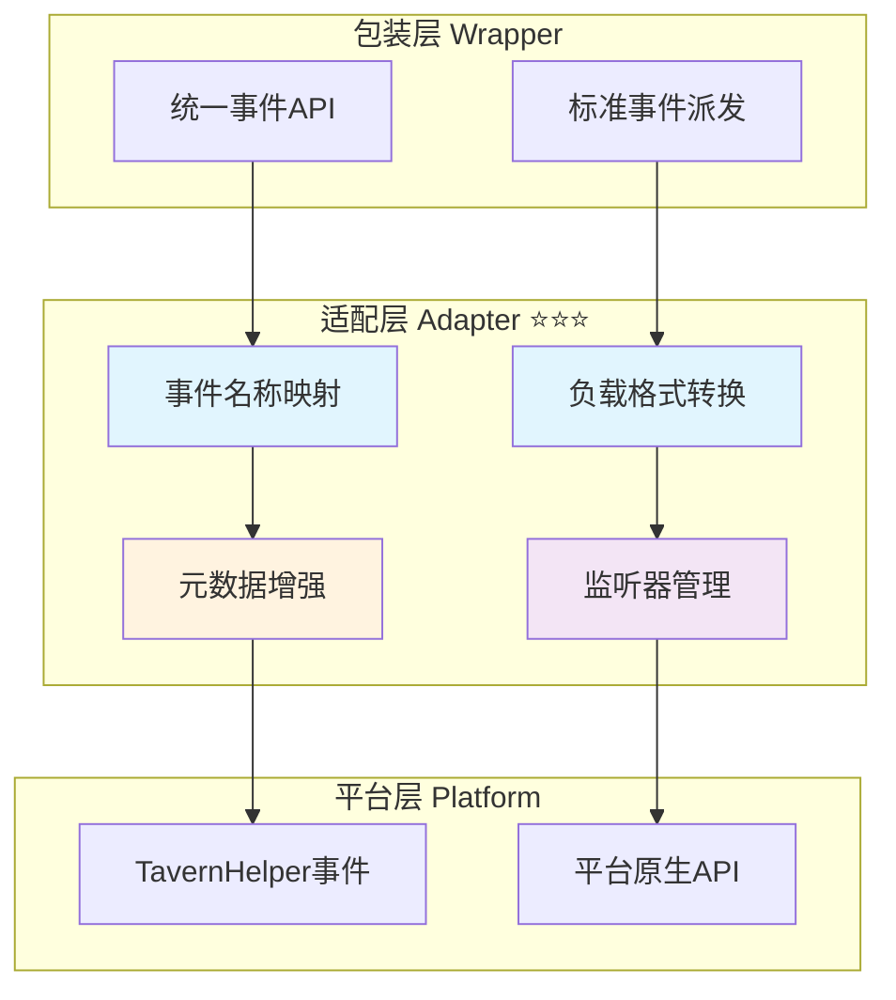

# 🔌 适配层：事件归一化与平台桥接

> **文档定位**：定义事件适配器的设计规范，实现平台事件到标准事件的转换与桥接。

---

## 📋 目录

1. [适配层职责与目标](#适配层职责与目标)
2. [核心接口设计](#核心接口设计)
3. [事件映射规则](#事件映射规则)
4. [负载转换与增强](#负载转换与增强)
5. [TavernHelper适配器实现](#tavernhelper适配器实现)
6. [错误处理与降级](#错误处理与降级)
7. [测试与验证](#测试与验证)

---

## 适配层职责与目标

### 🎯 核心职责

适配层作为平台层与包装层之间的桥梁，主要负责：

1. **事件归一化** ⭐⭐⭐
   - 将平台特定事件名称转换为标准事件名称
   - 统一事件负载格式和字段命名
   - 补充缺失的元数据（时间戳、追踪ID等）

2. **双向事件桥接** ⭐⭐⭐
   - 平台事件 → 标准事件：监听平台原生事件，派发标准事件
   - 标准事件 → 平台事件：接收标准事件，调用平台API

3. **监听器生命周期管理** ⭐⭐⭐
   - 维护平台监听器与标准监听器的映射关系
   - 提供统一的清理机制
   - 防止内存泄漏

4. **能力协商与降级** ⭐⭐
   - 检测平台支持的事件类型
   - 对不支持的事件进行优雅降级
   - 提供能力发现接口

### 📊 架构定位



---

## 核心接口设计

### 1. EventAdapter 接口 ⭐⭐⭐

**职责**：定义事件适配器的标准接口契约。

```typescript
/**
 * 事件适配器接口
 * 负责平台事件与标准事件之间的双向转换
 */
interface EventAdapter {
  /**
   * 监听标准事件
   * @param eventName 标准事件名称
   * @param callback 回调函数
   * @returns 取消监听函数
   */
  on(eventName: StandardEventName, callback: EventCallback): UnsubscribeFunction;
  
  /**
   * 一次性监听标准事件
   * @param eventName 标准事件名称
   * @param callback 回调函数
   * @returns 取消监听函数
   */
  once(eventName: StandardEventName, callback: EventCallback): UnsubscribeFunction;
  
  /**
   * 取消监听标准事件
   * @param eventName 标准事件名称
   * @param callback 可选的具体回调函数
   */
  off(eventName: StandardEventName, callback?: EventCallback): void;
  
  /**
   * 派发自定义事件
   * @param eventName 事件名称（可以是非标准事件）
   * @param detail 事件数据
   */
  emit(eventName: string, detail: any): void;
  
  /**
   * 清除所有监听器
   */
  clear(): void;
  
  /**
   * 获取适配器支持的能力
   */
  getCapabilities(): EventCapabilities;
}
```

### 2. 类型定义 ⭐⭐⭐

```typescript
/** 标准事件名称类型 */
type StandardEventName =
  | 'message:sent'
  | 'message:received'
  | 'state:changed'
  | 'generation:started'
  | 'generation:progress'
  | 'generation:ended'
  | 'generation:error'
  | 'stream:token_incremental'
  | 'stream:token_full';

/** 事件回调函数类型 */
type EventCallback = (payload: any) => void;

/** 取消订阅函数类型 */
type UnsubscribeFunction = () => void;

/** 事件能力声明 */
interface EventCapabilities {
  /** 支持的标准事件列表 */
  supportedEvents: StandardEventName[];
  
  /** 是否支持流式增量事件 */
  supportsStreamIncremental: boolean;
  
  /** 是否支持流式快照事件 */
  supportsStreamFull: boolean;
  
  /** 是否支持自定义事件 */
  supportsCustomEvents: boolean;
  
  /** 是否支持一次性监听 */
  supportsOnce: boolean;
}
```

### 3. 事件负载标准化 ⭐⭐⭐

```typescript
/** 基础事件负载 */
interface BaseEventPayload {
  /** 事件时间戳（毫秒） */
  timestamp: number;
  
  /** 平台标识（可选） */
  platform?: string;
}

/** 生成事件负载 */
interface GenerationEventPayload extends BaseEventPayload {
  generation_id?: string;
  prompt?: string;
  options?: any;
  progress?: {
    tokens?: number;
    elapsed_ms?: number;
  };
  result?: string;
  error?: {
    code?: string;
    message: string;
  };
}

/** 流式Token负载 */
interface StreamTokenPayload extends BaseEventPayload {
  generation_id?: string;
  token?: string;
  full?: string;
  index?: number;
}

/** 状态变化负载 */
interface StateChangedPayload extends BaseEventPayload {
  scope: string;
  key: string;
  oldValue: any;
  newValue: any;
  metadata: {
    operation: string;
    affectedKeys: string[];
  };
}
```

---

## 事件映射规则

### 📋 标准事件映射表

| 标准事件 | TavernHelper 平台事件 | 转换优先级 | 备注 |
|---------|---------------------|----------|------|
| `generation:started` | `GENERATION_STARTED` | ⭐⭐⭐ | 直接映射 |
| `generation:ended` | `GENERATION_ENDED` | ⭐⭐⭐ | 直接映射 |
| `generation:error` | 无对应事件 | ⭐⭐⭐ | 需在生成函数中捕获异常 |
| `generation:progress` | 无对应事件 | ⭐⭐ | 可通过流式事件推断 |
| `stream:token_incremental` | `STREAM_TOKEN_RECEIVED_INCREMENTALLY` | ⭐⭐⭐ | 直接映射 |
| `stream:token_full` | `STREAM_TOKEN_RECEIVED_FULLY` | ⭐⭐⭐ | 直接映射 |
| `message:sent` | `MESSAGE_SENT` | ⭐⭐ | 直接映射 |
| `message:received` | `MESSAGE_RECEIVED` | ⭐⭐ | 直接映射 |
| `state:changed` | 无对应事件 | ⭐⭐ | 由变量模块主动派发 |

### 🔄 映射实现示例

```typescript
/** 事件名称映射表 */
const EVENT_NAME_MAP: Record<string, StandardEventName> = {
  'GENERATION_STARTED': 'generation:started',
  'GENERATION_ENDED': 'generation:ended',
  'STREAM_TOKEN_RECEIVED_INCREMENTALLY': 'stream:token_incremental',
  'STREAM_TOKEN_RECEIVED_FULLY': 'stream:token_full',
  'MESSAGE_SENT': 'message:sent',
  'MESSAGE_RECEIVED': 'message:received',
};

/** 反向映射：标准事件 → 平台事件 */
const REVERSE_EVENT_MAP: Record<StandardEventName, string> = {
  'generation:started': 'GENERATION_STARTED',
  'generation:ended': 'GENERATION_ENDED',
  'stream:token_incremental': 'STREAM_TOKEN_RECEIVED_INCREMENTALLY',
  'stream:token_full': 'STREAM_TOKEN_RECEIVED_FULLY',
  'message:sent': 'MESSAGE_SENT',
  'message:received': 'MESSAGE_RECEIVED',
  // 以下事件无平台对应，需特殊处理
  'generation:error': null,
  'generation:progress': null,
  'state:changed': null,
};
```

---

## 负载转换与增强

### 1. 生成开始事件转换 ⭐⭐⭐

```typescript
/**
 * 转换 GENERATION_STARTED 事件
 * 平台签名: (generation_id: string) => void
 * 标准签名: (payload: GenerationEventPayload) => void
 */
function transformGenerationStarted(
  platformGenerationId: string
): GenerationEventPayload {
  return {
    generation_id: platformGenerationId,
    timestamp: Date.now(),
    platform: 'TavernHelper',
  };
}

// 使用示例
eventOn('GENERATION_STARTED', (generationId) => {
  const standardPayload = transformGenerationStarted(generationId);
  emitStandardEvent('generation:started', standardPayload);
});
```

### 2. 流式增量事件转换 ⭐⭐⭐

```typescript
/**
 * 转换 STREAM_TOKEN_RECEIVED_INCREMENTALLY 事件
 * 平台签名: (incremental_text: string, generation_id: string) => void
 * 标准签名: (payload: StreamTokenPayload) => void
 */
function transformStreamIncremental(
  token: string,
  generationId: string,
  index?: number
): StreamTokenPayload {
  return {
    generation_id: generationId,
    token: token,
    index: index,
    timestamp: Date.now(),
    platform: 'TavernHelper',
  };
}

// 使用示例
let tokenIndex = 0;
eventOn('STREAM_TOKEN_RECEIVED_INCREMENTALLY', (token, generationId) => {
  const standardPayload = transformStreamIncremental(token, generationId, tokenIndex++);
  emitStandardEvent('stream:token_incremental', standardPayload);
});
```

### 3. 流式快照事件转换 ⭐⭐⭐

```typescript
/**
 * 转换 STREAM_TOKEN_RECEIVED_FULLY 事件
 * 平台签名: (full_text: string, generation_id: string) => void
 * 标准签名: (payload: StreamTokenPayload) => void
 */
function transformStreamFull(
  fullText: string,
  generationId: string
): StreamTokenPayload {
  return {
    generation_id: generationId,
    full: fullText,
    timestamp: Date.now(),
    platform: 'TavernHelper',
  };
}

// 使用示例
eventOn('STREAM_TOKEN_RECEIVED_FULLY', (fullText, generationId) => {
  const standardPayload = transformStreamFull(fullText, generationId);
  emitStandardEvent('stream:token_full', standardPayload);
});
```

### 4. 生成完成事件转换 ⭐⭐⭐

```typescript
/**
 * 转换 GENERATION_ENDED 事件
 * 平台签名: (text: string, generation_id: string) => void
 * 标准签名: (payload: GenerationEventPayload) => void
 */
function transformGenerationEnded(
  result: string,
  generationId: string
): GenerationEventPayload {
  return {
    generation_id: generationId,
    result: result,
    timestamp: Date.now(),
    platform: 'TavernHelper',
  };
}

// 使用示例
eventOn('GENERATION_ENDED', (text, generationId) => {
  const standardPayload = transformGenerationEnded(text, generationId);
  emitStandardEvent('generation:ended', standardPayload);
});
```

---

## TavernHelper适配器实现

### 完整适配器类 ⭐⭐⭐

```typescript
/**
 * TavernHelper 事件适配器
 * 实现平台事件与标准事件的双向转换
 */
class TavernHelperEventAdapter implements EventAdapter {
  /** 标准事件监听器映射表 */
  private standardListeners: Map<StandardEventName, Set<EventCallback>> = new Map();
  
  /** 平台监听器映射表（用于清理） */
  private platformListeners: Map<string, Set<EventCallback>> = new Map();
  
  /** Token索引计数器（用于流式事件） */
  private tokenIndexMap: Map<string, number> = new Map();
  
  constructor() {
    this.initializePlatformBridge();
  }
  
  /**
   * 初始化平台事件桥接
   * 监听所有需要映射的平台事件
   */
  private initializePlatformBridge(): void {
    // 映射 GENERATION_STARTED
    this.bridgeEvent('GENERATION_STARTED', 'generation:started', (generationId) => ({
      generation_id: generationId,
      timestamp: Date.now(),
    }));
    
    // 映射 GENERATION_ENDED
    this.bridgeEvent('GENERATION_ENDED', 'generation:ended', (text, generationId) => ({
      generation_id: generationId,
      result: text,
      timestamp: Date.now(),
    }));
    
    // 映射流式增量事件
    this.bridgeEvent(
      'STREAM_TOKEN_RECEIVED_INCREMENTALLY',
      'stream:token_incremental',
      (token, generationId) => {
        // 维护token索引
        const currentIndex = this.tokenIndexMap.get(generationId) || 0;
        this.tokenIndexMap.set(generationId, currentIndex + 1);
        
        return {
          generation_id: generationId,
          token: token,
          index: currentIndex,
          timestamp: Date.now(),
        };
      }
    );
    
    // 映射流式快照事件
    this.bridgeEvent(
      'STREAM_TOKEN_RECEIVED_FULLY',
      'stream:token_full',
      (fullText, generationId) => ({
        generation_id: generationId,
        full: fullText,
        timestamp: Date.now(),
      })
    );
    
    // 映射消息事件
    this.bridgeEvent('MESSAGE_SENT', 'message:sent', (message) => ({
      message,
      timestamp: Date.now(),
    }));
    
    this.bridgeEvent('MESSAGE_RECEIVED', 'message:received', (message) => ({
      message,
      timestamp: Date.now(),
    }));
  }
  
  /**
   * 桥接单个平台事件到标准事件
   */
  private bridgeEvent(
    platformEventName: string,
    standardEventName: StandardEventName,
    transformer: (...args: any[]) => any
  ): void {
    const handler = (...args: any[]) => {
      const standardPayload = transformer(...args);
      this.notifyListeners(standardEventName, standardPayload);
    };
    
    // 记录平台监听器以便清理
    if (!this.platformListeners.has(platformEventName)) {
      this.platformListeners.set(platformEventName, new Set());
    }
    this.platformListeners.get(platformEventName)!.add(handler);
    
    // 注册到平台
    eventOn(platformEventName, handler);
  }
  
  /**
   * 监听标准事件
   */
  on(eventName: StandardEventName, callback: EventCallback): UnsubscribeFunction {
    if (!this.standardListeners.has(eventName)) {
      this.standardListeners.set(eventName, new Set());
    }
    
    this.standardListeners.get(eventName)!.add(callback);
    
    // 返回取消函数
    return () => {
      this.off(eventName, callback);
    };
  }
  
  /**
   * 一次性监听标准事件
   */
  once(eventName: StandardEventName, callback: EventCallback): UnsubscribeFunction {
    const onceWrapper = (payload: any) => {
      callback(payload);
      this.off(eventName, onceWrapper);
    };
    
    return this.on(eventName, onceWrapper);
  }
  
  /**
   * 取消监听标准事件
   */
  off(eventName: StandardEventName, callback?: EventCallback): void {
    const listeners = this.standardListeners.get(eventName);
    if (!listeners) return;
    
    if (callback) {
      listeners.delete(callback);
    } else {
      listeners.clear();
    }
    
    // 清理空的监听器集合
    if (listeners.size === 0) {
      this.standardListeners.delete(eventName);
    }
  }
  
  /**
   * 派发自定义事件
   */
  emit(eventName: string, detail: any): void {
    // 如果是标准事件，使用标准派发
    if (this.isStandardEvent(eventName)) {
      this.notifyListeners(eventName as StandardEventName, detail);
    } else {
      // 否则使用平台的 eventEmit
      eventEmit(eventName, detail);
    }
  }
  
  /**
   * 清除所有监听器
   */
  clear(): void {
    // 清除标准监听器
    this.standardListeners.clear();
    
    // 清除平台监听器
    for (const [platformEventName, handlers] of this.platformListeners) {
      for (const handler of handlers) {
        eventOff(platformEventName, handler);
      }
    }
    this.platformListeners.clear();
    
    // 清除Token索引
    this.tokenIndexMap.clear();
  }
  
  /**
   * 获取适配器能力
   */
  getCapabilities(): EventCapabilities {
    return {
      supportedEvents: [
        'generation:started',
        'generation:ended',
        'stream:token_incremental',
        'stream:token_full',
        'message:sent',
        'message:received',
      ],
      supportsStreamIncremental: true,
      supportsStreamFull: true,
      supportsCustomEvents: true,
      supportsOnce: true,
    };
  }
  
  /**
   * 通知所有标准事件监听器
   */
  private notifyListeners(eventName: StandardEventName, payload: any): void {
    const listeners = this.standardListeners.get(eventName);
    if (!listeners) return;
    
    listeners.forEach((callback) => {
      try {
        callback(payload);
      } catch (error) {
        console.error(`Error in event listener for ${eventName}:`, error);
      }
    });
  }
  
  /**
   * 检查是否为标准事件
   */
  private isStandardEvent(eventName: string): boolean {
    const standardEvents: StandardEventName[] = [
      'generation:started',
      'generation:ended',
      'generation:error',
      'generation:progress',
      'stream:token_incremental',
      'stream:token_full',
      'message:sent',
      'message:received',
      'state:changed',
    ];
    return standardEvents.includes(eventName as StandardEventName);
  }
}
```

### 使用示例 ⭐⭐⭐

```typescript
// 创建适配器实例
const adapter = new TavernHelperEventAdapter();

// 监听标准事件
const unsubscribe = adapter.on('generation:started', (payload) => {
  console.log('生成开始:', payload);
  // payload: { generation_id: string, timestamp: number }
});

// 监听流式内容
adapter.on('stream:token_incremental', (payload) => {
  console.log('增量Token:', payload.token);
  // payload: { generation_id: string, token: string, index: number, timestamp: number }
});

// 清理监听器
unsubscribe();

// 或者清除所有
adapter.clear();
```

---

## 错误处理与降级

### 1. 错误事件补充 ⭐⭐⭐

由于 TavernHelper 没有专用的错误事件，适配器需要在生成函数调用层面捕获错误：

```typescript
/**
 * 包装生成函数以捕获错误
 */
async function generateWithErrorHandling(
  adapter: EventAdapter,
  generateFn: () => Promise<string>,
  generationId: string
): Promise<string> {
  try {
    return await generateFn();
  } catch (error) {
    // 派发标准错误事件
    adapter.emit('generation:error', {
      generation_id: generationId,
      error: {
        code: error.code || 'GENERATION_ERROR',
        message: error.message || '生成失败',
      },
      timestamp: Date.now(),
    });
    
    throw error;
  }
}
```

### 2. 事件丢失检测 ⭐⭐

```typescript
/**
 * 检测关键事件是否按预期触发
 */
class EventHealthMonitor {
  private pendingGenerations: Map<string, {
    startTime: number;
    hasEnded: boolean;
  }> = new Map();
  
  constructor(private adapter: EventAdapter) {
    this.setupMonitoring();
  }
  
  private setupMonitoring(): void {
    // 监控开始事件
    this.adapter.on('generation:started', (payload) => {
      this.pendingGenerations.set(payload.generation_id, {
        startTime: Date.now(),
        hasEnded: false,
      });
    });
    
    // 监控结束事件
    this.adapter.on('generation:ended', (payload) => {
      const gen = this.pendingGenerations.get(payload.generation_id);
      if (gen) {
        gen.hasEnded = true;
        this.pendingGenerations.delete(payload.generation_id);
      }
    });
    
    // 定期检查超时的生成任务
    setInterval(() => this.checkTimeouts(), 5000);
  }
  
  private checkTimeouts(): void {
    const now = Date.now();
    const timeout = 60000; // 60秒超时
    
    for (const [generationId, gen] of this.pendingGenerations) {
      if (!gen.hasEnded && now - gen.startTime > timeout) {
        console.warn(`Generation ${generationId} timeout, dispatching error event`);
        
        // 派发超时错误事件
        this.adapter.emit('generation:error', {
          generation_id: generationId,
          error: {
            code: 'TIMEOUT',
            message: '生成超时',
          },
          timestamp: now,
        });
        
        this.pendingGenerations.delete(generationId);
      }
    }
  }
}
```

### 3. 降级策略 ⭐⭐

```typescript
/**
 * 能力降级处理
 */
function createAdapterWithFallback(): EventAdapter {
  const adapter = new TavernHelperEventAdapter();
  const capabilities = adapter.getCapabilities();
  
  // 检查关键能力
  if (!capabilities.supportsStreamIncremental) {
    console.warn('Platform does not support stream incremental, using full snapshot only');
  }
  
  if (!capabilities.supportsStreamFull) {
    console.warn('Platform does not support stream full, using incremental only');
  }
  
  return adapter;
}
```

---

## 测试与验证

### ✅ 单元测试清单

```typescript
describe('TavernHelperEventAdapter', () => {
  let adapter: TavernHelperEventAdapter;
  
  beforeEach(() => {
    adapter = new TavernHelperEventAdapter();
  });
  
  afterEach(() => {
    adapter.clear();
  });
  
  it('应该正确映射生成开始事件', (done) => {
    adapter.on('generation:started', (payload) => {
      expect(payload).toHaveProperty('generation_id');
      expect(payload).toHaveProperty('timestamp');
      done();
    });
    
    // 触发平台事件
    eventEmit('GENERATION_STARTED', 'test-gen-id');
  });
  
  it('应该正确转换流式增量事件', (done) => {
    let receivedTokens = [];
    
    adapter.on('stream:token_incremental', (payload) => {
      receivedTokens.push(payload.token);
      
      if (receivedTokens.length === 3) {
        expect(receivedTokens).toEqual(['Hello', ' ', 'World']);
        expect(payload.index).toBe(2);
        done();
      }
    });
    
    // 模拟流式传输
    eventEmit('STREAM_TOKEN_RECEIVED_INCREMENTALLY', 'Hello', 'test-id');
    eventEmit('STREAM_TOKEN_RECEIVED_INCREMENTALLY', ' ', 'test-id');
    eventEmit('STREAM_TOKEN_RECEIVED_INCREMENTALLY', 'World', 'test-id');
  });
  
  it('应该支持取消监听', () => {
    let callCount = 0;
    
    const unsubscribe = adapter.on('generation:started', () => {
      callCount++;
    });
    
    eventEmit('GENERATION_STARTED', 'test-1');
    expect(callCount).toBe(1);
    
    unsubscribe();
    
    eventEmit('GENERATION_STARTED', 'test-2');
    expect(callCount).toBe(1); // 不应该再增加
  });
  
  it('应该支持一次性监听', () => {
    let callCount = 0;
    
    adapter.once('generation:ended', () => {
      callCount++;
    });
    
    eventEmit('GENERATION_ENDED', 'result', 'test-id');
    expect(callCount).toBe(1);
    
    eventEmit('GENERATION_ENDED', 'result2', 'test-id-2');
    expect(callCount).toBe(1); // 不应该再增加
  });
});
```

### 📊 集成测试场景

```typescript
describe('Event Flow Integration', () => {
  it('完整的生成流程事件序列', async () => {
    const adapter = new TavernHelperEventAdapter();
    const events: string[] = [];
    
    // 监听所有相关事件
    adapter.on('generation:started', () => events.push('started'));
    adapter.on('stream:token_incremental', () => events.push('token'));
    adapter.on('generation:ended', () => events.push('ended'));
    
    // 执行生成（模拟）
    await simulateGeneration('test-gen-id');
    
    // 验证事件顺序
    expect(events).toEqual([
      'started',
      'token',
      'token',
      'token',
      'ended',
    ]);
  });
});
```

---

## 📊 性能考虑

### 1. 内存管理 ⭐⭐⭐

```typescript
/**
 * 监听器数量监控
 */
class ListenerMemoryMonitor {
  private readonly WARNING_THRESHOLD = 100;
  
  checkListenerCount(adapter: TavernHelperEventAdapter): void {
    const count = this.getListenerCount(adapter);
    
    if (count > this.WARNING_THRESHOLD) {
      console.warn(
        `High number of event listeners detected: ${count}. ` +
        `Possible memory leak. Consider calling adapter.clear()`
      );
    }
  }
  
  private getListenerCount(adapter: any): number {
    let total = 0;
    for (const listeners of adapter.standardListeners.values()) {
      total += listeners.size;
    }
    return total;
  }
}
```

### 2. 事件节流 ⭐⭐

```typescript
/**
 * 对高频事件进行节流处理
 */
function throttleEvent(
  adapter: EventAdapter,
  eventName: StandardEventName,
  callback: EventCallback,
  delay: number = 100
): UnsubscribeFunction {
  let lastCall = 0;
  let timeoutId: any = null;
  
  return adapter.on(eventName, (payload) => {
    const now = Date.now();
    
    if (now - lastCall >= delay) {
      lastCall = now;
      callback(payload);
    } else {
      // 延迟调用，确保最后一次事件被处理
      if (timeoutId) clearTimeout(timeoutId);
      timeoutId = setTimeout(() => {
        lastCall = Date.now();
        callback(payload);
      }, delay);
    }
  });
}
```

---

## 🔗 相关资源

- **平台分析**：[`platform.md`](./platform.md) - TavernHelper 事件能力
- **包装层**：[`wrapper.md`](./wrapper.md) - 统一事件API
- **应用层**：[`application.md`](./application.md) - Vue集成
- **RFC规范**：[`CHARACTER_API_RFC.md`](/CHARACTER_API_RFC#_4-2-事件系统-characterapi-events-⭐⭐⭐)

---

> **📖 文档状态**：本文档定义了事件适配层的完整设计规范，包括接口定义、实现示例和测试策略。