# 🎨 应用层：Vue 组件事件集成

> **文档定位**：提供 Vue 3 应用层的事件系统集成方案，包括组合式 API、响应式处理和最佳实践。

---

## 📋 目录

1. [应用层职责与目标](#应用层职责与目标)
2. [Vue Composition API 集成](#vue-composition-api-集成)
3. [响应式事件处理](#响应式事件处理)
4. [实用组合式函数](#实用组合式函数)
5. [完整组件示例](#完整组件示例)
6. [最佳实践](#最佳实践)
7. [性能优化技巧](#性能优化技巧)

---

## 应用层职责与目标

### 🎯 核心职责

应用层负责将事件系统集成到 Vue 应用中，主要包括：

1. **响应式集成** ⭐⭐⭐
   - 将事件数据转换为响应式状态
   - 自动触发 UI 更新
   - 与 Vue 响应式系统无缝集成

2. **生命周期管理** ⭐⭐⭐
   - 组件挂载时注册监听器
   - 组件卸载时自动清理
   - 防止内存泄漏

3. **开发者体验** ⭐⭐
   - 提供简洁的组合式 API
   - 支持 TypeScript 类型推断
   - 友好的错误提示

4. **UI 状态同步** ⭐⭐
   - 实时更新加载状态
   - 显示生成进度
   - 处理错误提示

### 📊 架构定位

```mermaid
graph TB
    subgraph "Vue 应用层 ⭐⭐"
        V1[Vue组件]
        V2[组合式函数]
        V3[响应式状态]
    end
    
    subgraph "包装层"
        W1[EventManager]
    end
    
    V1 --> V2
    V2 --> V3
    V3 --> W1
    
    style V1 fill:#42b883
    style V2 fill:#35495e
    style V3 fill:#42b883
```



---

## Vue Composition API 集成

### 1. 基础事件钩子 ⭐⭐⭐

```typescript
import { ref, onMounted, onUnmounted } from 'vue';
import type { Ref } from 'vue';

/**
 * 使用事件监听的基础钩子
 * @param eventManager 事件管理器实例
 * @param eventName 事件名称
 * @param handler 事件处理函数
 */
export function useEventListener(
  eventManager: EventManager,
  eventName: StandardEventName,
  handler: EventCallback
): void {
  let unsubscribe: UnsubscribeFunction | null = null;
  
  onMounted(() => {
    unsubscribe = eventManager.on(eventName, handler);
  });
  
  onUnmounted(() => {
    if (unsubscribe) {
      unsubscribe();
    }
  });
}
```

**使用示例**：

```vue
<script setup lang="ts">
import { useEventListener } from '@/composables/useEventListener';

const eventManager = inject<EventManager>('eventManager');

// 监听生成开始事件
useEventListener(eventManager, 'generation:started', (payload) => {
  console.log('生成开始:', payload.generation_id);
});

// 监听生成完成事件
useEventListener(eventManager, 'generation:ended', (payload) => {
  console.log('生成完成:', payload.result);
});
</script>
```

### 2. 响应式事件状态 ⭐⭐⭐

```typescript
/**
 * 监听事件并返回响应式状态
 * @param eventManager 事件管理器
 * @param eventName 事件名称
 * @param initialValue 初始值
 */
export function useEventState<T = any>(
  eventManager: EventManager,
  eventName: StandardEventName,
  initialValue?: T
): Ref<T | undefined> {
  const state = ref<T | undefined>(initialValue);
  
  useEventListener(eventManager, eventName, (payload: T) => {
    state.value = payload;
  });
  
  return state as Ref<T | undefined>;
}
```

**使用示例**：

```vue
<template>
  <div>
    <div v-if="startPayload">
      生成ID: {{ startPayload.generation_id }}
    </div>
    <div v-if="endPayload">
      结果: {{ endPayload.result }}
    </div>
  </div>
</template>

<script setup lang="ts">
import { useEventState } from '@/composables/useEventState';

const eventManager = inject<EventManager>('eventManager');

// 响应式状态自动更新
const startPayload = useEventState(eventManager, 'generation:started');
const endPayload = useEventState(eventManager, 'generation:ended');
</script>
```

---

## 响应式事件处理

### 1. 生成状态管理 ⭐⭐⭐

```typescript
import { ref, computed } from 'vue';
import type { Ref, ComputedRef } from 'vue';

/**
 * 生成状态接口
 */
interface GenerationState {
  isGenerating: Ref<boolean>;
  generationId: Ref<string | null>;
  progress: Ref<number>;
  result: Ref<string>;
  error: Ref<string | null>;
}

/**
 * 使用生成状态管理
 * 集成所有生成相关事件的响应式状态
 */
export function useGenerationState(
  eventManager: EventManager
): GenerationState {
  const isGenerating = ref(false);
  const generationId = ref<string | null>(null);
  const progress = ref(0);
  const result = ref('');
  const error = ref<string | null>(null);
  
  // 监听生成开始
  useEventListener(eventManager, 'generation:started', (payload) => {
    isGenerating.value = true;
    generationId.value = payload.generation_id || null;
    progress.value = 0;
    result.value = '';
    error.value = null;
  });
  
  // 监听生成进度
  useEventListener(eventManager, 'generation:progress', (payload) => {
    if (payload.progress?.tokens) {
      progress.value = Math.min(payload.progress.tokens / 10, 100);
    }
  });
  
  // 监听生成完成
  useEventListener(eventManager, 'generation:ended', (payload) => {
    isGenerating.value = false;
    result.value = payload.result || '';
    progress.value = 100;
  });
  
  // 监听生成错误
  useEventListener(eventManager, 'generation:error', (payload) => {
    isGenerating.value = false;
    error.value = payload.error?.message || '生成失败';
  });
  
  return {
    isGenerating,
    generationId,
    progress,
    result,
    error,
  };
}
```

**使用示例**：

```vue
<template>
  <div class="generation-monitor">
    <div v-if="isGenerating" class="loading">
      <span>生成中...</span>
      <progress :value="progress" max="100">{{ progress }}%</progress>
    </div>
    
    <div v-if="error" class="error">
      {{ error }}
    </div>
    
    <div v-if="result && !isGenerating" class="result">
      {{ result }}
    </div>
  </div>
</template>

<script setup lang="ts">
import { useGenerationState } from '@/composables/useGenerationState';

const eventManager = inject<EventManager>('eventManager');
const { isGenerating, progress, result, error } = useGenerationState(eventManager);
</script>

<style scoped>
.generation-monitor {
  padding: 1rem;
}

.loading {
  display: flex;
  flex-direction: column;
  gap: 0.5rem;
}

.error {
  color: red;
  padding: 0.5rem;
  background: #fee;
  border-radius: 4px;
}

.result {
  white-space: pre-wrap;
  padding: 1rem;
  background: #f5f5f5;
  border-radius: 4px;
}
</style>
```

### 2. 流式内容收集 ⭐⭐⭐

```typescript
/**
 * 流式内容状态接口
 */
interface StreamState {
  content: Ref<string>;
  isStreaming: Ref<boolean>;
  tokenCount: Ref<number>;
}

/**
 * 使用流式内容收集
 * 实时收集和显示流式生成的内容
 */
export function useStreamContent(
  eventManager: EventManager,
  options?: {
    mode?: 'incremental' | 'full';
    generationId?: string;
  }
): StreamState {
  const content = ref('');
  const isStreaming = ref(false);
  const tokenCount = ref(0);
  
  const mode = options?.mode || 'incremental';
  const targetGenerationId = options?.generationId;
  
  // 监听生成开始
  useEventListener(eventManager, 'generation:started', (payload) => {
    if (!targetGenerationId || payload.generation_id === targetGenerationId) {
      content.value = '';
      isStreaming.value = true;
      tokenCount.value = 0;
    }
  });
  
  // 监听流式内容
  if (mode === 'incremental') {
    useEventListener(eventManager, 'stream:token_incremental', (payload) => {
      if (!targetGenerationId || payload.generation_id === targetGenerationId) {
        content.value += payload.token || '';
        tokenCount.value++;
      }
    });
  } else {
    useEventListener(eventManager, 'stream:token_full', (payload) => {
      if (!targetGenerationId || payload.generation_id === targetGenerationId) {
        content.value = payload.full || '';
        tokenCount.value++;
      }
    });
  }
  
  // 监听生成结束
  useEventListener(eventManager, 'generation:ended', (payload) => {
    if (!targetGenerationId || payload.generation_id === targetGenerationId) {
      isStreaming.value = false;
      // 确保最终内容正确
      if (payload.result) {
        content.value = payload.result;
      }
    }
  });
  
  return {
    content,
    isStreaming,
    tokenCount,
  };
}
```

**使用示例**：

```vue
<template>
  <div class="stream-viewer">
    <div class="header">
      <span v-if="isStreaming" class="streaming-indicator">● 正在生成</span>
      <span class="token-count">{{ tokenCount }} tokens</span>
    </div>
    
    <div class="content">
      {{ content }}
      <span v-if="isStreaming" class="cursor">|</span>
    </div>
  </div>
</template>

<script setup lang="ts">
import { useStreamContent } from '@/composables/useStreamContent';

const eventManager = inject<EventManager>('eventManager');

const { content, isStreaming, tokenCount } = useStreamContent(eventManager, {
  mode: 'incremental',
});
</script>

<style scoped>
.stream-viewer {
  font-family: monospace;
}

.header {
  display: flex;
  justify-content: space-between;
  padding: 0.5rem;
  background: #f0f0f0;
}

.streaming-indicator {
  color: #42b883;
  animation: pulse 1s infinite;
}

@keyframes pulse {
  0%, 100% { opacity: 1; }
  50% { opacity: 0.5; }
}

.content {
  padding: 1rem;
  white-space: pre-wrap;
}

.cursor {
  animation: blink 1s infinite;
}

@keyframes blink {
  0%, 49% { opacity: 1; }
  50%, 100% { opacity: 0; }
}
</style>
```

---

## 实用组合式函数

### 1. 事件日志记录 ⭐⭐

```typescript
/**
 * 事件日志条目
 */
interface EventLogEntry {
  timestamp: number;
  eventName: string;
  payload: any;
}

/**
 * 使用事件日志
 * 记录所有事件用于调试
 */
export function useEventLog(
  eventManager: EventManager,
  options?: {
    maxEntries?: number;
    filter?: (eventName: string) => boolean;
  }
) {
  const logs = ref<EventLogEntry[]>([]);
  const maxEntries = options?.maxEntries || 100;
  const filter = options?.filter;
  
  const standardEvents: StandardEventName[] = [
    'generation:started',
    'generation:progress',
    'generation:ended',
    'generation:error',
    'stream:token_incremental',
    'stream:token_full',
    'message:sent',
    'message:received',
    'state:changed',
  ];
  
  // 监听所有标准事件
  standardEvents.forEach((eventName) => {
    if (!filter || filter(eventName)) {
      useEventListener(eventManager, eventName, (payload) => {
        logs.value.push({
          timestamp: Date.now(),
          eventName,
          payload,
        });
        
        // 限制日志条目数量
        if (logs.value.length > maxEntries) {
          logs.value.shift();
        }
      });
    }
  });
  
  // 清空日志
  const clearLogs = () => {
    logs.value = [];
  };
  
  // 导出日志
  const exportLogs = () => {
    return JSON.stringify(logs.value, null, 2);
  };
  
  return {
    logs: readonly(logs),
    clearLogs,
    exportLogs,
  };
}
```

### 2. 事件统计 ⭐⭐

```typescript
/**
 * 事件统计数据
 */
interface EventStatistics {
  totalEvents: Ref<number>;
  eventCounts: Ref<Record<string, number>>;
  lastEventTime: Ref<number | null>;
}

/**
 * 使用事件统计
 * 统计事件触发次数和频率
 */
export function useEventStatistics(
  eventManager: EventManager
): EventStatistics {
  const totalEvents = ref(0);
  const eventCounts = ref<Record<string, number>>({});
  const lastEventTime = ref<number | null>(null);
  
  const standardEvents: StandardEventName[] = [
    'generation:started',
    'generation:progress',
    'generation:ended',
    'generation:error',
    'stream:token_incremental',
    'stream:token_full',
    'message:sent',
    'message:received',
    'state:changed',
  ];
  
  standardEvents.forEach((eventName) => {
    useEventListener(eventManager, eventName, () => {
      totalEvents.value++;
      lastEventTime.value = Date.now();
      
      if (!eventCounts.value[eventName]) {
        eventCounts.value[eventName] = 0;
      }
      eventCounts.value[eventName]++;
    });
  });
  
  return {
    totalEvents: readonly(totalEvents),
    eventCounts: readonly(eventCounts),
    lastEventTime: readonly(lastEventTime),
  };
}
```

### 3. 生成任务追踪 ⭐⭐⭐

```typescript
/**
 * 生成任务信息
 */
interface GenerationTask {
  id: string;
  startTime: number;
  endTime?: number;
  duration?: number;
  tokenCount: number;
  status: 'running' | 'completed' | 'error';
  error?: string;
}

/**
 * 使用生成任务追踪
 * 追踪所有生成任务的状态
 */
export function useGenerationTracker(
  eventManager: EventManager
) {
  const tasks = ref<Map<string, GenerationTask>>(new Map());
  
  // 监听生成开始
  useEventListener(eventManager, 'generation:started', (payload) => {
    const id = payload.generation_id || `gen-${Date.now()}`;
    tasks.value.set(id, {
      id,
      startTime: Date.now(),
      tokenCount: 0,
      status: 'running',
    });
  });
  
  // 监听Token
  useEventListener(eventManager, 'stream:token_incremental', (payload) => {
    const id = payload.generation_id;
    if (id && tasks.value.has(id)) {
      const task = tasks.value.get(id)!;
      task.tokenCount++;
    }
  });
  
  // 监听完成
  useEventListener(eventManager, 'generation:ended', (payload) => {
    const id = payload.generation_id;
    if (id && tasks.value.has(id)) {
      const task = tasks.value.get(id)!;
      task.endTime = Date.now();
      task.duration = task.endTime - task.startTime;
      task.status = 'completed';
    }
  });
  
  // 监听错误
  useEventListener(eventManager, 'generation:error', (payload) => {
    const id = payload.generation_id;
    if (id && tasks.value.has(id)) {
      const task = tasks.value.get(id)!;
      task.endTime = Date.now();
      task.duration = task.endTime - task.startTime;
      task.status = 'error';
      task.error = payload.error?.message;
    }
  });
  
  // 获取任务列表（按时间倒序）
  const taskList = computed(() => {
    return Array.from(tasks.value.values())
      .sort((a, b) => b.startTime - a.startTime);
  });
  
  // 获取活跃任务
  const activeTasks = computed(() => {
    return taskList.value.filter(t => t.status === 'running');
  });
  
  // 清空任务历史
  const clearHistory = () => {
    tasks.value.clear();
  };
  
  return {
    tasks: readonly(tasks),
    taskList,
    activeTasks,
    clearHistory,
  };
}
```

---

## 完整组件示例

### AI 对话生成器组件 ⭐⭐⭐

```vue
<template>
  <div class="ai-generator">
    <!-- 输入区域 -->
    <div class="input-section">
      <textarea
        v-model="userInput"
        :disabled="isGenerating"
        placeholder="输入你的问题..."
        @keydown.ctrl.enter="handleGenerate"
      ></textarea>
      
      <button
        @click="handleGenerate"
        :disabled="isGenerating || !userInput.trim()"
      >
        {{ isGenerating ? '生成中...' : '发送' }}
      </button>
    </div>
    
    <!-- 进度显示 -->
    <div v-if="isGenerating" class="progress-section">
      <div class="progress-bar">
        <div class="progress-fill" :style="{ width: `${progress}%` }"></div>
      </div>
      <div class="progress-info">
        <span>已生成 {{ tokenCount }} tokens</span>
        <span>{{ Math.round(progress) }}%</span>
      </div>
    </div>
    
    <!-- 错误提示 -->
    <div v-if="error" class="error-section">
      <span class="error-icon">⚠️</span>
      <span>{{ error }}</span>
      <button @click="error = null">关闭</button>
    </div>
    
    <!-- 生成内容 -->
    <div class="content-section">
      <div class="content-display">
        {{ content }}
        <span v-if="isStreaming" class="cursor">▋</span>
      </div>
    </div>
    
    <!-- 任务历史 -->
    <div class="history-section">
      <h3>生成历史</h3>
      <div
        v-for="task in taskList.slice(0, 5)"
        :key="task.id"
        class="history-item"
        :class="{ active: task.status === 'running' }"
      >
        <span class="task-id">{{ task.id }}</span>
        <span class="task-status">{{ statusText(task.status) }}</span>
        <span class="task-tokens">{{ task.tokenCount }} tokens</span>
        <span v-if="task.duration" class="task-duration">
          {{ (task.duration / 1000).toFixed(2) }}s
        </span>
      </div>
    </div>
  </div>
</template>

<script setup lang="ts">
import { ref, inject } from 'vue';
import { useGenerationState } from '@/composables/useGenerationState';
import { useStreamContent } from '@/composables/useStreamContent';
import { useGenerationTracker } from '@/composables/useGenerationTracker';

// 注入事件管理器
const eventManager = inject<EventManager>('eventManager')!;

// 状态管理
const userInput = ref('');
const { isGenerating, progress, error } = useGenerationState(eventManager);
const { content, isStreaming, tokenCount } = useStreamContent(eventManager);
const { taskList } = useGenerationTracker(eventManager);

// 生成处理
const handleGenerate = async () => {
  if (!userInput.value.trim() || isGenerating.value) return;
  
  try {
    // 调用生成API
    await CharacterAPI.generation.generateWithPreset({
      user_input: userInput.value,
      stream: true,
      generation_id: `gen-${Date.now()}`,
    });
    
    // 清空输入
    userInput.value = '';
  } catch (err: any) {
    error.value = err.message || '生成失败';
  }
};

// 状态文本
const statusText = (status: string) => {
  const map: Record<string, string> = {
    running: '进行中',
    completed: '已完成',
    error: '失败',
  };
  return map[status] || status;
};
</script>

<style scoped>
.ai-generator {
  max-width: 800px;
  margin: 0 auto;
  padding: 1rem;
}

.input-section {
  display: flex;
  gap: 0.5rem;
  margin-bottom: 1rem;
}

.input-section textarea {
  flex: 1;
  min-height: 100px;
  padding: 0.5rem;
  border: 1px solid #ddd;
  border-radius: 4px;
  resize: vertical;
}

.input-section button {
  padding: 0.5rem 1rem;
  background: #42b883;
  color: white;
  border: none;
  border-radius: 4px;
  cursor: pointer;
}

.input-section button:disabled {
  opacity: 0.5;
  cursor: not-allowed;
}

.progress-section {
  margin-bottom: 1rem;
}

.progress-bar {
  height: 4px;
  background: #eee;
  border-radius: 2px;
  overflow: hidden;
  margin-bottom: 0.5rem;
}

.progress-fill {
  height: 100%;
  background: #42b883;
  transition: width 0.3s ease;
}

.progress-info {
  display: flex;
  justify-content: space-between;
  font-size: 0.875rem;
  color: #666;
}

.error-section {
  display: flex;
  align-items: center;
  gap: 0.5rem;
  padding: 0.75rem;
  background: #fee;
  border: 1px solid #fcc;
  border-radius: 4px;
  margin-bottom: 1rem;
}

.error-icon {
  font-size: 1.25rem;
}

.content-section {
  margin-bottom: 1rem;
}

.content-display {
  padding: 1rem;
  background: #f8f8f8;
  border-radius: 4px;
  white-space: pre-wrap;
  word-wrap: break-word;
  min-height: 200px;
  font-family: 'Courier New', monospace;
}

.cursor {
  animation: blink 1s infinite;
}

@keyframes blink {
  0%, 49% { opacity: 1; }
  50%, 100% { opacity: 0; }
}

.history-section {
  border-top: 1px solid #ddd;
  padding-top: 1rem;
}

.history-item {
  display: flex;
  justify-content: space-between;
  padding: 0.5rem;
  border-bottom: 1px solid #eee;
  font-size: 0.875rem;
}

.history-item.active {
  background: #f0f9ff;
}

.task-id {
  font-family: monospace;
  color: #666;
}

.task-status {
  color: #42b883;
}
</style>
```

---

## 最佳实践

### 1. 提供全局EventManager ⭐⭐⭐

```typescript
// main.ts
import { createApp } from 'vue';
import App from './App.vue';
import { TavernHelperEventAdapter } from './adapters/TavernHelperEventAdapter';
import { EventManagerImpl } from './managers/EventManager';

const app = createApp(App);

// 创建全局事件管理器
const adapter = new TavernHelperEventAdapter();
const eventManager = new EventManagerImpl(adapter, { debug: true });

// 提供给所有组件
app.provide('eventManager', eventManager);

app.mount('#app');
```

### 2. 组件卸载时清理 ⭐⭐⭐

```typescript
// 总是在 onUnmounted 中清理监听器
import { onUnmounted } from 'vue';

const unsubscribers: UnsubscribeFunction[] = [];

// 收集所有取消函数
unsubscribers.push(
  eventManager.on('generation:started', handler1)
);
unsubscribers.push(
  eventManager.on('generation:ended', handler2)
);

// 组件卸载时清理
onUnmounted(() => {
  unsubscribers.forEach(unsub => unsub());
});
```

### 3. 使用 TypeScript 类型 ⭐⭐

```typescript
// 定义明确的负载类型
interface GenerationStartedPayload {
  generation_id: string;
  timestamp: number;
}

// 使用类型安全的回调
useEventListener(
  eventManager,
  'generation:started',
  (payload: GenerationStartedPayload) => {
    // TypeScript 会进行类型检查
    console.log(payload.generation_id);
  }
);
```

---

## 性能优化技巧

### 1. 使用 shallowRef ⭐⭐

```typescript
import { shallowRef } from 'vue';

// 对于大型对象，使用 shallowRef 减少响应式开销
const largeData = shallowRef<any[]>([]);

useEventListener(eventManager, 'data:updated', (payload) => {
  largeData.value = payload.data;
});
```

### 2. 防抖和节流 ⭐⭐

```typescript
import { useDebounceFn, useThrottleFn } from '@vueuse/core';

// 防抖处理高频事件
const debouncedHandler = useDebounceFn((payload) => {
  console.log('处理:', payload);
}, 300);

useEventListener(eventManager, 'stream:token_incremental', debouncedHandler);

// 节流处理
const throttledHandler = useThrottleFn((payload) => {
  updateUI(payload);
}, 100);

useEventListener(eventManager, 'stream:token_full', throttledHandler);
```

### 3. 条件监听 ⭐⭐

```typescript
// 只在特定条件下监听事件
const shouldListen = ref(true);

watchEffect((onCleanup) => {
  if (shouldListen.value) {
    const unsub = eventManager.on('generation:progress', handler);
    onCleanup(() => unsub());
  }
});
```

---

## 🔗 相关资源

- **包装层**：[`wrapper.md`](./wrapper.md) - EventManager 实现
- **适配层**：[`adapter.md`](./adapter.md) - 事件适配器
- **平台层**：[`platform.md`](./platform.md) - TavernHelper 能力
- **Vue文档**：[Vue 3 Composition API](https://vuejs.org/guide/extras/composition-api-faq.html)

---

> **📖 文档状态**：本文档提供了 Vue 3 应用层的事件系统集成完整方案，包括组合式 API、响应式处理和实用示例。