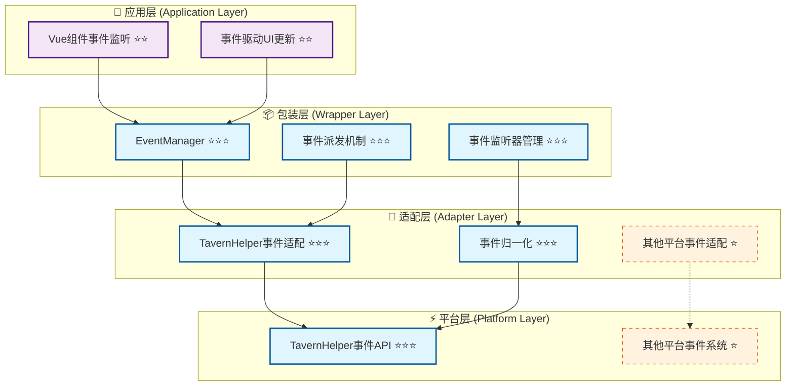
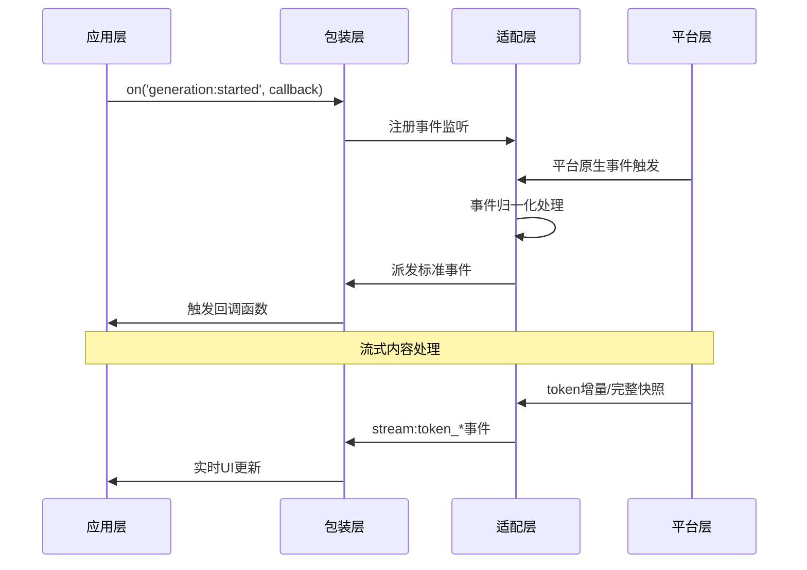
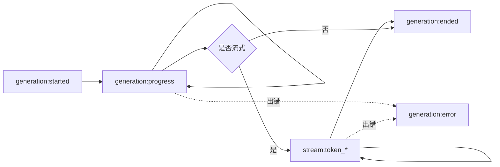

# 🔔 CharacterAPI.events 事件系统四层架构索引

> **核心目标**：提供标准化事件总线，统一平台事件与模块间通信，支持生成过程和流式token事件，实现模块解耦和异步通信。

## 📋 快速导航

| 架构层次 | 核心职责 | 推荐度 | 适用场景 | 文档链接 |
|----------|----------|--------|----------|----------|
| **底层平台特性** | 平台原生事件能力分析 | ⭐⭐⭐ **必需** | 所有事件场景 | [`platform.md`](./platform.md) |
| **平台适配层** | 事件归一化与桥接 | ⭐⭐⭐ **必需** | 跨平台事件支持 | [`adapter.md`](./adapter.md) |
| **包装层实现** | 统一事件API与生命周期管理 | ⭐⭐⭐ **必需** | 生产环境使用 | [`wrapper.md`](./wrapper.md) |
| **应用层集成** | Vue组件事件集成 | ⭐⭐ **推荐** | 前端应用开发 | [`application.md`](./application.md) |

## 🏗️ 架构层次图



## 💡 实施策略

### 🎯 **推荐实施路径**
1. **核心三层优先** (⭐⭐⭐)：Platform → Adapter → Wrapper
2. **应用层集成** (⭐⭐)：基础Vue组件集成
3. **可选扩展** (⭐)：高级事件处理模式

---

## 🎯 核心目标与特性

### ✅ **标准化事件系统**
- 统一的事件名称和负载格式
- 支持生成过程事件和流式token事件
- 事件监听器的生命周期管理

### ✅ **跨模块通信总线**
- 模块间解耦通信机制
- 自定义事件派发支持
- 事件优先级与冒泡控制

### ✅ **可观察性支持**
- 完整的事件链路追踪
- 支持事件重放与诊断
- 标准化日志输出

### ✅ **平台无关设计**
- 封装平台事件差异
- 统一的事件接口
- 优雅的降级策略

---

## 🔧 核心接口与类型定义

### 📋 **标准事件名称** ⭐⭐⭐
> **职责**：定义所有标准事件的名称常量
> **必要性**：**绝对必需** - 确保事件名称的一致性和类型安全

```typescript
type StandardEventName =
  // 消息事件
  | 'message:sent'
  | 'message:received'
  
  // 状态变化事件
  | 'state:changed'
  
  // 生成过程事件
  | 'generation:started'
  | 'generation:progress'
  | 'generation:ended'
  | 'generation:error'
  
  // 流式内容事件
  | 'stream:token_incremental'  // 增量片段
  | 'stream:token_full';         // 完整快照
```

### 📦 **事件负载结构** ⭐⭐⭐
> **职责**：定义各类事件的数据载荷格式
> **必要性**：**绝对必需** - 确保事件数据的结构化和可预测性

```typescript
// 生成事件负载
interface GenerationEventPayload {
  generation_id?: string;
  prompt?: string;
  options?: any;
  progress?: { 
    tokens?: number; 
    elapsed_ms?: number 
  };
  result?: string;
  error?: { 
    code?: string; 
    message: string 
  };
  timestamp: number;
}

// 流式Token负载
interface StreamTokenPayload {
  generation_id?: string;
  token?: string;          // 增量单token或小片段
  full?: string;           // 完整快照（当stream:token_full时）
  index?: number;          // 序号（可选）
  timestamp: number;
}

// 状态变化负载
interface StateChangedPayload {
  scope: string;
  key: string;
  oldValue: any;
  newValue: any;
  metadata: {
    operation: string;
    timestamp: number;
    affectedKeys: string[];
  };
}
```

> 📖 **完整类型定义参考**：[`wrapper.md - 核心接口实现`](./wrapper.md#_2-1-核心接口实现)

### 🎛️ **事件管理器接口** ⭐⭐⭐
> **职责**：提供统一的事件监听和派发接口
> **必要性**：**绝对必需** - 核心事件系统封装

```typescript
interface EventManager {
  /** 监听标准事件（返回取消函数） */
  on(eventName: StandardEventName, callback: (payload: any) => void): () => void;
  
  /** 一次性监听事件 */
  once(eventName: StandardEventName, callback: (payload: any) => void): () => void;
  
  /** 取消监听 */
  off(eventName: StandardEventName, callback?: (payload: any) => void): void;
  
  /** 派发自定义事件 */
  emit(eventName: string, detail: any): void;
  
  /** 清除所有监听器 */
  clear(): void;
}
```

---

## 📡 事件驱动架构

### 🔄 **事件流程图** ⭐⭐⭐



### 📋 **标准事件类型分类** ⭐⭐⭐

#### **生命周期事件**
| 事件名称 | 触发时机 | 数据载荷 | 必要性 |
|----------|----------|----------|--------|
| `generation:started` | 生成开始 | `{ generation_id, prompt, options, timestamp }` | ⭐⭐⭐ |
| `generation:progress` | 生成进度更新 | `{ generation_id, progress, timestamp }` | ⭐⭐⭐ |
| `generation:ended` | 生成完成 | `{ generation_id, result, timestamp }` | ⭐⭐⭐ |
| `generation:error` | 生成错误 | `{ generation_id, error, timestamp }` | ⭐⭐⭐ |

#### **流式内容事件**
| 事件名称 | 触发时机 | 数据载荷 | 必要性 |
|----------|----------|----------|--------|
| `stream:token_incremental` | 增量内容到达 | `{ generation_id, token, index, timestamp }` | ⭐⭐⭐ |
| `stream:token_full` | 完整快照更新 | `{ generation_id, full, timestamp }` | ⭐⭐ |

#### **状态与消息事件**
| 事件名称 | 触发时机 | 数据载荷 | 必要性 |
|----------|----------|----------|--------|
| `state:changed` | 变量状态改变 | `{ scope, key, oldValue, newValue, metadata }` | ⭐⭐⭐ |
| `message:sent` | 消息发送 | `{ message, timestamp }` | ⭐⭐ |
| `message:received` | 消息接收 | `{ message, timestamp }` | ⭐⭐ |

> 📖 **事件详细说明**：[`adapter.md - 事件归一化与桥接`](./adapter.md#_2-事件归一化与桥接)

---

## 🏗️ 分层实现指南

### 1️⃣ **底层平台特性** ⭐⭐⭐ **必需**
> **实施优先级**：第一阶段 - 平台事件能力调研

- **核心能力**：TavernHelper事件系统分析
- **关键特性**：事件类型、订阅机制、事件负载格式
- **实现要点**：平台事件清单、API接口映射、兼容性分析

📖 **详细实现**：[`platform.md - 平台事件特性分析`](./platform.md)

### 2️⃣ **平台适配层** ⭐⭐⭐ **必需**
> **实施优先级**：第二阶段 - 事件归一化设计

- **核心能力**：事件转换、归一化处理、事件桥接
- **关键特性**：平台事件映射、负载转换、错误处理
- **实现要点**：适配器接口、事件转换规则、降级策略

📖 **详细实现**：[`adapter.md - 事件适配器设计`](./adapter.md)

### 3️⃣ **包装层实现** ⭐⭐⭐ **必需**
> **实施优先级**：第三阶段 - 统一事件API

- **核心能力**：EventManager、监听器管理、事件派发
- **关键特性**：统一接口、生命周期管理、内存管理
- **实现要点**：事件总线实现、监听器清理、性能优化

📖 **详细实现**：[`wrapper.md - 包装层设计`](./wrapper.md)

### 4️⃣ **应用层集成** ⭐⭐ **推荐**
> **实施优先级**：第四阶段 - 前端事件集成

- **核心能力**：Vue组件集成、响应式事件处理
- **关键特性**：组件生命周期管理、自动清理、UI更新
- **实现要点**：Vue组合式API、事件钩子、最佳实践

📖 **详细实现**：[`application.md - 应用层集成`](./application.md)

---

## 🚀 快速开始

### 基础使用

```typescript
// 1. 初始化
await CharacterAPI.init();

// 2. 监听标准事件
const unsubscribe = CharacterAPI.events.on('generation:started', (payload) => {
  console.log('生成开始:', payload);
});

// 3. 监听流式内容
CharacterAPI.events.on('stream:token_incremental', (payload) => {
  console.log('增量内容:', payload.token);
});

// 4. 监听完成事件
CharacterAPI.events.on('generation:ended', (payload) => {
  console.log('生成完成:', payload.result);
});

// 5. 清理监听器
unsubscribe();
```

### 完整事件处理示例

```typescript
// 创建生成任务并监听所有事件
async function generateWithFullObservability() {
  const generationId = 'gen-' + Date.now();
  let fullText = '';
  
  // 监听开始
  const offStarted = CharacterAPI.events.on('generation:started', (p) => {
    if (p.generation_id === generationId) {
      console.log('开始生成:', p.prompt);
    }
  });
  
  // 监听进度
  const offProgress = CharacterAPI.events.on('generation:progress', (p) => {
    if (p.generation_id === generationId) {
      console.log('进度:', p.progress);
    }
  });
  
  // 监听增量内容
  const offIncremental = CharacterAPI.events.on('stream:token_incremental', (p) => {
    if (p.generation_id === generationId) {
      fullText += p.token;
      console.log('当前内容:', fullText);
    }
  });
  
  // 监听完成
  const offEnded = CharacterAPI.events.on('generation:ended', (p) => {
    if (p.generation_id === generationId) {
      console.log('最终结果:', p.result);
    }
  });
  
  // 监听错误
  const offError = CharacterAPI.events.on('generation:error', (p) => {
    if (p.generation_id === generationId) {
      console.error('生成错误:', p.error);
    }
  });
  
  try {
    // 执行生成
    const result = await CharacterAPI.generation.generateWithPreset({
      user_input: '你好',
      stream: true,
      generation_id: generationId
    });
    
    return result;
  } finally {
    // 清理监听器
    offStarted();
    offProgress();
    offIncremental();
    offEnded();
    offError();
  }
}
```

### Vue组件集成示例

```vue
<template>
  <div>
    <div v-if="isGenerating">生成中... {{ progress }}%</div>
    <div>{{ generatedText }}</div>
  </div>
</template>

<script setup>
import { ref, onMounted, onUnmounted } from 'vue';

const isGenerating = ref(false);
const progress = ref(0);
const generatedText = ref('');
const unsubscribers = [];

onMounted(() => {
  // 监听生成开始
  unsubscribers.push(
    CharacterAPI.events.on('generation:started', () => {
      isGenerating.value = true;
      progress.value = 0;
      generatedText.value = '';
    })
  );
  
  // 监听流式内容
  unsubscribers.push(
    CharacterAPI.events.on('stream:token_incremental', (payload) => {
      generatedText.value += payload.token;
    })
  );
  
  // 监听进度
  unsubscribers.push(
    CharacterAPI.events.on('generation:progress', (payload) => {
      if (payload.progress?.tokens) {
        progress.value = Math.min(payload.progress.tokens / 10, 100);
      }
    })
  );
  
  // 监听完成
  unsubscribers.push(
    CharacterAPI.events.on('generation:ended', () => {
      isGenerating.value = false;
      progress.value = 100;
    })
  );
});

onUnmounted(() => {
  // 清理所有监听器
  unsubscribers.forEach(unsub => unsub());
});
</script>
```

---

## 🧪 测试与验收策略

### ✅ **测试覆盖矩阵**
| 测试层级 | 覆盖范围 | 测试重点 | 验收标准 |
|----------|----------|----------|----------|
| **单元测试** | 事件管理器 | 订阅/取消/派发逻辑 | 覆盖率 > 95% |
| **集成测试** | 跨层事件流转 | 事件链路完整性 | 所有标准事件可追踪 |
| **性能测试** | 高频事件场景 | 内存泄漏、性能瓶颈 | 无内存泄漏 |

### 📋 **验收检查清单**
- [ ] 是否支持所有标准事件类型？
- [ ] 是否正确处理事件监听器生命周期？
- [ ] 是否防止内存泄漏？
- [ ] 是否支持自定义事件派发？
- [ ] 是否提供事件链路追踪能力？
- [ ] 是否正确处理异步事件？

---

## 🔄 事件语义要求

### ⚠️ **核心语义约定** ⭐⭐⭐

1. **事件串联性**：同一`generation_id`的事件应可串联复盘
2. **流式语义**：
   - 启用`stream_use_incremental`时至少派发增量事件
   - 启用`stream_use_full`时至少派发快照事件
   - 两种流式模式可并发使用
3. **非流式保证**：即使非流式模式，也建议派发过程事件（至少started/ended）
4. **错误处理**：所有错误都应通过`generation:error`事件派发
5. **时间戳**：所有事件都应包含`timestamp`字段

### 📊 **事件顺序保证**



---

## 💡 最佳实践

### ✅ **推荐做法**

1. **总是清理监听器**
   ```typescript
   const unsub = CharacterAPI.events.on('event', callback);
   // 使用完后
   unsub();
   ```

2. **使用generation_id追踪**
   ```typescript
   const generationId = 'unique-id';
   CharacterAPI.events.on('generation:ended', (p) => {
     if (p.generation_id === generationId) {
       // 处理特定生成任务
     }
   });
   ```

3. **错误处理必不可少**
   ```typescript
   CharacterAPI.events.on('generation:error', (error) => {
     console.error('生成错误:', error);
     // 友好的错误提示
   });
   ```

4. **Vue组件中使用onUnmounted**
   ```typescript
   onUnmounted(() => {
     unsubscribers.forEach(unsub => unsub());
   });
   ```

### ⚠️ **避免的做法**

1. ❌ 忘记取消监听导致内存泄漏
2. ❌ 在回调中执行耗时同步操作
3. ❌ 不处理错误事件
4. ❌ 依赖事件触发顺序（除了标准流程）

---

## 🔗 相关资源链接

### 📚 **核心文档**
- [CharacterAPI RFC](/CHARACTER_API_RFC) - 整体架构与事件规范
- [事件系统索引](./index.md) - 本文档

### 🛠️ **实现参考**
- [包装层实现](./wrapper.md) - 统一事件接口
- [适配器设计](./adapter.md) - 平台事件桥接
- [平台特性分析](./platform.md) - TavernHelper事件系统

### 🎯 **其他模块**
- [Generation模块](../generation/) - 生成事件集成
- [Variable模块](../variable/) - 状态变化事件

---

## 📝 附录

### A. 完整事件清单

```typescript
// 生成相关事件
'generation:started'          // 生成开始
'generation:progress'         // 生成进度
'generation:ended'            // 生成完成
'generation:error'            // 生成错误

// 流式内容事件
'stream:token_incremental'    // 增量Token
'stream:token_full'           // 完整快照

// 状态与消息事件
'state:changed'               // 状态变化
'message:sent'                // 消息发送
'message:received'            // 消息接收

// 变量操作事件
'variable:error'              // 变量错误
```

### B. 事件负载Schema

参考 [`wrapper.md`](./wrapper.md) 中的完整TypeScript类型定义。

---

> **📖 文档状态**：本文档为事件系统模块的总览索引，各层实现细节请参考对应的详细文档。