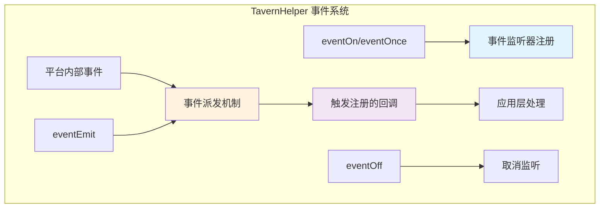
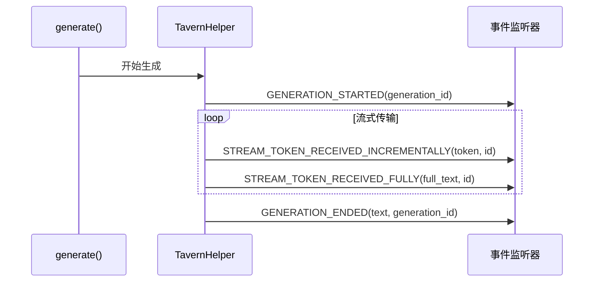

# 🔌 平台层：TavernHelper 事件系统能力分析

> **文档定位**：分析 TavernHelper 平台的原生事件系统能力，为适配层设计提供基础依据。

---

## 📋 目录

1. [平台事件系统概述](#平台事件系统概述)
2. [核心事件API](#核心事件api)
3. [生成相关事件](#生成相关事件)
4. [流式内容事件](#流式内容事件)
5. [其他标准事件](#其他标准事件)
6. [能力矩阵](#能力矩阵)
7. [平台特性总结](#平台特性总结)

---

## 平台事件系统概述

### 🎯 TavernHelper 事件机制

TavernHelper（基于 JS-Slash-Runner）提供了完整的事件系统，支持：

- ✅ **标准事件订阅**：通过 [`eventOn()`](../../resource/TAVERNHELPER.md#监听事件) 监听预定义事件
- ✅ **自定义事件派发**：通过 [`eventEmit()`](../../resource/TAVERNHELPER.md#发送事件) 派发自定义事件
- ✅ **一次性监听**：通过 [`eventOnce()`](../../resource/TAVERNHELPER.md#eventonce) 监听仅触发一次的事件
- ✅ **取消监听**：通过 [`eventOff()`](../../resource/TAVERNHELPER.md#eventoff) 取消事件监听

### 📊 事件架构图



---

## 核心事件API

### 1. [`eventOn()`](../../resource/TAVERNHELPER.md#eventon) - 监听事件 ⭐⭐⭐

**功能**：注册事件监听器，持续监听指定事件。

**接口定义**：
```typescript
function eventOn(
  eventName: string,
  callback: (...args: any[]) => void
): void;
```

**使用示例**：
```typescript
// 监听聊天变化事件
eventOn('CHAT_CHANGED', () => {
  console.log('聊天已变化');
});

// 监听消息发送事件
eventOn('MESSAGE_SENT', (message) => {
  console.log('消息已发送:', message);
});
```

**关键特性**：
- ✅ 支持任意字符串作为事件名
- ✅ 回调函数可接收多个参数
- ✅ 同一事件可注册多个监听器
- ⚠️ **注意**：不返回取消函数，需要手动调用 `eventOff` 清理

---

### 2. [`eventOnce()`](../../resource/TAVERNHELPER.md#eventonce) - 一次性监听 ⭐⭐

**功能**：注册一次性事件监听器，触发后自动移除。

**接口定义**：
```typescript
function eventOnce(
  eventName: string,
  callback: (...args: any[]) => void
): void;
```

**使用示例**：
```typescript
// 仅监听一次生成完成事件
eventOnce('GENERATION_ENDED', (text) => {
  console.log('生成完成:', text);
  // 回调执行后自动移除监听
});
```

**关键特性**：
- ✅ 自动清理，无需手动取消
- ✅ 适用于等待单次事件完成的场景
- ⚠️ 触发后立即移除，不可复用

---

### 3. [`eventOff()`](../../resource/TAVERNHELPER.md#eventoff) - 取消监听 ⭐⭐⭐

**功能**：取消已注册的事件监听器。

**接口定义**：
```typescript
function eventOff(
  eventName: string,
  callback?: (...args: any[]) => void
): void;
```

**使用示例**：
```typescript
// 定义回调函数
const onChatChanged = () => {
  console.log('聊天变化');
};

// 注册监听
eventOn('CHAT_CHANGED', onChatChanged);

// 取消特定回调
eventOff('CHAT_CHANGED', onChatChanged);

// 取消所有该事件的监听器
eventOff('CHAT_CHANGED');
```

**关键特性**：
- ✅ 可取消特定回调或所有回调
- ✅ 防止内存泄漏的关键机制
- ⚠️ 需要保持回调函数引用才能精确取消

---

### 4. [`eventEmit()`](../../resource/TAVERNHELPER.md#eventemit) - 派发事件 ⭐⭐

**功能**：派发自定义事件，触发已注册的监听器。

**接口定义**：
```typescript
function eventEmit(
  eventName: string,
  ...args: any[]
): void;
```

**使用示例**：
```typescript
// 发送自定义事件
eventEmit('CUSTOM_EVENT', { data: 'some data' });

// 发送带多个参数的事件
eventEmit('PLAYER_LEVEL_UP', playerName, newLevel, rewards);
```

**关键特性**：
- ✅ 支持任意数量的参数
- ✅ 同步触发所有注册的监听器
- ✅ 可用于模块间通信

---

## 生成相关事件

### 📋 TavernHelper 预定义生成事件

根据 [`TAVERNHELPER.md`](../../resource/TAVERNHELPER.md#通过事件获取生成结果)，TavernHelper 在生成过程中会派发以下事件：

#### 1. `GENERATION_STARTED` ⭐⭐⭐

**触发时机**：生成任务开始时

**事件定义**：
```typescript
[iframe_events.GENERATION_STARTED]: (generation_id: string) => void;
```

**参数说明**：
- `generation_id`: 生成任务的唯一标识符

**使用示例**：
```typescript
eventOn(iframe_events.GENERATION_STARTED, (generationId) => {
  console.log('生成开始，ID:', generationId);
  // 显示加载状态
});
```

**适配建议**：
- 映射到标准事件：[`generation:started`](./index.md#标准事件类型分类)
- 补充时间戳和其他元数据

---

#### 2. `STREAM_TOKEN_RECEIVED_FULLY` ⭐⭐⭐

**触发时机**：流式传输时，每次接收到新内容后推送当前完整文本

**事件定义**：
```typescript
[iframe_events.STREAM_TOKEN_RECEIVED_FULLY]: (full_text: string, generation_id: string) => void;
```

**参数说明**：
- `full_text`: 当前已生成的完整文本内容
- `generation_id`: 生成任务的唯一标识符

**内容示例**：
```typescript
// 第一次：'这是'
// 第二次：'这是一条'
// 第三次：'这是一条流式传输'
```

**使用示例**：
```typescript
eventOn(iframe_events.STREAM_TOKEN_RECEIVED_FULLY, (fullText, generationId) => {
  console.log('完整内容:', fullText);
  // 适合直接替换显示内容
  displayElement.textContent = fullText;
});
```

**适配建议**：
- 映射到标准事件：[`stream:token_full`](./index.md#标准事件类型分类)
- 适用于需要完整快照的场景

---

#### 3. `STREAM_TOKEN_RECEIVED_INCREMENTALLY` ⭐⭐⭐

**触发时机**：流式传输时，每次接收到新内容后推送增量部分

**事件定义**：
```typescript
[iframe_events.STREAM_TOKEN_RECEIVED_INCREMENTALLY]: (incremental_text: string, generation_id: string) => void;
```

**参数说明**：
- `incremental_text`: 本次新增的文本片段
- `generation_id`: 生成任务的唯一标识符

**内容示例**：
```typescript
// 第一次：'这是'
// 第二次：'一条'
// 第三次：'流式传输'
```

**使用示例**：
```typescript
let accumulatedText = '';
eventOn(iframe_events.STREAM_TOKEN_RECEIVED_INCREMENTALLY, (token, generationId) => {
  console.log('增量内容:', token);
  // 适合追加显示
  accumulatedText += token;
  displayElement.textContent = accumulatedText;
});
```

**适配建议**：
- 映射到标准事件：[`stream:token_incremental`](./index.md#标准事件类型分类)
- 适用于需要逐字显示的场景

---

#### 4. `GENERATION_ENDED` ⭐⭐⭐

**触发时机**：生成任务完成时

**事件定义**：
```typescript
[iframe_events.GENERATION_ENDED]: (text: string, generation_id: string) => void;
```

**参数说明**：
- `text`: 生成的最终完整文本
- `generation_id`: 生成任务的唯一标识符

**使用示例**：
```typescript
eventOn(iframe_events.GENERATION_ENDED, (finalText, generationId) => {
  console.log('生成完成，最终结果:', finalText);
  // 隐藏加载状态
  // 保存结果到历史记录
});
```

**适配建议**：
- 映射到标准事件：[`generation:ended`](./index.md#标准事件类型分类)
- 补充时间戳和性能指标

---

### 🔄 生成事件流程图



---

## 流式内容事件

### 📊 流式模式对比

| 事件类型 | 内容格式 | 适用场景 | 性能特点 |
|---------|----------|----------|----------|
| `STREAM_TOKEN_RECEIVED_INCREMENTALLY` | 增量片段 | 逐字显示、打字机效果 | 事件频繁、数据小 |
| `STREAM_TOKEN_RECEIVED_FULLY` | 完整快照 | 直接替换显示 | 事件频繁、数据大 |

### 💡 使用建议

**增量模式（Incremental）**：
```typescript
// ✅ 适合：需要累积显示的场景
let fullText = '';
eventOn(iframe_events.STREAM_TOKEN_RECEIVED_INCREMENTALLY, (token, id) => {
  fullText += token;
  updateDisplay(fullText);
});
```

**快照模式（Full）**：
```typescript
// ✅ 适合：需要完整替换的场景
eventOn(iframe_events.STREAM_TOKEN_RECEIVED_FULLY, (fullText, id) => {
  updateDisplay(fullText); // 直接替换
});
```

**混合模式**：
```typescript
// ✅ 适合：需要同时追踪增量和完整状态
eventOn(iframe_events.STREAM_TOKEN_RECEIVED_INCREMENTALLY, (token, id) => {
  handleIncrementalToken(token); // 处理增量逻辑
});

eventOn(iframe_events.STREAM_TOKEN_RECEIVED_FULLY, (fullText, id) => {
  validateFullText(fullText); // 验证完整性
});
```

---

## 其他标准事件

### 🎯 Tavern 标准事件清单

根据 [`TAVERNHELPER.md`](../../resource/TAVERNHELPER.md#常用事件类型)，TavernHelper 提供以下标准事件：

```typescript
const tavern_events = {
  // 聊天相关
  CHAT_CHANGED: 'CHAT_CHANGED',                     // 聊天切换
  MESSAGE_SENT: 'MESSAGE_SENT',                     // 消息发送
  MESSAGE_RECEIVED: 'MESSAGE_RECEIVED',             // 消息接收
  
  // 生成相关
  GENERATION_STARTED: 'GENERATION_STARTED',         // 生成开始
  GENERATION_ENDED: 'GENERATION_ENDED',             // 生成结束
  GENERATION_AFTER_COMMANDS: 'GENERATION_AFTER_COMMANDS', // 命令执行后
  
  // 渲染相关
  CHARACTER_MESSAGE_RENDERED: 'CHARACTER_MESSAGE_RENDERED', // 角色消息渲染
  USER_MESSAGE_RENDERED: 'USER_MESSAGE_RENDERED',   // 用户消息渲染
  
  // 其他
  IMPERSONATE_READY: 'IMPERSONATE_READY',           // 模拟准备就绪
  CHAT_COMPLETION_READY: 'CHAT_COMPLETION_READY',   // 聊天补全就绪
  
  // ... 更多事件
};
```

### 📋 事件分类与映射

#### 消息事件
| TavernHelper 事件 | CharacterAPI 标准事件 | 映射优先级 |
|-------------------|----------------------|-----------|
| `MESSAGE_SENT` | [`message:sent`](./index.md#标准事件类型分类) | ⭐⭐⭐ |
| `MESSAGE_RECEIVED` | [`message:received`](./index.md#标准事件类型分类) | ⭐⭐⭐ |

#### 聊天事件
| TavernHelper 事件 | CharacterAPI 标准事件 | 映射优先级 |
|-------------------|----------------------|-----------|
| `CHAT_CHANGED` | 自定义事件或状态变化 | ⭐⭐ |

#### 渲染事件
| TavernHelper 事件 | 映射建议 | 优先级 |
|-------------------|----------|--------|
| `CHARACTER_MESSAGE_RENDERED` | 保持平台特定，不映射 | ⭐ |
| `USER_MESSAGE_RENDERED` | 保持平台特定，不映射 | ⭐ |

---

## 能力矩阵

### ✅ TavernHelper 事件能力评估

| 能力项 | 支持情况 | 说明 | 评分 |
|--------|----------|------|------|
| **事件订阅** | ✅ 完全支持 | [`eventOn()`](../../resource/TAVERNHELPER.md#eventon) 机制完善 | ⭐⭐⭐ |
| **事件取消** | ✅ 完全支持 | [`eventOff()`](../../resource/TAVERNHELPER.md#eventoff) 支持精确取消 | ⭐⭐⭐ |
| **一次性监听** | ✅ 完全支持 | [`eventOnce()`](../../resource/TAVERNHELPER.md#eventonce) 自动清理 | ⭐⭐⭐ |
| **自定义事件** | ✅ 完全支持 | [`eventEmit()`](../../resource/TAVERNHELPER.md#eventemit) 灵活派发 | ⭐⭐⭐ |
| **流式增量** | ✅ 完全支持 | `STREAM_TOKEN_RECEIVED_INCREMENTALLY` | ⭐⭐⭐ |
| **流式快照** | ✅ 完全支持 | `STREAM_TOKEN_RECEIVED_FULLY` | ⭐⭐⭐ |
| **生成生命周期** | ✅ 完全支持 | 完整的 started/ended 事件 | ⭐⭐⭐ |
| **错误事件** | ⚠️ 需补充 | 无专用错误事件，需在回调中处理 | ⭐⭐ |
| **事件优先级** | ❌ 不支持 | 无内置优先级机制 | ⭐ |
| **事件冒泡** | ❌ 不支持 | 扁平化事件系统 | ⭐ |

### 🎯 能力总结

**优势**：
- ✅ 完整的基础事件API（on/off/once/emit）
- ✅ 双模式流式内容支持（增量+快照）
- ✅ 完善的生成生命周期事件
- ✅ 自定义事件灵活性高

**不足**：
- ⚠️ 缺少标准化的错误事件
- ⚠️ 事件负载格式不统一
- ⚠️ 缺少事件元数据（时间戳、追踪ID等）
- ⚠️ 无内置的监听器自动清理机制

---

## 平台特性总结

### 🔍 关键发现

#### 1. **事件命名约定**
- 使用 `UPPER_SNAKE_CASE` 命名
- 事件名称语义明确
- 区分平台事件（`tavern_events`）和iframe事件（`iframe_events`）

#### 2. **回调参数模式**
```typescript
// 生成事件：通常 (result, generation_id) 顺序
GENERATION_ENDED: (text: string, generation_id: string) => void

// 流式事件：通常 (content, generation_id) 顺序
STREAM_TOKEN_*: (content: string, generation_id: string) => void

// 其他事件：参数不统一，需逐个分析
```

#### 3. **生命周期管理**
- ✅ 提供 `eventOff` 手动清理
- ✅ 提供 `eventOnce` 自动清理
- ⚠️ 需要开发者主动管理内存

#### 4. **并发生成支持**
- ✅ 通过 `generation_id` 区分多个并发生成任务
- ✅ 所有生成相关事件都携带 `generation_id`
- ✅ 支持同时进行多个生成任务

---

### 📊 适配层设计建议

基于以上分析，适配层应该：

1. **标准化事件名称**
   ```typescript
   // 平台事件 → 标准事件映射
   'GENERATION_STARTED' → 'generation:started'
   'GENERATION_ENDED' → 'generation:ended'
   'STREAM_TOKEN_RECEIVED_INCREMENTALLY' → 'stream:token_incremental'
   'STREAM_TOKEN_RECEIVED_FULLY' → 'stream:token_full'
   ```

2. **统一负载格式**
   ```typescript
   // 补充标准字段
   {
     generation_id: string,
     timestamp: number,  // 新增
     // ... 其他平台原始数据
   }
   ```

3. **自动管理监听器**
   ```typescript
   // 包装层提供返回取消函数的接口
   const unsubscribe = CharacterAPI.events.on('event', callback);
   unsubscribe(); // 清理
   ```

4. **错误事件补充**
   ```typescript
   // 在适配层捕获生成错误，派发标准错误事件
   try {
     await generate(...);
   } catch (error) {
     emit('generation:error', {
       generation_id,
       error: { message: error.message },
       timestamp: Date.now()
     });
   }
   ```

---

### 🔗 相关资源

- **平台文档**：[`TAVERNHELPER.md`](../../resource/TAVERNHELPER.md)
- **RFC规范**：[`CHARACTER_API_RFC.md`](/CHARACTER_API_RFC#_4-2-事件系统-characterapi-events-⭐⭐⭐)
- **适配层设计**：[`adapter.md`](./adapter.md)
- **包装层实现**：[`wrapper.md`](./wrapper.md)

---

## 📝 平台兼容性备注

### TavernHelper 特定注意事项

1. **事件常量定义位置**
   ```typescript
   // 需要从平台获取事件常量
   const { tavern_events, iframe_events } = window;
   ```

2. **跨iframe通信**
   - TavernHelper 运行在 iframe 中
   - 事件系统支持跨iframe通信
   - 适配层需要正确处理iframe边界

3. **生成ID管理**
   - 如果未提供 `generation_id`，平台会自动生成UUID
   - 建议应用层始终提供明确的ID以便追踪

4. **事件触发时序**
   - 流式事件是异步触发的
   - 不保证 `INCREMENTALLY` 和 `FULLY` 的触发顺序
   - 应用层不应依赖事件的具体顺序

---

> **📖 文档状态**：本文档基于 TavernHelper API 文档分析，提供平台事件能力的完整清单和适配建议。