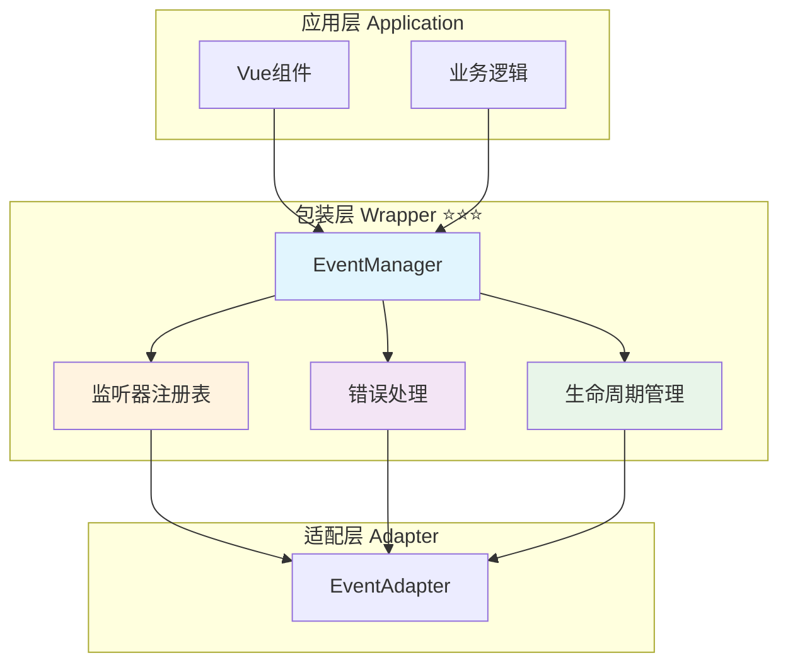

# 📦 包装层：统一事件管理器实现

> **文档定位**：定义包装层事件管理器的完整实现，提供统一的事件API接口和生命周期管理。

---

## 📋 目录

1. [包装层职责与目标](#包装层职责与目标)
2. [核心接口实现](#核心接口实现)
3. [EventManager 完整实现](#eventmanager-完整实现)
4. [内存管理与清理](#内存管理与清理)
5. [错误处理机制](#错误处理机制)
6. [使用示例与最佳实践](#使用示例与最佳实践)
7. [性能优化](#性能优化)

---

## 包装层职责与目标

### 🎯 核心职责

包装层作为应用层与适配层之间的桥梁，主要负责：

1. **统一事件API** ⭐⭐⭐
   - 提供简洁一致的事件订阅接口
   - 隐藏底层适配器的复杂性
   - 确保类型安全和接口稳定性

2. **生命周期管理** ⭐⭐⭐
   - 自动管理监听器的注册与注销
   - 防止内存泄漏
   - 提供批量清理机制

3. **错误处理** ⭐⭐⭐
   - 捕获并处理回调函数中的异常
   - 提供统一的错误日志记录
   - 不因单个监听器错误影响其他监听器

4. **开发者体验** ⭐⭐
   - 提供清晰的调试信息
   - 支持TypeScript类型推断
   - 友好的API设计

### 📊 架构定位



---

## 核心接口实现

### 1. EventManager 接口定义 ⭐⭐⭐

```typescript
/**
 * 事件管理器接口
 * 提供统一的事件订阅和派发能力
 */
interface EventManager {
  /**
   * 监听标准事件
   * @param eventName 标准事件名称
   * @param callback 回调函数
   * @returns 取消监听函数
   */
  on(eventName: StandardEventName, callback: EventCallback): UnsubscribeFunction;
  
  /**
   * 一次性监听事件
   * @param eventName 标准事件名称
   * @param callback 回调函数
   * @returns 取消监听函数
   */
  once(eventName: StandardEventName, callback: EventCallback): UnsubscribeFunction;
  
  /**
   * 取消监听事件
   * @param eventName 标准事件名称
   * @param callback 可选的具体回调函数
   */
  off(eventName: StandardEventName, callback?: EventCallback): void;
  
  /**
   * 派发自定义事件
   * @param eventName 事件名称
   * @param detail 事件数据
   */
  emit(eventName: string, detail: any): void;
  
  /**
   * 清除所有监听器
   */
  clear(): void;
  
  /**
   * 获取当前活跃的监听器数量
   * @param eventName 可选的事件名称，不传则返回总数
   */
  getListenerCount(eventName?: StandardEventName): number;
}
```

### 2. 类型定义 ⭐⭐⭐

```typescript
/** 标准事件名称 */
type StandardEventName =
  | 'message:sent'
  | 'message:received'
  | 'state:changed'
  | 'generation:started'
  | 'generation:progress'
  | 'generation:ended'
  | 'generation:error'
  | 'stream:token_incremental'
  | 'stream:token_full';

/** 事件回调函数 */
type EventCallback<T = any> = (payload: T) => void;

/** 取消订阅函数 */
type UnsubscribeFunction = () => void;

/** 监听器元数据 */
interface ListenerMetadata {
  callback: EventCallback;
  addedAt: number;
  callCount: number;
  lastCalledAt?: number;
}
```

---

## EventManager 完整实现

### 核心实现类 ⭐⭐⭐

```typescript
/**
 * 事件管理器实现
 * 基于适配器模式，提供统一的事件管理能力
 */
class EventManagerImpl implements EventManager {
  /** 适配器实例 */
  private adapter: EventAdapter;
  
  /** 监听器元数据注册表 */
  private listenerMetadata: Map<StandardEventName, Map<EventCallback, ListenerMetadata>> = new Map();
  
  /** 调试模式 */
  private debugMode: boolean = false;
  
  /**
   * 构造函数
   * @param adapter 事件适配器实例
   * @param options 配置选项
   */
  constructor(
    adapter: EventAdapter,
    options?: {
      debug?: boolean;
    }
  ) {
    this.adapter = adapter;
    this.debugMode = options?.debug || false;
  }
  
  /**
   * 监听标准事件
   */
  on(eventName: StandardEventName, callback: EventCallback): UnsubscribeFunction {
    // 参数校验
    this.validateEventName(eventName);
    this.validateCallback(callback);
    
    // 创建包装回调（添加错误处理和统计）
    const wrappedCallback = this.wrapCallback(eventName, callback);
    
    // 注册到适配器
    const unsubscribe = this.adapter.on(eventName, wrappedCallback);
    
    // 记录元数据
    this.recordListener(eventName, callback, wrappedCallback);
    
    // 调试日志
    this.debugLog('on', eventName, this.getListenerCount(eventName));
    
    // 返回清理函数
    return () => {
      unsubscribe();
      this.removeListener(eventName, callback);
      this.debugLog('off', eventName, this.getListenerCount(eventName));
    };
  }
  
  /**
   * 一次性监听事件
   */
  once(eventName: StandardEventName, callback: EventCallback): UnsubscribeFunction {
    let unsubscribed = false;
    
    const onceWrapper: EventCallback = (payload: any) => {
      if (unsubscribed) return;
      
      unsubscribed = true;
      callback(payload);
      
      // 自动取消监听
      this.off(eventName, onceWrapper);
    };
    
    return this.on(eventName, onceWrapper);
  }
  
  /**
   * 取消监听事件
   */
  off(eventName: StandardEventName, callback?: EventCallback): void {
    this.validateEventName(eventName);
    
    if (callback) {
      // 取消特定回调
      this.adapter.off(eventName, callback);
      this.removeListener(eventName, callback);
    } else {
      // 取消所有回调
      this.adapter.off(eventName);
      this.removeAllListeners(eventName);
    }
    
    this.debugLog('off', eventName, this.getListenerCount(eventName));
  }
  
  /**
   * 派发自定义事件
   */
  emit(eventName: string, detail: any): void {
    try {
      this.adapter.emit(eventName, detail);
      this.debugLog('emit', eventName, detail);
    } catch (error) {
      console.error(`Error emitting event ${eventName}:`, error);
      throw error;
    }
  }
  
  /**
   * 清除所有监听器
   */
  clear(): void {
    this.adapter.clear();
    this.listenerMetadata.clear();
    this.debugLog('clear', 'all', 0);
  }
  
  /**
   * 获取监听器数量
   */
  getListenerCount(eventName?: StandardEventName): number {
    if (eventName) {
      const listeners = this.listenerMetadata.get(eventName);
      return listeners ? listeners.size : 0;
    }
    
    // 返回总数
    let total = 0;
    for (const listeners of this.listenerMetadata.values()) {
      total += listeners.size;
    }
    return total;
  }
  
  /**
   * 包装回调函数（添加错误处理和统计）
   */
  private wrapCallback(
    eventName: StandardEventName,
    callback: EventCallback
  ): EventCallback {
    return (payload: any) => {
      // 更新统计信息
      const metadata = this.getListenerMetadata(eventName, callback);
      if (metadata) {
        metadata.callCount++;
        metadata.lastCalledAt = Date.now();
      }
      
      // 执行回调，捕获异常
      try {
        callback(payload);
      } catch (error) {
        console.error(
          `Error in event listener for ${eventName}:`,
          error,
          '\nPayload:',
          payload
        );
        
        // 派发错误事件（如果回调本身不是错误事件的监听器）
        if (eventName !== 'generation:error') {
          this.emitErrorEvent(eventName, error, payload);
        }
      }
    };
  }
  
  /**
   * 记录监听器元数据
   */
  private recordListener(
    eventName: StandardEventName,
    callback: EventCallback,
    wrappedCallback: EventCallback
  ): void {
    if (!this.listenerMetadata.has(eventName)) {
      this.listenerMetadata.set(eventName, new Map());
    }
    
    const listeners = this.listenerMetadata.get(eventName)!;
    listeners.set(callback, {
      callback: wrappedCallback,
      addedAt: Date.now(),
      callCount: 0,
    });
  }
  
  /**
   * 移除监听器元数据
   */
  private removeListener(eventName: StandardEventName, callback: EventCallback): void {
    const listeners = this.listenerMetadata.get(eventName);
    if (listeners) {
      listeners.delete(callback);
      
      // 清理空集合
      if (listeners.size === 0) {
        this.listenerMetadata.delete(eventName);
      }
    }
  }
  
  /**
   * 移除所有监听器元数据
   */
  private removeAllListeners(eventName: StandardEventName): void {
    this.listenerMetadata.delete(eventName);
  }
  
  /**
   * 获取监听器元数据
   */
  private getListenerMetadata(
    eventName: StandardEventName,
    callback: EventCallback
  ): ListenerMetadata | undefined {
    const listeners = this.listenerMetadata.get(eventName);
    return listeners?.get(callback);
  }
  
  /**
   * 派发错误事件
   */
  private emitErrorEvent(
    sourceEvent: string,
    error: any,
    payload: any
  ): void {
    try {
      this.emit('generation:error', {
        error: {
          code: 'LISTENER_ERROR',
          message: error.message || '事件监听器执行错误',
          sourceEvent,
          originalPayload: payload,
        },
        timestamp: Date.now(),
      });
    } catch (err) {
      // 防止错误事件本身出错导致无限循环
      console.error('Error emitting error event:', err);
    }
  }
  
  /**
   * 参数校验：事件名称
   */
  private validateEventName(eventName: string): void {
    if (!eventName || typeof eventName !== 'string') {
      throw new TypeError('Event name must be a non-empty string');
    }
  }
  
  /**
   * 参数校验：回调函数
   */
  private validateCallback(callback: any): void {
    if (typeof callback !== 'function') {
      throw new TypeError('Callback must be a function');
    }
  }
  
  /**
   * 调试日志
   */
  private debugLog(action: string, eventName: string, data: any): void {
    if (this.debugMode) {
      console.log(`[EventManager] ${action} - ${eventName}`, data);
    }
  }
  
  /**
   * 获取监听器统计信息（用于调试）
   */
  getStatistics(): {
    totalListeners: number;
    eventBreakdown: Record<string, number>;
    oldestListener?: {
      event: string;
      age: number;
    };
  } {
    const stats = {
      totalListeners: 0,
      eventBreakdown: {} as Record<string, number>,
      oldestListener: undefined as any,
    };
    
    let oldestTime = Date.now();
    
    for (const [eventName, listeners] of this.listenerMetadata) {
      const count = listeners.size;
      stats.totalListeners += count;
      stats.eventBreakdown[eventName] = count;
      
      // 查找最老的监听器
      for (const metadata of listeners.values()) {
        if (metadata.addedAt < oldestTime) {
          oldestTime = metadata.addedAt;
          stats.oldestListener = {
            event: eventName,
            age: Date.now() - metadata.addedAt,
          };
        }
      }
    }
    
    return stats;
  }
}
```

---

## 内存管理与清理

### 1. 自动清理机制 ⭐⭐⭐

```typescript
/**
 * 自动清理管理器
 * 定期检查并清理长时间未使用的监听器
 */
class AutoCleanupManager {
  private readonly MAX_IDLE_TIME = 5 * 60 * 1000; // 5分钟
  private cleanupInterval: any;
  
  constructor(private eventManager: EventManagerImpl) {
    this.startAutoCleanup();
  }
  
  /**
   * 启动自动清理
   */
  private startAutoCleanup(): void {
    this.cleanupInterval = setInterval(() => {
      this.performCleanup();
    }, 60000); // 每分钟检查一次
  }
  
  /**
   * 执行清理
   */
  private performCleanup(): void {
    const stats = this.eventManager.getStatistics();
    
    if (stats.oldestListener && stats.oldestListener.age > this.MAX_IDLE_TIME) {
      console.warn(
        `Listener for ${stats.oldestListener.event} has been idle for ` +
        `${Math.round(stats.oldestListener.age / 1000)}s. Consider cleaning up.`
      );
    }
  }
  
  /**
   * 停止自动清理
   */
  stop(): void {
    if (this.cleanupInterval) {
      clearInterval(this.cleanupInterval);
    }
  }
}
```

### 2. 批量清理工具 ⭐⭐

```typescript
/**
 * 批量清理工具
 * 用于组件卸载时批量清理监听器
 */
class EventCleanupHelper {
  private unsubscribers: UnsubscribeFunction[] = [];
  
  /**
   * 添加监听器
   */
  add(unsubscribe: UnsubscribeFunction): void {
    this.unsubscribers.push(unsubscribe);
  }
  
  /**
   * 清理所有监听器
   */
  cleanup(): void {
    this.unsubscribers.forEach(unsub => unsub());
    this.unsubscribers = [];
  }
  
  /**
   * 获取监听器数量
   */
  get count(): number {
    return this.unsubscribers.length;
  }
}

// 使用示例
const cleanup = new EventCleanupHelper();

// 注册多个监听器
cleanup.add(eventManager.on('generation:started', handler1));
cleanup.add(eventManager.on('generation:ended', handler2));
cleanup.add(eventManager.on('stream:token_incremental', handler3));

// 组件卸载时一次性清理
cleanup.cleanup();
```

---

## 错误处理机制

### 1. 错误边界 ⭐⭐⭐

```typescript
/**
 * 事件错误边界
 * 捕获并处理事件监听器中的错误
 */
class EventErrorBoundary {
  private errorHandlers: Map<string, (error: Error) => void> = new Map();
  
  /**
   * 注册错误处理器
   */
  onError(eventName: string, handler: (error: Error) => void): void {
    this.errorHandlers.set(eventName, handler);
  }
  
  /**
   * 处理错误
   */
  handleError(eventName: string, error: Error, payload: any): void {
    const handler = this.errorHandlers.get(eventName);
    
    if (handler) {
      try {
        handler(error);
      } catch (handlerError) {
        console.error('Error in error handler:', handlerError);
      }
    }
    
    // 默认错误处理
    this.logError(eventName, error, payload);
  }
  
  /**
   * 记录错误日志
   */
  private logError(eventName: string, error: Error, payload: any): void {
    console.error(
      `[EventManager] Error in listener for "${eventName}":`,
      {
        error: error.message,
        stack: error.stack,
        payload,
        timestamp: new Date().toISOString(),
      }
    );
  }
}
```

### 2. 错误重试机制 ⭐⭐

```typescript
/**
 * 带重试的事件监听
 */
function onWithRetry(
  eventManager: EventManager,
  eventName: StandardEventName,
  callback: EventCallback,
  options?: {
    maxRetries?: number;
    retryDelay?: number;
  }
): UnsubscribeFunction {
  const maxRetries = options?.maxRetries || 3;
  const retryDelay = options?.retryDelay || 1000;
  
  let retryCount = 0;
  
  return eventManager.on(eventName, async (payload) => {
    while (retryCount < maxRetries) {
      try {
        await callback(payload);
        retryCount = 0; // 重置计数
        break;
      } catch (error) {
        retryCount++;
        
        if (retryCount >= maxRetries) {
          console.error(`Failed after ${maxRetries} retries:`, error);
          throw error;
        }
        
        console.warn(`Retry ${retryCount}/${maxRetries} after error:`, error);
        await new Promise(resolve => setTimeout(resolve, retryDelay));
      }
    }
  });
}
```

---

## 使用示例与最佳实践

### 1. 基础使用 ⭐⭐⭐

```typescript
// 创建事件管理器
const adapter = new TavernHelperEventAdapter();
const eventManager = new EventManagerImpl(adapter, { debug: true });

// 监听生成事件
const unsubscribe = eventManager.on('generation:started', (payload) => {
  console.log('生成开始:', payload.generation_id);
});

// 监听流式内容
eventManager.on('stream:token_incremental', (payload) => {
  process.stdout.write(payload.token);
});

// 监听生成完成
eventManager.on('generation:ended', (payload) => {
  console.log('\n生成完成:', payload.result);
});

// 清理监听器
unsubscribe();
```

### 2. 一次性监听 ⭐⭐

```typescript
// 等待单次事件完成
eventManager.once('generation:ended', (payload) => {
  console.log('首次生成完成:', payload.result);
  // 此监听器会自动移除
});
```

### 3. 批量管理 ⭐⭐⭐

```typescript
class GenerationMonitor {
  private cleanup = new EventCleanupHelper();
  
  constructor(private eventManager: EventManager) {
    this.setupListeners();
  }
  
  private setupListeners(): void {
    // 集中管理所有监听器
    this.cleanup.add(
      this.eventManager.on('generation:started', this.onStart.bind(this))
    );
    
    this.cleanup.add(
      this.eventManager.on('generation:progress', this.onProgress.bind(this))
    );
    
    this.cleanup.add(
      this.eventManager.on('generation:ended', this.onEnd.bind(this))
    );
    
    this.cleanup.add(
      this.eventManager.on('generation:error', this.onError.bind(this))
    );
  }
  
  private onStart(payload: any): void {
    console.log('开始:', payload.generation_id);
  }
  
  private onProgress(payload: any): void {
    console.log('进度:', payload.progress);
  }
  
  private onEnd(payload: any): void {
    console.log('完成:', payload.result);
  }
  
  private onError(payload: any): void {
    console.error('错误:', payload.error);
  }
  
  destroy(): void {
    this.cleanup.cleanup();
  }
}

// 使用
const monitor = new GenerationMonitor(eventManager);
// ... 使用 ...
monitor.destroy(); // 清理所有监听器
```

### 4. 条件监听 ⭐⭐

```typescript
/**
 * 仅监听特定ID的生成事件
 */
function onGenerationById(
  eventManager: EventManager,
  generationId: string,
  handlers: {
    onStart?: (payload: any) => void;
    onProgress?: (payload: any) => void;
    onEnd?: (payload: any) => void;
    onError?: (payload: any) => void;
  }
): UnsubscribeFunction {
  const unsubscribers: UnsubscribeFunction[] = [];
  
  if (handlers.onStart) {
    unsubscribers.push(
      eventManager.on('generation:started', (payload) => {
        if (payload.generation_id === generationId) {
          handlers.onStart!(payload);
        }
      })
    );
  }
  
  if (handlers.onProgress) {
    unsubscribers.push(
      eventManager.on('generation:progress', (payload) => {
        if (payload.generation_id === generationId) {
          handlers.onProgress!(payload);
        }
      })
    );
  }
  
  if (handlers.onEnd) {
    unsubscribers.push(
      eventManager.on('generation:ended', (payload) => {
        if (payload.generation_id === generationId) {
          handlers.onEnd!(payload);
        }
      })
    );
  }
  
  if (handlers.onError) {
    unsubscribers.push(
      eventManager.on('generation:error', (payload) => {
        if (payload.generation_id === generationId) {
          handlers.onError!(payload);
        }
      })
    );
  }
  
  // 返回统一清理函数
  return () => {
    unsubscribers.forEach(unsub => unsub());
  };
}

// 使用示例
const cleanupGen = onGenerationById(eventManager, 'gen-123', {
  onStart: (p) => console.log('开始:', p),
  onEnd: (p) => console.log('完成:', p),
  onError: (p) => console.error('错误:', p),
});

// 清理
cleanupGen();
```

---

## 性能优化

### 1. 事件节流 ⭐⭐

```typescript
/**
 * 节流事件监听
 * 限制高频事件的处理频率
 */
function onThrottled(
  eventManager: EventManager,
  eventName: StandardEventName,
  callback: EventCallback,
  delay: number = 100
): UnsubscribeFunction {
  let lastCall = 0;
  let timeoutId: any = null;
  let lastPayload: any = null;
  
  return eventManager.on(eventName, (payload) => {
    lastPayload = payload;
    const now = Date.now();
    
    if (now - lastCall >= delay) {
      lastCall = now;
      callback(payload);
    } else {
      // 确保最后一次事件被处理
      if (timeoutId) clearTimeout(timeoutId);
      
      timeoutId = setTimeout(() => {
        lastCall = Date.now();
        callback(lastPayload);
      }, delay - (now - lastCall));
    }
  });
}

// 使用示例：节流处理高频流式事件
const unsubscribe = onThrottled(
  eventManager,
  'stream:token_incremental',
  (payload) => {
    updateUI(payload.token);
  },
  50 // 每50ms最多更新一次
);
```

### 2. 事件防抖 ⭐⭐

```typescript
/**
 * 防抖事件监听
 * 仅在事件停止触发一段时间后执行
 */
function onDebounced(
  eventManager: EventManager,
  eventName: StandardEventName,
  callback: EventCallback,
  delay: number = 300
): UnsubscribeFunction {
  let timeoutId: any = null;
  
  return eventManager.on(eventName, (payload) => {
    if (timeoutId) clearTimeout(timeoutId);
    
    timeoutId = setTimeout(() => {
      callback(payload);
    }, delay);
  });
}

// 使用示例：防抖处理用户输入
const unsubscribe = onDebounced(
  eventManager,
  'state:changed',
  (payload) => {
    saveToBackend(payload);
  },
  500 // 停止变化500ms后保存
);
```

### 3. 批量处理 ⭐⭐

```typescript
/**
 * 批量处理事件
 * 收集一段时间内的所有事件，统一处理
 */
function onBatched(
  eventManager: EventManager,
  eventName: StandardEventName,
  callback: (payloads: any[]) => void,
  options: {
    maxSize?: number;
    maxWait?: number;
  } = {}
): UnsubscribeFunction {
  const maxSize = options.maxSize || 100;
  const maxWait = options.maxWait || 1000;
  
  let batch: any[] = [];
  let timeoutId: any = null;
  
  const flush = () => {
    if (batch.length > 0) {
      callback([...batch]);
      batch = [];
    }
    if (timeoutId) {
      clearTimeout(timeoutId);
      timeoutId = null;
    }
  };
  
  const unsubscribe = eventManager.on(eventName, (payload) => {
    batch.push(payload);
    
    // 达到批量大小，立即处理
    if (batch.length >= maxSize) {
      flush();
      return;
    }
    
    // 设置超时处理
    if (!timeoutId) {
      timeoutId = setTimeout(flush, maxWait);
    }
  });
  
  // 返回增强的清理函数
  return () => {
    flush(); // 清理前处理剩余批次
    unsubscribe();
  };
}

// 使用示例：批量处理Token
const unsubscribe = onBatched(
  eventManager,
  'stream:token_incremental',
  (tokens) => {
    const combined = tokens.map(t => t.token).join('');
    updateDisplay(combined);
  },
  { maxSize: 10, maxWait: 100 }
);
```

---

## 🔗 相关资源

- **适配层**：[`adapter.md`](./adapter.md) - 事件适配器实现
- **平台层**：[`platform.md`](./platform.md) - TavernHelper事件能力
- **应用层**：[`application.md`](./application.md) - Vue组件集成
- **RFC规范**：[`CHARACTER_API_RFC.md`](../../CHARACTER_API_RFC.md#_4-2-事件系统-characterapi-events-⭐⭐⭐)

---

## 📊 性能基准

### 监听器性能指标

| 操作 | 时间复杂度 | 说明 |
|------|-----------|------|
| `on()` | O(1) | 注册监听器 |
| `off()` | O(1) | 取消单个监听器 |
| `emit()` | O(n) | n为该事件的监听器数量 |
| `clear()` | O(m) | m为所有监听器总数 |
| `getListenerCount()` | O(1) | 获取计数 |

### 内存占用

- 每个监听器：约100-200字节（包含元数据）
- 1000个监听器：约100-200KB
- 建议监听器总数：< 1000

---

> **📖 文档状态**：本文档提供了事件管理器包装层的完整实现，包括核心接口、内存管理、错误处理和性能优化策略。