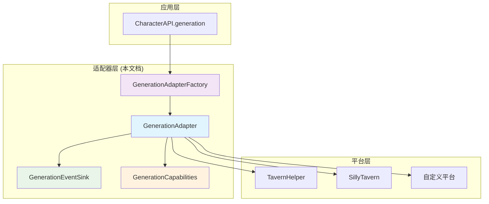
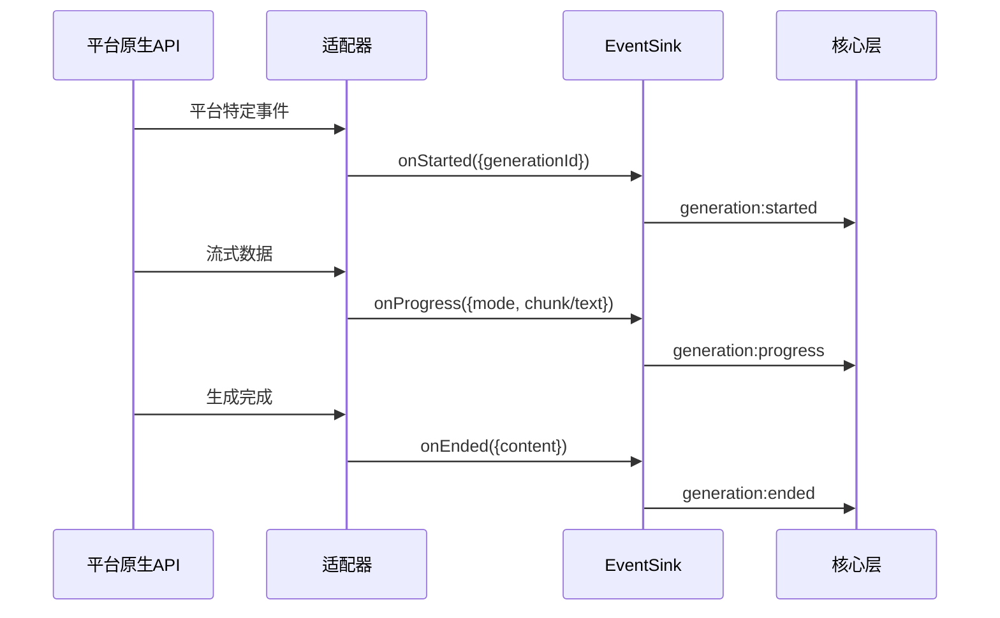

# 🎯 四层模型·平台适配层（Generation Adapter）

> **核心目标**：提供可直接落地的适配器设计与实现合同（SPI），将各平台原生生成能力映射为统一的 [`CharacterAPI.generation`](../index.md#generation-api) 接口与事件语义，并支持能力协商、降级与资源释放。

---

## 📋 快速导航

| 组件 | 职责 | 推荐度 | 适用场景 | 复杂度 |
|------|------|--------|----------|--------|
| [`GenerationAdapter`](#核心适配器接口) | 统一生成接口实现 | ⭐⭐⭐ **必需** | 所有平台 | 中等 |
| [`GenerationEventSink`](#事件归一化接收器) | 事件归一化处理 | ⭐⭐⭐ **必需** | 流式生成 | 简单 |
| [`GenerationCapabilities`](#能力声明系统) | 能力协商与降级 | ⭐⭐⭐ **必需** | 跨平台兼容 | 简单 |
| [`AdapterFactory`](#适配器工厂) | 适配器实例化 | ⭐⭐ **推荐** | 多平台支持 | 简单 |
| [`StreamDeliveryOptions`](#流式内容选择) | 流式内容控制 | ⭐⭐ **推荐** | 高级流式场景 | 简单 |
| [`ResourceManager`](#资源管理) | 并发与清理 | ⭐ **可选** | 高并发场景 | 中等 |

## 🏗️ 架构概览



---

## 🎯 核心适配器接口

### GenerationAdapter ⭐⭐⭐

> **职责**：统一生成接口的核心实现，负责将平台特定的生成能力映射为标准接口
> **必要性**：**绝对必需** - 所有平台适配的基础合同

#### 核心特性
- ✅ 统一的生成方法签名
- ✅ 能力声明与协商
- ✅ 事件归一化处理
- ✅ 资源生命周期管理

#### 接口概览
```typescript
export interface GenerationAdapter {
  capabilities: GenerationCapabilities;
  
  generateWithPreset(prompt: string, options?: PresetGenerationOptions & StreamDeliveryOptions): Promise<string>;
  generateRaw(ordered_prompts: (BuiltinPrompt | RolePrompt)[], options?: RawGenerationOptions & StreamDeliveryOptions): Promise<string>;
  
  stop?(generationId?: string): Promise<void>;
  registerEvents?(sink: GenerationEventSink): () => void;
}
```

> 📖 **完整实现参考**：[TavernHelper适配器实现](#tavernhelper-适配器完整实现)

### 💡 **实施策略**

**默认导出推荐**：
```typescript
// 导出类型安全的适配器工厂
export { TavernHelperAdapterFactory as DefaultAdapterFactory };
```


---

## 🔄 事件归一化接收器

### GenerationEventSink ⭐⭐⭐

> **职责**：将平台特定事件转换为统一的事件语义
> **必要性**：**绝对必需** - 流式生成的核心组件

#### 标准事件流程


#### 接口定义
```typescript
export interface GenerationEventSink {
  onStarted(payload: { generationId: string; meta?: Record<string, any> }): void;
  onProgress(payload: { 
    mode: 'incremental' | 'full'; 
    chunk?: string; 
    text?: string; 
    generationId: string; 
    meta?: Record<string, any> 
  }): void;
  onEnded(payload: { content: string; generationId: string; meta?: Record<string, any> }): void;
  onError(payload: { error: Error; generationId?: string; meta?: Record<string, any> }): void;
}
```

#### ⚠️ 重要约束
- **并发隔离**：所有事件必须携带 `generationId`
- **事件顺序**：非流式仅 `started → ended/error`，流式按选项转发
- **错误处理**：异常必须通过 `onError` 传递并上抛 Promise

---

## 🎛️ 能力声明系统

### GenerationCapabilities ⭐⭐⭐

> **职责**：声明平台支持的功能特性，用于运行时协商与降级
> **必要性**：**绝对必需** - 跨平台兼容的基础

#### 能力矩阵
```typescript
export interface GenerationCapabilities {
  // 流式能力
  supportsStreamingIncremental: boolean;  // 增量流式
  supportsStreamingFull: boolean;         // 完整快照流式
  
  // 输入能力
  supportsImageInput: boolean;            // 图片输入
  supportsOverrides: boolean;             // 提示词覆盖
  supportsInjects: boolean;               // 提示词注入
  supportsOrderedPrompts: boolean;        // 自定义提示词序列
  
  // 控制能力
  supportsStopById: boolean;              // 按ID停止生成
  supportsCustomApi: boolean;             // 自定义API配置
}
```

#### 降级策略表

| 不支持的能力 | 降级行为 | 日志级别 | 用户感知 |
|-------------|----------|----------|----------|
| `supportsStreamingFull` | 忽略 `stream_use_full` | `warn` | 仅增量流式 |
| `supportsImageInput` | 忽略 `image` 参数 | `warn` | 文本生成 |
| `supportsStopById` | `stop()` 空实现 | `warn` | 不可中断 |
| `supportsOverrides` | 忽略 `overrides` | `warn` | 默认提示词 |

#### 💡 **最佳实践**
```typescript
// 能力检查与降级示例
function validateCapabilities(capabilities: GenerationCapabilities, options: any) {
  if (!capabilities.supportsImageInput && options.image) {
    logger.warn('Image input not supported, ignoring image parameter');
    delete options.image;
  }
  
  if (!capabilities.supportsStreamingFull && options.stream_use_full) {
    logger.warn('Full streaming not supported, using incremental only');
    options.stream_use_full = false;
  }
}
```

---

## 🏭 适配器工厂

### GenerationAdapterFactory ⭐⭐

> **职责**：标准化适配器实例创建，支持依赖注入和配置管理
> **必要性**：**推荐使用** - 多平台环境下的最佳实践

#### 工厂接口
```typescript
export interface GenerationAdapterFactory {
  name: string; // 平台标识，如 "TavernHelper" | "SillyTavern"
  create(context: AdapterContext): GenerationAdapter;
}

export interface AdapterContext {
  platformInfo: { name: string; version?: string; features?: string[] };
  logger?: { debug(...args: any[]): void; warn(...args: any[]): void; error(...args: any[]): void };
}
```

#### 🚀 使用示例
```typescript
// 注册多个适配器工厂
const factories = new Map<string, GenerationAdapterFactory>([
  ['TavernHelper', TavernHelperAdapterFactory],
  ['SillyTavern', SillyTavernAdapterFactory],
  ['Custom', CustomAdapterFactory]
]);

// 运行时选择适配器
function createAdapter(platformName: string, context: AdapterContext) {
  const factory = factories.get(platformName);
  if (!factory) {
    throw new Error(`Unsupported platform: ${platformName}`);
  }
  return factory.create(context);
}
```

---

## 📊 统一选项类型

### 预设生成选项 ⭐⭐⭐
```typescript
export interface PresetGenerationOptions {
  user_input?: string;                    // 用户输入
  image?: File | string | (File | string)[]; // 图片输入
  stream?: boolean;                       // 是否启用流式
  overrides?: Overrides;                  // 提示词覆盖
  injects?: Omit<InjectionPrompt, 'id'>[]; // 提示词注入
  max_chat_history?: 'all' | number;     // 聊天历史限制
  custom_api?: CustomApiConfig;           // 自定义API配置
  generation_id?: string;                 // 生成ID
}
```

### 流式内容选择 ⭐⭐
```typescript
export interface StreamDeliveryOptions {
  /** 是否转发增量内容 (默认: true) */
  stream_use_incremental?: boolean;
  /** 是否转发完整快照 (默认: false) */
  stream_use_full?: boolean;
}
```

### 📖 类型复用参考
- **配置规范参考**：
  - 预设模式：参见 CharacterAPI RFC
  - 自定义模式：参见 CharacterAPI RFC
  - 覆盖配置：参见 CharacterAPI RFC
  - 注入配置：参见 CharacterAPI RFC

---

## 🔧 资源管理

### 并发控制 ⭐

> **职责**：管理多个并发生成请求的资源分配与清理
> **必要性**：**可选扩展** - 高并发场景下的性能优化

#### 资源管理策略
```typescript
class GenerationResourceManager {
  private subscriptions = new Map<string, () => void>();
  
  register(generationId: string, cleanup: () => void): void {
    this.subscriptions.set(generationId, cleanup);
  }
  
  cleanup(generationId: string): void {
    const cleanup = this.subscriptions.get(generationId);
    if (cleanup) {
      try {
        cleanup();
      } catch (error) {
        console.warn(`Cleanup failed for ${generationId}:`, error);
      }
      this.subscriptions.delete(generationId);
    }
  }
  
  cleanupAll(): void {
    for (const [id, cleanup] of this.subscriptions) {
      this.cleanup(id);
    }
  }
}
```

#### ⚠️ 关键原则
- **精确过滤**：使用 `generationId` 避免事件交叉污染
- **强制清理**：无论成功失败都必须执行清理函数
- **异常安全**：清理过程中的异常不应影响主流程

---

## ✅ 适配器合规清单

### 🔍 实现检查清单

- [ ] **能力声明**：`capabilities` 完整且与实际一致
- [ ] **事件序列**：非流式无 `progress`，流式按选项转发
- [ ] **错误处理**：异常必达 `generation:error` 并上抛 Promise
- [ ] **降级策略**：不支持功能有 `warn` 日志且不崩溃
- [ ] **平台语义**：覆盖/注入/图片等行为与平台一致
- [ ] **返回一致性**：返回值与 `ended` 事件内容相同
- [ ] **资源清理**：所有订阅都有对应的清理机制

### 🎯 质量指标

| 指标类型 | 目标值 | 验证方法 |
|----------|--------|----------|
| **接口一致性** | 100% | 类型检查通过 |
| **事件完整性** | 100% | 所有事件都有对应处理 |
| **错误覆盖率** | ≥95% | 异常场景测试 |
| **资源泄漏率** | 0% | 内存监控测试 |
| **降级透明度** | 100% | 所有降级都有日志 |

---

## 🚀 TavernHelper 适配器完整实现

> **自包含实现**：以下代码可直接复制使用，无需外部依赖

::: details 点击展开：生产就绪的 TavernHelper 适配器 (TypeScript)

```typescript
/**
 * TavernHelper Generation Adapter - Production Ready Implementation
 * 
 * 🎯 特性：
 * - ✅ 完整的 SPI 合同实现
 * - ✅ 事件归一化与资源管理
 * - ✅ 能力协商与优雅降级
 * - ✅ 并发安全与错误处理
 * - ✅ 类型安全与文档完整
 * 
 * 📋 前置依赖：
 * - TavernHelper 原生 API (generate, generateRaw, eventOn)
 * - 全局 CharacterAPI 对象
 * - iframe_events 事件常量
 */

/** ========================
 *  🏗️ SPI 合同与核心类型
 * ======================== */

export interface GenerationEventSink {
  onStarted(payload: { generationId: string; meta?: Record<string, any> }): void;
  onProgress(payload: { 
    mode: 'incremental' | 'full'; 
    chunk?: string; 
    text?: string; 
    generationId: string; 
    meta?: Record<string, any> 
  }): void;
  onEnded(payload: { content: string; generationId: string; meta?: Record<string, any> }): void;
  onError(payload: { error: Error; generationId?: string; meta?: Record<string, any> }): void;
}

export interface GenerationCapabilities {
  supportsStreamingIncremental: boolean;
  supportsStreamingFull: boolean;
  supportsImageInput: boolean;
  supportsOverrides: boolean;
  supportsInjects: boolean;
  supportsOrderedPrompts: boolean;
  supportsStopById: boolean;
  supportsCustomApi: boolean;
}

export interface AdapterContext {
  platformInfo: { name: string; version?: string; features?: string[] };
  logger?: { 
    debug(...args: any[]): void; 
    warn(...args: any[]): void; 
    error(...args: any[]): void 
  };
}

export interface GenerationAdapter {
  capabilities: GenerationCapabilities;
  generateWithPreset(prompt: string, options?: PresetGenerationOptions & StreamDeliveryOptions): Promise<string>;
  generateRaw(ordered_prompts: (BuiltinPrompt | RolePrompt)[], options?: RawGenerationOptions & StreamDeliveryOptions): Promise<string>;
  stop?(generationId?: string): Promise<void>;
  registerEvents?(sink: GenerationEventSink): () => void;
}

export interface GenerationAdapterFactory {
  name: string;
  create(context: AdapterContext): GenerationAdapter;
}

/** ========================
 *  📊 统一选项与辅助类型
 * ======================== */

export interface Overrides { [key: string]: any }
export interface InjectionPrompt { id: string; content: string }
export interface CustomApiConfig { 
  endpoint: string; 
  headers?: Record<string, string>; 
  body?: any 
}

export type Role = 'system' | 'user' | 'assistant' | 'tool';
export interface BuiltinPrompt { 
  type: 'builtin'; 
  content: string; 
  role?: Role; 
  id?: string 
}
export interface RolePrompt { 
  type: 'role'; 
  content: string; 
  role?: Role; 
  id?: string 
}

export interface PresetGenerationOptions {
  user_input?: string;
  image?: File | string | (File | string)[];
  stream?: boolean;
  overrides?: Overrides;
  injects?: Omit<InjectionPrompt, 'id'>[];
  max_chat_history?: 'all' | number;
  custom_api?: CustomApiConfig;
  generation_id?: string;
}

export interface RawGenerationOptions extends PresetGenerationOptions {
  ordered_prompts?: (BuiltinPrompt | RolePrompt)[];
}

export interface StreamDeliveryOptions {
  /** 是否转发增量内容 (默认: true) */
  stream_use_incremental?: boolean;
  /** 是否转发完整快照 (默认: false) */
  stream_use_full?: boolean;
}

/** ========================
 *  🔌 TavernHelper 原生 API 声明
 * ======================== */

declare const iframe_events: {
  STREAM_TOKEN_RECEIVED_INCREMENTALLY: string;
  STREAM_TOKEN_RECEIVED_FULLY: string;
  GENERATION_ENDED: string;
};

declare function eventOn<T extends (...args: any[]) => void>(
  eventName: string, 
  handler: T
): () => void;

declare function generate(config: {
  user_input: string;
  image?: File | string | (File | string)[];
  should_stream?: boolean;
  overrides?: Overrides;
  injects?: Omit<InjectionPrompt, 'id'>[];
  max_chat_history?: 'all' | number;
  custom_api?: CustomApiConfig;
  generation_id: string;
}): Promise<string>;

declare function generateRaw(config: {
  user_input?: string;
  image?: File | string | (File | string)[];
  should_stream?: boolean;
  overrides?: Overrides;
  injects?: Omit<InjectionPrompt, 'id'>[];
  ordered_prompts?: (BuiltinPrompt | RolePrompt)[];
  max_chat_history?: 'all' | number;
  custom_api?: CustomApiConfig;
  generation_id: string;
}): Promise<string>;

/** ========================
 *  🔄 事件桥接与资源管理
 * ======================== */

/**
 * 为指定生成ID注册流式事件监听器
 * @param generation_id 生成唯一标识
 * @param options 流式内容选择配置
 * @param sink 事件接收器
 * @returns 清理函数，用于取消所有事件监听
 */
function registerStreamingEvents(
  generation_id: string, 
  options: StreamDeliveryOptions, 
  sink: GenerationEventSink
): () => void {
  const cleanupFunctions: (() => void)[] = [];

  // 注册增量流式事件
  if (options.stream_use_incremental ?? true) {
    cleanupFunctions.push(
      eventOn(iframe_events.STREAM_TOKEN_RECEIVED_INCREMENTALLY, 
        (chunk: string, id: string) => {
          if (id === generation_id) {
            sink.onProgress({ 
              mode: 'incremental', 
              chunk, 
              generationId: id 
            });
          }
        }
      )
    );
  }

  // 注册完整快照流式事件
  if (options.stream_use_full ?? false) {
    cleanupFunctions.push(
      eventOn(iframe_events.STREAM_TOKEN_RECEIVED_FULLY, 
        (text: string, id: string) => {
          if (id === generation_id) {
            sink.onProgress({ 
              mode: 'full', 
              text, 
              generationId: id 
            });
          }
        }
      )
    );
  }

  // 注册生成结束事件
  cleanupFunctions.push(
    eventOn(iframe_events.GENERATION_ENDED, 
      (finalText: string, id: string) => {
        if (id === generation_id) {
          sink.onEnded({ 
            content: finalText, 
            generationId: id 
          });
        }
      }
    )
  );

  // 返回统一清理函数
  return () => {
    cleanupFunctions.forEach((cleanup, index) => {
      try {
        cleanup();
      } catch (error) {
        console.warn(`Event cleanup failed at index ${index}:`, error);
      }
    });
  };
}

/** ========================
 *  🏭 TavernHelper 适配器工厂
 * ======================== */

export const TavernHelperAdapterFactory: GenerationAdapterFactory = {
  name: 'TavernHelper',

  create(context: AdapterContext): GenerationAdapter {
    // 🎛️ 能力声明
    const capabilities: GenerationCapabilities = {
      supportsStreamingIncremental: true,
      supportsStreamingFull: true,
      supportsImageInput: true,
      supportsOverrides: true,
      supportsInjects: true,
      supportsOrderedPrompts: true,
      supportsStopById: false, // TavernHelper 暂不支持按ID停止
      supportsCustomApi: true,
    };

    // 📡 事件转发到 CharacterAPI
    const createEventSink = (): GenerationEventSink => ({
      onStarted: (payload) => {
        (window as any)?.CharacterAPI?.events?.emit?.('generation:started', {
          generation_id: payload.generationId,
          timestamp: Date.now(),
          meta: payload.meta,
        });
      },

      onProgress: (payload) => {
        (window as any)?.CharacterAPI?.events?.emit?.('generation:progress', {
          generation_id: payload.generationId,
          progress: payload.mode === 'incremental' 
            ? { tokens: payload.chunk?.length ?? 0 }
            : undefined,
          result: payload.text,
          timestamp: Date.now(),
          meta: payload.meta,
        });

        // 发送细分事件
        const eventName = payload.mode === 'incremental' 
          ? 'stream:token_incremental' 
          : 'stream:token_full';
        (window as any)?.CharacterAPI?.events?.emit?.(eventName, {
          generation_id: payload.generationId,
          token: payload.chunk,
          full: payload.text,
          timestamp: Date.now(),
        });
      },

      onEnded: (payload) => {
        (window as any)?.CharacterAPI?.events?.emit?.('generation:ended', {
          generation_id: payload.generationId,
          result: payload.content,
          timestamp: Date.now(),
          meta: payload.meta,
        });
      },

      onError: (payload) => {
        (window as any)?.CharacterAPI?.events?.emit?.('generation:error', {
          generation_id: payload.generationId,
          error: { 
            message: payload.error?.message ?? String(payload.error) 
          },
          timestamp: Date.now(),
          meta: payload.meta,
        });
      },
    });

    // 🗂️ 资源管理器
    const subscriptions = new Map<string, () => void>();

    // 🎯 能力协商与降级处理
    function validateAndDowngrade(options: any): void {
      if (!capabilities.supportsStreamingFull && options?.stream_use_full) {
        context.logger?.warn(
          '[TavernHelperAdapter] Full streaming not supported, using incremental only'
        );
        options.stream_use_full = false;
      }

      if (!capabilities.supportsStopById && options?.generation_id) {
        context.logger?.warn(
          '[TavernHelperAdapter] Stop by ID not supported'
        );
      }
    }

    // 🚀 预设模式生成实现
    async function generateWithPreset(
      prompt: string, 
      options?: PresetGenerationOptions & StreamDeliveryOptions
    ): Promise<string> {
      const generationId = options?.generation_id ?? `gen-${Date.now()}-${Math.random().toString(36).substr(2, 9)}`;
      
      // 能力协商
      validateAndDowngrade(options);

      const config = {
        user_input: prompt,
        image: options?.image,
        should_stream: !!options?.stream,
        overrides: options?.overrides,
        injects: options?.injects,
        max_chat_history: options?.max_chat_history,
        custom_api: options?.custom_api,
        generation_id: generationId,
      };

      const sink = createEventSink();
      let cleanup: () => void = () => {};

      try {
        // 流式事件注册
        if (config.should_stream) {
          cleanup = registerStreamingEvents(
            generationId,
            {
              stream_use_incremental: options?.stream_use_incremental ?? true,
              stream_use_full: options?.stream_use_full ?? false,
            },
            sink
          );
          subscriptions.set(generationId, cleanup);
          sink.onStarted({ generationId });
        }

        // 调用原生生成API
        const result = await generate(config);
        
        // 非流式模式手动触发结束事件
        if (!config.should_stream) {
          sink.onEnded({ content: result, generationId });
        }

        return result;

      } catch (error: any) {
        sink.onError({ error, generationId });
        throw error;
      } finally {
        // 强制资源清理
        try {
          cleanup();
        } catch (cleanupError) {
          context.logger?.warn(
            '[TavernHelperAdapter] Cleanup failed:', 
            cleanupError
          );
        }
        subscriptions.delete(generationId);
      }
    }

    // 🎨 自定义模式生成实现
    async function generateRaw(
      ordered_prompts: (BuiltinPrompt | RolePrompt)[], 
      options?: RawGenerationOptions & StreamDeliveryOptions
    ): Promise<string> {
      const generationId = options?.generation_id ?? `raw-${Date.now()}-${Math.random().toString(36).substr(2, 9)}`;
      
      // 能力协商
      validateAndDowngrade(options);

      const config = {
        user_input: options?.user_input,
        image: options?.image,
        should_stream: !!options?.stream,
        overrides: options?.overrides,
        injects: options?.injects,
        ordered_prompts,
        max_chat_history: options?.max_chat_history,
        custom_api: options?.custom_api,
        generation_id: generationId,
      };

      const sink = createEventSink();
      let cleanup: () => void = () => {};

      try {
        // 流式事件注册
        if (config.should_stream) {
          cleanup = registerStreamingEvents(
            generationId,
            {
              stream_use_incremental: options?.stream_use_incremental ?? true,
              stream_use_full: options?.stream_use_full ?? false,
            },
            sink
          );
          subscriptions.set(generationId, cleanup);
          sink.onStarted({ generationId });
        }

        // 调用原生生成API
        const result = await generateRaw(config);
        
        // 非流式模式手动触发结束事件
        if (!config.should_stream) {
          sink.onEnded({ content: result, generationId });
        }

        return result;

      } catch (error: any) {
        sink.onError({ error, generationId });
        throw error;
      } finally {
        // 强制资源清理
        try {
          cleanup();
        } catch (cleanupError) {
          context.logger?.warn(
            '[TavernHelperAdapter] Cleanup failed:', 
            cleanupError
          );
        }
        subscriptions.delete(generationId);
      }
    }

    // ⏹️ 停止生成实现
    async function stop(generationId?: string): Promise<void> {
      if (!capabilities.supportsStopById) {
        context.logger?.warn(
          '[TavernHelperAdapter] Stop by ID not supported:', 
          generationId
        );
        return;
      }

      // 清理指定生成的事件订阅
      if (generationId && subscriptions.has(generationId)) {
        try {
          const cleanup = subscriptions.get(generationId)!;
          cleanup();
          subscriptions.delete(generationId);
          context.logger?.debug(
            '[TavernHelperAdapter] Stopped generation:', 
            generationId
          );
        } catch (error) {
          context.logger?.warn(
            '[TavernHelperAdapter] Stop cleanup failed:', 
            error
          );
        }
      }
    }

    // 🔧 全局事件注册（可选）
    function registerEvents(sink: GenerationEventSink): () => void {
      // 这里可以注册全局事件监听器
      // 当前 TavernHelper 不需要全局事件注册
      return () => {};
    }

    return {
      capabilities,
      generateWithPreset,
      generateRaw,
      stop,
      registerEvents,
    };
  },
};

/** ========================
 *  🚀 便捷导出
 * ======================== */

// 默认适配器工厂
export default TavernHelperAdapterFactory;

// 类型安全的创建函数
export function createTavernHelperAdapter(
  context?: Partial<AdapterContext>
): GenerationAdapter {
  const defaultContext: AdapterContext = {
    platformInfo: { 
      name: 'TavernHelper', 
      version: '1.0.0' 
    },
    logger: console,
    ...context,
  };
  
  return TavernHelperAdapterFactory.create(defaultContext);
}

/** ========================
 *  📋 使用示例
 * ======================== */

/*
// 基础使用
const adapter = createTavernHelperAdapter();

// 预设模式生成
const result1 = await adapter.generateWithPreset("你好", {
  stream: true,
  stream_use_incremental: true,
});

// 自定义模式生成
const result2 = await adapter.generateRaw([
  { type: 'builtin', content: 'System prompt', role: 'system' },
  { type: 'role', content: 'User message', role: 'user' }
], {
  stream: false,
});

// 停止生成
await adapter.stop('generation-id');
*/
```

:::

---

## 🌐 扩展指引

### 第三方平台适配 ⭐

> **适用场景**：为新平台（如 OpenAI、Claude、自研平台）创建适配器

#### 🛠️ 实施步骤

1. **能力评估**：分析目标平台支持的功能特性
2. **接口映射**：将平台API映射到标准接口
3. **事件桥接**：实现平台事件到标准事件的转换
4. **测试验证**：确保所有功能正常工作

#### 📝 模板代码
```typescript
export const CustomPlatformAdapterFactory: GenerationAdapterFactory = {
  name: 'CustomPlatform',
  
  create(context: AdapterContext): GenerationAdapter {
    const capabilities: GenerationCapabilities = {
      // 根据平台实际能力配置
      supportsStreamingIncremental: true,
      supportsStreamingFull: false,
      // ... 其他能力
    };

    return {
      capabilities,
      
      async generateWithPreset(prompt, options) {
        // 实现预设模式生成
        // 1. 参数转换
        // 2. 调用平台API
        // 3. 事件处理
        // 4. 返回结果
      },
      
      async generateRaw(prompts, options) {
        // 实现自定义模式生成
      },
      
      async stop(generationId) {
        // 实现停止逻辑
      }
    };
  }
};
```

### 💡 **常见场景处理**

| 平台特性 | 处理策略 | 示例 |
|----------|----------|------|
| **仅支持一次性返回** | 关闭流式，直接返回 | OpenAI Completion |
| **仅有增量事件** | 关闭 `stream_use_full` | WebSocket 流式 |
| **需要轮询状态** | 实现轮询机制 | 异步任务平台 |
| **有速率限制** | 添加限流逻辑 | 公共API服务 |

---

## 📚 相关文档

- 📖 [**生成系统总览**](../index.md) - 四层架构完整介绍
- 🏗️ [**平台层设计**](./platform.md) - 平台特定实现指南
- 🎛️ [**包装层设计**](./wrapper.md) - 中间件与增强功能
- 🚀 [**应用层设计**](./application.md) - 上层API与集成方案
- 📋 [**CharacterAPI RFC**](../CHARACTER_API_RFC.md) - 规范参考文档

---

**🎯 核心价值**：通过标准化的适配器接口，实现了平台无关的生成能力抽象，为上层应用提供了统一、可靠、可扩展的生成服务基础设施。