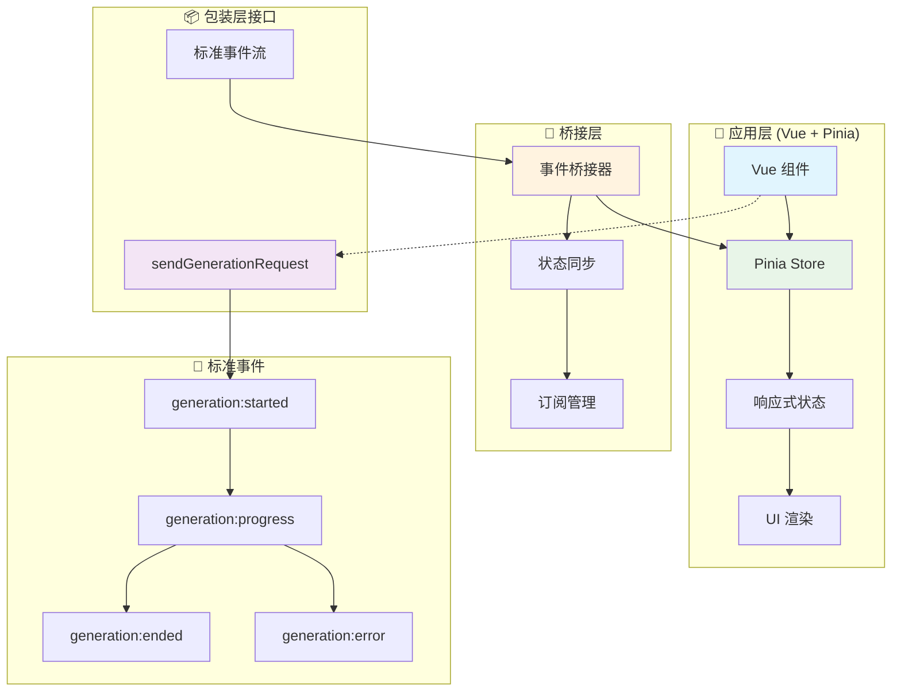
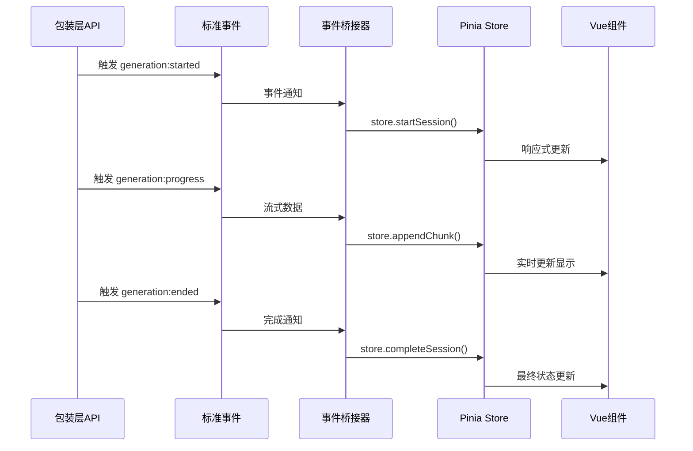

# 🎯 四层模型·高级应用实现（Vue + Pinia）

> **核心目标**：提供可直接落地的 Vue + Pinia 高级集成方案，将生成事件与状态交给 Pinia Store 统一管理，实现事件机制与应用层的完美解耦，为现代响应式前端提供工程化的生成能力集成。

---

## 📋 快速导航

| 组件 | 职责 | 推荐度 | 适用场景 | 复杂度 |
|------|------|--------|----------|--------|
| [Pinia Store 设计](#🏪-pinia-store-设计-⭐⭐⭐) | 统一状态管理 | ⭐⭐⭐ **必需** | Vue + Pinia 项目 | 🟡 中等 |
| [事件桥接器](#🌉-事件桥接器-⭐⭐⭐) | 事件归一化处理 | ⭐⭐⭐ **必需** | 所有响应式场景 | 🟢 简单 |
| [Vue 组件集成](#🔧-vue-组件集成-⭐⭐⭐) | 组件生命周期管理 | ⭐⭐⭐ **必需** | Vue 组件开发 | 🟢 简单 |
| [并发隔离管理](#🔄-并发隔离管理-⭐⭐) | 多会话状态隔离 | ⭐⭐ **推荐** | 多任务场景 | 🟡 中等 |
| [资源管理策略](#🗂️-资源管理策略-⭐⭐) | 内存与订阅清理 | ⭐⭐ **推荐** | 生产环境 | 🟡 中等 |
| [SSR 兼容处理](#🌐-ssr-兼容处理-⭐) | 服务端渲染支持 | ⭐ **可选** | SSR 项目 | 🔴 复杂 |

## 🏗️ 架构概览



## 💡 **实施策略**

### 🎯 **核心设计原则**
- **状态集中化**：所有生成状态统一由 Pinia Store 管理
- **事件解耦**：组件不直接订阅事件，通过桥接器写入 Store
- **并发隔离**：基于 `generationId` 的会话隔离机制
- **资源安全**：完整的生命周期管理和自动清理


---

## 🏪 Pinia Store 设计 ⭐⭐⭐

> **职责**：作为生成状态的唯一数据源，提供响应式状态管理和操作接口
> **必要性**：**绝对必需** - Vue + Pinia 架构的核心组件

### ✅ 核心特性
- 完整的状态机管理
- 基于 Map 的并发会话隔离
- 响应式的 getters 计算属性
- 类型安全的 actions 操作

### 🔧 状态设计

```typescript
export enum GenerationStatus {
  IDLE = 'idle',
  PREPARING = 'preparing',
  GENERATING = 'generating',
  COMPLETED = 'completed',
  FAILED = 'failed',
  CANCELLED = 'cancelled'
}

export interface GenerationSession {
  id: string;
  status: GenerationStatus;
  startedAt?: number;
  endedAt?: number;
  
  // 流式内容缓冲
  incrementalBuffer: string[];
  fullSnapshot?: string;
  
  // 最终结果
  content?: string;
  error?: string;
  
  // 元数据
  meta?: Record<string, any>;
}
```

### 💡 **Store 实现策略**

```typescript
export const useGenerationStore = defineStore('generation', {
  state: () => ({
    sessions: new Map<string, GenerationSession>()
  }),
  
  getters: {
    getSession: (state) => (id: string) => state.sessions.get(id),
    
    getContent: (state) => (id: string) => {
      const session = state.sessions.get(id);
      return session?.content ?? session?.fullSnapshot ?? 
             session?.incrementalBuffer.join('') ?? '';
    },
    
    isGenerating: (state) => (id: string) => {
      return state.sessions.get(id)?.status === GenerationStatus.GENERATING;
    },
    
    getProgress: (state) => (id: string) => {
      const session = state.sessions.get(id);
      if (!session) return 0;
      
      switch (session.status) {
        case GenerationStatus.PREPARING: return 10;
        case GenerationStatus.GENERATING: return 50;
        case GenerationStatus.COMPLETED: return 100;
        default: return 0;
      }
    }
  }
});
```

> 📖 **完整实现参考**：[附录A - Pinia Store 完整实现](#附录a-pinia-store-完整实现)

---

## 🌉 事件桥接器 ⭐⭐⭐

> **职责**：将标准化事件转换为 Store 状态更新，实现事件与状态的解耦
> **必要性**：**绝对必需** - 事件驱动架构的核心桥梁

### ✅ 核心特性
- 标准事件到 Store 操作的映射
- 自动订阅管理和清理
- 错误边界处理
- 并发安全保障

### 🔧 桥接器设计

```typescript
export function bridgeGenerationEventsToStore() {
  const store = useGenerationStore();
  const subscriptions: (() => void)[] = [];

  // 生成开始事件
  subscriptions.push(
    CharacterAPI.events.on('generation:started', ({ generationId, meta }) => {
      store.startSession(generationId, meta);
    })
  );

  // 生成进度事件
  subscriptions.push(
    CharacterAPI.events.on('generation:progress', (payload) => {
      const { generationId, mode, chunk, text } = payload;
      
      if (mode === 'incremental' && chunk) {
        store.appendChunk(generationId, chunk);
      }
      
      if (mode === 'full' && text) {
        store.updateSnapshot(generationId, text);
      }
    })
  );

  // 生成完成事件
  subscriptions.push(
    CharacterAPI.events.on('generation:ended', ({ generationId, content }) => {
      store.completeSession(generationId, content);
    })
  );

  // 生成错误事件
  subscriptions.push(
    CharacterAPI.events.on('generation:error', ({ generationId, error }) => {
      store.failSession(generationId, error?.message ?? String(error));
    })
  );

  // 返回清理函数
  return () => {
    subscriptions.forEach(unsubscribe => {
      try {
        unsubscribe();
      } catch (error) {
        console.warn('事件订阅清理失败:', error);
      }
    });
  };
}
```

### 📊 **事件流程图**



> 📖 **完整实现参考**：[附录B - 事件桥接器完整实现](#附录b-事件桥接器完整实现)

---

## 🔧 Vue 组件集成 ⭐⭐⭐

> **职责**：在 Vue 组件中集成生成功能，管理组件生命周期和用户交互
> **必要性**：**绝对必需** - Vue 应用的标准集成方式

### ✅ 核心特性
- 组合式 API 封装
- 自动生命周期管理
- 响应式状态绑定
- 类型安全保障

### 🔧 组合式函数设计

```typescript
export function useGeneration(options: {
  autoCleanup?: boolean;
  defaultConfig?: Partial<GenerationRequest>;
} = {}) {
  const store = useGenerationStore();
  const { autoCleanup = true, defaultConfig = {} } = options;
  
  let bridgeCleanup: (() => void) | null = null;
  
  // 初始化桥接器
  onMounted(() => {
    bridgeCleanup = bridgeGenerationEventsToStore();
  });
  
  // 自动清理
  if (autoCleanup) {
    onBeforeUnmount(() => {
      bridgeCleanup?.();
    });
  }
  
  // 生成函数
  const generate = async (
    input: string, 
    config: Partial<GenerationRequest> = {}
  ) => {
    const generationId = `vue-${Date.now()}-${Math.random().toString(36).substr(2, 9)}`;
    
    await sendGenerationRequest({
      userInput: input,
      generationId,
      streaming: true,
      stream_use_incremental: true,
      stream_use_full: false,
      ...defaultConfig,
      ...config
    });
    
    return generationId;
  };
  
  return {
    store,
    generate,
    cleanup: () => bridgeCleanup?.()
  };
}
```

### 💡 **组件使用示例**

```vue
<script setup lang="ts">
import { computed, ref } from 'vue';
import { useGeneration } from '@/composables/useGeneration';

const { store, generate } = useGeneration();
const currentId = ref<string | null>(null);

// 响应式计算属性
const content = computed(() => 
  currentId.value ? store.getContent(currentId.value) : ''
);

const isLoading = computed(() => 
  currentId.value ? store.isGenerating(currentId.value) : false
);

const progress = computed(() => 
  currentId.value ? store.getProgress(currentId.value) : 0
);

// 生成处理
async function handleGenerate() {
  try {
    currentId.value = await generate('请生成一个故事');
  } catch (error) {
    console.error('生成失败:', error);
  }
}
</script>

<template>
  <div class="generation-panel">
    <button @click="handleGenerate" :disabled="isLoading">
      {{ isLoading ? '生成中...' : '开始生成' }}
    </button>
    
    <div v-if="isLoading" class="progress">
      <div class="progress-bar" :style="{ width: `${progress}%` }"></div>
    </div>
    
    <div class="content" v-if="content">
      {{ content }}
    </div>
  </div>
</template>
```

> 📖 **完整实现参考**：[附录C - Vue 组件集成完整实现](#附录c-vue-组件集成完整实现)

---

## 🔄 并发隔离管理 ⭐⭐

> **职责**：管理多个并发生成会话，确保状态隔离和资源安全
> **必要性**：**强烈推荐** - 多任务场景的必备功能

### ✅ 核心特性
- 基于 `generationId` 的会话隔离
- 并发限制和队列管理
- 智能资源分配
- 异常恢复机制

### 🔧 并发管理策略

```typescript
export class ConcurrentGenerationManager {
  private maxConcurrent = 3;
  private queue: Array<() => Promise<void>> = [];
  private running = new Set<string>();
  
  async executeGeneration(
    input: string,
    config: Partial<GenerationRequest> = {}
  ): Promise<string> {
    return new Promise((resolve, reject) => {
      const task = async () => {
        const generationId = `concurrent-${Date.now()}-${Math.random().toString(36).substr(2, 9)}`;
        
        try {
          this.running.add(generationId);
          
          await sendGenerationRequest({
            userInput: input,
            generationId,
            streaming: true,
            ...config
          });
          
          resolve(generationId);
        } catch (error) {
          reject(error);
        } finally {
          this.running.delete(generationId);
          this.processQueue();
        }
      };
      
      if (this.running.size < this.maxConcurrent) {
        task();
      } else {
        this.queue.push(task);
      }
    });
  }
  
  private processQueue(): void {
    if (this.queue.length > 0 && this.running.size < this.maxConcurrent) {
      const task = this.queue.shift()!;
      task();
    }
  }
  
  getActiveCount(): number {
    return this.running.size;
  }
  
  getQueueLength(): number {
    return this.queue.length;
  }
}
```

### 📊 **并发策略对比**

| 策略 | 优点 | 缺点 | 适用场景 |
|------|------|------|----------|
| 无限制并发 | 响应快速 | 资源消耗大 | 轻量级任务 |
| 固定并发限制 | 资源可控 | 可能排队 | 一般应用 |
| 动态并发调整 | 自适应优化 | 逻辑复杂 | 高性能要求 |

> 📖 **完整实现参考**：[附录D - 并发管理完整实现](#附录d-并发管理完整实现)

---

## 🗂️ 资源管理策略 ⭐⭐

> **职责**：管理内存使用、订阅清理和状态持久化
> **必要性**：**强烈推荐** - 生产环境的稳定性保障

### ✅ 核心特性
- 自动内存清理
- 订阅生命周期管理
- 状态持久化支持
- 性能监控集成

### 🔧 资源管理实现

```typescript
export class GenerationResourceManager {
  private cleanupTasks = new Map<string, (() => void)[]>();
  private memoryThreshold = 100; // 最大会话数
  private cleanupInterval: number;
  
  constructor() {
    // 定期清理过期会话
    this.cleanupInterval = setInterval(() => {
      this.performCleanup();
    }, 60000); // 每分钟清理一次
  }
  
  registerCleanup(generationId: string, cleanup: () => void): void {
    if (!this.cleanupTasks.has(generationId)) {
      this.cleanupTasks.set(generationId, []);
    }
    this.cleanupTasks.get(generationId)!.push(cleanup);
  }
  
  cleanup(generationId: string): void {
    const tasks = this.cleanupTasks.get(generationId);
    if (tasks) {
      tasks.forEach(task => {
        try {
          task();
        } catch (error) {
          console.warn(`清理任务失败 [${generationId}]:`, error);
        }
      });
      this.cleanupTasks.delete(generationId);
    }
  }
  
  private performCleanup(): void {
    const store = useGenerationStore();
    const sessions = Array.from(store.sessions.entries());
    
    // 清理完成超过5分钟的会话
    const fiveMinutesAgo = Date.now() - 5 * 60 * 1000;
    
    sessions.forEach(([id, session]) => {
      if (session.endedAt && session.endedAt < fiveMinutesAgo) {
        store.removeSession(id);
        this.cleanup(id);
      }
    });
    
    // 内存压力清理
    if (sessions.length > this.memoryThreshold) {
      const oldestSessions = sessions
        .filter(([, session]) => session.status === GenerationStatus.COMPLETED)
        .sort(([, a], [, b]) => (a.endedAt || 0) - (b.endedAt || 0))
        .slice(0, sessions.length - this.memoryThreshold);
      
      oldestSessions.forEach(([id]) => {
        store.removeSession(id);
        this.cleanup(id);
      });
    }
  }
  
  destroy(): void {
    clearInterval(this.cleanupInterval);
    this.cleanupTasks.clear();
  }
}
```

### ⚠️ **内存管理注意事项**
- 及时清理完成的会话状态
- 避免无限制的事件监听器累积
- 合理设置会话保留时间
- 监控内存使用情况

> 📖 **完整实现参考**：[附录E - 资源管理完整实现](#附录e-资源管理完整实现)

---

## 🌐 SSR 兼容处理 ⭐

> **职责**：确保服务端渲染环境下的正确行为
> **必要性**：**可选扩展** - SSR 项目的兼容性保障

### ✅ 核心特性
- 服务端安全的状态初始化
- 客户端激活处理
- 水合错误预防
- 渐进式增强支持

### 🔧 SSR 兼容策略

```typescript
export function createSSRSafeGenerationStore() {
  // 服务端返回空状态
  if (typeof window === 'undefined') {
    return defineStore('generation', {
      state: () => ({
        sessions: new Map<string, GenerationSession>()
      }),
      actions: {
        // 服务端空实现
        startSession: () => {},
        appendChunk: () => {},
        completeSession: () => {}
      }
    });
  }
  
  // 客户端正常实现
  return useGenerationStore();
}

export function useSSRSafeGeneration() {
  const isClient = ref(false);
  
  onMounted(() => {
    isClient.value = true;
  });
  
  const store = createSSRSafeGenerationStore();
  let bridgeCleanup: (() => void) | null = null;
  
  // 仅在客户端初始化桥接器
  watch(isClient, (client) => {
    if (client && !bridgeCleanup) {
      bridgeCleanup = bridgeGenerationEventsToStore();
    }
  });
  
  return {
    store,
    isClient: readonly(isClient),
    cleanup: () => bridgeCleanup?.()
  };
}
```

### 💡 **SSR 最佳实践**
- 避免在服务端执行生成请求
- 使用客户端激活进行事件订阅
- 合理处理水合不匹配
- 提供降级方案

---

## 🧪 测试与验收

### ✅ 测试用例清单

#### 基础功能测试
- [ ] **Store 状态管理**：会话创建、更新、删除的正确性
- [ ] **事件桥接**：标准事件到 Store 操作的映射准确性
- [ ] **并发隔离**：多个 `generationId` 的状态互不干扰
- [ ] **资源清理**：组件卸载时的内存泄漏检查

#### 高级功能测试
- [ ] **流式更新**：增量和完整模式的正确处理
- [ ] **错误处理**：异常情况下的状态一致性
- [ ] **并发管理**：并发限制和队列机制
- [ ] **SSR 兼容**：服务端渲染环境的安全性

### 📊 **质量指标**

| 指标类型 | 目标值 | 验证方法 |
|----------|--------|----------|
| **状态一致性** | 100% | 单元测试覆盖 |
| **内存泄漏率** | 0% | 长时间运行测试 |
| **并发正确性** | 100% | 压力测试验证 |
| **响应时间** | < 50ms | 性能基准测试 |

---

## ✅ 实施检查清单

### 🎯 **必需实施** ⭐⭐⭐
- [ ] 创建 Pinia Store 管理生成状态
- [ ] 实现事件桥接器连接标准事件
- [ ] 集成 Vue 组合式函数
- [ ] 配置基础的生命周期管理

### 🚀 **推荐实施** ⭐⭐
- [ ] 添加并发隔离和限制机制
- [ ] 实现自动资源清理策略
- [ ] 集成错误边界处理
- [ ] 添加性能监控和日志

### 💡 **可选实施** ⭐
- [ ] 支持 SSR 环境兼容
- [ ] 实现状态持久化
- [ ] 添加高级调试工具
- [ ] 集成性能分析

---

## 📚 附录：完整代码实现

### 附录A：Pinia Store 完整实现

::: details 点击展开：生产就绪的 Pinia Store (TypeScript)

```typescript
/**
 * Generation Pinia Store - Production Ready Implementation
 * 
 * 🎯 特性：
 * - ✅ 完整的状态机管理
 * - ✅ 并发会话隔离
 * - ✅ 响应式计算属性
 * - ✅ 类型安全保障
 * - ✅ 自动清理机制
 */

import { defineStore } from 'pinia';

export enum GenerationStatus {
  IDLE = 'idle',
  PREPARING = 'preparing',
  GENERATING = 'generating',
  COMPLETED = 'completed',
  FAILED = 'failed',
  CANCELLED = 'cancelled'
}

export interface GenerationSession {
  id: string;
  status: GenerationStatus;
  startedAt?: number;
  endedAt?: number;
  
  // 流式内容缓冲
  incrementalBuffer: string[];
  fullSnapshot?: string;
  
  // 最终结果
  content?: string;
  error?: string;
  
  // 元数据
  meta?: Record<string, any>;
}

export const useGenerationStore = defineStore('generation', {
  state: () => ({
    sessions: new Map<string, GenerationSession>()
  }),

  getters: {
    // 获取指定会话
    getSession: (state) => (id: string): GenerationSession | undefined => {
      return state.sessions.get(id);
    },

    // 获取会话内容
    getContent: (state) => (id: string): string => {
      const session = state.sessions.get(id);
      if (!session) return '';
      
      // 优先级：最终内容 > 完整快照 > 增量缓冲
      return session.content ?? 
             session.fullSnapshot ?? 
             session.incrementalBuffer.join('');
    },

    // 检查是否正在生成
    isGenerating: (state) => (id: string): boolean => {
      return state.sessions.get(id)?.status === GenerationStatus.GENERATING;
    },

    // 获取生成进度
    getProgress: (state) => (id: string): number => {
      const session = state.sessions.get(id);
      if (!session) return 0;
      
      switch (session.status) {
        case GenerationStatus.PREPARING: return 10;
        case GenerationStatus.GENERATING: return 50;
        case GenerationStatus.COMPLETED: return 100;
        case GenerationStatus.FAILED: return 0;
        case GenerationStatus.CANCELLED: return 0;
        default: return 0;
      }
    },

    // 获取会话错误
    getError: (state) => (id: string): string | null => {
      return state.sessions.get(id)?.error ?? null;
    },

    // 获取所有活跃会话
    getActiveSessions: (state) => (): GenerationSession[] => {
      return Array.from(state.sessions.values()).filter(
        session => session.status === GenerationStatus.GENERATING ||
                  session.status === GenerationStatus.PREPARING
      );
    },

    // 获取会话统计
    getStats: (state) => () => {
      const sessions = Array.from(state.sessions.values());
      return {
        total: sessions.length,
        active: sessions.filter(s => s.status === GenerationStatus.GENERATING).length,
        completed: sessions.filter(s => s.status === GenerationStatus.COMPLETED).length,
        failed: sessions.filter(s => s.status === GenerationStatus.FAILED).length
      };
    }
  },

  actions: {
    // 开始新会话
    startSession(id: string, meta?: Record<string, any>): void {
      this.sessions.set(id, {
        id,
        status: GenerationStatus.PREPARING,
        startedAt: Date.now(),
        incrementalBuffer: [],
        meta
      });
    },

    // 设置生成中状态
    setGenerating(id: string): void {
      const session = this.sessions.get(id);
      if (session) {
        session.status = GenerationStatus.GENERATING;
      }
    },

    // 追加增量内容
    appendChunk(id: string, chunk: string): void {
      const session = this.sessions.get(id);
      if (session) {
        session.status = GenerationStatus.GENERATING;
        session.incrementalBuffer.push(chunk);
      }
    },

    // 更新完整快照
    updateSnapshot(id: string, text: string): void {
      const session = this.sessions.get(id);
      if (session) {
        session.status = GenerationStatus.GENERATING;
        session.fullSnapshot = text;
      }
    },

    // 完成会话
    completeSession(id: string, content: string): void {
      const session = this.sessions.get(id);
      if (session) {
        session.status = GenerationStatus.COMPLETED;
        session.endedAt = Date.now();
        session.content = content;
      }
    },

    // 会话失败
    failSession(id: string, error: string): void {
      let session = this.sessions.get(id);
      if (!session) {
        // 创建失败会话记录
        session = {
          id,
          status: GenerationStatus.FAILED,
          incrementalBuffer: []
        };
        this.sessions.set(id, session);
      }
      
      session.status = GenerationStatus.FAILED;
      session.endedAt = Date.now();
      session.error = error;
    },

    // 取消会话
    cancelSession(id: string): void {
      const session = this.sessions.get(id);
      if (session) {
        session.status = GenerationStatus.CANCELLED;
        session.endedAt = Date.now();
      }
    },

    // 移除会话
    removeSession(id: string): void {
      this.sessions.delete(id);
    },

    // 清理完成的会话
    cleanupCompletedSessions(maxAge: number = 300000): number {
      const now = Date.now();
      let cleaned = 0;

      for (const [id, session] of this.sessions.entries()) {
        const isCompleted = session.status === GenerationStatus.COMPLETED ||
                           session.status === GenerationStatus.FAILED ||
                           session.status === GenerationStatus.CANCELLED;
        
        const isOld = session.endedAt && (now - session.endedAt) > maxAge;
        
        if (isCompleted && isOld) {
          this.sessions.delete(id);
          cleaned++;
        }
      }

      return cleaned;
    },

    // 清理所有会话
    clearAllSessions(): void {
      this.sessions.clear();
    }
  }
});
```

:::

### 附录B：事件桥接器完整实现

::: details 点击展开：生产就绪的事件桥接器 (TypeScript)

```typescript
/**
 * Generation Event Bridge - Production Ready Implementation
 * 
 * 🎯 特性：
 * - ✅ 标准事件到 Store 的映射
 * - ✅ 错误边界处理
 * - ✅ 自动订阅管理
 * - ✅ 并发安全保障
 * - ✅ 调试和日志支持
 */

import { useGenerationStore } from './generationStore';

export interface BridgeOptions {
  enableLogging?: boolean;
  errorHandler?: (error: Error, context: string) => void;
  beforeEventProcess?: (eventType: string, payload: any) => boolean;
}

export function bridgeGenerationEventsToStore(options: BridgeOptions = {}) {
  const {
    enableLogging = false,
    errorHandler = console.error,
    beforeEventProcess
  } = options;

  const store = useGenerationStore();
  const subscriptions: (() => void)[] = [];

  // 日志辅助函数
  const log = (message: string, data?: any) => {
    if (enableLogging) {
      console.log(`[GenerationBridge] ${message}`, data);
    }
  };

  // 错误处理包装器
  const withErrorHandling = (
    eventType: string,
    handler: (payload: any) => void
  ) => {
    return (payload: any) => {
      try {
        // 前置处理钩子
        if (beforeEventProcess && !beforeEventProcess(eventType, payload)) {
          log(`事件被前置钩子拒绝: ${eventType}`, payload);
          return;
        }

        log(`处理事件: ${eventType}`, payload);
        handler(payload);
      } catch (error) {
        const errorMessage = `事件处理失败 [${eventType}]: ${error.message}`;
        log(errorMessage, { error, payload });
        errorHandler(error as Error, eventType);
      }
    };
  };

  // 生成开始事件
  subscriptions.push(
    CharacterAPI.events.on('generation:started', 
      withErrorHandling('generation:started', ({ generationId, meta }) => {
        if (!generationId) {
          throw new Error('generationId is required for started event');
        }
        
        store.startSession(generationId, meta);
        store.setGenerating(generationId);
      })
    )
  );

  // 生成进度事件
  subscriptions.push(
    CharacterAPI.events.on('generation:progress', 
      withErrorHandling('generation:progress', (payload) => {
        const { generationId, mode, chunk, text } = payload;
        
        if (!generationId) {
          throw new Error('generationId is required for progress event');
        }

        if (mode === 'incremental' && chunk) {
          store.appendChunk(generationId, chunk);
        } else if (mode === 'full' && text) {
          store.updateSnapshot(generationId, text);
        } else {
          log(`无效的进度事件数据`, payload);
        }
      })
    )
  );

  // 生成完成事件
  subscriptions.push(
    CharacterAPI.events.on('generation:ended', 
      withErrorHandling('generation:ended', ({ generationId, content }) => {
        if (!generationId) {
          throw new Error('generationId is required for ended event');
        }
        
        store.completeSession(generationId, content || '');
      })
    )
  );

  // 生成错误事件
  subscriptions.push(
    CharacterAPI.events.on('generation:error', 
      withErrorHandling('generation:error', ({ generationId, error }) => {
        const errorMessage = error?.message ?? String(error) ?? '未知错误';
        
        if (generationId) {
          store.failSession(generationId, errorMessage);
        } else {
          log('收到无 generationId 的错误事件', { error });
        }
      })
    )
  );

  log('事件桥接器已初始化', { subscriptionCount: subscriptions.length });

  // 返回清理函数
  return () => {
    log('清理事件桥接器', { subscriptionCount: subscriptions.length });
    
    subscriptions.forEach((unsubscribe, index) => {
      try {
        unsubscribe();
      } catch (error) {
        errorHandler(
          error as Error, 
          `subscription-cleanup-${index}`
        );
      }
    });
    
    subscriptions.length = 0;
  };
}

// 便捷的单例桥接器
let globalBridge: (() => void) | null = null;

export function initializeGlobalBridge(options?: BridgeOptions): void {
  if (globalBridge) {
    console.warn('全局桥接器已存在，先清理再初始化');
    globalBridge();
  }
  
  globalBridge = bridgeGenerationEventsToStore(options);
}

export function destroyGlobalBridge(): void {
  if (globalBridge) {
    globalBridge();
    globalBridge = null;
  }
}

// Vue 插件形式
export const GenerationBridgePlugin = {
  install(app: any, options?: BridgeOptions) {
    // 在应用启动时初始化桥接器
    app.config.globalProperties.$generationBridge = {
      initialize: () => initializeGlobalBridge(options),
      destroy: destroyGlobalBridge
    };
    
    // 自动初始化
    initializeGlobalBridge(options);
    
    // 应用卸载时清理
    app.unmount = ((originalUnmount) => {
      return function() {
        destroyGlobalBridge();
        return originalUnmount.call(this);
      };
    })(app.unmount);
  }
};
```

:::

### 附录C：Vue 组件集成完整实现

::: details 点击展开：生产就绪的 Vue 集成 (TypeScript)

```typescript
/**
 * Vue Generation Integration - Production Ready Implementation
 * 
 * 🎯 特性：
 * - ✅ 组合式 API 封装
 * - ✅ 自动生命周期管理
 * - ✅ 响应式状态绑定
 * - ✅ 类型安全保障
 * - ✅ 错误边界处理
 */

import { 
  ref, 
  computed, 
  onMounted, 
  onBeforeUnmount, 
  readonly,
  watch,
  nextTick
} from 'vue';
import { useGenerationStore } from './generationStore';
import { bridgeGenerationEventsToStore } from './eventBridge';
import { sendGenerationRequest } from '@/core/wrappers/generation';

export interface UseGenerationOptions {
  autoCleanup?: boolean;
  enableLogging?: boolean;
  defaultConfig?: Partial<GenerationRequest>;
  maxRetries?: number;
  retryDelay?: number;
}

export interface GenerationRequest {
  userInput: string;
  streaming?: boolean;
  generationId?: string;
  stream_use_incremental?: boolean;
  stream_use_full?: boolean;
  [key: string]: any;
}

export function useGeneration(options: UseGenerationOptions = {}) {
  const {
    autoCleanup = true,
    enableLogging = false,
    defaultConfig = {},
    maxRetries = 3,
    retryDelay = 1000
  } = options;

  const store = useGenerationStore();
  const currentId = ref<string | null>(null);
  const isInitialized = ref(false);
  
  let bridgeCleanup: (() => void) | null = null;

  // 日志辅助函数
  const log = (message: string, data?: any) => {
    if (enableLogging) {
      console.log(`[useGeneration] ${message}`, data);
    }
  };

  // 初始化桥接器
  const initializeBridge = () => {
    if (!bridgeCleanup) {
      bridgeCleanup = bridgeGenerationEventsToStore({
        enableLogging,
        errorHandler: (error, context) => {
          log(`桥接器错误 [${context}]:`, error);
        }
      });
      isInitialized.value = true;
      log('桥接器已初始化');
    }
  };

  // 清理资源
  const cleanup = () => {
    if (bridgeCleanup) {
      bridgeCleanup();
      bridgeCleanup = null;
      isInitialized.value = false;
      log('桥接器已清理');
    }
  };

  // 生命周期管理
  onMounted(() => {
    initializeBridge();
  });

  if (autoCleanup) {
    onBeforeUnmount(() => {
      cleanup();
    });
  }

  // 响应式计算属性
  const content = computed(() => {
    return currentId.value ? store.getContent(currentId.value) : '';
  });

  const isLoading = computed(() => {
    return currentId.value ? store.isGenerating(currentId.value) : false;
  });

  const progress = computed(() => {
    return currentId.value ? store.getProgress(currentId.value) : 0;
  });

  const error = computed(() => {
    return currentId.value ? store.getError(currentId.value) : null;
  });

  const session = computed(() => {
    return currentId.value ? store.getSession(currentId.value) : null;
  });

  // 生成函数（带重试机制）
  const generate = async (
    input: string,
    config: Partial<GenerationRequest> = {}
  ): Promise<string> => {
    if (!isInitialized.value) {
      throw new Error('生成器未初始化，请等待组件挂载完成');
    }

    const generationId = config.generationId || 
      `vue-${Date.now()}-${Math.random().toString(36).substr(2, 9)}`;
    
    currentId.value = generationId;
    log('开始生成', { generationId, input });

    let lastError: Error | null = null;
    
    for (let attempt = 1; attempt <= maxRetries; attempt++) {
      try {
        await sendGenerationRequest({
          userInput: input,
          generationId,
          streaming: true,
          stream_use_incremental: true,
          stream_use_full: false,
          ...defaultConfig,
          ...config
        });

        log('生成成功', { generationId, attempt });
        return generationId;

      } catch (error) {
        lastError = error as Error;
        log(`生成失败 (尝试 ${attempt}/${maxRetries})`, { 
          generationId, 
          error: lastError.message 
        });

        if (attempt < maxRetries) {
          await new Promise(resolve => 
            setTimeout(resolve, retryDelay * attempt)
          );
        }
      }
    }

    throw new Error(
      `生成在 ${maxRetries} 次尝试后仍然失败: ${lastError?.message}`
    );
  };

  // 取消生成
  const cancel = async (): Promise<boolean> => {
    if (!currentId.value) {
      return false;
    }

    const id = currentId.value;
    log('取消生成', { generationId: id });

    try {
      // 调用取消接口（如果支持）
      if (typeof cancelGeneration === 'function') {
        await cancelGeneration(id);
      }
      
      // 更新本地状态
      store.cancelSession(id);
      return true;
    } catch (error) {
      log('取消失败', { generationId: id, error });
      return false;
    }
  };

  // 清除当前会话
  const clear = () => {
    if (currentId.value) {
      store.removeSession(currentId.value);
      currentId.value = null;
      log('已清除当前会话');
    }
  };

  // 重新生成
  const regenerate = async (): Promise<string | null> => {
    const lastSession = session.value;
    if (!lastSession?.meta?.userInput) {
      throw new Error('无法重新生成：缺少原始输入');
    }

    return await generate(
      lastSession.meta.userInput,
      lastSession.meta.config || {}
    );
  };

  // 监听会话状态变化
  watch(session, (newSession, oldSession) => {
    if (newSession && oldSession) {
      const statusChanged = newSession.status !== oldSession.status;
      if (statusChanged && enableLogging) {
        log('会话状态变化', {
          generationId: newSession.id,
          from: oldSession.status,
          to: newSession.status
        });
      }
    }
  }, { deep: true });

  return {
    // 只读状态
    content: readonly(content),
    isLoading: readonly(isLoading),
    progress: readonly(progress),
    error: readonly(error),
    session: readonly(session),
    currentId: readonly(currentId),
    isInitialized: readonly(isInitialized),

    // 操作函数
    generate,
    cancel,
    clear,
    regenerate,
    cleanup,

    // 工具函数
    setCurrentId: (id: string) => {
      currentId.value = id;
    },
    
    // Store 访问
    store
  };
}

// 全局组合式函数（单例模式）
let globalGenerationInstance: ReturnType<typeof useGeneration> | null = null;

export function useGlobalGeneration(
  options?: UseGenerationOptions
): ReturnType<typeof useGeneration> {
  if (!globalGenerationInstance) {
    globalGenerationInstance = useGeneration({
      autoCleanup: false, // 全局实例不自动清理
      ...options
    });
  }
  
  return globalGenerationInstance;
}

// 清理全局实例
export function destroyGlobalGeneration(): void {
  if (globalGenerationInstance) {
    globalGenerationInstance.cleanup();
    globalGenerationInstance = null;
  }
}
```

:::

### 附录D：并发管理完整实现

::: details 点击展开：生产就绪的并发管理器 (TypeScript)

```typescript
/**
 * Concurrent Generation Manager - Production Ready Implementation
 * 
 * 🎯 特性：
 * - ✅ 并发限制和队列管理
 * - ✅ 智能资源分配
 * - ✅ 异常恢复机制
 * - ✅ 性能监控集成
 * - ✅ 优雅降级处理
 */

import { ref, computed, reactive } from 'vue';
import { sendGenerationRequest } from '@/core/wrappers/generation';

export interface ConcurrentTask {
  id: string;
  input: string;
  config: Partial<GenerationRequest>;
  priority: number;
  createdAt: number;
  startedAt?: number;
  resolve: (value: string) => void;
  reject: (error: Error) => void;
}

export interface ConcurrentManagerOptions {
  maxConcurrent?: number;
  queueTimeout?: number;
  taskTimeout?: number;
  enablePriority?: boolean;
  enableMetrics?: boolean;
}

export interface ConcurrentMetrics {
  totalTasks: number;
  completedTasks: number;
  failedTasks: number;
  averageWaitTime: number;
  averageExecutionTime: number;
  currentQueueLength: number;
  activeTaskCount: number;
}

export class ConcurrentGenerationManager {
  private options: Required<ConcurrentManagerOptions>;
  private queue: ConcurrentTask[] = [];
  private activeTasks = new Map<string, ConcurrentTask>();
  private metrics = reactive<ConcurrentMetrics>({
    totalTasks: 0,
    completedTasks: 0,
    failedTasks: 0,
    averageWaitTime: 0,
    averageExecutionTime: 0,
    currentQueueLength: 0,
    activeTaskCount: 0
  });

  constructor(options: ConcurrentManagerOptions = {}) {
    this.options = {
      maxConcurrent: options.maxConcurrent ?? 3,
      queueTimeout: options.queueTimeout ?? 30000,
      taskTimeout: options.taskTimeout ?? 60000,
      enablePriority: options.enablePriority ?? true,
      enableMetrics: options.enableMetrics ?? true
    };
  }

  // 执行生成任务
  async executeGeneration(
    input: string,
    config: Partial<GenerationRequest> = {},
    priority: number = 0
  ): Promise<string> {
    return new Promise((resolve, reject) => {
      const task: ConcurrentTask = {
        id: `task-${Date.now()}-${Math.random().toString(36).substr(2, 9)}`,
        input,
        config,
        priority,
        createdAt: Date.now(),
        resolve,
        reject
      };

      this.enqueueTask(task);
    });
  }

  // 任务入队
  private enqueueTask(task: ConcurrentTask): void {
    // 检查队列超时
    const queueTimer = setTimeout(() => {
      this.removeFromQueue(task.id);
      task.reject(new Error('任务队列超时'));
    }, this.options.queueTimeout);

    // 清理定时器的包装
    const originalResolve = task.resolve;
    const originalReject = task.reject;
    
    task.resolve = (value: string) => {
      clearTimeout(queueTimer);
      originalResolve(value);
    };
    
    task.reject = (error: Error) => {
      clearTimeout(queueTimer);
      originalReject(error);
    };

    // 优先级排序插入
    if (this.options.enablePriority) {
      const insertIndex = this.queue.findIndex(t => t.priority < task.priority);
      if (insertIndex === -1) {
        this.queue.push(task);
      } else {
        this.queue.splice(insertIndex, 0, task);
      }
    } else {
      this.queue.push(task);
    }

    this.updateMetrics();
    this.processQueue();
  }

  // 处理队列
  private processQueue(): void {
    while (
      this.queue.length > 0 && 
      this.activeTasks.size < this.options.maxConcurrent
    ) {
      const task = this.queue.shift()!;
      this.executeTask(task);
    }
  }

  // 执行单个任务
  private async executeTask(task: ConcurrentTask): Promise<void> {
    task.startedAt = Date.now();
    this.activeTasks.set(task.id, task);
    this.updateMetrics();

    // 任务超时处理
    const taskTimer = setTimeout(() => {
      this.cancelTask(task.id, '任务执行超时');
    }, this.options.taskTimeout);

    try {
      const generationId = task.config.generationId || 
        `concurrent-${task.id}`;

      await sendGenerationRequest({
        userInput: task.input,
        generationId,
        streaming: true,
        ...task.config
      });

      clearTimeout(taskTimer);
      this.completeTask(task.id, generationId);

    } catch (error) {
      clearTimeout(taskTimer);
      this.failTask(task.id, error as Error);
    }
  }

  // 完成任务
  private completeTask(taskId: string, result: string): void {
    const task = this.activeTasks.get(taskId);
    if (task) {
      this.activeTasks.delete(taskId);
      
      if (this.options.enableMetrics) {
        this.metrics.completedTasks++;
        this.updateExecutionTime(task);
      }
      
      task.resolve(result);
      this.updateMetrics();
      this.processQueue();
    }
  }

  // 任务失败
  private failTask(taskId: string, error: Error): void {
    const task = this.activeTasks.get(taskId);
    if (task) {
      this.activeTasks.delete(taskId);
      
      if (this.options.enableMetrics) {
        this.metrics.failedTasks++;
      }
      
      task.reject(error);
      this.updateMetrics();
      this.processQueue();
    }
  }

  // 取消任务
  private cancelTask(taskId: string, reason: string): void {
    const task = this.activeTasks.get(taskId);
    if (task) {
      this.activeTasks.delete(taskId);
      task.reject(new Error(`任务已取消: ${reason}`));
      this.updateMetrics();
      this.processQueue();
    }
  }

  // 从队列中移除任务
  private removeFromQueue(taskId: string): boolean {
    const index = this.queue.findIndex(task => task.id === taskId);
    if (index !== -1) {
      this.queue.splice(index, 1);
      this.updateMetrics();
      return true;
    }
    return false;
  }

  // 更新执行时间统计
  private updateExecutionTime(task: ConcurrentTask): void {
    if (task.startedAt) {
      const executionTime = Date.now() - task.startedAt;
      const waitTime = task.startedAt - task.createdAt;
      
      // 简单的移动平均
      const alpha = 0.1;
      this.metrics.averageExecutionTime = 
        this.metrics.averageExecutionTime * (1 - alpha) + 
        executionTime * alpha;
      
      this.metrics.averageWaitTime = 
        this.metrics.averageWaitTime * (1 - alpha) + 
        waitTime * alpha;
    }
  }

  // 更新指标
  private updateMetrics(): void {
    if (this.options.enableMetrics) {
      this.metrics.currentQueueLength = this.queue.length;
      this.metrics.activeTaskCount = this.activeTasks.size;
      this.metrics.totalTasks = 
        this.metrics.completedTasks + 
        this.metrics.failedTasks + 
        this.metrics.activeTaskCount + 
        this.metrics.currentQueueLength;
    }
  }

  // 公共方法
  public getMetrics(): ConcurrentMetrics {
    return { ...this.metrics };
  }

  public getQueueStatus(): {
    queueLength: number;
    activeCount: number;
    maxConcurrent: number;
    utilizationRate: number;
  } {
    return {
      queueLength: this.queue.length,
      activeCount: this.activeTasks.size,
      maxConcurrent: this.options.maxConcurrent,
      utilizationRate: this.activeTasks.size / this.options.maxConcurrent
    };
  }

  public cancelAllTasks(reason = '批量取消'): number {
    const canceledCount = this.activeTasks.size + this.queue.length;
    
    // 取消活跃任务
    for (const [taskId] of this.activeTasks) {
      this.cancelTask(taskId, reason);
    }
    
    // 清空队列
    while (this.queue.length > 0) {
      const task = this.queue.shift()!;
      task.reject(new Error(`任务已取消: ${reason}`));
    }
    
    this.updateMetrics();
    return canceledCount;
  }

  public adjustConcurrency(newLimit: number): void {
    this.options.maxConcurrent = Math.max(1, newLimit);
    this.processQueue();
  }

  public clearMetrics(): void {
    Object.assign(this.metrics, {
      totalTasks: 0,
      completedTasks: 0,
      failedTasks: 0,
      averageWaitTime: 0,
      averageExecutionTime: 0,
      currentQueueLength: this.queue.length,
      activeTaskCount: this.activeTasks.size
    });
  }
}

// Vue 组合式函数封装
export function useConcurrentGeneration(
  options?: ConcurrentManagerOptions
) {
  const manager = new ConcurrentGenerationManager(options);
  
  const metrics = computed(() => manager.getMetrics());
  const queueStatus = computed(() => manager.getQueueStatus());
  
  return {
    execute: manager.executeGeneration.bind(manager),
    cancelAll: manager.cancelAllTasks.bind(manager),
    adjustConcurrency: manager.adjustConcurrency.bind(manager),
    clearMetrics: manager.clearMetrics.bind(manager),
    metrics: readonly(metrics),
    queueStatus: readonly(queueStatus)
  };
}

// 全局并发管理器
export const globalConcurrentManager = new ConcurrentGenerationManager();
```

:::

### 附录E：资源管理完整实现

::: details 点击展开：生产就绪的资源管理器 (TypeScript)

```typescript
/**
 * Generation Resource Manager - Production Ready Implementation
 * 
 * 🎯 特性：
 * - ✅ 自动内存清理
 * - ✅ 订阅生命周期管理
 * - ✅ 状态持久化支持
 * - ✅ 性能监控集成
 * - ✅ 内存泄漏检测
 */

import { ref, computed, watch, onBeforeUnmount } from 'vue';
import { useGenerationStore } from './generationStore';

export interface ResourceManagerOptions {
  maxSessions?: number;
  cleanupInterval?: number;
  sessionMaxAge?: number;
  enablePersistence?: boolean;
  enableMemoryMonitoring?: boolean;
  persistenceKey?: string;
}

export interface ResourceMetrics {
  totalSessions: number;
  activeSessions: number;
  memoryUsage: number;
  cleanupCount: number;
  lastCleanupTime: number;
}

export class GenerationResourceManager {
  private options: Required<ResourceManagerOptions>;
  private cleanupTasks = new Map<string, (() => void)[]>();
  private cleanupTimer: number | null = null;
  private metrics = ref<ResourceMetrics>({
    totalSessions: 0,
    activeSessions: 0,
    memoryUsage: 0,
    cleanupCount: 0,
    lastCleanupTime: 0
  });

  constructor(options: ResourceManagerOptions = {}) {
    this.options = {
      maxSessions: options.maxSessions ?? 100,
      cleanupInterval: options.cleanupInterval ?? 60000, // 1分钟
      sessionMaxAge: options.sessionMaxAge ?? 300000, // 5分钟
      enablePersistence: options.enablePersistence ?? false,
      enableMemoryMonitoring: options.enableMemoryMonitoring ?? true,
      persistenceKey: options.persistenceKey ?? 'generation-sessions'
    };

    this.startCleanupTimer();
    this.loadPersistedSessions();
  }

  // 注册清理任务
  registerCleanup(generationId: string, cleanup: () => void): void {
    if (!this.cleanupTasks.has(generationId)) {
      this.cleanupTasks.set(generationId, []);
    }
    this.cleanupTasks.get(generationId)!.push(cleanup);
  }

  // 执行特定会话的清理
  cleanup(generationId: string): void {
    const tasks = this.cleanupTasks.get(generationId);
    if (tasks) {
      tasks.forEach((task, index) => {
        try {
          task();
        } catch (error) {
          console.warn(`清理任务失败 [${generationId}:${index}]:`, error);
        }
      });
      this.cleanupTasks.delete(generationId);
    }
  }

  // 启动定期清理
  private startCleanupTimer(): void {
    this.cleanupTimer = setInterval(() => {
      this.performScheduledCleanup();
    }, this.options.cleanupInterval) as unknown as number;
  }

  // 执行定期清理
  private performScheduledCleanup(): void {
    const store = useGenerationStore();
    const now = Date.now();
    let cleanedCount = 0;

    // 清理过期会话
    const expiredSessions = Array.from(store.sessions.entries()).filter(
      ([, session]) => {
        const isCompleted = ['completed', 'failed', 'cancelled'].includes(session.status);
        const isExpired = session.endedAt && (now - session.endedAt) > this.options.sessionMaxAge;
        return isCompleted && isExpired;
      }
    );

    expiredSessions.forEach(([id]) => {
      store.removeSession(id);
      this.cleanup(id);
      cleanedCount++;
    });

    // 内存压力清理
    if (store.sessions.size > this.options.maxSessions) {
      const excessCount = store.sessions.size - this.options.maxSessions;
      const oldestCompleted = Array.from(store.sessions.entries())
        .filter(([, session]) => ['completed', 'failed'].includes(session.status))
        .sort(([, a], [, b]) => (a.endedAt || 0) - (b.endedAt || 0))
        .slice(0, excessCount);

      oldestCompleted.forEach(([id]) => {
        store.removeSession(id);
        this.cleanup(id);
        cleanedCount++;
      });
    }

    // 更新指标
    this.updateMetrics(cleanedCount);
    
    // 持久化状态
    if (this.options.enablePersistence) {
      this.persistSessions();
    }
  }

  // 更新资源指标
  private updateMetrics(cleanedCount: number = 0): void {
    const store = useGenerationStore();
    const sessions = Array.from(store.sessions.values());
    
    this.metrics.value = {
      totalSessions: sessions.length,
      activeSessions: sessions.filter(s => 
        ['preparing', 'generating'].includes(s.status)
      ).length,
      memoryUsage: this.estimateMemoryUsage(sessions),
      cleanupCount: this.metrics.value.cleanupCount + cleanedCount,
      lastCleanupTime: cleanedCount > 0 ? Date.now() : this.metrics.value.lastCleanupTime
    };
  }

  // 估算内存使用量
  private estimateMemoryUsage(sessions: any[]): number {
    if (!this.options.enableMemoryMonitoring) return 0;
    
    return sessions.reduce((total, session) => {
      let size = 0;
      
      // 估算字符串内容大小
      if (session.content) size += session.content.length * 2; // UTF-16
      if (session.fullSnapshot) size += session.fullSnapshot.length * 2;
      if (session.incrementalBuffer) {
        size += session.incrementalBuffer.reduce((sum: number, chunk: string) => 
          sum + chunk.length * 2, 0
        );
      }
      if (session.error) size += session.error.length * 2;
      
      // 估算对象开销
      size += 200; // 基础对象开销
      
      return total + size;
    }, 0);
  }

  // 持久化会话状态
  private persistSessions(): void {
    if (!this.options.enablePersistence || typeof localStorage === 'undefined') {
      return;
    }

    try {
      const store = useGenerationStore();
      const sessionsToSave = Array.from(store.sessions.entries())
        .filter(([, session]) => session.status === 'completed')
        .map(([id, session]) => [id, {
          id: session.id,
          status: session.status,
          content: session.content,
          endedAt: session.endedAt,
          meta: session.meta
        }]);

      localStorage.setItem(
        this.options.persistenceKey,
        JSON.stringify(sessionsToSave)
      );
    } catch (error) {
      console.warn('会话持久化失败:', error);
    }
  }

  // 加载持久化的会话
  private loadPersistedSessions(): void {
    if (!this.options.enablePersistence || typeof localStorage === 'undefined') {
      return;
    }

    try {
      const stored = localStorage.getItem(this.options.persistenceKey);
      if (stored) {
        const sessions = JSON.parse(stored);
        const store = useGenerationStore();
        
        sessions.forEach(([id, session]: [string, any]) => {
          store.sessions.set(id, {
            ...session,
            incrementalBuffer: []
          });
        });
      }
    } catch (error) {
      console.warn('会话加载失败:', error);
    }
  }

  // 内存泄漏检测
  detectMemoryLeaks(): {
    suspiciousSessions: string[];
    largeBuffers: string[];
    recommendations: string[];
  } {
    const store = useGenerationStore();
    const sessions = Array.from(store.sessions.entries());
    const now = Date.now();
    
    const suspiciousSessions = sessions
      .filter(([, session]) => {
        const age = now - (session.startedAt || now);
        return age > 600000 && ['preparing', 'generating'].includes(session.status); // 10分钟
      })
      .map(([id]) => id);

    const largeBuffers = sessions
      .filter(([, session]) => {
        const bufferSize = session.incrementalBuffer?.reduce(
          (sum, chunk) => sum + chunk.length, 0
        ) || 0;
        return bufferSize > 100000; // 100KB
      })
      .map(([id]) => id);

    const recommendations: string[] = [];
    
    if (suspiciousSessions.length > 0) {
      recommendations.push(`发现 ${suspiciousSessions.length} 个长时间运行的会话，建议检查是否存在死锁`);
    }
    
    if (largeBuffers.length > 0) {
      recommendations.push(`发现 ${largeBuffers.length} 个大缓冲区会话，建议优化流式处理`);
    }
    
    if (sessions.length > this.options.maxSessions * 0.8) {
      recommendations.push('会话数量接近上限，建议增加清理频率');
    }

    return {
      suspiciousSessions,
      largeBuffers,
      recommendations
    };
  }

  // 强制清理所有资源
  forceCleanup(): number {
    const store = useGenerationStore();
    const sessionCount = store.sessions.size;
    
    // 清理所有会话
    for (const [id] of store.sessions) {
      this.cleanup(id);
    }
    
    store.clearAllSessions();
    this.cleanupTasks.clear();
    
    // 清理持久化数据
    if (this.options.enablePersistence && typeof localStorage !== 'undefined') {
      localStorage.removeItem(this.options.persistenceKey);
    }
    
    this.updateMetrics();
    return sessionCount;
  }

  // 销毁资源管理器
  destroy(): void {
    if (this.cleanupTimer) {
      clearInterval(this.cleanupTimer);
      this.cleanupTimer = null;
    }
    
    this.forceCleanup();
  }

  // 获取指标
  getMetrics(): ResourceMetrics {
    this.updateMetrics();
    return { ...this.metrics.value };
  }
}

// Vue 组合式函数
export function useResourceManager(options?: ResourceManagerOptions) {
  const manager = new GenerationResourceManager(options);
  
  // 自动清理
  onBeforeUnmount(() => {
    manager.destroy();
  });
  
  const metrics = computed(() => manager.getMetrics());
  
  // 监听内存使用情况
  watch(
    () => metrics.value.memoryUsage,
    (newUsage, oldUsage) => {
      if (newUsage > oldUsage * 1.5 && newUsage > 1024 * 1024) { // 1MB
        console.warn('生成会话内存使用量快速增长:', {
          current: `${(newUsage / 1024 / 1024).toFixed(2)}MB`,
          previous: `${(oldUsage / 1024 / 1024).toFixed(2)}MB`
        });
      }
    }
  );
  
  return {
    registerCleanup: manager.registerCleanup.bind(manager),
    cleanup: manager.cleanup.bind(manager),
    forceCleanup: manager.forceCleanup.bind(manager),
    detectMemoryLeaks: manager.detectMemoryLeaks.bind(manager),
    metrics: readonly(metrics)
  };
}

// 全局资源管理器
export const globalResourceManager = new GenerationResourceManager();
```

:::

---

## 📖 相关文档

- 🏗️ [**适配层设计**](./adapter.md) - 了解底层适配机制
- 🎛️ [**包装层实现**](./wrapper.md) - 理解中间件逻辑
- 🚀 [**应用层集成**](./application.md) - 基础应用层用法
- 📋 [**生成系统总览**](./index.md) - 四层架构完整介绍

---

**🎯 核心价值**：通过 Pinia Store 的集中状态管理和事件桥接机制，实现了真正的关注点分离。组件专注于 UI 逻辑，Store 管理业务状态，桥接器处理事件转换，为 Vue + Pinia 项目提供了工程化的生成能力集成方案。