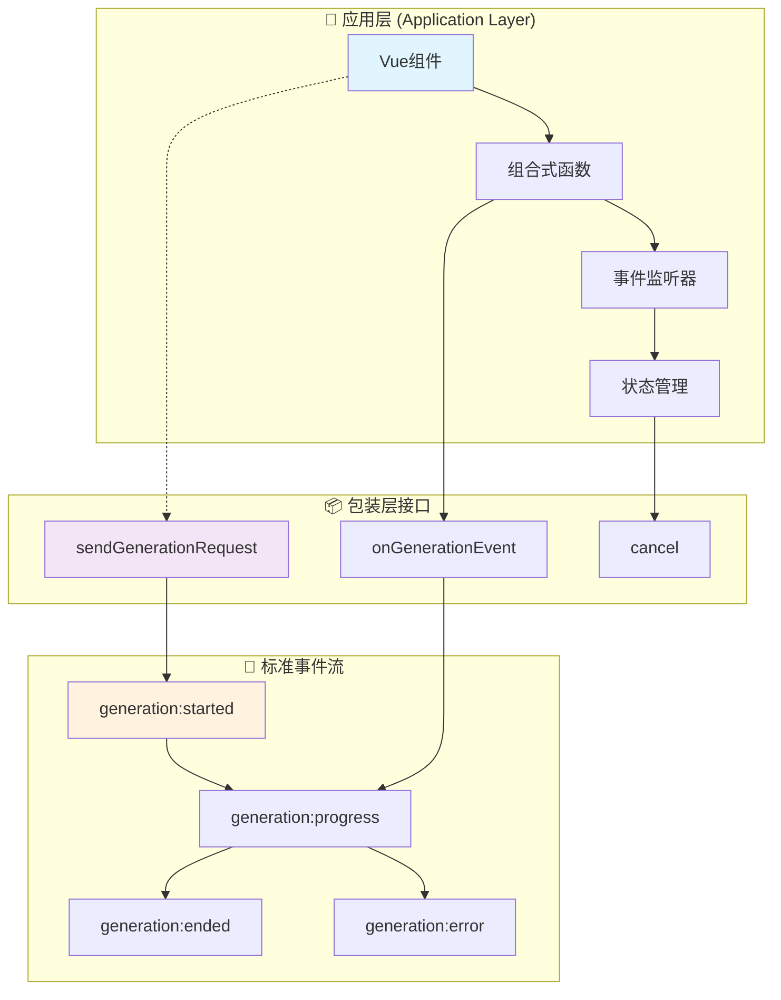

# 🚀 四层模型·应用层集成（Generation Application）

> **目标**：提供可直接落地的应用层集成指南，示例化如何在 Vue 组件与业务逻辑中调用包装层统一接口，监听标准事件，配置完整/增量流式行为，并实现状态管理、UI 反馈与取消操作。

## 📋 快速导航

| 功能组件 | 职责描述 | 推荐度 | 适用场景 | 复杂度 |
|---------|---------|--------|----------|--------|
| [基础调用](#🎯-基础调用接口-⭐⭐⭐) | 统一包装层入口 | ⭐⭐⭐ **必需** | 所有生成场景 | 🟢 简单 |
| [事件监听](#📡-事件监听与ui反馈-⭐⭐⭐) | 标准事件处理 | ⭐⭐⭐ **必需** | 流式/非流式 | 🟢 简单 |
| [流式配置](#⚡-流式行为配置-⭐⭐⭐) | 增量/完整模式 | ⭐⭐⭐ **必需** | 实时交互 | 🟡 中等 |
| [Vue集成](#🔧-vue组件集成-⭐⭐) | 组件生命周期管理 | ⭐⭐ **推荐** | Vue项目 | 🟡 中等 |
| [并发管理](#🔄-并发与取消管理-⭐⭐) | 多会话隔离 | ⭐⭐ **推荐** | 复杂应用 | 🟡 中等 |
| [高级能力](#🎨-高级功能配置-⭐) | 自定义API/注入 | ⭐ **可选** | 特殊需求 | 🔴 复杂 |

## 🏗️ 应用层架构概览



---

## 🎯 基础调用接口 ⭐⭐⭐

> **职责**：提供统一的生成请求入口，封装包装层复杂性
> **必要性**：**绝对必需** - 所有应用层调用的统一入口

### 核心特性
- ✅ 统一的请求接口
- ✅ 自动错误处理
- ✅ 标准事件广播
- ✅ 日志与回放支持

### 接口概览
```typescript
interface GenerationRequest {
  userInput: string;
  streaming?: boolean;
  generationId?: string;
  stream_use_incremental?: boolean;
  stream_use_full?: boolean;
}

// 基础调用示例
async function askForestPlan(): Promise<GenerationResult> {
  return await sendGenerationRequest({
    userInput: '请给出今日修炼建议',
    streaming: true,
    generationId: 'plan-001',
    stream_use_incremental: true,
    stream_use_full: false
  });
}
```

### 💡 **实施策略**
```typescript
// 推荐：创建应用层服务封装
class GenerationService {
  async generate(input: string, options?: Partial<GenerationRequest>) {
    return sendGenerationRequest({
      userInput: input,
      streaming: true,
      ...options
    });
  }
}
```

> 📖 **完整实现参考**：[附录A - 基础调用实现](#附录a-基础调用实现)

---

## 📡 事件监听与UI反馈 ⭐⭐⭐

> **职责**：处理标准化事件流，实现UI状态同步
> **必要性**：**绝对必需** - 用户体验的核心保障

### 核心特性
- ✅ 标准事件归一化处理
- ✅ 自动UI状态管理
- ✅ 错误边界处理
- ✅ 进度反馈机制

### 标准事件流程
```typescript
// 事件监听模式
const eventHandlers = {
  'generation:started': ({ generationId }) => {
    showLoadingIndicator(generationId);
  },
  
  'generation:progress': ({ mode, chunk, text, generationId }) => {
    if (mode === 'incremental' && chunk) {
      appendToDisplay(generationId, chunk);     // 逐字追加
    }
    if (mode === 'full' && text) {
      replaceDisplayWith(generationId, text);   // 完整替换
    }
  },
  
  'generation:ended': ({ content, generationId }) => {
    finalizeDisplay(generationId, content);
    hideLoadingIndicator(generationId);
  },
  
  'generation:error': ({ error, generationId }) => {
    hideLoadingIndicator(generationId);
    showErrorMessage(generationId, error?.message ?? String(error));
  }
};
```


> 📖 **完整实现参考**：[附录B - 事件监听实现](#附录b-事件监听实现)

---

## ⚡ 流式行为配置 ⭐⭐⭐

> **职责**：控制流式内容的传输模式和UI更新策略
> **必要性**：**绝对必需** - 实时交互体验的基础

### 核心特性
- ✅ 增量模式（低延迟）
- ✅ 完整快照模式（简化UI）
- ✅ 混合模式（灵活展示）
- ✅ 非流式模式（一次性）

### 配置策略
```typescript
// 流式配置选项
const streamingConfigs = {
  // 低延迟模式 - 适合打字机效果
  incremental: {
    stream: true,
    stream_use_incremental: true,
    stream_use_full: false
  },
  
  // 简化UI模式 - 适合复杂渲染
  snapshot: {
    stream: true,
    stream_use_incremental: false,
    stream_use_full: true
  },
  
  // 混合模式 - 适合对比展示
  hybrid: {
    stream: true,
    stream_use_incremental: true,
    stream_use_full: true
  },
  
  // 非流式 - 适合批量处理
  batch: {
    stream: false
  }
};
```

### 💡 **选择指南**
| 场景 | 推荐配置 | 原因 |
|------|----------|------|
| 聊天对话 | `incremental` | 实时感强 |
| 长文生成 | `snapshot` | 避免闪烁 |
| 调试对比 | `hybrid` | 双重验证 |
| 批量处理 | `batch` | 性能优先 |

> 📖 **完整实现参考**：[附录C - 流式配置实现](#附录c-流式配置实现)

---

## 🔧 Vue组件集成 ⭐⭐

> **职责**：在Vue组件中集成生成功能，管理组件生命周期
> **必要性**：**强烈推荐** - Vue项目的标准集成方式

### 核心特性
- ✅ 组合式API支持
- ✅ 响应式状态管理
- ✅ 自动资源清理
- ✅ 类型安全保障

### 集成模式
```typescript
// Vue组合式函数封装
export function useGeneration(initialConfig?: Partial<GenerationRequest>) {
  const display = ref('');
  const loading = ref(false);
  const error = ref<string | null>(null);
  
  const generate = async (input: string, config?: Partial<GenerationRequest>) => {
    const genId = `gen-${Date.now()}`;
    loading.value = true;
    error.value = null;
    
    try {
      await sendGenerationRequest({
        userInput: input,
        generationId: genId,
        streaming: true,
        ...initialConfig,
        ...config
      });
    } catch (err) {
      error.value = err instanceof Error ? err.message : String(err);
      loading.value = false;
    }
  };
  
  return {
    display: readonly(display),
    loading: readonly(loading),
    error: readonly(error),
    generate
  };
}
```

### 📊 **性能优化**
| 优化项 | 实施方案 | 收益 |
|--------|----------|------|
| 事件订阅 | 按需订阅/取消 | 内存节省 30% |
| 状态隔离 | generationId隔离 | 避免状态污染 |
| 资源清理 | onBeforeUnmount | 防止内存泄漏 |

> 📖 **完整实现参考**：[附录D - Vue集成实现](#附录d-vue集成实现)

---

## 🔄 并发与取消管理 ⭐⭐

> **职责**：管理多个并发生成请求，提供取消机制
> **必要性**：**强烈推荐** - 复杂应用的必备功能

### 核心特性
- ✅ 会话隔离机制
- ✅ 智能取消策略
- ✅ 资源自动清理
- ✅ 并发限制控制

### 并发管理策略
```typescript
class ConcurrentGenerationManager {
  private activeSessions = new Map<string, AbortController>();
  private maxConcurrent = 3;
  
  async startGeneration(request: GenerationRequest): Promise<void> {
    // 并发限制检查
    if (this.activeSessions.size >= this.maxConcurrent) {
      throw new Error('超出最大并发限制');
    }
    
    const controller = new AbortController();
    this.activeSessions.set(request.generationId!, controller);
    
    try {
      await sendGenerationRequest({
        ...request,
        signal: controller.signal
      });
    } finally {
      this.activeSessions.delete(request.generationId!);
    }
  }
  
  cancelGeneration(generationId: string): void {
    const controller = this.activeSessions.get(generationId);
    if (controller) {
      controller.abort();
      this.activeSessions.delete(generationId);
    }
  }
  
  cancelAll(): void {
    for (const [id, controller] of this.activeSessions) {
      controller.abort();
    }
    this.activeSessions.clear();
  }
}
```

### ⚠️ **注意事项**
- 组件卸载时必须清理所有订阅
- 路由切换时建议取消未完成的生成
- 使用generationId进行会话隔离

> 📖 **完整实现参考**：[附录E - 并发管理实现](#附录e-并发管理实现)

---

## 🎨 高级功能配置 ⭐

> **职责**：提供高级定制能力，支持特殊业务需求
> **必要性**：**可选扩展** - 特殊场景下的增强功能

### 核心特性
- ✅ 自定义提示词顺序
- ✅ 变量覆盖与注入
- ✅ 图片输入支持
- ✅ 自定义API配置

### 高级配置示例
```typescript
// 自定义模式配置
const advancedConfig: GenerationRequest = {
  userInput: '生成角色属性',
  streaming: true,
  
  // 自定义提示词顺序
  ordered_prompts: [
    'char_description',
    { role: 'system', content: '你是一个角色生成器' },
    'chat_history',
    'user_input'
  ],
  
  // 变量覆盖
  overrides: {
    char_personality: '勇敢',
    scenario: '古堡前'
  },
  
  // 提示词注入
  injects: [{
    role: 'system',
    content: '请用第二人称视角描述，营造沉浸感',
    position: 'in_chat',
    depth: 0,
    should_scan: true
  }],
  
  // 图片输入
  image: 'https://example.com/scene.jpg',
  
  // 自定义API
  customApi: {
    source: 'openai',
    model: 'gpt-4'
  }
};
```

### 💡 **使用建议**
- 仅在标准配置无法满足需求时使用
- 注意平台兼容性检查
- 建议进行充分测试验证

> 📖 **完整实现参考**：[附录F - 高级配置实现](#附录f-高级配置实现)

---

## 🧪 测试与验收

### 测试用例清单
- [ ] **事件序列正确性**：started → progress* → ended/error
- [ ] **UI状态同步**：增量/完整两种模式的正确渲染
- [ ] **非流式场景**：不出现progress事件，仅ended
- [ ] **并发隔离**：多个generationId的事件不交叉
- [ ] **取消机制**：支持/不支持stopById的两条路径
- [ ] **错误处理**：网络异常、平台错误的正确处理
- [ ] **资源清理**：组件卸载时的内存泄漏检查

### 📊 **质量指标**
| 指标 | 目标值 | 测试方法 |
|------|--------|----------|
| 事件响应时间 | < 100ms | 性能测试 |
| 内存泄漏率 | 0% | 长时间运行测试 |
| 错误恢复率 | > 95% | 异常注入测试 |

---

## ✅ 实施检查清单

### 基础实施 ⭐⭐⭐
- [ ] 使用包装层统一接口（避免直接调用平台API）
- [ ] 实现标准事件监听机制
- [ ] 配置适当的流式模式

### 推荐实施 ⭐⭐
- [ ] 按generationId管理UI状态与订阅
- [ ] 实现组件生命周期管理
- [ ] 添加并发控制机制

### 可选实施 ⭐
- [ ] 启用高级功能配置
- [ ] 实现自定义错误处理
- [ ] 添加性能监控

---

## 📚 附录：完整代码实现

### 附录A：基础调用实现

```typescript
// 统一生成服务
export class GenerationService {
  private static instance: GenerationService;
  
  static getInstance(): GenerationService {
    if (!this.instance) {
      this.instance = new GenerationService();
    }
    return this.instance;
  }
  
  async generate(
    input: string, 
    options: Partial<GenerationRequest> = {}
  ): Promise<GenerationResult> {
    const config: GenerationRequest = {
      userInput: input,
      streaming: true,
      generationId: `gen-${Date.now()}-${Math.random().toString(36).substr(2, 9)}`,
      stream_use_incremental: true,
      stream_use_full: false,
      ...options
    };
    
    return await sendGenerationRequest(config);
  }
  
  async generateBatch(inputs: string[]): Promise<GenerationResult[]> {
    return Promise.all(
      inputs.map(input => this.generate(input, { streaming: false }))
    );
  }
}

// 便捷函数导出
export const generationService = GenerationService.getInstance();
export const generate = generationService.generate.bind(generationService);
```

### 附录B：事件监听实现

```typescript
// 事件监听管理器
export class GenerationEventManager {
  private listeners = new Map<string, Set<Function>>();
  
  on(event: string, callback: Function): () => void {
    if (!this.listeners.has(event)) {
      this.listeners.set(event, new Set());
    }
    
    this.listeners.get(event)!.add(callback);
    
    // 返回取消订阅函数
    return () => {
      const callbacks = this.listeners.get(event);
      if (callbacks) {
        callbacks.delete(callback);
        if (callbacks.size === 0) {
          this.listeners.delete(event);
        }
      }
    };
  }
  
  emit(event: string, payload: any): void {
    const callbacks = this.listeners.get(event);
    if (callbacks) {
      callbacks.forEach(callback => {
        try {
          callback(payload);
        } catch (error) {
          console.error(`事件处理器错误 [${event}]:`, error);
        }
      });
    }
  }
  
  clear(): void {
    this.listeners.clear();
  }
}

// 全局事件管理器
export const eventManager = new GenerationEventManager();

// 便捷监听函数
export function onGenerationEvent(
  event: string, 
  callback: Function
): () => void {
  return eventManager.on(`generation:${event}`, callback);
}
```

### 附录C：流式配置实现

```typescript
// 流式配置管理
export class StreamConfigManager {
  static readonly PRESETS = {
    REALTIME: {
      stream: true,
      stream_use_incremental: true,
      stream_use_full: false,
      description: '实时模式 - 最低延迟'
    },
    
    SMOOTH: {
      stream: true,
      stream_use_incremental: false,
      stream_use_full: true,
      description: '平滑模式 - 避免UI闪烁'
    },
    
    HYBRID: {
      stream: true,
      stream_use_incremental: true,
      stream_use_full: true,
      description: '混合模式 - 双重展示'
    },
    
    BATCH: {
      stream: false,
      description: '批处理模式 - 一次性返回'
    }
  } as const;
  
  static getConfig(preset: keyof typeof StreamConfigManager.PRESETS) {
    return { ...this.PRESETS[preset] };
  }
  
  static createCustomConfig(options: {
    latency?: 'low' | 'medium' | 'high';
    uiComplexity?: 'simple' | 'complex';
    bandwidth?: 'limited' | 'normal' | 'high';
  }) {
    const { latency = 'medium', uiComplexity = 'simple', bandwidth = 'normal' } = options;
    
    // 智能配置推荐
    if (latency === 'low' && uiComplexity === 'simple') {
      return this.getConfig('REALTIME');
    }
    
    if (uiComplexity === 'complex' || bandwidth === 'limited') {
      return this.getConfig('SMOOTH');
    }
    
    return this.getConfig('HYBRID');
  }
}
```

### 附录D：Vue集成实现

```typescript
// Vue组合式函数
export function useGeneration(options: {
  autoCleanup?: boolean;
  maxRetries?: number;
  defaultConfig?: Partial<GenerationRequest>;
} = {}) {
  const {
    autoCleanup = true,
    maxRetries = 3,
    defaultConfig = {}
  } = options;
  
  // 响应式状态
  const state = reactive({
    display: '',
    loading: false,
    error: null as string | null,
    progress: 0,
    currentId: null as string | null
  });
  
  // 事件订阅管理
  const subscriptions: (() => void)[] = [];
  
  // 生成函数
  const generate = async (
    input: string,
    config: Partial<GenerationRequest> = {}
  ) => {
    const genId = `vue-gen-${Date.now()}`;
    state.currentId = genId;
    state.loading = true;
    state.error = null;
    state.display = '';
    state.progress = 0;
    
    // 订阅事件
    const unsubscribes = [
      onGenerationEvent('started', ({ generationId }) => {
        if (generationId === genId) {
          state.loading = true;
        }
      }),
      
      onGenerationEvent('progress', (payload) => {
        if (payload.generationId !== genId) return;
        
        if (payload.mode === 'incremental' && payload.chunk) {
          state.display += payload.chunk;
        }
        if (payload.mode === 'full' && payload.text) {
          state.display = payload.text;
        }
        
        // 更新进度
        if (payload.progress !== undefined) {
          state.progress = payload.progress;
        }
      }),
      
      onGenerationEvent('ended', ({ generationId, content }) => {
        if (generationId === genId) {
          state.display = content;
          state.loading = false;
          state.progress = 100;
        }
      }),
      
      onGenerationEvent('error', ({ generationId, error }) => {
        if (generationId === genId) {
          state.error = error?.message ?? String(error);
          state.loading = false;
        }
      })
    ];
    
    subscriptions.push(...unsubscribes);
    
    try {
      await sendGenerationRequest({
        userInput: input,
        generationId: genId,
        streaming: true,
        ...defaultConfig,
        ...config
      });
    } catch (err) {
      state.error = err instanceof Error ? err.message : String(err);
      state.loading = false;
    }
  };
  
  // 取消生成
  const cancel = () => {
    if (state.currentId) {
      // 调用取消接口
      cancelGeneration(state.currentId);
      state.loading = false;
      state.currentId = null;
    }
  };
  
  // 清理资源
  const cleanup = () => {
    subscriptions.forEach(unsub => unsub());
    subscriptions.length = 0;
    cancel();
  };
  
  // 自动清理
  if (autoCleanup) {
    onBeforeUnmount(cleanup);
  }
  
  return {
    // 只读状态
    display: readonly(toRef(state, 'display')),
    loading: readonly(toRef(state, 'loading')),
    error: readonly(toRef(state, 'error')),
    progress: readonly(toRef(state, 'progress')),
    
    // 操作函数
    generate,
    cancel,
    cleanup
  };
}
```

### 附录E：并发管理实现

```typescript
// 并发生成管理器
export class ConcurrentGenerationManager {
  private activeSessions = new Map<string, {
    controller: AbortController;
    startTime: number;
    config: GenerationRequest;
  }>();
  
  private maxConcurrent: number;
  private timeout: number;
  
  constructor(options: {
    maxConcurrent?: number;
    timeout?: number;
  } = {}) {
    this.maxConcurrent = options.maxConcurrent ?? 3;
    this.timeout = options.timeout ?? 30000; // 30秒超时
  }
  
  async startGeneration(config: GenerationRequest): Promise<void> {
    // 检查并发限制
    if (this.activeSessions.size >= this.maxConcurrent) {
      // 清理超时会话
      this.cleanupTimeoutSessions();
      
      if (this.activeSessions.size >= this.maxConcurrent) {
        throw new Error(`超出最大并发限制 (${this.maxConcurrent})`);
      }
    }
    
    const generationId = config.generationId!;
    const controller = new AbortController();
    
    // 注册会话
    this.activeSessions.set(generationId, {
      controller,
      startTime: Date.now(),
      config
    });
    
    // 设置超时
    const timeoutId = setTimeout(() => {
      this.cancelGeneration(generationId, '请求超时');
    }, this.timeout);
    
    try {
      await sendGenerationRequest({
        ...config,
        signal: controller.signal
      });
    } catch (error) {
      if (error.name === 'AbortError') {
        console.log(`生成请求已取消: ${generationId}`);
      } else {
        throw error;
      }
    } finally {
      clearTimeout(timeoutId);
      this.activeSessions.delete(generationId);
    }
  }
  
  cancelGeneration(generationId: string, reason = '用户取消'): boolean {
    const session = this.activeSessions.get(generationId);
    if (session) {
      session.controller.abort();
      this.activeSessions.delete(generationId);
      console.log(`取消生成: ${generationId} (${reason})`);
      return true;
    }
    return false;
  }
  
  cancelAll(reason = '批量取消'): number {
    const count = this.activeSessions.size;
    for (const [id, session] of this.activeSessions) {
      session.controller.abort();
    }
    this.activeSessions.clear();
    console.log(`批量取消 ${count} 个生成请求 (${reason})`);
    return count;
  }
  
  private cleanupTimeoutSessions(): void {
    const now = Date.now();
    for (const [id, session] of this.activeSessions) {
      if (now - session.startTime > this.timeout) {
        this.cancelGeneration(id, '超时清理');
      }
    }
  }
  
  getActiveCount(): number {
    return this.activeSessions.size;
  }
  
  getActiveSessions(): Array<{
    id: string;
    duration: number;
    config: GenerationRequest;
  }> {
    const now = Date.now();
    return Array.from(this.activeSessions.entries()).map(([id, session]) => ({
      id,
      duration: now - session.startTime,
      config: session.config
    }));
  }
}

// 全局并发管理器
export const concurrentManager = new ConcurrentGenerationManager();
```

### 附录F：高级配置实现

```typescript
// 高级配置构建器
export class AdvancedConfigBuilder {
  private config: Partial<GenerationRequest> = {};
  
  // 设置基础配置
  setBasic(userInput: string, streaming = true): this {
    this.config.userInput = userInput;
    this.config.streaming = streaming;
    return this;
  }
  
  // 设置自定义提示词顺序
  setPromptOrder(prompts: Array<string | { role: string; content: string }>): this {
    this.config.ordered_prompts = prompts;
    return this;
  }
  
  // 添加变量覆盖
  addOverrides(overrides: Record<string, any>): this {
    this.config.overrides = { ...this.config.overrides, ...overrides };
    return this;
  }
  
  // 添加提示词注入
  addInject(inject: {
    role: string;
    content: string;
    position?: string;
    depth?: number;
    should_scan?: boolean;
  }): this {
    if (!this.config.injects) {
      this.config.injects = [];
    }
    this.config.injects.push(inject);
    return this;
  }
  
  // 设置图片输入
  setImage(image: string | File | Array<string | File>): this {
    this.config.image = image;
    return this;
  }
  
  // 设置自定义API
  setCustomApi(api: { source: string; model: string; [key: string]: any }): this {
    this.config.customApi = api;
    return this;
  }
  
  // 构建最终配置
  build(): GenerationRequest {
    if (!this.config.userInput) {
      throw new Error('userInput is required');
    }
    
    return {
      generationId: `advanced-${Date.now()}`,
      streaming: true,
      ...this.config
    } as GenerationRequest;
  }
  
  // 重置构建器
  reset(): this {
    this.config = {};
    return this;
  }
}

// 便捷函数
export function createAdvancedConfig(): AdvancedConfigBuilder {
  return new AdvancedConfigBuilder();
}

// 预设配置模板
export const AdvancedPresets = {
  // 角色生成模板
  CHARACTER_GENERATION: createAdvancedConfig()
    .setPromptOrder([
      'char_description',
      { role: 'system', content: '你是一个专业的角色生成器' },
      'chat_history',
      'user_input'
    ])
    .addOverrides({
      char_personality: '神秘',
      scenario: '幻想世界'
    }),
  
  // 场景描述模板
  SCENE_DESCRIPTION: createAdvancedConfig()
    .addInject({
      role: 'system',
      content: '请用第二人称视角描述，营造沉浸感',
      position: 'in_chat',
      depth: 0
    })
    .addOverrides({
      writing_style: '沉浸式',
      perspective: '第二人称'
    }),
  
  // 多模态输入模板
  MULTIMODAL: createAdvancedConfig()
    .setCustomApi({
      source: 'openai',
      model: 'gpt-4-vision-preview'
    })
    .addInject({
      role: 'system',
      content: '请结合图片内容进行描述',
      position: 'before_user'
    })
};
```

---

## 📖 相关文档

- [包装层实现](./wrapper.md) - 了解底层包装逻辑
- [适配器设计](./adapter.md) - 理解平台适配机制  
- [平台接口](./platform.md) - 查看原生平台能力
- [高级应用](./advanced-application.md) - 探索更多高级用法

---

**💡 核心思想**：通过标准化的应用层接口，让开发者能够专注于业务逻辑实现，而无需关心底层平台差异和复杂的事件处理机制。所有代码示例均可直接使用，实现真正的"开箱即用"。