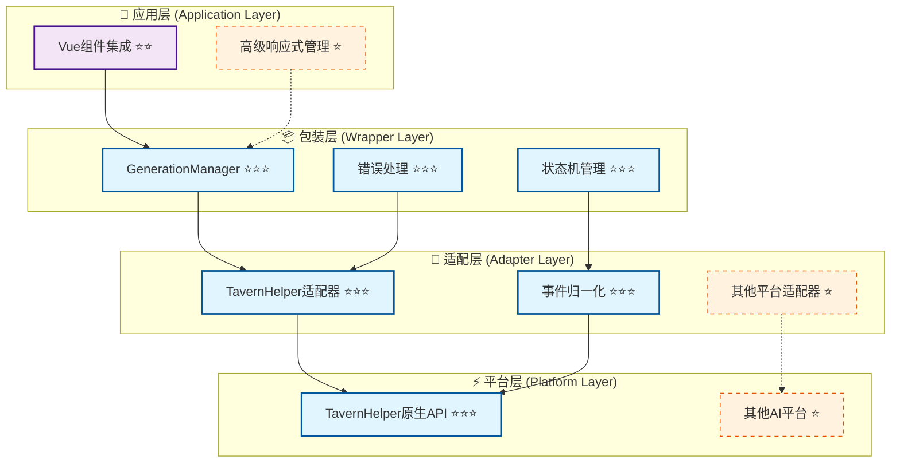
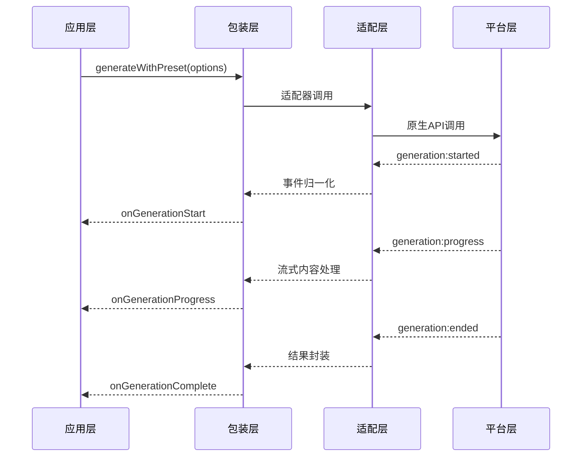

# 🚀 CharacterAPI.generation 四层架构索引

> **核心目标**：提供统一的AI生成接口，封装平台差异，支持预设与自定义生成模式，实现流式响应与事件驱动的可观察架构。

## 📋 快速导航

| 架构层次 | 核心职责 | 推荐度 | 适用场景 | 文档链接 |
|----------|----------|--------|----------|----------|
| **底层平台特性** | 平台原生能力封装 | ⭐⭐⭐ **必需** | 所有生成场景 | [platform.md](./platform.md) |
| **平台适配层** | 统一接口与事件桥接 | ⭐⭐⭐ **必需** | 多平台支持 | [adapter.md](./adapter.md) |
| **包装层实现** | 状态管理与错误处理 | ⭐⭐⭐ **必需** | 生产环境使用 | [wrapper.md](./wrapper.md) |
| **应用层集成** | Vue组件与UI集成 | ⭐⭐ **推荐** | 前端应用开发 | [application.md](./application.md) |
| **高级响应式** | Pinia状态管理 | ⭐ **可选扩展** | 复杂状态场景 | [advanced-application.md](./advanced-application.md) |

## 🏗️ 架构层次图



## 💡 实施策略

### 🎯 **推荐实施路径**
1. **核心三层优先** (⭐⭐⭐)：Platform → Adapter → Wrapper
2. **应用层集成** (⭐⭐)：基础Vue组件集成
3. **可选扩展** (⭐)：高级响应式管理


---

## 🎯 核心目标与特性

### ✅ **统一接口设计**
- 将平台差异封装到适配器中，调用者仅依赖 [`CharacterAPI.generation`](./wrapper.md#_2-1-核心接口实现)
- 支持预设生成与自定义生成两种模式

### ✅ **全量特性支持**
- 优先实现 RFC 规范描述的 [`generate`](/CHARACTER_API_RFC) / [`generateRaw`](/CHARACTER_API_RFC) 能力
- 支持提示词覆盖、注入、历史管理、图片输入、自定义API配置
- 完整的事件与流式响应支持

### ✅ **可观察性架构**
- 与教程包装层打通，标准化事件与日志输出
- 支持生成过程回放与诊断
- 统一的错误处理与状态管理

### ✅ **可扩展性设计**
- 保留与其他平台适配的一致入口与类型
- 模块化的组件设计，支持按需加载

---

## 🔧 核心接口与类型定义

### 📋 **生成选项接口** ⭐⭐⭐
> **职责**：定义预设与自定义生成模式的统一参数接口
> **必要性**：**绝对必需** - 所有生成操作的基础类型定义

```typescript
// 预设模式生成选项（映射 TavernHelper GenerateConfig）
export interface PresetGenerationOptions {
  user_input?: string;              // 用户输入内容
  image?: File | string | (File | string)[]; // 图片输入支持
  stream?: boolean;                 // 流式响应开关
  overrides?: Overrides;            // 提示词覆盖配置
  injects?: Omit<InjectionPrompt, 'id'>[]; // 提示词注入
  max_chat_history?: 'all' | number; // 历史消息限制
  custom_api?: CustomApiConfig;     // 自定义API配置
  generation_id?: string;           // 生成唯一标识
}

// 自定义模式生成选项（映射 TavernHelper GenerateRawConfig）
export interface RawGenerationOptions extends PresetGenerationOptions {
  ordered_prompts?: (BuiltinPrompt | RolePrompt)[]; // 自定义提示词序列
}

// 流式内容传递选项
export interface StreamDeliveryOptions {
  stream_use_incremental?: boolean; // 增量内容推送 (默认: true)
  stream_use_full?: boolean;        // 完整快照推送 (默认: false)
}
```

> 📖 **完整类型定义参考**：[wrapper.md - 核心接口实现](./wrapper.md#_2-1-核心接口实现)

### 🎛️ **生成管理器接口** ⭐⭐⭐
> **职责**：提供统一的生成操作入口与生命周期管理
> **必要性**：**绝对必需** - 核心业务逻辑封装

```typescript
interface GenerationManager {
  // 预设模式生成
  generateWithPreset(options: PresetGenerationOptions): Promise<GenerationResult>;
  
  // 自定义模式生成
  generateRaw(options: RawGenerationOptions): Promise<GenerationResult>;
  
  // 停止生成
  stop(generationId: string): Promise<void>;
  
  // 事件订阅
  on(event: GenerationEvent, handler: EventHandler): void;
}
```

---

## 📡 事件驱动架构

### 🔄 **事件流程图** ⭐⭐⭐



### 📋 **标准事件类型** ⭐⭐⭐
| 事件名称 | 触发时机 | 数据载荷 | 必要性 |
|----------|----------|----------|--------|
| `generation:started` | 生成开始 | `{ generationId, timestamp }` | ⭐⭐⭐ |
| `generation:progress` | 流式内容 | `{ content, isIncremental }` | ⭐⭐⭐ |
| `generation:ended` | 生成完成 | `{ result, duration }` | ⭐⭐⭐ |
| `generation:error` | 生成错误 | `{ error, context }` | ⭐⭐⭐ |

> 📖 **事件详细说明**：[adapter.md - 事件归一化与桥接](./adapter.md#_2-事件归一化与桥接)

---

## 🏗️ 分层实现指南

### 1️⃣ **底层平台特性** ⭐⭐⭐ **必需**
> **实施优先级**：第一阶段 - 基础能力调研

- **核心能力**：TavernHelper原生API封装
- **关键特性**：生成模式、事件系统、流式响应、提示词管理
- **实现要点**：平台能力清单、API接口映射、兼容性分析

📖 **详细实现**：[platform.md - 平台特性分析](./platform.md)

### 2️⃣ **平台适配层** ⭐⭐⭐ **必需**
> **实施优先级**：第二阶段 - 统一接口设计

- **核心能力**：SPI合同定义、事件归一化、运行时协商
- **关键特性**：适配器工厂、能力声明、降级策略
- **实现要点**：接口标准化、事件桥接、错误映射

📖 **详细实现**：[adapter.md - 适配器设计](./adapter.md)

### 3️⃣ **包装层实现** ⭐⭐⭐ **必需**
> **实施优先级**：第三阶段 - 业务逻辑封装

- **核心能力**：GenerationManager、状态机、并发控制
- **关键特性**：统一调用接口、错误处理、资源管理
- **实现要点**：生命周期管理、重试机制、日志集成

📖 **详细实现**：[wrapper.md - 包装层设计](./wrapper.md)

### 4️⃣ **应用层集成** ⭐⭐ **推荐**
> **实施优先级**：第四阶段 - 前端集成

- **核心能力**：Vue组件集成、UI状态同步、用户交互
- **关键特性**：响应式绑定、错误提示、进度显示
- **实现要点**：组件设计、状态管理、用户体验

📖 **详细实现**：[application.md - 应用层集成](./application.md)

### 5️⃣ **高级响应式** ⭐ **可选扩展**
> **实施优先级**：第五阶段 - 高级特性

- **核心能力**：Pinia状态管理、复杂业务场景支持
- **关键特性**：全局状态、持久化、多实例管理
- **实现要点**：状态设计、性能优化、扩展机制

📖 **详细实现**：[advanced-application.md - 高级应用](./advanced-application.md)

---

## 🧪 测试与验收策略

### ✅ **测试覆盖矩阵**
| 测试层级 | 覆盖范围 | 测试重点 | 验收标准 |
|----------|----------|----------|----------|
| **单元测试** | 各层组件 | 接口契约、错误处理 | 覆盖率 > 90% |
| **集成测试** | 跨层交互 | 事件流转、状态同步 | 端到端场景通过 |
| **性能测试** | 并发场景 | 响应时间、资源占用 | 满足性能基线 |

### 📋 **验收检查清单**
- [ ] 是否支持预设与自定义两种生成模式？
- [ ] 是否实现完整的事件驱动架构？
- [ ] 是否提供统一的错误处理机制？
- [ ] 是否支持流式响应与进度反馈？
- [ ] 是否具备良好的扩展性设计？

> 📖 **测试详细指南**：后续补充

---

## 🔗 相关资源链接

### 📚 **核心文档**
- [CharacterAPI RFC](/CHARACTER_API_RFC) - 整体架构与接口规范
- [生成模块索引](/landing/generation/) - 分步实现与导航

### 🛠️ **实现参考**
- [包装层实现](./wrapper.md) - 统一接口与事件处理
- [适配器设计](./adapter.md) - 平台差异封装与桥接

### 🎯 **快速导航**
| 文档 | 用途 | 推荐度 |
|------|------|--------|
| [platform.md](./platform.md) | 平台能力分析 | ⭐⭐⭐ |
| [adapter.md](./adapter.md) | 适配器设计 | ⭐⭐⭐ |
| [wrapper.md](./wrapper.md) | 包装层实现 | ⭐⭐⭐ |
| [application.md](./application.md) | 应用层集成 | ⭐⭐ |
| [advanced-application.md](./advanced-application.md) | 高级特性 | ⭐ |
