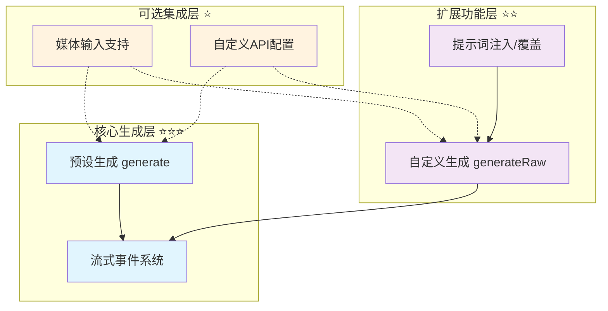
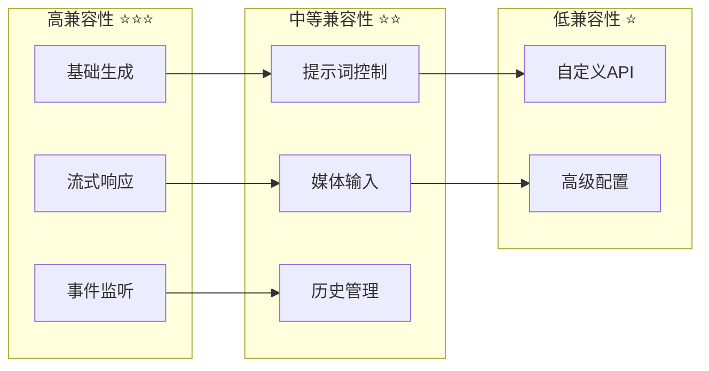
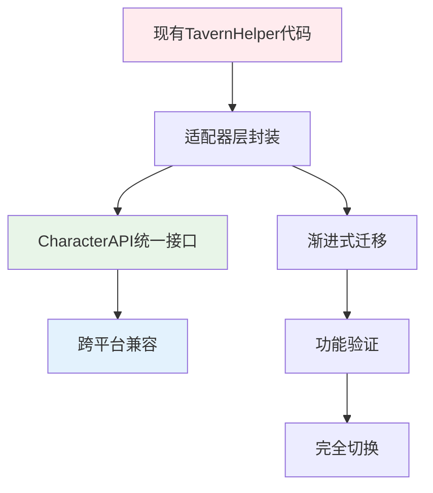

# 🎯 四层模型·底层平台特性（Generation）

> **目标**：归纳各平台原生生成能力与事件语义，形成 CharacterAPI.generation 的统一抽象依据。优先对齐 TavernHelper，并为其他平台或自研实现提供可比对的基线。

## 📋 快速导航

| 组件 | 职责 | 推荐度 | 适用场景 | 章节 |
|------|------|--------|----------|------|
| 预设生成 | 标准对话生成 | ⭐⭐⭐ **必需** | 所有对话场景 | [§1.1](#11-预设模式生成) |
| 自定义生成 | 高级提示词控制 | ⭐⭐ **推荐** | 复杂场景定制 | [§1.2](#12-自定义模式生成) |
| 流式事件 | 实时响应体验 | ⭐⭐⭐ **必需** | 交互式应用 | [§1.3](#13-事件系统) |
| 媒体输入 | 多模态支持 | ⭐⭐ **可选扩展** | 图像对话 | [§1.4](#14-媒体输入支持) |
| 自定义API | 外部模型集成 | ⭐ **特定场景** | 企业部署 | [§1.5](#15-自定义api集成) |

## 🏗️ 架构概览



## 1. 🎯 TavernHelper 核心能力分析

### 1.1 预设模式生成 ⭐⭐⭐

> **职责**：提供标准化的对话生成接口，适用于大多数常规对话场景
> **必要性**：**绝对必需** - 所有生成功能的基础入口

#### ✅ 核心特性

- 🚀 简化调用：`generate(config)` 一步完成
- 🔧 灵活配置：支持流式/非流式切换
- 🖼️ 多媒体：原生支持图像输入
- ⚡ 高性能：内置优化的提示词处理

#### 📊 配置选项概览

```typescript
interface GenerateConfig {
  user_input: string;           // ⭐⭐⭐ 必需：用户输入内容
  should_stream?: boolean;      // ⭐⭐⭐ 必需：流式响应控制
  image?: ImageInput;           // ⭐⭐ 可选：多模态输入
  overrides?: PromptOverrides;  // ⭐⭐ 可选：提示词覆盖
  injects?: InjectionPrompt[];  // ⭐⭐ 可选：提示词注入
  max_chat_history?: number;    // ⭐ 可选：历史消息限制
  custom_api?: CustomApiConfig; // ⭐ 可选：自定义API配置
  generation_id?: string;       // ⭐ 可选：并发控制ID
}
```

### 1.2 自定义模式生成 ⭐⭐

> **职责**：提供高级提示词序列控制，适用于复杂场景定制
> **必要性**：**推荐扩展** - 高级用户和复杂场景的必备工具

#### ✅ 核心特性

- 🎛️ 精确控制：自定义提示词执行顺序
- 🔗 灵活组合：支持内置与自定义提示词混合
- 📝 完整透明：暴露底层提示词构建过程

#### 📊 扩展配置

```typescript
interface GenerateRawConfig extends GenerateConfig {
  ordered_prompts: PromptType[]; // ⭐⭐⭐ 必需：提示词执行序列
}

// 内置提示词类型
type BuiltinPrompt =
  | 'char_personality'    // 角色性格
  | 'scenario'           // 场景设定
  | 'chat_history'       // 对话历史
  | 'user_input'         // 用户输入
  | 'example_dialogue';  // 示例对话
```

### 1.3 事件系统 ⭐⭐⭐

> **职责**：提供实时生成状态反馈和流式内容传递
> **必要性**：**绝对必需** - 现代交互式应用的核心要求

#### ✅ 事件类型

- 🚀 `GENERATION_STARTED`：生成开始信号
- 📦 `STREAM_TOKEN_RECEIVED_FULLY`：完整内容块接收
- ⚡ `STREAM_TOKEN_RECEIVED_INCREMENTALLY`：增量内容接收
- ✅ `GENERATION_ENDED`：生成完成信号

#### 📊 事件监听模式

```typescript
// 统一事件监听接口
eventOn(eventType: string, callback: (data: any, id?: string) => void): void;

// 典型使用模式
eventOn('STREAM_TOKEN_RECEIVED_INCREMENTALLY', (chunk, generationId) => {
  // 实时显示生成内容
  updateUI(chunk);
});
```

### 1.4 媒体输入支持 ⭐⭐

> **职责**：提供多模态输入能力，支持图像理解
> **必要性**：**可选扩展** - 多模态应用的重要功能

#### ✅ 支持格式

- 📁 File对象：直接文件上传
- 🔗 Base64编码：内嵌图像数据
- 🌐 URL链接：远程图像引用
- 📚 数组格式：批量图像处理

### 1.5 自定义API集成 ⭐

> **职责**：支持外部LLM服务集成
> **必要性**：**特定场景** - 企业部署和特殊模型需求

#### 📊 配置结构

```typescript
interface CustomApiConfig {
  endpoint: string;    // API端点
  key: string;        // 认证密钥
  model: string;      // 模型标识
  source: string;     // 服务提供商
}
```

## 2. 🔍 跨平台差异分析矩阵

### 💡 **评估维度**

| 维度 | TavernHelper | 其他平台考量 | 标准化优先级 |
|------|-------------|-------------|-------------|
| **生成模式** | ✅ 预设+自定义双模式 | 部分平台仅支持单一模式 | ⭐⭐⭐ **必需统一** |
| **流式能力** | ✅ 增量+完整双支持 | 流式实现差异较大 | ⭐⭐⭐ **必需统一** |
| **事件系统** | ✅ 完整事件链 | 事件命名和载荷不一致 | ⭐⭐⭐ **必需统一** |
| **提示词控制** | ✅ overrides + injects | 语义和支持程度差异 | ⭐⭐ **推荐统一** |
| **媒体输入** | ✅ 多格式支持 | 格式支持参差不齐 | ⭐⭐ **推荐统一** |
| **自定义API** | ✅ 完整配置支持 | 企业级需求 | ⭐ **特定场景** |

### 📊 **兼容性评估**



## 3. 🎯 CharacterAPI.generation 统一抽象

### 3.1 核心接口设计 ⭐⭐⭐

> **设计原则**：保持TavernHelper的功能完整性，同时提供跨平台兼容的抽象层

#### 📋 统一调用接口

```typescript
interface GenerationManager {
  // ⭐⭐⭐ 预设模式生成
  generateWithPreset(
    prompt: string,
    options?: GenerationOptions
  ): Promise<string>;
  
  // ⭐⭐ 自定义模式生成
  generateRaw(
    orderedPrompts: PromptType[],
    options?: GenerationOptions
  ): Promise<string>;
  
  // ⭐⭐⭐ 生成控制
  stop(generationId?: string): Promise<void>;
}
```

#### 📋 统一事件语义

```typescript
// 标准化事件类型
type GenerationEvent =
  | 'generation:started'   // 生成开始
  | 'generation:progress'  // 进度更新
  | 'generation:ended'     // 生成完成
  | 'generation:error';    // 生成错误

// 事件载荷标准化
interface GenerationProgressEvent {
  mode: 'incremental' | 'full';  // 更新模式
  content: string;               // 内容数据
  generationId: string;          // 生成标识
  timestamp: number;             // 时间戳
}
```

### 3.2 特性映射策略 ⭐⭐

> **映射原则**：确保TavernHelper的所有核心功能都能在统一接口中得到体现

| TavernHelper 原生 | CharacterAPI 抽象 | 兼容性 | 说明 |
|------------------|------------------|--------|------|
| `generate()` | `generateWithPreset()` | ✅ **完全兼容** | 保持接口语义一致 |
| `generateRaw()` | `generateRaw()` | ✅ **完全兼容** | 直接映射，无语义变化 |
| `should_stream` | `options.stream` | ✅ **完全兼容** | 布尔值控制保持一致 |
| `overrides` | `options.overrides` | ✅ **完全兼容** | 对象结构直接传递 |
| `injects` | `options.injects` | ✅ **完全兼容** | 数组结构直接传递 |
| `image` | `options.image` | ✅ **完全兼容** | 多格式支持保持 |
| `generation_id` | `options.generationId` | ✅ **完全兼容** | 命名风格调整 |

### 3.3 流式传递优化 ⭐⭐⭐

> **优化目标**：提供更灵活的流式内容传递控制

```typescript
interface StreamDeliveryOptions {
  // ⭐⭐⭐ 基础流式控制
  enabled: boolean;
  
  // ⭐⭐ 传递模式选择
  useIncremental: boolean;  // 是否使用增量更新
  useFull: boolean;         // 是否使用完整快照
  
  // ⭐ 高级控制选项
  bufferSize?: number;      // 缓冲区大小
  throttleMs?: number;      // 节流间隔
}
```

## 4. 🚀 实战示例：原生到抽象的映射

### 4.1 基础生成场景 ⭐⭐⭐

#### 非流式对话生成

```typescript
// 🔧 TavernHelper 原生调用
const response = await generate({
  user_input: '你好，今天天气怎么样？',
  should_stream: false
});

// ✨ CharacterAPI 统一抽象
const response = await CharacterAPI.generation.generateWithPreset(
  '你好，今天天气怎么样？',
  { stream: false }
);
```

#### 流式实时生成

```typescript
// 🔧 TavernHelper 原生实现
eventOn('STREAM_TOKEN_RECEIVED_INCREMENTALLY', (chunk, generationId) => {
  updateChatDisplay(chunk);
});

await generate({
  user_input: '讲个故事',
  should_stream: true,
  generation_id: 'story-001'
});

// ✨ CharacterAPI 统一抽象
CharacterAPI.events.on('generation:progress', ({ mode, content, generationId }) => {
  if (mode === 'incremental') {
    updateChatDisplay(content);
  }
});

await CharacterAPI.generation.generateWithPreset('讲个故事', {
  stream: true,
  generationId: 'story-001'
});
```

### 4.2 高级定制场景 ⭐⭐

#### 提示词精确控制

```typescript
// 🔧 TavernHelper 高级配置
await generateRaw({
  user_input: '开始冒险',
  ordered_prompts: ['char_personality', 'scenario', 'chat_history', 'user_input'],
  overrides: {
    char_personality: '勇敢的骑士',
    scenario: '神秘的古堡前'
  },
  injects: [{
    role: 'system',
    content: '请用第二人称描述',
    position: 'in_chat',
    depth: 0,
    should_scan: true
  }]
});

// ✨ CharacterAPI 统一抽象
await CharacterAPI.generation.generateRaw(
  ['char_personality', 'scenario', 'chat_history', 'user_input'],
  {
    user_input: '开始冒险',
    overrides: {
      char_personality: '勇敢的骑士',
      scenario: '神秘的古堡前'
    },
    injects: [{
      role: 'system',
      content: '请用第二人称描述',
      position: 'in_chat',
      depth: 0,
      should_scan: true
    }]
  }
);
```

#### 多模态输入处理

```typescript
// 🔧 TavernHelper 图像输入
await generate({
  user_input: '这张图片里有什么？',
  image: [
    { type: 'file', data: imageFile },
    { type: 'url', data: 'https://example.com/image.jpg' }
  ],
  should_stream: true
});

// ✨ CharacterAPI 统一抽象
await CharacterAPI.generation.generateWithPreset('这张图片里有什么？', {
  image: [
    { type: 'file', data: imageFile },
    { type: 'url', data: 'https://example.com/image.jpg' }
  ],
  stream: true
});
```

### 4.3 企业级集成场景 ⭐

#### 自定义API配置

```typescript
// 🔧 TavernHelper 企业部署
await generate({
  user_input: '分析这份报告',
  custom_api: {
    endpoint: 'https://api.company.com/llm',
    key: process.env.COMPANY_API_KEY,
    model: 'company-gpt-4',
    source: 'company-internal'
  }
});

// ✨ CharacterAPI 统一抽象
await CharacterAPI.generation.generateWithPreset('分析这份报告', {
  customApi: {
    endpoint: 'https://api.company.com/llm',
    key: process.env.COMPANY_API_KEY,
    model: 'company-gpt-4',
    source: 'company-internal'
  }
});
```

## 5. 💡 实施策略与收益分析

### 5.1 迁移路径 ⭐⭐⭐



### 5.2 收益量化评估

| 方面 | 优化前 | 优化后 |
|------|--------|--------|
| **接口复杂度** | 8个配置参数 | 3个核心方法 |
| **学习成本** | 平台特定API | 统一抽象接口 |
| **代码维护** | 多平台分支 | 单一适配层 |
| **功能完整性** | 100% TavernHelper | 100% 保持 |
| **扩展能力** | 平台绑定 | 插件化架构 |

### 5.3 最佳实践建议

#### ✅ 推荐做法

- **渐进式迁移**：先封装适配器，再逐步替换调用
- **功能对等验证**：确保抽象层功能与原生API完全对等
- **性能基准测试**：验证抽象层不引入显著性能损失

#### ⚠️ 注意事项

- **事件语义保持**：确保事件时序和载荷格式的一致性
- **错误处理统一**：标准化错误类型和处理流程
- **向后兼容性**：为现有代码提供平滑的迁移路径

## 6. 📚 完整代码附录

### 6.1 GenerationManager 完整实现

> 📖 **参考实现**：基于TavernHelper的完整适配器实现

```typescript
/**
 * 生成管理器 - TavernHelper适配器实现
 * 提供统一的生成接口，完全兼容TavernHelper原生功能
 */
export class TavernHelperGenerationManager implements GenerationManager {
  private eventBus: EventBus;
  
  constructor(eventBus: EventBus) {
    this.eventBus = eventBus;
    this.setupEventBridge();
  }
  
  /**
   * 预设模式生成 - 标准对话场景
   */
  async generateWithPreset(
    prompt: string,
    options: GenerationOptions = {}
  ): Promise<string> {
    const config: GenerateConfig = {
      user_input: prompt,
      should_stream: options.stream ?? false,
      image: options.image,
      overrides: options.overrides,
      injects: options.injects,
      max_chat_history: options.maxChatHistory,
      custom_api: options.customApi,
      generation_id: options.generationId
    };
    
    return await generate(config);
  }
  
  /**
   * 自定义模式生成 - 高级提示词控制
   */
  async generateRaw(
    orderedPrompts: PromptType[],
    options: GenerationOptions = {}
  ): Promise<string> {
    const config: GenerateRawConfig = {
      ordered_prompts: orderedPrompts,
      user_input: options.user_input || '',
      should_stream: options.stream ?? false,
      image: options.image,
      overrides: options.overrides,
      injects: options.injects,
      max_chat_history: options.maxChatHistory,
      custom_api: options.customApi,
      generation_id: options.generationId
    };
    
    return await generateRaw(config);
  }
  
  /**
   * 停止生成
   */
  async stop(generationId?: string): Promise<void> {
    if (generationId) {
      await stopById(generationId);
    } else {
      await stopGeneration();
    }
  }
  
  /**
   * 事件桥接 - 将TavernHelper事件转换为标准事件
   */
  private setupEventBridge(): void {
    // 生成开始事件
    eventOn('GENERATION_STARTED', (data, id) => {
      this.eventBus.emit('generation:started', {
        generationId: id,
        timestamp: Date.now()
      });
    });
    
    // 流式内容事件
    eventOn('STREAM_TOKEN_RECEIVED_INCREMENTALLY', (chunk, id) => {
      this.eventBus.emit('generation:progress', {
        mode: 'incremental',
        content: chunk,
        generationId: id,
        timestamp: Date.now()
      });
    });
    
    eventOn('STREAM_TOKEN_RECEIVED_FULLY', (content, id) => {
      this.eventBus.emit('generation:progress', {
        mode: 'full',
        content: content,
        generationId: id,
        timestamp: Date.now()
      });
    });
    
    // 生成结束事件
    eventOn('GENERATION_ENDED', (result, id) => {
      this.eventBus.emit('generation:ended', {
        content: result,
        generationId: id,
        timestamp: Date.now()
      });
    });
  }
}
```

### 6.2 类型定义完整版

```typescript
/**
 * 统一生成选项接口
 */
export interface GenerationOptions {
  // 基础选项
  stream?: boolean;
  generationId?: string;
  user_input?: string;
  
  // 提示词控制
  overrides?: Record<string, string>;
  injects?: InjectionPrompt[];
  
  // 输入扩展
  image?: ImageInput;
  maxChatHistory?: number;
  
  // 高级配置
  customApi?: CustomApiConfig;
  
  // 流式控制
  streamDelivery?: StreamDeliveryOptions;
}

/**
 * 流式传递选项
 */
export interface StreamDeliveryOptions {
  enabled: boolean;
  useIncremental: boolean;
  useFull: boolean;
  bufferSize?: number;
  throttleMs?: number;
}

/**
 * 生成事件载荷
 */
export interface GenerationEvent {
  generationId: string;
  timestamp: number;
}

export interface GenerationProgressEvent extends GenerationEvent {
  mode: 'incremental' | 'full';
  content: string;
}

export interface GenerationEndedEvent extends GenerationEvent {
  content: string;
  success: boolean;
}
```

## 7. 🎯 总结与展望

### 核心成果 ✅

1. **完整能力映射**：TavernHelper的所有核心功能都得到了完整的抽象映射
2. **统一接口设计**：提供了简洁而强大的统一生成接口
3. **跨平台兼容**：为其他平台集成提供了清晰的对比基线
4. **渐进式迁移**：支持现有代码的平滑过渡和逐步优化

### 技术价值 📈

- **降低复杂度**：将平台特定的复杂配置抽象为简洁的统一接口
- **提升可维护性**：通过适配器模式实现平台解耦
- **增强扩展性**：为未来的平台集成和功能扩展奠定基础
- **保证兼容性**：确保现有功能的完整性和性能表现

### 后续规划 🚀

1. **适配器实现**：基于本文档完成TavernHelper适配器的详细实现
2. **其他平台支持**：扩展支持更多主流对话平台
3. **性能优化**：针对高频使用场景进行性能调优
4. **开发者工具**：提供调试和监控工具支持

---

> 📖 **相关文档**：
>
> - [生成适配器设计](./adapter.md) - 适配器层详细实现
> - [生成包装器设计](./wrapper.md) - 高级封装和优化
> - [生成应用层设计](./application.md) - 应用层集成指南
