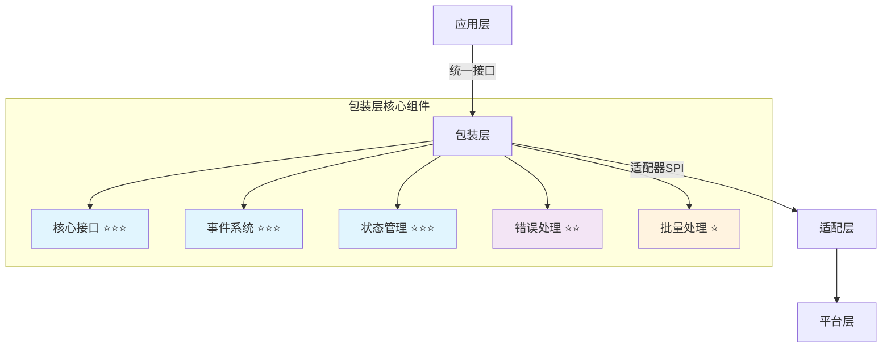
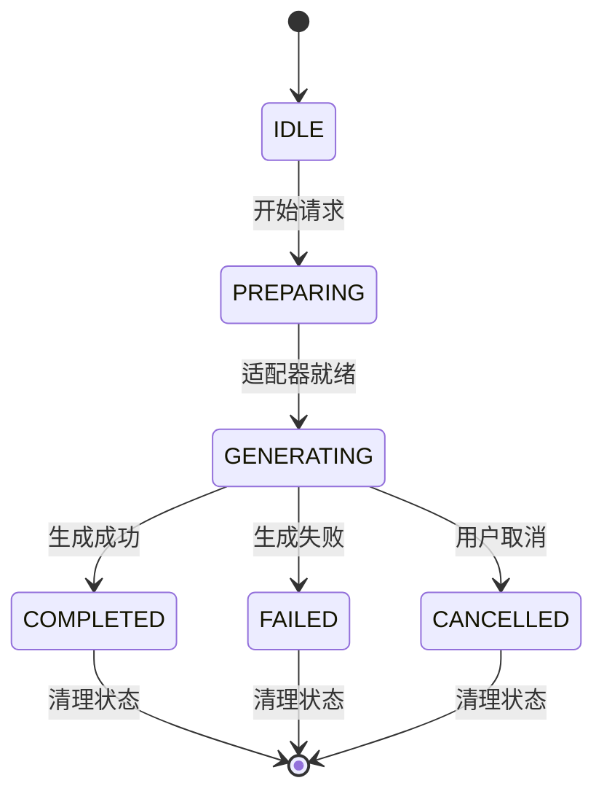

# 🎯 四层模型·包装层实现（Generation Wrapper）

> **核心职责**：为应用层提供统一、稳定的生成请求接口，屏蔽底层平台差异，提供完整的状态管理、事件系统和错误处理能力。

## 📋 快速导航

| 组件 | 职责 | 推荐度 | 适用场景 |
|------|------|--------|----------|
| [核心接口](#核心接口-必需) | 统一生成请求API | ⭐⭐⭐ **必需** | 所有生成场景 |
| [事件系统](#事件系统-必需) | 状态通知与进度跟踪 | ⭐⭐⭐ **必需** | 实时反馈场景 |
| [状态管理](#状态管理-必需) | 并发隔离与生命周期 | ⭐⭐⭐ **必需** | 多任务场景 |
| [错误处理](#错误处理-推荐) | 重试与超时控制 | ⭐⭐ **推荐** | 生产环境 |
| [批量处理](#批量处理-可选) | 并发生成优化 | ⭐ **可选** | 高吞吐场景 |

## 🏗️ 架构概览



## 💡 **实施策略**

### 🎯 **核心设计原则**
- **接口稳定性**：应用层仅依赖包装层API，与底层平台解耦
- **状态透明性**：完整的生命周期状态机，支持并发隔离
- **事件驱动**：基于事件的异步通信，支持流式和批量模式
- **错误可控**：标准化错误处理，支持重试和降级策略


---

## 🚀 核心接口 ⭐⭐⭐ {#核心接口-必需}

> **职责**：提供统一的生成请求接口，屏蔽底层平台差异
> **必要性**：**绝对必需** - 应用层的唯一入口点

### ✅ 核心特性
- 统一的请求/响应格式
- 自动适配器选择和能力协商
- 完整的TypeScript类型支持
- 流式和非流式模式支持

### 🔧 接口概览

```typescript
// 主要导出接口
export async function sendGenerationRequest(config: GenerationConfig): Promise<GenerationResult>
export async function sendStreamingRequest(config: GenerationConfig, onChunk: ChunkHandler): Promise<GenerationResult>
export function onGenerationEvent(type: GenerationEventType, handler: EventHandler): UnsubscribeFunction
export async function cancel(generationId: string): Promise<boolean>
```

> 📖 **完整实现参考**：[附录A：核心接口实现](#附录a核心接口实现)

### 🎯 **类型定义**

```typescript
// 生成请求配置
interface GenerationConfig {
  userInput: string;
  streaming?: boolean;
  retries?: number;
  timeout?: number;
  generationId?: string;
  model?: string;
  temperature?: number;
  maxTokens?: number;
  
  // 回调函数
  onProgress?: (chunk: string) => void;
  onComplete?: (result: string) => void;
  onError?: (error: Error) => void;
  onStateChange?: (state: GenerationState) => void;
}

// 生成结果
interface GenerationResult {
  success: boolean;
  content: string;
  generationId: string;
  metadata: GenerationMetadata;
}

// 元数据
interface GenerationMetadata {
  platform: string;
  model?: string;
  tokens?: number;
  duration: number;
  retryCount?: number;
  fromCache?: boolean;
  [key: string]: any;
}
```

### 💡 **使用示例**

```typescript
// 基础使用
const result = await sendGenerationRequest({
  userInput: "请生成一个故事",
  streaming: false,
  timeout: 30000
});

// 流式使用
await sendStreamingRequest({
  userInput: "请生成一个故事",
  streaming: true
}, (chunk) => {
  console.log('收到内容片段:', chunk);
});

// 事件监听
const unsubscribe = onGenerationEvent('generation:progress', (event) => {
  console.log(`生成进度: ${event.payload.progress}%`);
});
```

---

## 🎭 事件系统 ⭐⭐⭐ {#事件系统-必需}

> **职责**：提供完整的事件驱动通信机制，支持实时状态通知和进度跟踪
> **必要性**：**绝对必需** - 异步操作的核心通信机制

### ✅ 核心特性
- 完整的事件生命周期管理
- 支持增量和完整内容传递
- 事件历史记录和回放
- 类型安全的事件监听

### 🔧 事件类型概览

```typescript
export enum GenerationEventType {
  STARTED = 'generation:started',
  PROGRESS = 'generation:progress',
  STREAM_CHUNK = 'generation:stream_chunk',
  COMPLETED = 'generation:completed',
  FAILED = 'generation:failed',
  CANCELLED = 'generation:cancelled'
}
```

### 💡 **内容传递策略**

| 模式 | 增量传递 | 完整传递 | 适用场景 |
|------|----------|----------|----------|
| 流式模式 | ✅ 默认启用 | ⚠️ 可选启用 | 实时显示 |
| 非流式模式 | ❌ 不适用 | ✅ 仅最终结果 | 批量处理 |

> 📖 **完整实现参考**：[附录B：事件系统实现](#附录b事件系统实现)

---

## 🔄 状态管理 ⭐⭐⭐ {#状态管理-必需}

> **职责**：管理生成请求的完整生命周期状态，提供并发隔离和状态追踪
> **必要性**：**绝对必需** - 多任务并发的基础保障

### ✅ 核心特性
- 完整的状态机：`idle → preparing → generating → completed|failed`
- 基于`generationId`的并发隔离
- 自动状态清理和内存管理
- Vue响应式状态支持

### 🔧 状态流转图



### 💡 **并发隔离策略**

```typescript
// 每个生成请求独立管理
const sessionMap = new Map<string, GenerationSession>();

interface GenerationSession {
  subscription: UnsubscribeFunction[];
  buffer: string[];
  meta: GenerationMetadata;
  startedAt: number;
  endedAt?: number;
}
```

> 📖 **完整实现参考**：[附录C：状态管理实现](#附录c状态管理实现)

---

## ⚠️ 错误处理 ⭐⭐ {#错误处理-推荐}

> **职责**：提供标准化的错误处理、重试机制和超时控制
> **必要性**：**强烈推荐** - 生产环境的稳定性保障

### ✅ 核心特性
- 标准化错误类型和消息
- 智能重试策略（指数退避）
- 多层超时控制
- 错误分类和处理策略

### 🔧 重试策略配置

```typescript
interface RetryConfig {
  maxRetries: number;        // 最大重试次数
  baseDelay: number;         // 基础延迟时间
  maxDelay: number;          // 最大延迟时间
  backoffFactor: number;     // 退避因子
  retryableErrors: string[]; // 可重试的错误类型
}
```

### 💡 **错误分类处理**

| 错误类型 | 重试策略 | 处理方式 |
|----------|----------|----------|
| 网络错误 | ✅ 自动重试 | 指数退避 |
| 超时错误 | ✅ 自动重试 | 增加超时时间 |
| 参数错误 | ❌ 不重试 | 立即失败 |
| 权限错误 | ❌ 不重试 | 立即失败 |

> 📖 **完整实现参考**：[附录D：错误处理实现](#附录d错误处理实现)

---

## 🚀 批量处理 ⭐ {#批量处理-可选}

> **职责**：提供高效的批量生成请求处理能力
> **必要性**：**可选扩展** - 高吞吐量场景的性能优化

### ✅ 核心特性
- 并发控制和资源管理
- 失败快速模式和容错模式
- 批量进度跟踪
- 结果聚合和错误收集

### 🔧 批量配置选项

```typescript
interface BatchOptions {
  concurrent: number;    // 并发数量
  failFast: boolean;     // 快速失败模式
  timeout: number;       // 批量超时
  retryFailed: boolean;  // 重试失败项
}
```

### 💡 **性能优化策略**

| 场景 | 并发数 | 失败模式 | 适用情况 |
|------|--------|----------|----------|
| 实时处理 | 1-3 | 快速失败 | 用户交互 |
| 批量处理 | 5-10 | 容错模式 | 后台任务 |
| 大规模处理 | 10+ | 容错模式 | 数据处理 |

> 📖 **完整实现参考**：[附录E：批量处理实现](#附录e批量处理实现)

---

## 🔗 适配层集成

### 🎯 **耦合点设计**

包装层仅通过标准化的适配器SPI进行调用：

```typescript
interface GenerationAdapter {
  generateWithPreset(params: PresetParams): Promise<GenerationResult>;
  generateRaw(params: RawParams): Promise<GenerationResult>;
  stop(generationId: string): Promise<boolean>;
  capabilities: AdapterCapabilities;
}
```

### 💡 **能力协商机制**

```typescript
// 根据适配器能力动态调整行为
const adapter = await PlatformAdapterFactory.create();
const canStream = adapter.capabilities.supportsStreaming;
const canCancel = adapter.capabilities.supportsStopById;

if (config.streaming && !canStream) {
  console.warn('适配器不支持流式，降级为非流式模式');
  config.streaming = false;
}
```

---

## 📊 实施检查清单

### ✅ **必需功能**
- [ ] 统一接口：sendGenerationRequest()、sendStreamingRequest()、onGenerationEvent()、cancel()
- [ ] 状态机：覆盖所有状态转换，异常路径处理一致
- [ ] 事件系统：支持增量/完整内容传递，事件历史记录
- [ ] 并发隔离：基于`generationId`的会话管理

### ⚠️ **推荐功能**
- [ ] 错误处理：标准化 GenerationError，可配置重试策略
- [ ] 超时控制：请求级和流式超时机制
- [ ] 日志系统：结构化输出，支持回放
- [ ] 资源管理：自动清理订阅和状态

### 💡 **可选功能**
- [ ] 批量处理：并发控制，失败处理策略
- [ ] Vue集成：响应式状态管理
- [ ] 性能监控：耗时统计，成功率追踪

---

## 📚 附录：完整代码实现

### 附录A：核心接口实现

```typescript
// 主要生成函数
export async function sendGenerationRequest(config: GenerationConfig): Promise<GenerationResult> {
  const generationId = config.generationId || generateId();
  const startTime = Date.now();
  
  try {
    // 更新状态
    updateGenerationState(generationId, {
      status: GenerationStatus.PREPARING,
      progress: 0,
      error: null
    });
    
    // 触发开始事件
    emitGenerationEvent({
      type: GenerationEventType.STARTED,
      generationId,
      timestamp: Date.now(),
      payload: { config }
    });
    
    // 获取适配器
    const adapter = await PlatformAdapterFactory.create();
    
    // 准备参数
    const params = prepareGenerationParams(config, adapter);
    
    // 执行生成
    const result = await executeGeneration(params, config, adapter, generationId);
    
    // 更新完成状态
    updateGenerationState(generationId, {
      status: GenerationStatus.COMPLETED,
      progress: 100,
      result: result.content
    });
    
    // 触发完成事件
    emitGenerationEvent({
      type: GenerationEventType.COMPLETED,
      generationId,
      timestamp: Date.now(),
      payload: {
        content: result.content,
        duration: Date.now() - startTime
      }
    });
    
    config.onComplete?.(result.content);
    return result;
    
  } catch (error) {
    // 处理错误
    const wrappedError = wrapError(error, generationId);
    
    updateGenerationState(generationId, {
      status: GenerationStatus.FAILED,
      error: wrappedError
    });
    
    emitGenerationEvent({
      type: GenerationEventType.FAILED,
      generationId,
      timestamp: Date.now(),
      payload: { error: wrappedError }
    });
    
    config.onError?.(wrappedError);
    throw wrappedError;
  } finally {
    // 清理状态
    setTimeout(() => {
      clearGenerationState(generationId);
    }, 30000); // 30秒后清理
  }
}

// 带重试的生成函数
export async function sendGenerationRequestWithRetry(config: GenerationConfig): Promise<GenerationResult> {
  const maxRetries = config.retries || 3;
  let lastError: Error;
  
  for (let attempt = 1; attempt <= maxRetries; attempt++) {
    try {
      const result = await sendGenerationRequest({
        ...config,
        generationId: `${config.generationId || 'retry'}-attempt-${attempt}`
      });
      
      // 成功则返回结果
      return {
        ...result,
        metadata: {
          ...result.metadata,
          retryCount: attempt - 1
        }
      };
    } catch (error) {
      lastError = error as Error;
      
      // 如果不是最后一次尝试，等待后重试
      if (attempt < maxRetries) {
        const delay = Math.min(1000 * Math.pow(2, attempt - 1), 10000);
        await new Promise(resolve => setTimeout(resolve, delay));
        
        console.warn(`生成请求失败，${delay}ms后进行第${attempt + 1}次尝试:`, error);
      }
    }
  }
  
  throw new Error(`生成请求在${maxRetries}次尝试后仍然失败: ${lastError.message}`);
}
```

### 附录B：事件系统实现

```typescript
// 事件类型枚举
export enum GenerationEventType {
  STARTED = 'generation:started',
  PROGRESS = 'generation:progress',
  STREAM_CHUNK = 'generation:stream_chunk',
  COMPLETED = 'generation:completed',
  FAILED = 'generation:failed',
  CANCELLED = 'generation:cancelled',
  STATE_CHANGED = 'generation:state_changed',
  BATCH_STARTED = 'generation:batch_started',
  BATCH_COMPLETED = 'generation:batch_completed'
}

// 事件数据接口
export interface GenerationEventData {
  type: GenerationEventType;
  generationId: string;
  timestamp: number;
  payload?: any;
}

// 事件监听器类型
export type GenerationEventListener = (event: GenerationEventData) => void;

// 事件发射器与历史
class GenerationEventEmitter {
  private listeners = new Map<GenerationEventType, Set<GenerationEventListener>>();
  private eventHistory: GenerationEventData[] = [];
  private maxHistorySize = 1000;
  
  // 添加监听器
  on(eventType: GenerationEventType, listener: GenerationEventListener): () => void {
    if (!this.listeners.has(eventType)) {
      this.listeners.set(eventType, new Set());
    }
    this.listeners.get(eventType)!.add(listener);
    return () => this.listeners.get(eventType)?.delete(listener);
  }
  
  // 一次性监听器
  once(eventType: GenerationEventType, listener: GenerationEventListener): () => void {
    const wrappedListener = (event: GenerationEventData) => {
      listener(event);
      this.off(eventType, wrappedListener);
    };
    return this.on(eventType, wrappedListener);
  }
  
  // 移除监听器
  off(eventType: GenerationEventType, listener: GenerationEventListener): void {
    this.listeners.get(eventType)?.delete(listener);
  }
  
  // 发射事件
  emit(event: GenerationEventData): void {
    this.addToHistory(event);
    const listeners = this.listeners.get(event.type);
    if (listeners) {
      listeners.forEach(listener => {
        try { listener(event); } catch (error) {
          console.error(`事件监听器执行错误 (${event.type}):`, error);
        }
      });
    }
  }
  
  // 获取事件历史
  getHistory(filter?: { generationId?: string; eventType?: GenerationEventType; since?: number; }): GenerationEventData[] {
    let history = [...this.eventHistory];
    if (filter) {
      if (filter.generationId) history = history.filter(e => e.generationId === filter.generationId);
      if (filter.eventType) history = history.filter(e => e.type === filter.eventType);
      if (filter.since) history = history.filter(e => e.timestamp >= filter.since!);
    }
    return history;
  }
  
  // 清理历史记录
  clearHistory(): void {
    this.eventHistory = [];
  }
  
  // 添加到历史记录
  private addToHistory(event: GenerationEventData): void {
    this.eventHistory.push(event);
    if (this.eventHistory.length > this.maxHistorySize) {
      this.eventHistory.shift();
    }
  }
}

// 全局事件发射器与导出函数
const eventEmitter = new GenerationEventEmitter();

export function emitGenerationEvent(event: GenerationEventData): void {
  eventEmitter.emit(event);
}

export function onGenerationEvent(eventType: GenerationEventType, listener: GenerationEventListener): () => void {
  return eventEmitter.on(eventType, listener);
}

export function onceGenerationEvent(eventType: GenerationEventType, listener: GenerationEventListener): () => void {
  return eventEmitter.once(eventType, listener);
}

export function offGenerationEvent(eventType: GenerationEventType, listener: GenerationEventListener): void {
  eventEmitter.off(eventType, listener);
}

export function getGenerationEventHistory(filter?: { generationId?: string; eventType?: GenerationEventType; since?: number; }): GenerationEventData[] {
  return eventEmitter.getHistory(filter);
}
```

### 附录C：状态管理实现

```typescript
// 生成状态枚举
export enum GenerationStatus {
  IDLE = 'idle',
  PREPARING = 'preparing',
  GENERATING = 'generating',
  COMPLETED = 'completed',
  FAILED = 'failed',
  CANCELLED = 'cancelled'
}

// 生成状态接口
export interface GenerationState {
  generationId: string;
  status: GenerationStatus;
  progress: number;
  startTime?: number;
  endTime?: number;
  result?: string;
  error?: Error;
  metadata?: Record<string, any>;
}

// 全局状态管理
class GenerationStateManager {
  private states = new Map<string, GenerationState>();
  private listeners = new Set<(state: GenerationState) => void>();

  // 更新状态
  updateState(generationId: string, updates: Partial<GenerationState>): void {
    const currentState = this.states.get(generationId) || {
      generationId,
      status: GenerationStatus.IDLE,
      progress: 0
    };

    const newState = {
      ...currentState,
      ...updates,
      generationId // 确保ID不被覆盖
    };

    this.states.set(generationId, newState);

    // 通知监听器
    this.listeners.forEach(listener => {
      try {
        listener(newState);
      } catch (error) {
        console.error('状态监听器执行错误:', error);
      }
    });
  }

  // 获取状态
  getState(generationId: string): GenerationState | undefined {
    return this.states.get(generationId);
  }

  // 获取所有状态
  getAllStates(): GenerationState[] {
    return Array.from(this.states.values());
  }

  // 清理状态
  clearState(generationId: string): void {
    this.states.delete(generationId);
  }

  // 添加监听器
  addListener(listener: (state: GenerationState) => void): () => void {
    this.listeners.add(listener);
    return () => this.listeners.delete(listener);
  }

  // 清理过期状态
  cleanup(maxAge: number = 300000): void { // 默认5分钟
    const now = Date.now();

    for (const [id, state] of this.states.entries()) {
      const stateAge = now - (state.startTime || now);

      if (stateAge > maxAge &&
          (state.status === GenerationStatus.COMPLETED ||
           state.status === GenerationStatus.FAILED)) {
        this.states.delete(id);
      }
    }
  }
}

// 全局状态管理器实例
const stateManager = new GenerationStateManager();

// 导出的状态管理函数
export function updateGenerationState(generationId: string, updates: Partial<GenerationState>): void {
  stateManager.updateState(generationId, updates);
}

export function getGenerationState(generationId: string): GenerationState | undefined {
  return stateManager.getState(generationId);
}

export function getAllGenerationStates(): GenerationState[] {
  return stateManager.getAllStates();
}

export function clearGenerationState(generationId: string): void {
  stateManager.clearState(generationId);
}

export function onGenerationStateChange(listener: (state: GenerationState) => void): () => void {
  return stateManager.addListener(listener);
}
```

### 附录D：错误处理实现

```typescript
// 标准化错误类
export class GenerationError extends Error {
  constructor(
    message: string,
    public code: string,
    public generationId: string,
    public retriable: boolean = false,
    public originalError?: Error
  ) {
    super(message);
    this.name = 'GenerationError';
  }
}

// 错误包装函数
export function wrapError(error: any, generationId: string): GenerationError {
  if (error instanceof GenerationError) {
    return error;
  }

  // 根据错误类型判断是否可重试
  const retriable = isRetriableError(error);
  const code = getErrorCode(error);
  
  return new GenerationError(
    error.message || '生成请求失败',
    code,
    generationId,
    retriable,
    error
  );
}

// 判断错误是否可重试
function isRetriableError(error: any): boolean {
  const retriableCodes = [
    'NETWORK_ERROR',
    'TIMEOUT_ERROR',
    'SERVER_ERROR',
    'RATE_LIMIT_ERROR'
  ];
  
  const errorCode = getErrorCode(error);
  return retriableCodes.includes(errorCode);
}

// 获取错误代码
function getErrorCode(error: any): string {
  if (error.code) return error.code;
  if (error.status >= 500) return 'SERVER_ERROR';
  if (error.status === 429) return 'RATE_LIMIT_ERROR';
  if (error.status >= 400) return 'CLIENT_ERROR';
  if (error.name === 'TimeoutError') return 'TIMEOUT_ERROR';
  if (error.name === 'NetworkError') return 'NETWORK_ERROR';
  return 'UNKNOWN_ERROR';
}
```

### 附录E：批量处理实现

```typescript
// 批量生成函数
export async function sendBatchGenerationRequests(
  configs: GenerationConfig[],
  options: {
    concurrent?: number;
    failFast?: boolean;
  } = {}
): Promise<GenerationResult[]> {
  const { concurrent = 3, failFast = false } = options;
  const results: GenerationResult[] = [];
  const errors: Error[] = [];
  
  // 分批处理
  for (let i = 0; i < configs.length; i += concurrent) {
    const batch = configs.slice(i, i + concurrent);
    
    const batchPromises = batch.map(async (config, index) => {
      try {
        const result = await sendGenerationRequest({
          ...config,
          generationId: config.generationId || `batch-${i + index}`
        });
        return { index: i + index, result };
      } catch (error) {
        if (failFast) throw error;
        errors.push(error as Error);
        return { index: i + index, error: error as Error };
      }
    });
    
    const batchResults = await Promise.all(batchPromises);
    
    // 处理批次结果
    for (const item of batchResults) {
      if ('result' in item) {
        results[item.index] = item.result;
      } else {
        results[item.index] = {
          success: false,
          content: '',
          generationId: configs[item.index].generationId || `batch-${item.index}`,
          metadata: {
            platform: 'unknown',
            duration: 0,
            error: item.error.message
          }
        } as GenerationResult;
      }
    }
  }
  
  if (errors.length > 0 && failFast) {
    throw new Error(`批量生成失败: ${errors.map(e => e.message).join(', ')}`);
  }
  
  return results;
}
```

---

## 🎯 总结

通过以上包装层设计，应用侧获得了：

- **🔧 统一接口**：屏蔽平台差异，提供一致的API体验
- **📊 完整状态**：全生命周期状态管理，支持并发隔离
- **🎭 事件驱动**：实时通知机制，支持流式和批量模式
- **⚠️ 错误可控**：标准化错误处理，智能重试策略
- **🚀 高性能**：批量处理优化，资源自动管理

这为真实项目的工程化落地提供了坚实的基础架构支撑。
