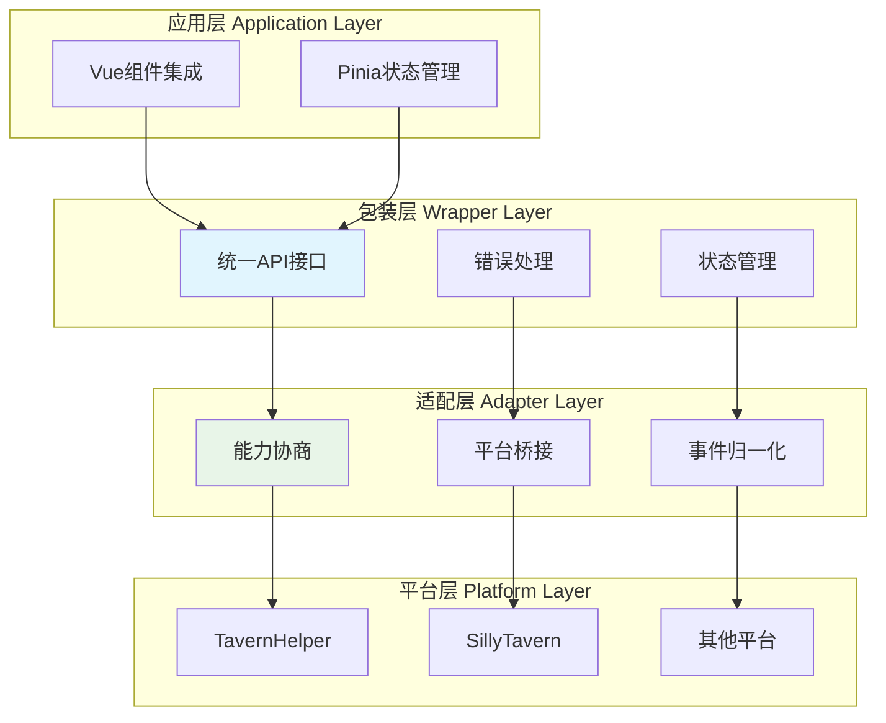

# 📚 Landing - RFC 实现指南索引

> **定位**：提供各功能模块的详细实现指南与架构文档，帮助开发者理解和实现 CharacterAPI RFC 规范。

## 🎯 模块导航

本目录包含 CharacterAPI RFC 各功能模块的详细实现指南，每个模块都提供了从平台层到应用层的完整架构设计文档。

### 📦 可用模块

<div class="module-grid">

#### 🚀 [Generation - 生成模块](./generation/)
> **核心功能**：AI 内容生成接口的统一封装

- 提供预设与自定义生成模式
- 支持流式响应与事件驱动
- 完整的状态管理与错误处理

**适用场景**：AI 角色对话生成、内容创作、智能问答

[📖 查看详细文档 →](./generation/)

---

#### 🔧 [Variable - 变量模块](./variable/)
> **核心功能**：跨平台变量操作与数据管理

- 统一的变量 CRUD 接口
- 多作用域支持（chat/global/character/message/script）
- 批量操作与事务支持
- 响应式状态管理集成

**适用场景**：角色状态管理、游戏数据存储、配置管理

[📖 查看详细文档 →](./variable/)

---

#### 🔔 [Event - 事件模块](./event/)
> **核心功能**：标准化事件总线与跨模块通信

- 统一的事件订阅与派发机制
- 支持生成过程和流式token事件
- 完整的事件生命周期管理
- 模块解耦与异步通信支持

**适用场景**：事件驱动架构、实时状态监听、跨模块通信

[📖 查看详细文档 →](./event/)

---

#### 🤖 [LLM Variable - LLM变量模块](./llm-variable/)
> **核心功能**：LLM驱动的变量更新机制

- 解析LLM输出的结构化指令
- 安全的变量路径验证
- JavaScript回调函数支持
- 自动初始化系统
- 完全基于 Variable 模块构建

**适用场景**：LLM交互场景、游戏状态管理、对话驱动应用

**设计特点**：作为 Variable 模块的高级包装层，专注于"LLM指令解析 → 变量操作"

[📖 查看详细文档 →](./llm-variable/)

---

#### 🔍 [Regex - 正则系统模块](./regex/)
> **核心功能**：跨平台正则表达式管理与文本处理系统

- 统一的正则表达式CRUD操作
- 灵活的匹配规则配置（source/destination双维度）
- 作用域控制（全局/角色级别）
- 深度过滤支持
- 实时文本格式化与批量管理

**适用场景**：文本过滤、内容替换、格式美化、敏感词处理

**设计特点**：基于酒馆正则系统，提供统一的跨平台正则处理能力

[📖 查看详细文档 →](./regex/)

</div>

---

## 🏗️ 通用架构模式

所有模块遵循统一的四层架构设计：



### 架构层次说明

| 层次 | 职责 | 必要性 | 文档关键字 |
|------|------|--------|-----------|
| **应用层** | Vue/Pinia 集成，UI 响应式更新 | ⭐⭐ 推荐 | `application.md`, `advanced-application.md` |
| **包装层** | 统一接口、错误处理、状态管理 | ⭐⭐⭐ 必需 | `wrapper.md` |
| **适配层** | 平台差异封装、能力协商、事件桥接 | ⭐⭐⭐ 必需 | `adapter.md` |
| **平台层** | 原生 API 能力分析、平台特性对比 | ⭐⭐ 推荐 | `platform.md` |

---

## 📖 文档组织结构

每个模块目录包含以下标准文档：

### 核心文档 ⭐⭐⭐ 必读

- **`index.md`** - 模块总览与快速导航
- **`wrapper.md`** - 包装层实现（核心业务逻辑）
- **`adapter.md`** - 适配层设计（平台差异封装）

### 参考文档 ⭐⭐ 推荐

- **`platform.md`** - 平台特性分析（底层能力调研）
- **`application.md`** - 应用层集成（Vue/Pinia 集成指南）

### 扩展文档 ⭐ 可选

- **`advanced-application.md`** - 高级应用实现（复杂场景与优化），可供参考

---

## 🚀 快速开始

### 实施路径建议

```typescript
// 1. 选择模块
import { CharacterAPI } from '@character-api/core';

// 2. 初始化（自动检测平台）
await CharacterAPI.init();

// 3. 使用对应模块
// Generation 模块示例
const result = await CharacterAPI.generation.generateWithPreset({
  user_input: '你好',
  stream: true
});

// Variable 模块示例
await CharacterAPI.variable.update({
  player: { name: '张三', level: 10 }
});
```

### 学习路线

1. **入门**：阅读模块 `index.md` 了解整体架构
2. **核心**：学习 `wrapper.md` 掌握核心接口
3. **集成**：参考 `application.md` 进行应用集成
4. **深入**：查看 `adapter.md` 和 `platform.md` 理解底层实现

---

## 🔗 相关资源

### 📚 核心文档

- [RFC 总览](/CHARACTER_API_RFC) - 完整规范说明
- [规范介绍](/introduce) - RFC 设计理念
- [公告](/RFC_ANNOUNCEMENT) - 版本更新与重要通知

### 🛠️ 实现参考

- [Generation 模块](./generation/) - 生成功能实现
- [Variable 模块](./variable/) - 变量管理实现
- [Event 模块](./event/) - 事件系统实现
- [LLM Variable 模块](./llm-variable/) - LLM变量实现
- [Regex 模块](./regex/) - 正则系统实现

### 💡 开发指南

- **设计原则**：平台无关、能力协商、统一规范
- **最佳实践**：分层架构、事件驱动、类型安全
- **测试策略**：单元测试、集成测试、平台兼容性测试

---

## 📝 文档约定

### 推荐度标识

- ⭐⭐⭐ **必需** - 所有场景都需要实现的核心功能
- ⭐⭐ **推荐** - 大多数场景建议使用的功能
- ⭐ **可选** - 特定场景或高级需求的扩展功能

---

## 🤝 贡献指南

### 添加新模块

1. 在 `landing/` 下创建模块目录
2. 按照标准结构创建文档文件
3. 更新本索引文件添加模块入口
4. 更新 VitePress 配置添加侧边栏

### 文档规范

- 使用 Markdown 格式
- 包含 Mermaid 图表说明架构
- 提供完整的代码示例
- 标注推荐度和必要性

---

<style scoped>
.module-grid {
  margin: 2rem 0;
}

.module-grid h4 {
  margin-top: 2rem;
  padding-bottom: 0.5rem;
  border-bottom: 2px solid var(--vp-c-brand);
}

.module-grid blockquote {
  margin: 1rem 0;
  padding: 0.5rem 1rem;
  background: var(--vp-c-bg-soft);
  border-left: 4px solid var(--vp-c-brand);
}

.module-grid ul {
  margin: 1rem 0;
}

.module-grid hr {
  margin: 2rem 0;
  border: none;
  border-top: 1px dashed var(--vp-c-divider);
}
</style>