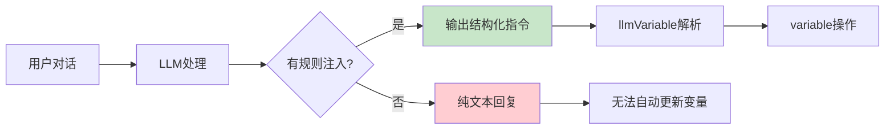
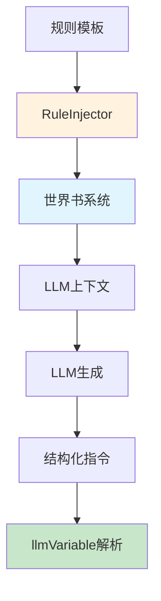

# LLMVariable 规则注入系统

> **核心职责**：通过世界书系统向LLM注入变量操作规则，引导LLM生成符合格式的结构化指令。

---

## 🎯 规则注入的作用

### 为什么需要规则注入？ ⭐⭐⭐



**规则注入的价值**：
- ✅ **引导LLM行为**：让LLM知道如何格式化变量操作指令
- ✅ **提供格式规范**：明确的语法和示例
- ✅ **增强可预测性**：结构化输出便于解析
- ✅ **安全控制**：限制LLM的操作范围

---

## 🏗️ 架构设计

### 规则注入流程 ⭐⭐⭐



### 组件关系 ⭐⭐⭐

| 组件 | 职责 | 依赖 |
|------|------|------|
| **RuleInjector** | 管理规则模板、注入逻辑 | 世界书API |
| **RuleTemplate** | 定义规则内容、示例 | 无 |
| **WorldInfoAdapter** | 平台世界书适配 | 平台原生API |

> **注意**：规则注入**不依赖** [`variable`](../variable/index.md) 模块，它只负责向LLM提供指令格式说明。

---

## 🔧 核心实现

### RuleInjector 类 ⭐⭐⭐

```typescript
class RuleInjector {
  private worldInfoAdapter: WorldInfoAdapter;
  private templates: Map<string, RuleTemplate>;
  private activeRules: Set<string>;

  constructor(worldInfoAdapter: WorldInfoAdapter) {
    this.worldInfoAdapter = worldInfoAdapter;
    this.templates = new Map();
    this.activeRules = new Set();
    
    // 加载默认规则模板
    this.loadDefaultTemplates();
  }

  /**
   * 注入规则到世界书 ⭐⭐⭐
   */
  async injectRules(rules: Rule[]): Promise<void> {
    try {
      for (const rule of rules) {
        if (!rule.enabled) continue;

        // 构建世界书条目
        const entry = this.buildWorldInfoEntry(rule);

        // 注入到世界书
        await this.worldInfoAdapter.addEntry(entry);

        // 记录激活状态
        this.activeRules.add(rule.id);
      }

      console.log(`✅ Successfully injected ${rules.length} rules`);
    } catch (error) {
      console.error('❌ Failed to inject rules:', error);
      throw error;
    }
  }

  /**
   * 获取当前激活的规则 ⭐⭐
   */
  async getActiveRules(): Promise<Rule[]> {
    const rules: Rule[] = [];

    for (const ruleId of this.activeRules) {
      const template = this.templates.get(ruleId);
      if (template) {
        rules.push({
          id: ruleId,
          template,
          enabled: true,
          priority: 100
        });
      }
    }

    return rules;
  }

  /**
   * 更新规则模板 ⭐⭐
   */
  async updateTemplate(template: RuleTemplate): Promise<void> {
    this.templates.set(template.name, template);

    // 如果规则已激活，重新注入
    if (this.activeRules.has(template.name)) {
      await this.reinjectRule(template.name);
    }
  }

  /**
   * 移除规则 ⭐⭐
   */
  async removeRule(ruleId: string): Promise<void> {
    await this.worldInfoAdapter.removeEntry(ruleId);
    this.activeRules.delete(ruleId);
  }

  /**
   * 加载默认规则模板 ⭐⭐⭐
   */
  private loadDefaultTemplates(): void {
    // 1. 基础JSON格式规则（推荐）
    this.templates.set('json_format', {
      name: 'json_format',
      version: '1.0.0',
      description: 'JSON格式变量操作指令（推荐）',
      instructions: this.getJSONFormatInstructions(),
      examples: [
        '{"op":"assign","path":["player","name"],"value":"张三","reason":"设置玩家名字"}',
        '{"op":"assign","path":["player","level"],"value":2,"old":1,"reason":"升级"}',
        '{"op":"push","path":["inventory"],"value":{"id":"sword"},"reason":"获得物品"}',
        '{"op":"callback","path":["showMessage"],"value":["恭喜升级！"]}'
      ]
    });

    // 2. MVU格式规则（兼容）
    this.templates.set('mvu_format', {
      name: 'mvu_format',
      version: '1.0.0',
      description: 'MVU格式变量操作指令（兼容）',
      instructions: this.getMVUFormatInstructions(),
      examples: [
        "_.set('player.name', null, '张三'); // 设置玩家名字",
        "_.set('player.level', 1, 2); // 玩家升级",
        "_.get('player.hp'); // 获取生命值",
        "_.push('inventory', {id: 'sword'}); // 添加物品"
      ]
    });

    // 3. 游戏系统规则
    this.templates.set('game_system', {
      name: 'game_system',
      version: '1.0.0',
      description: 'RPG游戏系统变量操作规则',
      instructions: this.getGameSystemInstructions(),
      examples: [
        '{"op":"assign","path":["player","hp"],"value":80,"old":100,"reason":"受到伤害"}',
        '{"op":"push","path":["player","inventory"],"value":{"id":"potion"},"reason":"获得药水"}',
        '{"op":"assign","path":["quests","main","status"],"value":"completed","reason":"完成任务"}'
      ]
    });
  }

  /**
   * 构建世界书条目 ⭐⭐⭐
   */
  private buildWorldInfoEntry(rule: Rule): WorldInfoEntry {
    const { template } = rule;

    return {
      id: rule.id,
      keys: [`llm_var_${template.name}`, 'variable_operations'],
      content: this.formatRuleContent(template),
      enabled: rule.enabled,
      priority: rule.priority,
      position: 'before_char',  // 在角色卡之前注入
      extensions: {
        selectiveLogic: true,
        secondaryKeys: ['变量操作', 'variable', 'set', 'get', '记录', '更新']
      }
    };
  }

  /**
   * 格式化规则内容 ⭐⭐⭐
   */
  private formatRuleContent(template: RuleTemplate): string {
    return `
# ${template.name} - ${template.description}

${template.instructions}

## 示例：

${template.examples.map((ex, i) => `${i + 1}. \`${ex}\``).join('\n')}

## 重要提示：

- **推荐使用JSON格式**：更准确、更易解析
- **必须包含reason字段**：说明操作原因
- **路径使用数组格式**：如 ["player", "hp"]
- **支持批量操作**：可以输出JSON数组
- 指令会被自动解析并执行，请确保格式正确
`.trim();
  }

  /**
   * 重新注入规则 ⭐⭐
   */
  private async reinjectRule(ruleId: string): Promise<void> {
    await this.removeRule(ruleId);
    
    const template = this.templates.get(ruleId);
    if (template) {
      await this.injectRules([{
        id: ruleId,
        template,
        enabled: true,
        priority: 100
      }]);
    }
  }

  // ========== 规则内容模板 ==========

  /**
   * JSON格式指令说明（推荐） ⭐⭐⭐
   */
  private getJSONFormatInstructions(): string {
    return `
## JSON格式变量操作指令（推荐）

当你需要记录、修改或获取变量时，请使用JSON格式：

### 基础格式

\`\`\`json
{
  "op": "操作类型",
  "path": ["路径", "数组"],
  "value": 新值,
  "old": 旧值（可选）,
  "reason": "操作原因"
}
\`\`\`

### 操作类型

1. **assign** - 赋值
   \`\`\`json
   {"op":"assign","path":["player","hp"],"value":80,"old":100}
   \`\`\`

2. **get** - 获取
   \`\`\`json
   {"op":"get","path":["player","level"]}
   \`\`\`

3. **delete** - 删除
   \`\`\`json
   {"op":"delete","path":["temp","data"]}
   \`\`\`

4. **merge** - 合并对象
   \`\`\`json
   {"op":"merge","path":["player"],"value":{"level":2,"exp":100}}
   \`\`\`

5. **push** - 数组追加
   \`\`\`json
   {"op":"push","path":["inventory"],"value":{"id":"sword"}}
   \`\`\`

6. **callback** - 触发事件
   \`\`\`json
   {"op":"callback","path":["showMessage"],"value":["恭喜升级！"]}
   \`\`\`

### 批量操作

可以使用JSON数组批量更新：

\`\`\`json
[
  {"op":"assign","path":["player","level"],"value":2},
  {"op":"assign","path":["player","hp"],"value":120}
]
\`\`\`

### 输出格式

请使用Markdown JSON代码块包裹：

\`\`\`json
{
  "op": "assign",
  "path": ["player", "name"],
  "value": "张三",
  "reason": "设置玩家名字"
}
\`\`\`
`.trim();
  }

  /**
   * MVU格式指令说明（兼容） ⭐⭐
   */
  private getMVUFormatInstructions(): string {
    return `
## MVU格式变量操作指令（兼容）

如果你熟悉JavaScript，也可以使用MVU格式：

### 设置变量
\`\`\`javascript
_.set('路径', 旧值, 新值); // 说明原因
\`\`\`

### 获取变量
\`\`\`javascript
_.get('路径');
\`\`\`

### 合并对象
\`\`\`javascript
_.merge('路径', 旧对象, 新属性);
\`\`\`

### 数组追加
\`\`\`javascript
_.push('数组路径', 新元素);
\`\`\`

### 删除变量
\`\`\`javascript
_.delete('路径');
\`\`\`

### 回调函数
\`\`\`javascript
_.callback('函数名', 参数1, 参数2, ...);
\`\`\`

### 路径格式
- 使用点号分隔层级：\`player.status.hp\`
- 路径区分大小写
- 不要使用特殊字符

### 注意事项
- 旧值用于验证（首次设置可以是 null）
- 新值可以是任何JSON可序列化的类型
- 必须添加注释说明操作原因
`.trim();
  }

  /**
   * 游戏系统规则说明 ⭐⭐⭐
   */
  private getGameSystemInstructions(): string {
    return `
## RPG游戏系统变量操作指南

你是一个RPG游戏的叙事者和系统管理员。在游戏过程中，你需要：

### 1. 角色属性管理

当玩家的属性发生变化时，使用JSON格式记录：

\`\`\`json
{"op":"assign","path":["player","hp"],"value":80,"old":100,"reason":"受到伤害"}
{"op":"assign","path":["player","mp"],"value":30,"old":50,"reason":"使用魔法"}
{"op":"assign","path":["player","level"],"value":6,"old":5,"reason":"升级"}
\`\`\`

### 2. 物品管理

添加或移除物品：

\`\`\`json
{"op":"push","path":["player","inventory"],"value":{"id":"potion","name":"生命药水","count":1},"reason":"获得物品"}
{"op":"assign","path":["player","gold"],"value":150,"old":100,"reason":"获得金币"}
\`\`\`

### 3. 任务追踪

记录任务进度：

\`\`\`json
{"op":"assign","path":["quests","main","status"],"value":"completed","old":"in_progress","reason":"完成主线任务"}
{"op":"push","path":["quests","completed"],"value":"quest_001","reason":"添加到已完成列表"}
\`\`\`

### 4. 世界状态

记录世界的变化：

\`\`\`json
{"op":"assign","path":["world","time","hour"],"value":18,"old":6,"reason":"时间推进到傍晚"}
{"op":"assign","path":["world","weather"],"value":"rainy","old":"sunny","reason":"天气变化"}
\`\`\`

### 重要规则

1. **每次属性变化都要记录**：这样系统才能追踪状态
2. **添加reason字段**：说明为什么发生这个变化
3. **提供old值**：用于验证数据一致性
4. **及时触发回调**：重要事件要通知UI更新

\`\`\`json
{"op":"callback","path":["showMessage"],"value":["恭喜你升级了！"],"reason":"显示升级消息"}
{"op":"callback","path":["onLevelUp"],"value":[{"level":6,"rewards":["skill_point"]}],"reason":"触发升级逻辑"}
\`\`\`
`.trim();
  }
}
```

---

## 🌍 世界书适配器

### WorldInfoAdapter 接口 ⭐⭐⭐

```typescript
interface WorldInfoAdapter {
  /**
   * 添加世界书条目
   */
  addEntry(entry: WorldInfoEntry): Promise<void>;

  /**
   * 移除世界书条目
   */
  removeEntry(id: string): Promise<void>;

  /**
   * 更新世界书条目
   */
  updateEntry(id: string, updates: Partial<WorldInfoEntry>): Promise<void>;

  /**
   * 获取所有条目
   */
  getAllEntries(): Promise<WorldInfoEntry[]>;

  /**
   * 搜索条目
   */
  searchEntries(query: string): Promise<WorldInfoEntry[]>;
}

interface WorldInfoEntry {
  id: string;
  keys: string[];           // 触发关键词
  content: string;          // 注入内容
  enabled: boolean;
  priority: number;
  position: 'before_char' | 'after_char' | 'before_example';
  extensions?: {
    selectiveLogic?: boolean;
    secondaryKeys?: string[];
    [key: string]: any;
  };
}
```

### 平台实现示例 ⭐⭐⭐

#### TavernHelper 实现

```typescript
class TavernHelperWorldInfoAdapter implements WorldInfoAdapter {
  async addEntry(entry: WorldInfoEntry): Promise<void> {
    // 调用 TavernHelper 的世界书 API
    await window.TavernHelper.worldInfo.add({
      uid: entry.id,
      keys: entry.keys.join(', '),
      content: entry.content,
      enabled: entry.enabled,
      priority: entry.priority,
      position: this.mapPosition(entry.position)
    });
  }

  async removeEntry(id: string): Promise<void> {
    await window.TavernHelper.worldInfo.remove(id);
  }

  async updateEntry(id: string, updates: Partial<WorldInfoEntry>): Promise<void> {
    await window.TavernHelper.worldInfo.update(id, {
      ...updates,
      keys: updates.keys?.join(', ')
    });
  }

  async getAllEntries(): Promise<WorldInfoEntry[]> {
    const entries = await window.TavernHelper.worldInfo.getAll();
    return entries.map(e => this.toStandardEntry(e));
  }

  async searchEntries(query: string): Promise<WorldInfoEntry[]> {
    const all = await this.getAllEntries();
    return all.filter(e => 
      e.content.includes(query) || 
      e.keys.some(k => k.includes(query))
    );
  }

  private mapPosition(pos: string): number {
    const map = {
      'before_char': 0,
      'after_char': 1,
      'before_example': 2
    };
    return map[pos] || 0;
  }

  private toStandardEntry(entry: any): WorldInfoEntry {
    return {
      id: entry.uid,
      keys: entry.keys.split(',').map(k => k.trim()),
      content: entry.content,
      enabled: entry.enabled,
      priority: entry.priority,
      position: ['before_char', 'after_char', 'before_example'][entry.position] as any
    };
  }
}
```

#### SillyTavern 实现

```typescript
class SillyTavernWorldInfoAdapter implements WorldInfoAdapter {
  async addEntry(entry: WorldInfoEntry): Promise<void> {
    // 调用 SillyTavern 的世界书 API
    await window.SillyTavern.worldInfo.createEntry({
      uid: entry.id,
      key: entry.keys,
      content: entry.content,
      enabled: entry.enabled,
      order: entry.priority,
      position: this.mapPosition(entry.position)
    });
  }

  async removeEntry(id: string): Promise<void> {
    await window.SillyTavern.worldInfo.deleteEntry(id);
  }

  async updateEntry(id: string, updates: Partial<WorldInfoEntry>): Promise<void> {
    await window.SillyTavern.worldInfo.updateEntry(id, updates);
  }

  async getAllEntries(): Promise<WorldInfoEntry[]> {
    const entries = await window.SillyTavern.worldInfo.getAllEntries();
    return entries.map(e => this.toStandardEntry(e));
  }

  async searchEntries(query: string): Promise<WorldInfoEntry[]> {
    // SillyTavern可能有原生搜索API
    const all = await this.getAllEntries();
    return all.filter(e => 
      e.content.includes(query) || 
      e.keys.some(k => k.includes(query))
    );
  }

  private mapPosition(pos: string): number {
    const map = {
      'before_char': 0,
      'after_char': 1,
      'before_example': 3
    };
    return map[pos] || 0;
  }

  private toStandardEntry(entry: any): WorldInfoEntry {
    return {
      id: entry.uid,
      keys: Array.isArray(entry.key) ? entry.key : [entry.key],
      content: entry.content,
      enabled: entry.enabled,
      priority: entry.order,
      position: this.reverseMapPosition(entry.position)
    };
  }

  private reverseMapPosition(pos: number): 'before_char' | 'after_char' | 'before_example' {
    const map = ['before_char', 'after_char', 'before_example'];
    return map[pos] as any || 'before_char';
  }
}
```

---

## 📝 规则模板示例

### 完整的游戏系统规则 ⭐⭐⭐

```typescript
const gameSystemRule: RuleTemplate = {
  name: 'game_system',
  version: '1.0.0',
  description: 'RPG游戏系统变量操作规则',
  instructions: `
# RPG游戏系统变量操作指南

你是一个RPG游戏的叙事者和系统管理员。在游戏过程中，你需要：

## 1. 角色属性管理

当玩家的属性发生变化时，使用以下格式记录：

\`\`\`json
{"op":"assign","path":["player","hp"],"value":80,"old":100,"reason":"受到20点伤害"}
{"op":"assign","path":["player","mp"],"value":30,"old":50,"reason":"使用了20点魔法"}
{"op":"assign","path":["player","level"],"value":6,"old":5,"reason":"升级到6级"}
\`\`\`

## 2. 物品管理

添加或移除物品：

\`\`\`json
{"op":"push","path":["player","inventory"],"value":{"id":"potion","name":"生命药水","count":1},"reason":"获得物品"}
{"op":"assign","path":["player","gold"],"value":150,"old":100,"reason":"获得金币"}
\`\`\`

## 3. 任务追踪

记录任务进度：

\`\`\`json
{"op":"assign","path":["quests","main","status"],"value":"completed","old":"in_progress","reason":"完成主线任务"}
{"op":"push","path":["quests","completed"],"value":"quest_001","reason":"添加到已完成列表"}
\`\`\`

## 4. 世界状态

记录世界的变化：

\`\`\`json
{"op":"assign","path":["world","time","hour"],"value":18,"old":6,"reason":"时间推进到傍晚"}
{"op":"assign","path":["world","weather"],"value":"rainy","old":"sunny","reason":"天气变化"}
\`\`\`

## 重要规则

1. **每次属性变化都要记录**：这样系统才能追踪状态
2. **注释要清晰**：reason字段说明为什么发生变化
3. **提供old值**：用于验证数据一致性
4. **及时触发回调**：重要事件要通知UI更新

\`\`\`json
{"op":"callback","path":["showMessage"],"value":["恭喜你升级了！"]}
{"op":"callback","path":["onLevelUp"],"value":[{"level":6,"rewards":["skill_point"]}]}
\`\`\`
`,
  examples: [
    '{"op":"assign","path":["player","hp"],"value":80,"old":100,"reason":"受到伤害"}',
    '{"op":"push","path":["player","inventory"],"value":{"id":"sword","name":"铁剑"},"reason":"获得武器"}',
    '{"op":"assign","path":["quests","main","progress"],"value":75,"old":50,"reason":"任务进度更新"}',
    '{"op":"callback","path":["showMessage"],"value":["你发现了一个宝箱！"],"reason":"提示消息"}',
    '{"op":"merge","path":["player","stats"],"value":{"strength":12,"agility":8},"reason":"属性成长"}'
  ]
};
```

---

## 🎮 使用示例

### 基础使用 ⭐⭐⭐

```typescript
// 1. 创建适配器
const adapter = await createWorldInfoAdapter();

// 2. 创建规则注入器
const ruleInjector = new RuleInjector(adapter);

// 3. 注入默认规则
await ruleInjector.injectRules([
  {
    id: 'json_format',
    template: ruleInjector.templates.get('json_format')!,
    enabled: true,
    priority: 100
  },
  {
    id: 'game_system',
    template: ruleInjector.templates.get('game_system')!,
    enabled: true,
    priority: 90
  }
]);

console.log('✅ 规则注入完成！LLM现在可以理解并生成变量操作指令');
```

### 自定义规则 ⭐⭐

```typescript
// 创建自定义规则模板
const customTemplate: RuleTemplate = {
  name: 'inventory_system',
  version: '1.0.0',
  description: '物品栏管理规则',
  instructions: `
# 物品栏管理

使用JSON格式管理物品：

## 添加物品
\`\`\`json
{"op":"push","path":["player","inventory"],"value":{"id":"item_id","name":"物品名","count":1},"reason":"获得物品"}
\`\`\`

## 修改物品数量
\`\`\`json
{"op":"assign","path":["player","inventory",0,"count"],"value":5,"old":1,"reason":"物品数量变化"}
\`\`\`
  `.trim(),
  examples: [
    '{"op":"push","path":["player","inventory"],"value":{"id":"potion","count":1},"reason":"获得药水"}'
  ]
};

// 更新模板
await ruleInjector.updateTemplate(customTemplate);

// 注入规则
await ruleInjector.injectRules([{
  id: 'inventory_system',
  template: customTemplate,
  enabled: true,
  priority: 90
}]);
```

### 动态启用/禁用规则 ⭐⭐

```typescript
class GameRuleManager {
  private ruleInjector: RuleInjector;

  async onGameStart() {
    // 游戏开始时注入基础规则
    await this.ruleInjector.injectRules([
      { id: 'json_format', enabled: true, priority: 100 },
      { id: 'game_system', enabled: true, priority: 90 }
    ]);
  }

  async onEnterCombat() {
    // 进入战斗时添加战斗规则
    const combatTemplate: RuleTemplate = {
      name: 'combat_system',
      version: '1.0.0',
      description: '战斗系统规则',
      instructions: '战斗时记录伤害、技能使用等...',
      examples: [
        '{"op":"assign","path":["player","hp"],"value":50,"old":100,"reason":"受到攻击"}'
      ]
    };
    
    await this.ruleInjector.updateTemplate(combatTemplate);
    await this.ruleInjector.injectRules([
      { id: 'combat_system', enabled: true, priority: 110 }
    ]);
  }

  async onLeaveCombat() {
    // 离开战斗时移除战斗规则
    await this.ruleInjector.removeRule('combat_system');
  }
}
```

---

## 🔍 规则优先级策略

### 优先级设置 ⭐⭐

```typescript
// 优先级范围：0-1000，数字越大优先级越高

const rulePriorities = {
  // 核心规则（最高优先级）
  CORE: 100,
  
  // 系统规则
  SYSTEM: 80-90,
  
  // 游戏逻辑规则
  GAMEPLAY: 60-70,
  
  // 辅助规则
  HELPER: 40-50,
  
  // 可选规则（最低优先级）
  OPTIONAL: 20-30
};

// 示例
await ruleInjector.injectRules([
  { 
    id: 'json_format', 
    priority: rulePriorities.CORE,  // 100
    enabled: true 
  },
  { 
    id: 'game_system', 
    priority: rulePriorities.SYSTEM,  // 85
    enabled: true 
  },
  { 
    id: 'combat', 
    priority: rulePriorities.GAMEPLAY,  // 65
    enabled: true 
  }
]);
```

### 规则冲突处理 ⭐⭐

```typescript
class RuleConflictResolver {
  /**
   * 检测规则冲突
   */
  detectConflicts(rules: Rule[]): ConflictReport {
    const conflicts: Conflict[] = [];

    for (let i = 0; i < rules.length; i++) {
      for (let j = i + 1; j < rules.length; j++) {
        const conflict = this.checkRuleConflict(rules[i], rules[j]);
        if (conflict) {
          conflicts.push(conflict);
        }
      }
    }

    return { conflicts, hasConflict: conflicts.length > 0 };
  }

  /**
   * 解决冲突
   */
  resolveConflicts(conflicts: Conflict[]): Resolution[] {
    return conflicts.map(conflict => {
      // 优先级高的规则保留
      const winner = conflict.rule1.priority > conflict.rule2.priority 
        ? conflict.rule1 
        : conflict.rule2;

      return {
        conflict,
        resolution: 'keep_higher_priority',
        keepRule: winner.id
      };
    });
  }

  private checkRuleConflict(rule1: Rule, rule2: Rule): Conflict | null {
    // 检查是否有相同的触发关键词
    const commonKeys = rule1.template.examples.filter(ex => 
      rule2.template.examples.includes(ex)
    );

    if (commonKeys.length > 0) {
      return {
        rule1,
        rule2,
        reason: 'Common trigger keywords',
        commonKeys
      };
    }

    return null;
  }
}
```

---

## ⚠️ 最佳实践

### 规则设计原则 ⭐⭐⭐

1. **清晰简洁**
   ```typescript
   ✅ 好的规则：简短、明确、有示例
   ❌ 差的规则：冗长、模糊、缺少示例
   ```

2. **渐进式引导**
   ```typescript
   // 从简单到复杂
   Level 1: 基础 JSON 格式
   Level 2: 高级操作（merge/push）
   Level 3: callback 和事件系统
   ```

3. **情境化规则**
   ```typescript
   // 根据场景注入不同规则
   if (inCombat) {
     injectCombatRules();
   } else if (inDialogue) {
     injectDialogueRules();
   }
   ```

### 性能优化 ⭐⭐

```typescript
// 1. 延迟加载规则
class LazyRuleInjector extends RuleInjector {
  private ruleCache: Map<string, Rule> = new Map();

  async injectOnDemand(ruleId: string): Promise<void> {
    if (this.ruleCache.has(ruleId)) {
      await this.injectRules([this.ruleCache.get(ruleId)!]);
    } else {
      const rule = await this.loadRule(ruleId);
      this.ruleCache.set(ruleId, rule);
      await this.injectRules([rule]);
    }
  }
}

// 2. 批量操作
async injectMultiple(ruleIds: string[]): Promise<void> {
  const rules = ruleIds.map(id => this.templates.get(id));
  await this.ruleInjector.injectRules(
    rules.filter(r => r !== undefined) as Rule[]
  );
}
```

---

## 📊 监控与调试

### 规则注入监控 ⭐⭐

```typescript
class RuleInjectionMonitor {
  private metrics: InjectionMetrics = {
    totalInjections: 0,
    successCount: 0,
    failureCount: 0,
    averageTime: 0
  };

  async monitorInjection(
    injector: RuleInjector, 
    rules: Rule[]
  ): Promise<void> {
    const startTime = performance.now();

    try {
      await injector.injectRules(rules);
      
      this.metrics.successCount++;
      this.updateMetrics(performance.now() - startTime);
      
      console.log('✅ Rule injection successful', {
        rules: rules.map(r => r.id),
        duration: performance.now() - startTime
      });
    } catch (error) {
      this.metrics.failureCount++;
      
      console.error('❌ Rule injection failed', {
        rules: rules.map(r => r.id),
        error: error.message
      });
      
      throw error;
    } finally {
      this.metrics.totalInjections++;
    }
  }

  getMetrics(): InjectionMetrics {
    return { ...this.metrics };
  }

  private updateMetrics(duration: number): void {
    this.metrics.averageTime = 
      (this.metrics.averageTime * (this.metrics.successCount - 1) + duration) / 
      this.metrics.successCount;
  }
}
```

---

## 📚 相关文档

- **包装层实现**：[`wrapper.md`](./wrapper.md) - 指令解析与执行
- **平台特性分析**：[`platform.md`](./platform.md) - 世界书系统详解
- **应用层集成**：[`application.md`](./application.md) - 前端集成指南
- **Variable模块**：[`../variable/index.md`](../variable/index.md) - 底层变量操作

---

> **设计要点**：
> 1. ✅ **平台无关**：通过适配器支持不同平台的世界书系统
> 2. ✅ **规则复用**：模板化设计，便于规则管理和共享
> 3. ✅ **动态调整**：根据场景动态启用/禁用规则
> 4. ✅ **性能优化**：延迟加载、批量操作、缓存机制
> 5. ✅ **JSON优先**：推荐使用JSON格式作为黄金标准