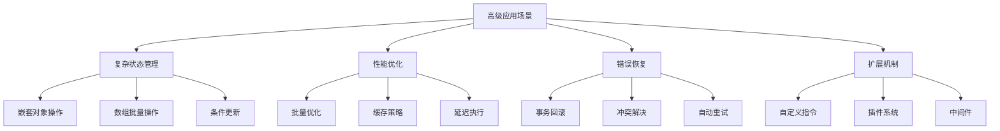

# LLMVariable 高级应用实现

> **本文档**：探讨 `CharacterAPI.llmVariable` 的高级用法、复杂场景处理和性能优化策略。

---

## 🎯 高级特性概览

### 复杂场景支持



---

## 🔧 高级状态管理

### 1. 深度嵌套对象操作

```typescript
class AdvancedLLMVariableManager extends LLMVariableManager {
  /**
   * 支持更复杂的路径表达式
   */
  async setNested(path: string, value: any, options?: {
    createPath?: boolean;  // 自动创建不存在的路径
    merge?: boolean;       // 是否合并
  }): Promise<OperationResult> {
    const keys = path.split('.');
    const parentPath = keys.slice(0, -1).join('.');
    const finalKey = keys[keys.length - 1];
    
    // 获取父对象
    let parent = await this.variableManager.get(parentPath);
    
    // 如果父对象不存在且需要创建
    if (!parent.success && options?.createPath) {
      parent = await this.createPath(parentPath);
    }
    
    // 执行更新
    if (parent.success) {
      const newParent = {
        ...parent.data,
        [finalKey]: options?.merge 
          ? { ...parent.data?.[finalKey], ...value }
          : value
      };
      
      return await this.variableManager.update(
        this.pathToObject(parentPath, newParent)
      );
    }
    
    throw new Error(`Parent path ${parentPath} does not exist`);
  }

  /**
   * 创建完整路径
   */
  private async createPath(path: string): Promise<VariableResult> {
    const keys = path.split('.');
    let currentPath = '';
    
    for (const key of keys) {
      currentPath = currentPath ? `${currentPath}.${key}` : key;
      
      const exists = await this.variableManager.get(currentPath);
      if (!exists.success) {
        await this.variableManager.update(
          this.pathToObject(currentPath, {})
        );
      }
    }
    
    return await this.variableManager.get(path);
  }
}
```

### 2. 数组高级操作

```typescript
interface ArrayOperations {
  /**
   * 按条件查找并更新数组元素
   */
  updateWhere(
    arrayPath: string,
    condition: (item: any) => boolean,
    updates: any
  ): Promise<OperationResult>;

  /**
   * 按条件删除数组元素
   */
  removeWhere(
    arrayPath: string,
    condition: (item: any) => boolean
  ): Promise<OperationResult>;

  /**
   * 数组去重
   */
  unique(
    arrayPath: string,
    keyFn?: (item: any) => any
  ): Promise<OperationResult>;
}

class ArrayOperationsMixin {
  async updateWhere(
    arrayPath: string,
    condition: (item: any) => boolean,
    updates: any
  ): Promise<OperationResult> {
    const result = await this.variableManager.get(arrayPath);
    
    if (result.success && Array.isArray(result.data)) {
      const updated = result.data.map(item => 
        condition(item) ? { ...item, ...updates } : item
      );
      
      return await this.variableManager.update(
        this.pathToObject(arrayPath, updated)
      );
    }
    
    throw new Error('Target is not an array');
  }

  async removeWhere(
    arrayPath: string,
    condition: (item: any) => boolean
  ): Promise<OperationResult> {
    const result = await this.variableManager.get(arrayPath);
    
    if (result.success && Array.isArray(result.data)) {
      const filtered = result.data.filter(item => !condition(item));
      
      return await this.variableManager.update(
        this.pathToObject(arrayPath, filtered)
      );
    }
    
    throw new Error('Target is not an array');
  }
}

// 使用示例
const llmVar = new AdvancedLLMVariableManager(variableManager);

// 更新物品栏中特定物品
await llmVar.updateWhere(
  'player.inventory',
  item => item.id === 'sword',
  { durability: 50 }
);

// 删除已使用的消耗品
await llmVar.removeWhere(
  'player.inventory',
  item => item.type === 'consumable' && item.count === 0
);
```

### 3. 条件更新与验证

```typescript
interface ConditionalUpdate {
  path: string;
  condition: (current: any) => boolean;
  value: any;
  fallback?: any;
}

class ConditionalUpdateManager {
  /**
   * 仅当条件满足时更新
   */
  async updateIf(updates: ConditionalUpdate[]): Promise<OperationResult[]> {
    const results: OperationResult[] = [];
    
    for (const update of updates) {
      const current = await this.variableManager.get(update.path);
      
      if (current.success && update.condition(current.data)) {
        // 条件满足，执行更新
        const result = await this.variableManager.update(
          this.pathToObject(update.path, update.value)
        );
        results.push(result);
      } else if (update.fallback !== undefined) {
        // 条件不满足，执行fallback
        const result = await this.variableManager.update(
          this.pathToObject(update.path, update.fallback)
        );
        results.push(result);
      } else {
        // 跳过更新
        results.push({
          success: false,
          error: 'Condition not met',
          metadata: {
            scope: VariableScope.CHARACTER,
            timestamp: Date.now(),
            operation: 'set',
            affectedKeys: [update.path]
          }
        });
      }
    }
    
    return results;
  }
}

// 使用示例
await manager.updateIf([
  {
    path: 'player.hp',
    condition: (hp) => hp > 0,  // 只有活着才能恢复
    value: 100,
    fallback: 0
  },
  {
    path: 'player.level',
    condition: (level) => level < 99,  // 等级上限
    value: level + 1
  }
]);
```

---

## ⚡ 性能优化

### 1. 批量操作优化

```typescript
class BatchOptimizer {
  private pendingOperations: VariableOperation[] = [];
  private batchTimer: NodeJS.Timeout | null = null;
  private readonly BATCH_DELAY = 100; // ms

  /**
   * 添加操作到批处理队列
   */
  queueOperation(operation: VariableOperation): void {
    this.pendingOperations.push(operation);
    
    // 延迟执行批处理
    if (this.batchTimer) {
      clearTimeout(this.batchTimer);
    }
    
    this.batchTimer = setTimeout(() => {
      this.executeBatch();
    }, this.BATCH_DELAY);
  }

  /**
   * 执行批处理
   */
  private async executeBatch(): Promise<void> {
    if (this.pendingOperations.length === 0) return;
    
    const operations = [...this.pendingOperations];
    this.pendingOperations = [];
    
    try {
      // 合并相同路径的操作
      const merged = this.mergeOperations(operations);
      
      // 批量执行
      await this.variableManager.batch(merged);
      
      console.log(`Batch executed: ${merged.length} operations`);
    } catch (error) {
      console.error('Batch execution failed:', error);
    }
  }

  /**
   * 合并相同路径的操作
   */
  private mergeOperations(operations: VariableOperation[]): VariableOperation[] {
    const merged = new Map<string, VariableOperation>();
    
    for (const op of operations) {
      const existing = merged.get(op.key);
      
      if (existing && existing.type === 'set' && op.type === 'set') {
        // 合并set操作，保留最新值
        existing.value = op.value;
      } else {
        merged.set(op.key, op);
      }
    }
    
    return Array.from(merged.values());
  }
}

// 使用示例
const optimizer = new BatchOptimizer(variableManager);

// 多个快速的更新会被自动合并
optimizer.queueOperation({ type: 'set', key: 'player.hp', value: 90 });
optimizer.queueOperation({ type: 'set', key: 'player.hp', value: 80 });
optimizer.queueOperation({ type: 'set', key: 'player.hp', value: 70 });
// 最终只执行一次：set player.hp = 70
```

### 2. 智能缓存

```typescript
class CachedLLMVariableManager {
  private cache: Map<string, CacheEntry> = new Map();
  private readonly CACHE_TTL = 5000; // 5秒

  async get(path: string): Promise<any> {
    // 检查缓存
    const cached = this.cache.get(path);
    if (cached && Date.now() - cached.timestamp < this.CACHE_TTL) {
      return cached.value;
    }
    
    // 从variable模块获取
    const result = await this.variableManager.get(path);
    
    // 更新缓存
    if (result.success) {
      this.cache.set(path, {
        value: result.data,
        timestamp: Date.now()
      });
    }
    
    return result.data;
  }

  async set(path: string, value: any): Promise<void> {
    // 更新变量
    await this.variableManager.update(
      this.pathToObject(path, value)
    );
    
    // 清除相关缓存
    this.invalidateCache(path);
  }

  private invalidateCache(path: string): void {
    // 清除精确匹配
    this.cache.delete(path);
    
    // 清除父路径（因为父对象也变了）
    const parts = path.split('.');
    for (let i = parts.length - 1; i > 0; i--) {
      const parentPath = parts.slice(0, i).join('.');
      this.cache.delete(parentPath);
    }
  }
}
```

### 3. 延迟执行与节流

```typescript
class ThrottledLLMVariable {
  private throttleTimers: Map<string, NodeJS.Timeout> = new Map();

  /**
   * 节流更新：一定时间内只执行一次
   */
  async throttleUpdate(
    path: string,
    value: any,
    delay: number = 1000
  ): Promise<void> {
    const existing = this.throttleTimers.get(path);
    
    if (existing) {
      // 已有待执行的更新，跳过
      return;
    }
    
    const timer = setTimeout(async () => {
      await this.variableManager.update(
        this.pathToObject(path, value)
      );
      this.throttleTimers.delete(path);
    }, delay);
    
    this.throttleTimers.set(path, timer);
  }

  /**
   * 防抖更新：等待一段时间无新更新后才执行
   */
  async debounceUpdate(
    path: string,
    value: any,
    delay: number = 500
  ): Promise<void> {
    const existing = this.throttleTimers.get(path);
    
    if (existing) {
      clearTimeout(existing);
    }
    
    const timer = setTimeout(async () => {
      await this.variableManager.update(
        this.pathToObject(path, value)
      );
      this.throttleTimers.delete(path);
    }, delay);
    
    this.throttleTimers.set(path, timer);
  }
}

// 使用场景：实时搜索
searchInput.addEventListener('input', async (e) => {
  // 防抖：只在用户停止输入500ms后更新
  await throttledLLM.debounceUpdate(
    'search.query',
    e.target.value,
    500
  );
});
```

---

## 🛡️ 错误恢复与事务

### 1. 事务支持

```typescript
class TransactionalLLMVariable {
  private transactions: Map<string, Transaction> = new Map();

  /**
   * 开始事务
   */
  async beginTransaction(id: string): Promise<void> {
    // 保存当前状态
    const snapshot = await this.createSnapshot();
    
    this.transactions.set(id, {
      id,
      snapshot,
      operations: [],
      startTime: Date.now()
    });
  }

  /**
   * 在事务中执行操作
   */
  async executeInTransaction(
    transactionId: string,
    operation: VariableOperation
  ): Promise<void> {
    const tx = this.transactions.get(transactionId);
    if (!tx) throw new Error('Transaction not found');
    
    try {
      // 执行操作
      await this.variableManager.batch([operation]);
      
      // 记录操作
      tx.operations.push(operation);
    } catch (error) {
      // 操作失败，回滚整个事务
      await this.rollback(transactionId);
      throw error;
    }
  }

  /**
   * 提交事务
   */
  async commit(transactionId: string): Promise<void> {
    const tx = this.transactions.get(transactionId);
    if (!tx) throw new Error('Transaction not found');
    
    // 触发事件
    CharacterAPI.events.emit('llm:transaction:committed', {
      transactionId,
      operations: tx.operations,
      duration: Date.now() - tx.startTime
    });
    
    // 清理事务
    this.transactions.delete(transactionId);
  }

  /**
   * 回滚事务
   */
  async rollback(transactionId: string): Promise<void> {
    const tx = this.transactions.get(transactionId);
    if (!tx) throw new Error('Transaction not found');
    
    // 恢复快照
    await this.restoreSnapshot(tx.snapshot);
    
    // 触发事件
    CharacterAPI.events.emit('llm:transaction:rollback', {
      transactionId,
      operations: tx.operations
    });
    
    // 清理事务
    this.transactions.delete(transactionId);
  }

  /**
   * 创建状态快照
   */
  private async createSnapshot(): Promise<Snapshot> {
    const allVars = await this.variableManager.get(['player', 'game', 'world']);
    return {
      timestamp: Date.now(),
      data: allVars.data
    };
  }

  /**
   * 恢复快照
   */
  private async restoreSnapshot(snapshot: Snapshot): Promise<void> {
    await this.variableManager.update(snapshot.data);
  }
}

// 使用示例
const txLLM = new TransactionalLLMVariable(variableManager);

try {
  await txLLM.beginTransaction('battle-001');
  
  // 执行一系列操作
  await txLLM.executeInTransaction('battle-001', {
    type: 'set',
    key: 'player.hp',
    value: 50
  });
  
  await txLLM.executeInTransaction('battle-001', {
    type: 'set',
    key: 'enemy.hp',
    value: 0
  });
  
  // 如果所有操作成功，提交
  await txLLM.commit('battle-001');
} catch (error) {
  // 发生错误，自动回滚
  console.error('Battle failed, rolling back:', error);
}
```

### 2. 冲突检测与解决

```typescript
class ConflictResolver {
  /**
   * 检测并解决变量冲突
   */
  async resolveConflict(
    path: string,
    ourValue: any,
    theirValue: any,
    strategy: ConflictStrategy = 'ours'
  ): Promise<any> {
    switch (strategy) {
      case 'ours':
        return ourValue;
      
      case 'theirs':
        return theirValue;
      
      case 'merge':
        if (typeof ourValue === 'object' && typeof theirValue === 'object') {
          return { ...ourValue, ...theirValue };
        }
        return theirValue;
      
      case 'manual':
        // 触发UI让用户选择
        return await this.promptUser(path, ourValue, theirValue);
      
      case 'timestamp':
        // 保留最新的
        const ourTime = ourValue._timestamp || 0;
        const theirTime = theirValue._timestamp || 0;
        return ourTime > theirTime ? ourValue : theirValue;
      
      default:
        return ourValue;
    }
  }

  private async promptUser(
    path: string,
    ourValue: any,
    theirValue: any
  ): Promise<any> {
    return new Promise((resolve) => {
      CharacterAPI.events.emit('llm:conflict:prompt', {
        path,
        ourValue,
        theirValue,
        resolve
      });
    });
  }
}

type ConflictStrategy = 'ours' | 'theirs' | 'merge' | 'manual' | 'timestamp';
```

---

## 🔌 扩展机制

### 1. 自定义指令

```typescript
interface CustomInstruction {
  name: string;
  handler: (args: any[]) => Promise<any>;
  validator?: (args: any[]) => boolean;
}

class CustomInstructionRegistry {
  private instructions: Map<string, CustomInstruction> = new Map();

  /**
   * 注册自定义指令
   */
  register(instruction: CustomInstruction): void {
    this.instructions.set(instruction.name, instruction);
  }

  /**
   * 执行自定义指令
   */
  async execute(name: string, args: any[]): Promise<any> {
    const instruction = this.instructions.get(name);
    
    if (!instruction) {
      throw new Error(`Unknown instruction: ${name}`);
    }
    
    // 验证参数
    if (instruction.validator && !instruction.validator(args)) {
      throw new Error(`Invalid arguments for ${name}`);
    }
    
    // 执行处理器
    return await instruction.handler(args);
  }
}

// 使用示例
const registry = new CustomInstructionRegistry();

// 注册自定义指令：增加经验值
registry.register({
  name: 'addExp',
  handler: async ([amount]) => {
    const player = await CharacterAPI.variable.get('player');
    const newExp = player.data.exp + amount;
    const newLevel = Math.floor(newExp / 100) + 1;
    
    await CharacterAPI.variable.update({
      player: {
        exp: newExp,
        level: newLevel
      }
    });
    
    if (newLevel > player.data.level) {
      CharacterAPI.events.emit('player:levelup', { level: newLevel });
    }
  },
  validator: ([amount]) => typeof amount === 'number' && amount > 0
});

// LLM可以使用：
// _.custom('addExp', 50); // 增加50经验值
```

### 2. 中间件系统

```typescript
type Middleware = (
  operation: VariableOperation,
  next: () => Promise<any>
) => Promise<any>;

class MiddlewareManager {
  private middlewares: Middleware[] = [];

  /**
   * 添加中间件
   */
  use(middleware: Middleware): void {
    this.middlewares.push(middleware);
  }

  /**
   * 执行中间件链
   */
  async execute(operation: VariableOperation): Promise<any> {
    let index = 0;
    
    const next = async (): Promise<any> => {
      if (index >= this.middlewares.length) {
        // 所有中间件执行完毕，执行实际操作
        return await this.executeOperation(operation);
      }
      
      const middleware = this.middlewares[index++];
      return await middleware(operation, next);
    };
    
    return await next();
  }

  private async executeOperation(operation: VariableOperation): Promise<any> {
    // 实际的操作执行
    return await this.variableManager.batch([operation]);
  }
}

// 使用示例
const middlewares = new MiddlewareManager();

// 日志中间件
middlewares.use(async (operation, next) => {
  console.log('Before:', operation);
  const result = await next();
  console.log('After:', result);
  return result;
});

// 验证中间件
middlewares.use(async (operation, next) => {
  if (operation.type === 'set' && operation.value < 0) {
    throw new Error('Negative values not allowed');
  }
  return await next();
});

// 缓存中间件
middlewares.use(async (operation, next) => {
  const cacheKey = `${operation.type}:${operation.key}`;
  const cached = cache.get(cacheKey);
  
  if (cached) {
    return cached;
  }
  
  const result = await next();
  cache.set(cacheKey, result);
  return result;
});
```

---

## 📊 监控与分析

### 性能分析器

```typescript
class PerformanceAnalyzer {
  private metrics: PerformanceMetric[] = [];

  /**
   * 记录操作性能
   */
  async measure<T>(
    name: string,
    fn: () => Promise<T>
  ): Promise<T> {
    const start = performance.now();
    const startMemory = performance.memory?.usedJSHeapSize;
    
    try {
      const result = await fn();
      
      const duration = performance.now() - start;
      const memoryDelta = startMemory 
        ? performance.memory.usedJSHeapSize - startMemory 
        : 0;
      
      this.metrics.push({
        name,
        duration,
        memoryDelta,
        timestamp: Date.now(),
        success: true
      });
      
      return result;
    } catch (error) {
      this.metrics.push({
        name,
        duration: performance.now() - start,
        timestamp: Date.now(),
        success: false,
        error: error.message
      });
      
      throw error;
    }
  }

  /**
   * 生成性能报告
   */
  generateReport(): PerformanceReport {
    const byName = new Map<string, PerformanceMetric[]>();
    
    for (const metric of this.metrics) {
      if (!byName.has(metric.name)) {
        byName.set(metric.name, []);
      }
      byName.get(metric.name)!.push(metric);
    }
    
    const report: PerformanceReport = {
      operations: []
    };
    
    for (const [name, metrics] of byName) {
      const durations = metrics.map(m => m.duration);
      const successCount = metrics.filter(m => m.success).length;
      
      report.operations.push({
        name,
        count: metrics.length,
        successRate: successCount / metrics.length,
        avgDuration: durations.reduce((a, b) => a + b, 0) / durations.length,
        minDuration: Math.min(...durations),
        maxDuration: Math.max(...durations)
      });
    }
    
    return report;
  }
}

// 使用示例
const analyzer = new PerformanceAnalyzer();

await analyzer.measure('parse_llm_output', async () => {
  return await llmVariable.parse(llmOutput);
});

await analyzer.measure('batch_update', async () => {
  return await llmVariable.batch(operations);
});

// 生成报告
const report = analyzer.generateReport();
console.log('Performance Report:', report);
```

---

## 📚 相关文档

- **包装层实现**：[`wrapper.md`](./wrapper.md) - 核心解析逻辑
- **规则注入**：[`adapter.md`](./adapter.md) - 规则管理
- **应用集成**：[`application.md`](./application.md) - 基础集成指南
- **Variable高级应用**：[`../variable/advanced-application.md`](../variable/advanced-application.md)

---

> **高级应用要点**：
> 1. ✅ **性能优先**：批量、缓存、节流等优化策略
> 2. ✅ **健壮性**：事务、冲突解决、错误恢复
> 3. ✅ **可扩展**：中间件、自定义指令、插件系统
> 4. ✅ **可观测**：完善的监控和性能分析