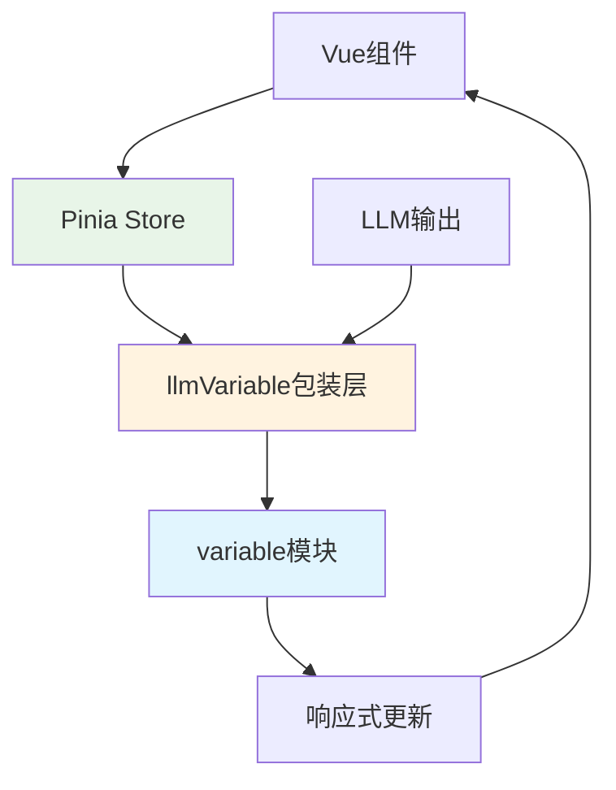

# LLMVariable 应用层集成

> **核心目标**：将 `CharacterAPI.llmVariable` 集成到前端应用，实现响应式状态管理和UI自动更新。

---

## 🎯 集成概览

### 集成架构



**关键点**：
- ✅ 通过Pinia Store管理LLM变量状态
- ✅ 自动解析LLM输出并更新状态
- ✅ 响应式UI更新
- ✅ 完整的错误处理和日志

---

## 🔧 Pinia Store 实现

### 基础Store

```typescript
import { defineStore } from 'pinia';
import { ref, computed, watch } from 'vue';

export const useLLMVariableStore = defineStore('llmVariable', () => {
  // ========== 状态 ==========
  
  // LLM变量数据（通过variable模块获取）
  const variables = ref<Record<string, any>>({});
  
  // 解析历史
  const parseHistory = ref<ParseResult[]>([]);
  
  // 统计信息
  const stats = ref<ParseStats>({
    totalParsed: 0,
    totalOperations: 0,
    successRate: 0,
    operationTypes: {},
    averageParseTime: 0
  });
  
  // 加载状态
  const loading = ref(false);
  const error = ref<string | null>(null);

  // ========== 计算属性 ==========
  
  // 获取特定变量
  const getVariable = computed(() => {
    return (path: string) => {
      const keys = path.split('.');
      let value = variables.value;
      
      for (const key of keys) {
        if (value && typeof value === 'object' && key in value) {
          value = value[key];
        } else {
          return undefined;
        }
      }
      
      return value;
    };
  });
  
  // 最近的解析结果
  const recentParses = computed(() => {
    return parseHistory.value.slice(-10);
  });
  
  // 成功率
  const successRate = computed(() => {
    return stats.value.successRate * 100;
  });

  // ========== 方法 ==========
  
  /**
   * 解析LLM输出
   */
  async function parseLLMOutput(output: string): Promise<ParseResult> {
    loading.value = true;
    error.value = null;
    
    try {
      // 调用 llmVariable 解析
      const result = await CharacterAPI.llmVariable.parse(output);
      
      // 记录历史
      parseHistory.value.push(result);
      
      // 更新统计
      stats.value = CharacterAPI.llmVariable.getStats();
      
      // 刷新变量数据
      await refreshVariables();
      
      return result;
    } catch (err) {
      error.value = err.message;
      throw err;
    } finally {
      loading.value = false;
    }
  }
  
  /**
   * 刷新变量数据
   */
  async function refreshVariables(): Promise<void> {
    try {
      // 从 variable 模块获取所有变量
      const result = await CharacterAPI.variable.get(['player', 'game', 'world']);
      
      if (result.success) {
        variables.value = result.data;
      }
    } catch (err) {
      console.error('Failed to refresh variables:', err);
    }
  }
  
  /**
   * 注册回调函数
   */
  function registerCallback(name: string, callback: Function): void {
    CharacterAPI.llmVariable.registerCallback(name, callback);
  }
  
  /**
   * 设置初始化规则
   */
  async function setInitRules(rules: InitRule[]): Promise<void> {
    await CharacterAPI.llmVariable.setInitRules(rules);
  }
  
  /**
   * 执行初始化
   */
  async function initialize(): Promise<InitResult> {
    loading.value = true;
    
    try {
      const result = await CharacterAPI.llmVariable.initialize();
      await refreshVariables();
      return result;
    } finally {
      loading.value = false;
    }
  }
  
  /**
   * 清除历史记录
   */
  function clearHistory(): void {
    parseHistory.value = [];
  }

  // ========== 监听事件 ==========
  
  // 监听变量变化事件
  CharacterAPI.events.on('state:changed', (payload) => {
    // 自动刷新受影响的变量
    refreshVariables();
  });
  
  // 监听指令执行事件
  CharacterAPI.events.on('llm:instruction:executed', (payload) => {
    console.log('Instruction executed:', payload);
  });

  return {
    // 状态
    variables,
    parseHistory,
    stats,
    loading,
    error,
    
    // 计算属性
    getVariable,
    recentParses,
    successRate,
    
    // 方法
    parseLLMOutput,
    refreshVariables,
    registerCallback,
    setInitRules,
    initialize,
    clearHistory
  };
});
```

---

## 🎨 Vue组件示例

### 1. 基础变量显示

```vue
<template>
  <div class="llm-variable-viewer">
    <h2>游戏状态</h2>
    
    <!-- 玩家信息 -->
    <div class="player-info">
      <h3>玩家</h3>
      <p>名字: {{ player?.name || '未命名' }}</p>
      <p>等级: {{ player?.level || 1 }}</p>
      <p>生命值: {{ player?.hp || 0 }} / {{ player?.maxHp || 100 }}</p>
    </div>
    
    <!-- 游戏信息 -->
    <div class="game-info">
      <h3>游戏</h3>
      <p>已开始: {{ game?.started ? '是' : '否' }}</p>
      <p>难度: {{ game?.difficulty || '普通' }}</p>
    </div>
    
    <!-- 统计信息 -->
    <div class="stats-info">
      <h3>统计</h3>
      <p>解析次数: {{ stats.totalParsed }}</p>
      <p>成功率: {{ successRate.toFixed(1) }}%</p>
    </div>
  </div>
</template>

<script setup lang="ts">
import { computed } from 'vue';
import { useLLMVariableStore } from '@/stores/llmVariable';

const store = useLLMVariableStore();

// 计算属性
const player = computed(() => store.getVariable('player'));
const game = computed(() => store.getVariable('game'));
const stats = computed(() => store.stats);
const successRate = computed(() => store.successRate);
</script>
```

### 2. LLM输出解析

```vue
<template>
  <div class="llm-parser">
    <h2>LLM输出解析</h2>
    
    <!-- 输入区域 -->
    <div class="input-area">
      <textarea
        v-model="llmOutput"
        placeholder="粘贴LLM输出..."
        rows="10"
      />
      <button @click="handleParse" :disabled="loading">
        {{ loading ? '解析中...' : '解析' }}
      </button>
    </div>
    
    <!-- 错误提示 -->
    <div v-if="error" class="error">
      {{ error }}
    </div>
    
    <!-- 解析结果 -->
    <div v-if="lastResult" class="result">
      <h3>解析结果</h3>
      <p>成功: {{ lastResult.success ? '是' : '否' }}</p>
      <p>操作数: {{ lastResult.operations.length }}</p>
      
      <div v-if="lastResult.operations.length > 0" class="operations">
        <h4>操作列表</h4>
        <div
          v-for="(op, index) in lastResult.operations"
          :key="index"
          class="operation"
          :class="{ success: op.success, error: !op.success }"
        >
          <span class="type">{{ op.type }}</span>
          <span class="path">{{ op.path }}</span>
          <span class="value">{{ op.oldValue }} → {{ op.newValue }}</span>
          <span class="reason">{{ op.reason }}</span>
        </div>
      </div>
    </div>
    
    <!-- 解析历史 -->
    <div class="history">
      <h3>最近解析</h3>
      <div
        v-for="(parse, index) in recentParses"
        :key="index"
        class="history-item"
      >
        <span>{{ new Date(parse.metadata.timestamp).toLocaleString() }}</span>
        <span>{{ parse.operations.length }} 操作</span>
        <span :class="{ success: parse.success, error: !parse.success }">
          {{ parse.success ? '✓' : '✗' }}
        </span>
      </div>
    </div>
  </div>
</template>

<script setup lang="ts">
import { ref, computed } from 'vue';
import { useLLMVariableStore } from '@/stores/llmVariable';

const store = useLLMVariableStore();

const llmOutput = ref('');
const lastResult = ref<ParseResult | null>(null);

const loading = computed(() => store.loading);
const error = computed(() => store.error);
const recentParses = computed(() => store.recentParses);

async function handleParse() {
  if (!llmOutput.value.trim()) return;
  
  try {
    lastResult.value = await store.parseLLMOutput(llmOutput.value);
    llmOutput.value = ''; // 清空输入
  } catch (err) {
    console.error('Parse failed:', err);
  }
}
</script>
```

### 3. 初始化配置

```vue
<template>
  <div class="init-config">
    <h2>初始化配置</h2>
    
    <!-- 规则列表 -->
    <div class="rules">
      <div
        v-for="(rule, index) in initRules"
        :key="index"
        class="rule-item"
      >
        <input v-model="rule.path" placeholder="变量路径" />
        <input v-model="rule.value" placeholder="初始值" />
        <select v-model="rule.condition">
          <option value="always">总是</option>
          <option value="once">一次</option>
          <option value="missing">缺失时</option>
        </select>
        <button @click="removeRule(index)">删除</button>
      </div>
      
      <button @click="addRule">添加规则</button>
    </div>
    
    <!-- 操作按钮 -->
    <div class="actions">
      <button @click="saveRules">保存规则</button>
      <button @click="runInitialize" :disabled="loading">
        {{ loading ? '初始化中...' : '执行初始化' }}
      </button>
    </div>
    
    <!-- 初始化结果 -->
    <div v-if="initResult" class="result">
      <h3>初始化结果</h3>
      <p>成功: {{ initResult.success ? '是' : '否' }}</p>
      <p>已初始化: {{ initResult.initialized.join(', ') }}</p>
      <p>已跳过: {{ initResult.skipped.join(', ') }}</p>
    </div>
  </div>
</template>

<script setup lang="ts">
import { ref, computed } from 'vue';
import { useLLMVariableStore } from '@/stores/llmVariable';

const store = useLLMVariableStore();

const initRules = ref<InitRule[]>([
  { path: 'player', value: { name: '冒险者', level: 1 }, condition: 'missing' },
  { path: 'game.started', value: true, condition: 'once' }
]);

const initResult = ref<InitResult | null>(null);
const loading = computed(() => store.loading);

function addRule() {
  initRules.value.push({
    path: '',
    value: null,
    condition: 'missing'
  });
}

function removeRule(index: number) {
  initRules.value.splice(index, 1);
}

async function saveRules() {
  await store.setInitRules(initRules.value);
  alert('规则已保存');
}

async function runInitialize() {
  initResult.value = await store.initialize();
}
</script>
```

---

## 🔄 自动化集成

### 自动解析LLM输出

```typescript
// 在generation模块集成llmVariable
CharacterAPI.events.on('generation:ended', async (payload) => {
  const { result } = payload;
  
  // 自动解析生成的内容
  try {
    await useLLMVariableStore().parseLLMOutput(result);
  } catch (error) {
    console.error('Auto-parse failed:', error);
  }
});
```

### 生命周期钩子

```vue
<script setup lang="ts">
import { onMounted, onUnmounted } from 'vue';
import { useLLMVariableStore } from '@/stores/llmVariable';

const store = useLLMVariableStore();

onMounted(async () => {
  // 初始化
  await store.initialize();
  
  // 注册回调
  store.registerCallback('showMessage', (msg: string) => {
    alert(msg);
  });
  
  store.registerCallback('onLevelUp', (data: any) => {
    console.log('Level up!', data);
    // 触发UI动画、音效等
  });
});

onUnmounted(() => {
  // 清理
  store.clearHistory();
});
</script>
```

---

## 🎮 实战示例

### RPG游戏UI集成

```vue
<template>
  <div class="rpg-game">
    <!-- 角色状态栏 -->
    <div class="status-bar">
      <div class="hp-bar">
        <div 
          class="hp-fill" 
          :style="{ width: hpPercent + '%' }"
        />
        <span>HP: {{ player?.hp }} / {{ player?.maxHp }}</span>
      </div>
      
      <div class="level">
        等级 {{ player?.level }}
        <div class="exp-bar">
          <div 
            class="exp-fill" 
            :style="{ width: expPercent + '%' }"
          />
        </div>
      </div>
    </div>
    
    <!-- 对话区域 -->
    <div class="dialogue">
      <div
        v-for="(msg, index) in messages"
        :key="index"
        class="message"
      >
        <span class="sender">{{ msg.sender }}</span>
        <span class="content">{{ msg.content }}</span>
      </div>
    </div>
    
    <!-- 输入框 -->
    <input
      v-model="userInput"
      @keyup.enter="sendMessage"
      placeholder="输入你的行动..."
    />
  </div>
</template>

<script setup lang="ts">
import { ref, computed, watch } from 'vue';
import { useLLMVariableStore } from '@/stores/llmVariable';

const store = useLLMVariableStore();
const messages = ref<Array<{sender: string; content: string}>>([]);
const userInput = ref('');

// 计算属性
const player = computed(() => store.getVariable('player'));
const hpPercent = computed(() => {
  const hp = player.value?.hp || 0;
  const maxHp = player.value?.maxHp || 100;
  return (hp / maxHp) * 100;
});
const expPercent = computed(() => {
  const exp = player.value?.exp || 0;
  const nextLevel = player.value?.nextLevelExp || 100;
  return (exp / nextLevel) * 100;
});

// 发送消息
async function sendMessage() {
  if (!userInput.value.trim()) return;
  
  messages.value.push({
    sender: '你',
    content: userInput.value
  });
  
  // 调用生成API
  const response = await CharacterAPI.generation.generateWithPreset(
    userInput.value,
    { stream: false }
  );
  
  messages.value.push({
    sender: 'AI',
    content: response
  });
  
  // llmVariable会自动解析响应中的指令
  
  userInput.value = '';
}

// 监听变量变化，播放动画
watch(() => player.value?.hp, (newHp, oldHp) => {
  if (oldHp && newHp < oldHp) {
    // 受伤动画
    playDamageAnimation();
  }
});

watch(() => player.value?.level, (newLevel, oldLevel) => {
  if (oldLevel && newLevel > oldLevel) {
    // 升级动画
    playLevelUpAnimation();
  }
});
</script>
```

---

## 📊 调试工具

### DevTools组件

```vue
<template>
  <div class="llm-variable-devtools">
    <div class="tabs">
      <button
        v-for="tab in tabs"
        :key="tab"
        :class="{ active: activeTab === tab }"
        @click="activeTab = tab"
      >
        {{ tab }}
      </button>
    </div>
    
    <!-- 变量视图 -->
    <div v-if="activeTab === '变量'" class="panel">
      <pre>{{ JSON.stringify(variables, null, 2) }}</pre>
    </div>
    
    <!-- 历史记录 -->
    <div v-if="activeTab === '历史'" class="panel">
      <div
        v-for="(parse, index) in parseHistory"
        :key="index"
        class="history-item"
      >
        <div class="timestamp">
          {{ new Date(parse.metadata.timestamp).toLocaleString() }}
        </div>
        <div class="operations">
          <div
            v-for="(op, i) in parse.operations"
            :key="i"
            class="operation"
          >
            {{ op.type }}({{ op.path }}): {{ op.oldValue }} → {{ op.newValue }}
          </div>
        </div>
      </div>
    </div>
    
    <!-- 统计信息 -->
    <div v-if="activeTab === '统计'" class="panel">
      <table>
        <tr>
          <td>总解析次数</td>
          <td>{{ stats.totalParsed }}</td>
        </tr>
        <tr>
          <td>总操作数</td>
          <td>{{ stats.totalOperations }}</td>
        </tr>
        <tr>
          <td>成功率</td>
          <td>{{ (stats.successRate * 100).toFixed(2) }}%</td>
        </tr>
        <tr>
          <td>平均解析时间</td>
          <td>{{ stats.averageParseTime.toFixed(2) }}ms</td>
        </tr>
      </table>
      
      <h4>操作类型分布</h4>
      <table>
        <tr
          v-for="(count, type) in stats.operationTypes"
          :key="type"
        >
          <td>{{ type }}</td>
          <td>{{ count }}</td>
        </tr>
      </table>
    </div>
  </div>
</template>

<script setup lang="ts">
import { ref, computed } from 'vue';
import { useLLMVariableStore } from '@/stores/llmVariable';

const store = useLLMVariableStore();

const activeTab = ref('变量');
const tabs = ['变量', '历史', '统计'];

const variables = computed(() => store.variables);
const parseHistory = computed(() => store.parseHistory);
const stats = computed(() => store.stats);
</script>
```

---

## 📚 相关文档

- **包装层实现**：[`wrapper.md`](./wrapper.md) - 核心解析逻辑
- **规则注入**：[`adapter.md`](./adapter.md) - 规则管理
- **Variable模块**：[`../variable/application.md`](../variable/application.md) - Variable的应用集成

---

> **集成要点**：
> 1. ✅ **响应式设计**：利用Vue的响应式系统自动更新UI
> 2. ✅ **自动化**：监听generation事件自动解析
> 3. ✅ **错误处理**：完善的错误提示和日志
> 4. ✅ **开发体验**：提供调试工具和DevTools