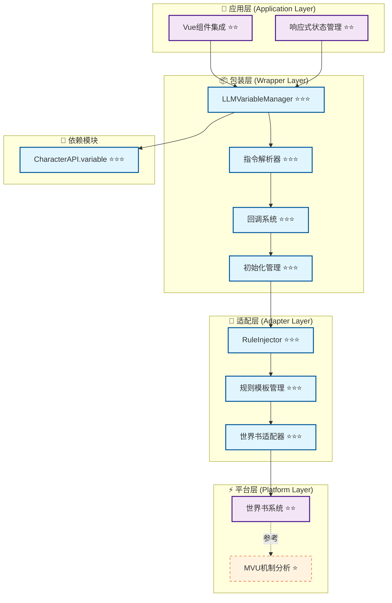
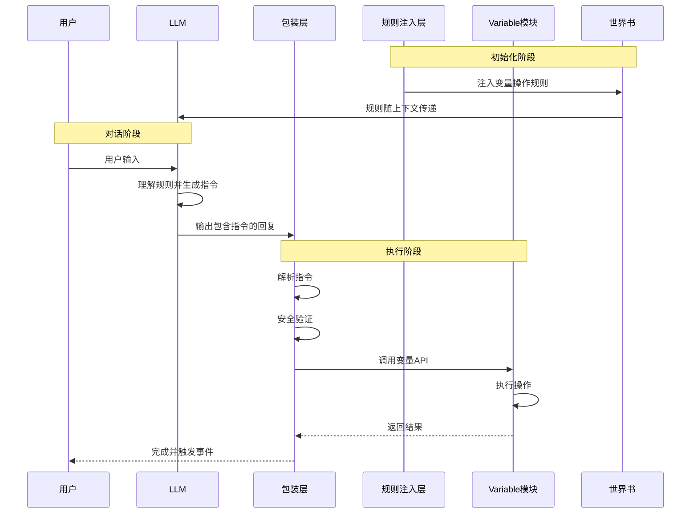

# 🤖 CharacterAPI.llmVariable LLM驱动的变量管理系统

> **核心目标**：提供LLM驱动的变量更新机制，通过结构化指令让LLM安全、可控地操作变量系统，作为 [`CharacterAPI.variable`](../variable/index.md) 的高级包装层。

## 📋 快速导航

| 架构层次 | 核心职责 | 推荐度 | 适用场景 | 文档链接 |
|----------|----------|--------|----------|----------|
| **底层平台特性** | 世界书系统能力分析 | ⭐⭐ **推荐** | 理解底层原理 | [`platform.md`](./platform.md) |
| **平台适配层** | 规则注入与世界书集成 | ⭐⭐⭐ **必需** | 规则管理与LLM引导 | [`adapter.md`](./adapter.md) |
| **包装层实现** | 指令解析、回调系统、初始化管理 | ⭐⭐⭐ **必需** | LLM驱动的变量更新 | [`wrapper.md`](./wrapper.md) |
| **应用层集成** | Vue/Pinia集成、UI响应式更新 | ⭐⭐ **推荐** | 前端应用开发 | [`application.md`](./application.md) |
| **高级应用实现** | 复杂场景与性能优化 | ⭐ **可选扩展** | 高级定制需求 | [`advanced-application.md`](./advanced-application.md) |

## 🏗️ 架构层次图



## 💡 实施策略

### 🎯 **推荐实施路径**
1. **核心三层优先** (⭐⭐⭐)：Platform → Adapter → Wrapper
2. **应用层集成** (⭐⭐)：基础Vue组件集成
3. **可选扩展** (⭐)：高级特性与性能优化

---

## 🎯 核心目标与特性

### ✅ **LLM指令解析**
- 解析LLM输出的结构化变量操作指令
- 支持多种指令格式（set/get/delete/merge/push/callback）
- 完整的安全验证与错误处理

### ✅ **规则驱动设计**
- 通过世界书向LLM注入变量操作规则
- 规则模板系统支持自定义
- 动态规则启用/禁用控制

### ✅ **完全集成 Variable 模块**
- 所有变量操作通过 [`CharacterAPI.variable`](../variable/index.md) 完成
- 复用作用域、批量操作、事件系统等能力
- 无缝的平台适配支持

### ✅ **JavaScript回调支持**
- 注册和调用JavaScript回调函数
- 触发UI更新、播放音效等交互
- 完整的回调生命周期管理

---

## 🔧 核心接口与类型定义

### 📋 **LLM变量管理器接口** ⭐⭐⭐
> **职责**：解析LLM输出的指令并执行变量操作
> **必要性**：**绝对必需** - LLM驱动变量更新的核心入口

```typescript
interface LLMVariableManager {
  /** 解析并执行LLM输出的指令 */
  parse(llmOutput: string): Promise<ParseResult>;
  
  /** 注册JavaScript回调函数 */
  registerCallback(name: string, callback: Function): void;
  
  /** 配置初始化规则 */
  setInitRules(rules: InitRule[]): Promise<void>;
  
  /** 手动触发初始化 */
  initialize(): Promise<InitResult>;
  
  /** 获取解析统计信息 */
  getStats(): ParseStats;
}
```

> 📖 **完整实现参考**：[`wrapper.md - 包装层实现`](./wrapper.md)

### 🎛️ **规则注入器接口** ⭐⭐⭐
> **职责**：向LLM注入变量操作规则，通过世界书系统
> **必要性**：**绝对必需** - LLM理解和生成指令的基础

```typescript
interface RuleInjector {
  /** 注入规则到世界书 */
  injectRules(rules: Rule[]): Promise<void>;
  
  /** 获取当前激活的规则 */
  getActiveRules(): Promise<Rule[]>;
  
  /** 更新规则模板 */
  updateTemplate(template: RuleTemplate): Promise<void>;
  
  /** 移除规则 */
  removeRule(ruleId: string): Promise<void>;
}
```

> 📖 **完整实现参考**：[`adapter.md - 规则注入系统`](./adapter.md)

### 📝 **指令格式规范** ⭐⭐⭐

支持两种指令格式：

#### **推荐：JSON格式** ✨（黄金标准）
```json
{
  "op": "assign",
  "path": ["player", "hp"],
  "value": 80,
  "old": 100,
  "reason": "受到伤害"
}
```

#### **兼容：MVU格式**（向后兼容）
```javascript
_.set('player.hp', 100, 80); // 受到伤害
```

> 📖 **详细格式说明**：[`wrapper.md - 指令格式`](./wrapper.md#指令格式规范)

---

## 📡 工作流程图

### 🔄 **完整流程** ⭐⭐⭐



---

## 🏗️ 分层实现指南

### 1️⃣ **底层平台特性** ⭐⭐ **推荐**
> **实施优先级**：第一阶段 - 理解底层机制

- **核心能力**：世界书系统能力分析
- **关键特性**：MVU机制原理、规则注入方式
- **实现要点**：平台差异对比、能力评估

📖 **详细实现**：[`platform.md - 平台特性分析`](./platform.md)

### 2️⃣ **平台适配层** ⭐⭐⭐ **必需**
> **实施优先级**：第二阶段 - 规则管理系统

- **核心能力**：RuleInjector、规则模板、世界书适配
- **关键特性**：规则注入、模板管理、平台桥接
- **实现要点**：世界书API封装、规则版本控制

📖 **详细实现**：[`adapter.md - 规则注入系统`](./adapter.md)

### 3️⃣ **包装层实现** ⭐⭐⭐ **必需**
> **实施优先级**：第三阶段 - 核心业务逻辑

- **核心能力**：LLMVariableManager、指令解析、回调系统
- **关键特性**：指令解析、安全验证、初始化管理
- **实现要点**：完全依赖Variable模块、事件集成

📖 **详细实现**：[`wrapper.md - 包装层设计`](./wrapper.md)

### 4️⃣ **应用层集成** ⭐⭐ **推荐**
> **实施优先级**：第四阶段 - 前端集成

- **核心能力**：Vue/Pinia集成、响应式状态管理
- **关键特性**：UI自动更新、开发者工具支持
- **实现要点**：Pinia Store设计、组件集成模式

📖 **详细实现**：[`application.md - 应用层集成`](./application.md)

### 5️⃣ **高级应用实现** ⭐ **可选扩展**
> **实施优先级**：第五阶段 - 高级特性

- **核心能力**：复杂场景支持、性能优化
- **关键特性**：批量优化、缓存策略、事务支持
- **实现要点**：性能分析、扩展机制

📖 **详细实现**：[`advanced-application.md - 高级应用`](./advanced-application.md)

---

## 🚀 快速开始

### 基础使用

```typescript
// 1. 初始化（自动检测平台）
await CharacterAPI.init();

// 2. 注册回调函数（可选）
CharacterAPI.llmVariable.registerCallback('onPlayerLevelUp', (player) => {
  console.log(`玩家升级到 ${player.level} 级！`);
});

// 3. 设置初始化规则（可选）
await CharacterAPI.llmVariable.setInitRules([
  {
    path: 'player',
    value: { name: '未命名', level: 1, hp: 100 },
    condition: 'missing'
  }
]);

// 4. 手动初始化（或等待自动触发）
await CharacterAPI.llmVariable.initialize();

// 5. LLM输出自动解析
// LLM的回复中包含指令会被自动解析执行
const llmOutput = `
玩家升级了！

\`\`\`json
{
  "op": "assign",
  "path": ["player", "level"],
  "value": 2,
  "old": 1,
  "reason": "升到2级"
}
\`\`\`
`;

// 6. 解析并执行
const result = await CharacterAPI.llmVariable.parse(llmOutput);
if (result.success) {
  console.log('成功执行操作:', result.operations.length);
}
```

### 完整示例：RPG游戏

```typescript
// 配置游戏系统
async function setupRPGSystem() {
  // 1. 注册游戏回调
  CharacterAPI.llmVariable.registerCallback('showMessage', (msg) => {
    alert(msg);
  });
  
  CharacterAPI.llmVariable.registerCallback('onLevelUp', (data) => {
    console.log('升级！', data);
    playLevelUpAnimation();
  });
  
  // 2. 设置初始化规则
  await CharacterAPI.llmVariable.setInitRules([
    {
      path: 'game.started',
      value: true,
      condition: 'once'
    },
    {
      path: 'player',
      value: {
        name: '冒险者',
        level: 1,
        hp: 100,
        mp: 50,
        inventory: []
      },
      condition: 'missing'
    }
  ]);
  
  // 3. 执行初始化
  await CharacterAPI.llmVariable.initialize();
  
  // 4. 监听变量变化
  CharacterAPI.events.on('state:changed', (payload) => {
    console.log('游戏状态变化:', payload);
  });
}
```

---

## 🧪 测试与验收策略

### ✅ **测试覆盖矩阵**
| 测试层级 | 覆盖范围 | 测试重点 | 验收标准 |
|----------|----------|----------|----------|
| **单元测试** | 指令解析器 | 解析准确性、错误处理 | 覆盖率 > 90% |
| **集成测试** | 与Variable集成 | 跨模块调用、事件派发 | 端到端场景通过 |
| **安全测试** | 路径验证 | 注入攻击防护、权限控制 | 无安全漏洞 |

### 📋 **验收检查清单**
- [ ] 是否正确解析所有指令格式？
- [ ] 是否完整集成Variable模块？
- [ ] 是否实现回调函数系统？
- [ ] 是否支持初始化系统？
- [ ] 是否提供完整的错误处理？
- [ ] 是否具备安全验证机制？

---

## 🔗 与 Variable 模块的关系

### **核心设计原则** ⭐⭐⭐

`llmVariable` 模块完全基于 [`CharacterAPI.variable`](../variable/index.md) 构建：

| llmVariable 功能 | 调用的 Variable API | 说明 |
|-----------------|-------------------|------|
| `_.set(path, old, new)` | [`variable.update()`](../variable/wrapper.md#核心接口) | 调用变量更新接口 |
| `_.get(path)` | [`variable.get()`](../variable/wrapper.md#核心接口) | 调用变量获取接口 |
| `_.delete(path)` | [`variable.update()`](../variable/wrapper.md#核心接口) | 设置为null实现删除 |
| `_.merge(path, old, new)` | [`variable.update()`](../variable/wrapper.md#核心接口) | 深度合并对象 |
| 初始化系统 | [`variable.batch()`](../variable/wrapper.md#核心接口) | 批量初始化变量 |

**关键优势**：
- ✅ **不重复造轮子**：复用 Variable 的所有能力
- ✅ **专注核心价值**：只做"LLM指令解析"
- ✅ **保持一致性**：变量操作行为完全一致
- ✅ **透明传递**：所有 Variable 的配置选项都可使用

---

## 📚 详细文档

### 核心实现文档

- **包装层实现** ⭐⭐⭐：[`wrapper.md`](./wrapper.md) - 指令解析器与执行引擎
- **平台适配层** ⭐⭐⭐：[`adapter.md`](./adapter.md) - 规则注入与世界书集成
- **底层平台特性** ⭐⭐：[`platform.md`](./platform.md) - 世界书系统与MVU机制

### 应用集成文档

- **应用层集成** ⭐⭐：[`application.md`](./application.md) - Vue/Pinia集成指南
- **高级应用实现** ⭐：[`advanced-application.md`](./advanced-application.md) - 复杂场景与性能优化

### 相关资源

- 基础变量系统：[`CharacterAPI.variable`](../variable/index.md)
- 事件系统：[`CharacterAPI.events`](../event/index.md)
- RFC总览：[CHARACTER_API_RFC](/CHARACTER_API_RFC)

---

## ⚠️ 注意事项

### 安全考虑
- **路径验证**：严格验证变量路径，防止注入攻击
- **回调白名单**：只允许注册的回调函数执行
- **权限控制**：限制可操作的变量作用域
- **指令限制**：单次解析的指令数量限制

### 性能考虑
- 批量指令优化为单次variable操作
- 合理使用缓存机制
- 避免频繁的初始化检查

### 平台兼容性
- **TavernHelper**：完整支持所有特性
- **SillyTavern**：世界书系统支持
- **其他平台**：需要适配世界书或类似机制

---

## 🔗 相关资源链接

### 📚 **核心文档**
- [CharacterAPI RFC](/CHARACTER_API_RFC) - 整体架构与接口规范
- [LLMVariable模块索引](./index.md) - 本文档

### 🛠️ **实现参考**
- [包装层实现](./wrapper.md) - 指令解析与执行
- [适配器设计](./adapter.md) - 规则注入系统
- [平台特性分析](./platform.md) - 世界书系统详解

### 🎯 **其他模块**
- [Variable模块](../variable/) - 底层变量操作
- [Event模块](../event/) - 事件系统集成
- [Generation模块](../generation/) - 生成功能集成

---

> **版本**：v1.0.0  
> **状态**：RFC草案  
> **更新时间**：2025-01-09