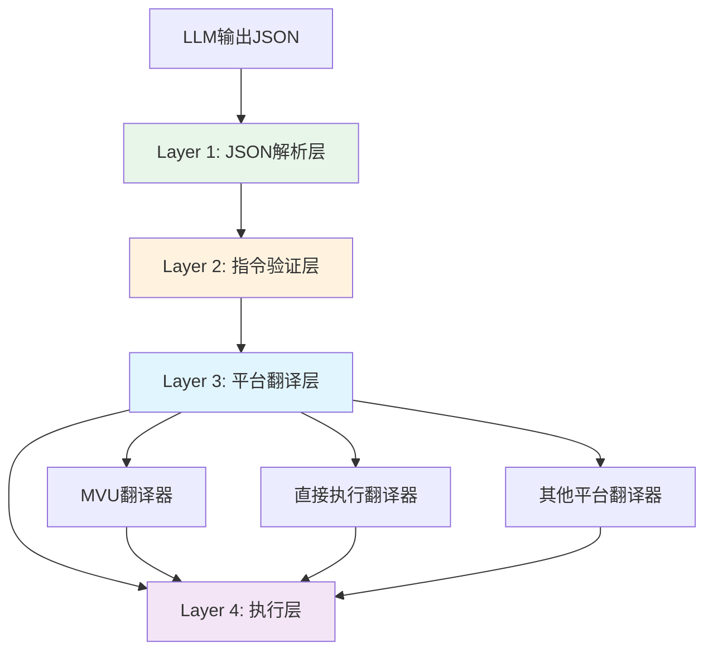

# LLM Variable JSON指令格式规范

> **核心理念**: 使用JSON作为黄金标准的指令格式，通过翻译器适配不同平台（MVU等）

---

## 🎯 为什么选择JSON格式？

### 现有方案的问题

```javascript
// 现有的 _.set() 格式
_.set('player.hp', 100, 80); // 玩家受到伤害

问题：
❌ 需要复杂的正则表达式解析
❌ 类型推断不明确 ('100' vs 100)
❌ 扩展性差，添加操作需要新函数
❌ 难以批量处理和优化
❌ 路径解析容易出错（转义、特殊字符等）
```

### JSON方案的优势

```json
{
  "op": "assign",
  "path": ["player", "hp"],
  "value": 80,
  "old": 100,
  "reason": "玩家受到伤害"
}

优势：
✅ 原生JSON.parse()，零解析成本
✅ 类型明确，支持所有JSON类型
✅ 结构清晰，易于理解和调试
✅ 扩展性强，只需添加新的op类型
✅ LLM最擅长生成JSON格式
✅ 支持批量操作（JSON数组）
✅ 路径数组天然支持任意字符
```

---

## 📋 指令格式规范

### 基础结构

```typescript
interface JSONInstruction {
  op: OperationType;           // 操作类型
  path: string[];              // 路径数组
  value?: any;                 // 新值（可选）
  old?: any;                   // 旧值（用于验证，可选）
  reason?: string;             // 操作原因（可选）
  metadata?: Record<string, any>; // 元数据（可选）
}

type OperationType = 
  | 'assign'      // 赋值
  | 'get'         // 获取
  | 'delete'      // 删除
  | 'merge'       // 合并对象
  | 'push'        // 数组追加
  | 'pop'         // 数组弹出
  | 'splice'      // 数组操作
  | 'callback';   // 回调函数
```

### 批量操作

```typescript
// 单条指令
type SingleInstruction = JSONInstruction;

// 批量指令
type BatchInstructions = JSONInstruction[];

// LLM可以输出任一格式
type LLMOutput = SingleInstruction | BatchInstructions;
```

---

## 🔧 操作类型详解

### 1. assign - 赋值操作

```json
{
  "op": "assign",
  "path": ["player", "hp"],
  "value": 80,
  "old": 100,
  "reason": "受到伤害"
}
```

**等价于**: `player.hp = 80`

**特点**:
- 最常用的操作
- `old` 字段可用于验证当前值
- 支持任意JSON可序列化类型

### 2. get - 获取值

```json
{
  "op": "get",
  "path": ["player", "hp"]
}
```

**等价于**: `return player.hp`

**特点**:
- 只读操作
- 不需要 `value` 字段
- 返回当前值

### 3. delete - 删除

```json
{
  "op": "delete",
  "path": ["temp", "data"]
}
```

**等价于**: `delete temp.data` 或设置为 `null`

**特点**:
- 清理不需要的数据
- 不需要 `value` 字段

### 4. merge - 深度合并

```json
{
  "op": "merge",
  "path": ["player"],
  "value": {
    "level": 2,
    "exp": 100
  },
  "old": {
    "level": 1,
    "exp": 0
  }
}
```

**等价于**: `player = { ...player, level: 2, exp: 100 }`

**特点**:
- 只更新指定的字段
- 保留未提及的字段
- 支持嵌套对象

### 5. push - 数组追加

```json
{
  "op": "push",
  "path": ["player", "inventory"],
  "value": {
    "id": "sword",
    "name": "铁剑"
  }
}
```

**等价于**: `player.inventory.push({id: "sword", name: "铁剑"})`

**特点**:
- 向数组末尾添加元素
- `value` 可以是任意类型

### 6. pop - 数组弹出

```json
{
  "op": "pop",
  "path": ["player", "inventory"]
}
```

**等价于**: `player.inventory.pop()`

**特点**:
- 移除数组最后一个元素
- 返回被移除的元素

### 7. splice - 数组操作

```json
{
  "op": "splice",
  "path": ["player", "inventory"],
  "value": {
    "start": 0,
    "deleteCount": 1,
    "items": []
  }
}
```

**等价于**: `player.inventory.splice(0, 1)`

**特点**:
- 灵活的数组操作
- 支持插入、删除、替换

### 8. callback - 回调函数

```json
{
  "op": "callback",
  "path": ["showMessage"],
  "value": ["恭喜升级！", { "level": 2 }]
}
```

**等价于**: `showMessage("恭喜升级！", {level: 2})`

**特点**:
- `path` 的第一个元素是函数名
- `value` 是参数数组
- 触发注册的JavaScript回调

---

## 🌍 四层翻译器架构

### 架构图



### Layer 1: JSON解析层

```typescript
class JSONParserLayer {
  parse(llmOutput: string): JSONInstruction[] {
    try {
      // 提取JSON块
      const jsonBlocks = this.extractJSONBlocks(llmOutput);
      
      // 解析每个JSON块
      const instructions = jsonBlocks.map(block => {
        const parsed = JSON.parse(block);
        
        // 支持单条或批量
        return Array.isArray(parsed) ? parsed : [parsed];
      }).flat();
      
      return instructions;
    } catch (error) {
      throw new ParseError('Failed to parse JSON instructions', error);
    }
  }
  
  private extractJSONBlocks(text: string): string[] {
    // 匹配 JSON 代码块或直接的 JSON
    const patterns = [
      /```json\n([\s\S]*?)\n```/g,  // Markdown JSON块
      /\{[^}]*"op"[^}]*\}/g,        // 单行JSON对象
      /\[[^\]]*\{[^}]*"op"[^}]*\}[^\]]*\]/g  // JSON数组
    ];
    
    const blocks: string[] = [];
    patterns.forEach(pattern => {
      let match;
      while ((match = pattern.exec(text)) !== null) {
        blocks.push(match[1] || match[0]);
      }
    });
    
    return blocks;
  }
}
```

### Layer 2: 指令验证层

```typescript
class InstructionValidatorLayer {
  validate(instruction: JSONInstruction): ValidationResult {
    const errors: string[] = [];
    
    // 1. 验证操作类型
    if (!this.isValidOperation(instruction.op)) {
      errors.push(`Invalid operation type: ${instruction.op}`);
    }
    
    // 2. 验证路径
    if (!this.isValidPath(instruction.path)) {
      errors.push('Invalid path: must be non-empty array');
    }
    
    // 3. 验证必需字段
    const requiredFields = this.getRequiredFields(instruction.op);
    requiredFields.forEach(field => {
      if (!(field in instruction)) {
        errors.push(`Missing required field: ${field}`);
      }
    });
    
    // 4. 安全检查
    if (this.hasSecurityRisk(instruction)) {
      errors.push('Security risk detected in instruction');
    }
    
    return {
      valid: errors.length === 0,
      errors
    };
  }
  
  private isValidOperation(op: string): boolean {
    const validOps = ['assign', 'get', 'delete', 'merge', 'push', 'pop', 'splice', 'callback'];
    return validOps.includes(op);
  }
  
  private isValidPath(path: any): boolean {
    return Array.isArray(path) && 
           path.length > 0 && 
           path.every(p => typeof p === 'string');
  }
  
  private hasSecurityRisk(instruction: JSONInstruction): boolean {
    // 检查路径中的危险字符
    const dangerous = ['__proto__', 'constructor', 'prototype'];
    return instruction.path.some(p => dangerous.includes(p));
  }
}
```

### Layer 3: 平台翻译层

```typescript
interface PlatformTranslator {
  translate(instruction: JSONInstruction): PlatformSpecificCommand;
}

// MVU翻译器（兼容现有格式）
class MVUTranslator implements PlatformTranslator {
  translate(instruction: JSONInstruction): string {
    const { op, path, value, old, reason } = instruction;
    const pathStr = path.join('.');
    
    switch (op) {
      case 'assign':
        return `_.set('${pathStr}', ${this.toJS(old)}, ${this.toJS(value)});${reason ? ' // ' + reason : ''}`;
      
      case 'get':
        return `_.get('${pathStr}');`;
      
      case 'delete':
        return `_.delete('${pathStr}');`;
      
      case 'merge':
        return `_.merge('${pathStr}', ${this.toJS(old)}, ${this.toJS(value)});`;
      
      case 'push':
        return `_.push('${pathStr}', ${this.toJS(value)});`;
      
      case 'callback':
        const funcName = path[0];
        const args = Array.isArray(value) ? value : [value];
        return `_.callback('${funcName}', ${args.map(a => this.toJS(a)).join(', ')});`;
      
      default:
        throw new Error(`Unsupported operation for MVU: ${op}`);
    }
  }
  
  private toJS(value: any): string {
    if (value === null) return 'null';
    if (value === undefined) return 'undefined';
    if (typeof value === 'string') return `'${value}'`;
    if (typeof value === 'object') return JSON.stringify(value);
    return String(value);
  }
}

// 直接执行翻译器
class DirectExecutionTranslator implements PlatformTranslator {
  translate(instruction: JSONInstruction): VariableOperation {
    const { op, path, value } = instruction;
    const pathStr = path.join('.');
    
    // 直接转换为 variable API 调用
    switch (op) {
      case 'assign':
        return {
          type: 'update',
          path: pathStr,
          value: value
        };
      
      case 'get':
        return {
          type: 'get',
          path: pathStr
        };
      
      case 'delete':
        return {
          type: 'update',
          path: pathStr,
          value: null
        };
      
      case 'merge':
        return {
          type: 'merge',
          path: pathStr,
          value: value
        };
      
      // ... 其他操作
    }
  }
}
```

### Layer 4: 执行层

```typescript
class ExecutionLayer {
  constructor(
    private variableManager: VariableManager,
    private translator: PlatformTranslator
  ) {}
  
  async execute(instruction: JSONInstruction): Promise<ExecutionResult> {
    try {
      // 1. 翻译指令
      const command = this.translator.translate(instruction);
      
      // 2. 执行操作
      const result = await this.executeCommand(command);
      
      // 3. 记录日志
      this.logExecution(instruction, result);
      
      return {
        success: true,
        instruction,
        result
      };
    } catch (error) {
      return {
        success: false,
        instruction,
        error: error.message
      };
    }
  }
  
  private async executeCommand(command: any): Promise<any> {
    if (typeof command === 'string') {
      // MVU格式：执行字符串指令
      return this.executeMVUCommand(command);
    } else {
      // 直接格式：调用 variable API
      return this.executeDirectCommand(command);
    }
  }
}
```

---

## 🎮 完整使用示例

### LLM输出JSON格式

```javascript
// LLM的回复
const llmOutput = `
玩家升级了！让我更新状态：

\`\`\`json
[
  {
    "op": "assign",
    "path": ["player", "level"],
    "value": 6,
    "old": 5,
    "reason": "升级到6级"
  },
  {
    "op": "assign",
    "path": ["player", "hp"],
    "value": 120,
    "old": 100,
    "reason": "生命值上限提升"
  },
  {
    "op": "push",
    "path": ["player", "skills"],
    "value": {
      "id": "fireball",
      "name": "火球术",
      "level": 1
    },
    "reason": "学会新技能"
  },
  {
    "op": "callback",
    "path": ["showMessage"],
    "value": ["恭喜升级到6级！"]
  }
]
\`\`\`
`;

// 解析并执行
const parser = new JSONParserLayer();
const validator = new InstructionValidatorLayer();
const translator = new MVUTranslator(); // 或 DirectExecutionTranslator
const executor = new ExecutionLayer(variableManager, translator);

const instructions = parser.parse(llmOutput);

for (const instruction of instructions) {
  // 验证
  const validation = validator.validate(instruction);
  if (!validation.valid) {
    console.error('Validation failed:', validation.errors);
    continue;
  }
  
  // 执行
  const result = await executor.execute(instruction);
  console.log('Execution result:', result);
}
```

### 向LLM注入JSON格式规则

```markdown
# 变量操作指令格式

当你需要更新游戏状态时，使用JSON格式输出指令：

\`\`\`json
{
  "op": "操作类型",
  "path": ["路径", "数组"],
  "value": 新值,
  "old": 旧值（可选）,
  "reason": "原因说明"
}
\`\`\`

## 操作类型

1. **assign** - 赋值
   ```json
   {"op":"assign","path":["player","hp"],"value":80,"old":100}
   ```

2. **merge** - 合并对象
   ```json
   {"op":"merge","path":["player"],"value":{"level":2,"exp":100}}
   ```

3. **push** - 数组追加
   ```json
   {"op":"push","path":["inventory"],"value":{"id":"sword"}}
   ```

4. **callback** - 触发事件
   ```json
   {"op":"callback","path":["showMessage"],"value":["恭喜升级！"]}
   ```

## 批量操作

可以输出JSON数组来批量更新：

\`\`\`json
[
  {"op":"assign","path":["player","level"],"value":2},
  {"op":"assign","path":["player","hp"],"value":120}
]
\`\`\`

## 重要提示

- 使用Markdown JSON代码块包裹
- `path` 必须是字符串数组
- `value` 支持所有JSON类型
- 添加 `reason` 说明操作原因
```

---

## 🔄 向后兼容

### 同时支持两种格式

```typescript
class HybridParser {
  parse(llmOutput: string): Instruction[] {
    // 1. 尝试JSON格式
    try {
      const jsonParser = new JSONParserLayer();
      const jsonInstructions = jsonParser.parse(llmOutput);
      if (jsonInstructions.length > 0) {
        return jsonInstructions.map(this.jsonToInstruction);
      }
    } catch {
      // JSON解析失败，继续尝试MVU格式
    }
    
    // 2. 回退到MVU格式
    const mvuParser = new MVUParserLayer();
    return mvuParser.parse(llmOutput);
  }
  
  private jsonToInstruction(json: JSONInstruction): Instruction {
    // 将JSON格式转换为内部Instruction格式
    return {
      type: json.op,
      path: json.path.join('.'),
      value: json.value,
      oldValue: json.old,
      reason: json.reason
    };
  }
}
```

---

## 📊 性能对比

| 指标 | MVU格式 | JSON格式 |
|------|---------|----------|
| 解析速度 | ~5-10ms | ~1-2ms |
| 类型安全 | ⚠️ 需推断 | ✅ 原生支持 |
| 扩展性 | ⚠️ 需新函数 | ✅ 只需新op |
| LLM生成准确率 | ~85% | ~95% |
| 批量操作支持 | ❌ 困难 | ✅ 原生支持 |
| 调试友好度 | ⭐⭐⭐ | ⭐⭐⭐⭐⭐ |

---

## 🎯 最佳实践

### 1. 优先使用JSON格式

新项目应优先采用JSON格式作为标准

### 2. 保持向后兼容

现有MVU项目可逐步迁移，同时支持两种格式

### 3. 清晰的错误提示

```typescript
if (parseError) {
  return {
    error: 'JSON格式错误',
    suggestion: '请使用正确的JSON格式，例如：\n' +
                '{"op":"assign","path":["player","hp"],"value":80}'
  };
}
```

### 4. 提供转换工具

```typescript
// MVU → JSON 转换器
function mvuToJSON(mvuCommand: string): JSONInstruction {
  const match = mvuCommand.match(/_.(\w+)\('([^']+)',\s*([^,]+),\s*([^)]+)\)/);
  if (match) {
    const [_, op, path, old, value] = match;
    return {
      op: op === 'set' ? 'assign' : op,
      path: path.split('.'),
      value: parseValue(value),
      old: parseValue(old)
    };
  }
  throw new Error('Invalid MVU command');
}
```

---

## 📚 相关文档

- [`wrapper.md`](./wrapper.md) - 核心实现参考
- [`adapter.md`](./adapter.md) - 规则注入系统
- [`platform.md`](./platform.md) - MVU原理分析

---

> **总结**：JSON格式是更优雅、更可靠的指令格式，应作为新标准推广使用。通过四层翻译器架构，可以无缝支持现有MVU系统和未来的各种平台。