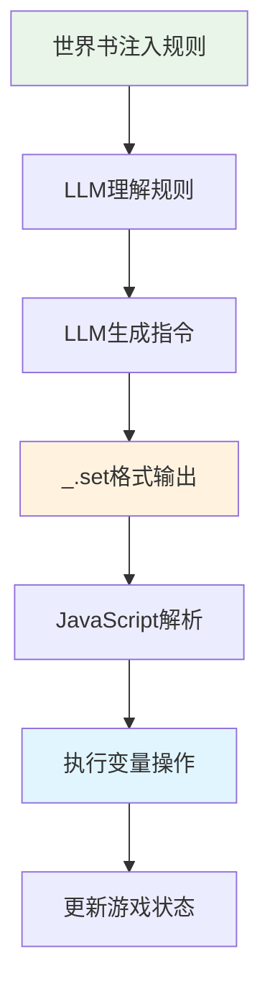

# LLMVariable 平台特性分析

> **本文档**：分析各平台的世界书系统能力，以及MVU（MagVarUpdate）机制的底层原理。

---

## 🎯 世界书系统概述

### 什么是世界书（World Info）？ ⭐⭐

世界书是LLM角色扮演平台提供的**上下文注入机制**，允许在对话中动态插入额外信息到LLM的上下文中。


**核心特性**：
- ✅ **关键词触发**：根据对话内容中的关键词激活
- ✅ **优先级控制**：多条目按优先级排序
- ✅ **位置控制**：可以插入到不同位置（角色卡前/后、示例前等）
- ✅ **条件逻辑**：支持复杂的激活条件

---

## 🏗️ 平台能力对比

### TavernHelper 世界书系统 ⭐⭐⭐

#### 能力特性

| 特性 | 支持情况 | 说明 |
|------|---------|------|
| 关键词触发 | ✅ 完整支持 | 支持多个关键词，逗号分隔 |
| 优先级 | ✅ 完整支持 | 0-1000范围 |
| 位置控制 | ✅ 完整支持 | before_char/after_char/before_example |
| 选择性逻辑 | ✅ 完整支持 | AND/OR逻辑组合 |
| 二级关键词 | ✅ 完整支持 | 用于更精细的匹配 |
| 正则表达式 | ✅ 支持 | 高级匹配模式 |
| 深度控制 | ✅ 支持 | 控制扫描对话历史的深度 |

#### API示例

```typescript
// TavernHelper 世界书 API
interface TavernHelperWorldInfo {
  add(entry: {
    uid: string;
    keys: string;           // "关键词1, 关键词2"
    content: string;
    enabled: boolean;
    priority: number;       // 0-1000
    position: number;       // 0=before_char, 1=after_char
    selectiveLogic?: number; // 0=AND, 1=OR
    secondaryKeys?: string;
  }): Promise<void>;

  remove(uid: string): Promise<void>;
  
  update(uid: string, updates: Partial<WorldInfoEntry>): Promise<void>;
  
  getAll(): Promise<WorldInfoEntry[]>;
}

// 使用示例
await window.TavernHelper.worldInfo.add({
  uid: 'llm_var_json',
  keys: 'variable, set, get, 变量, 记录',
  content: '# JSON格式变量操作指南\n...',
  enabled: true,
  priority: 100,
  position: 0,  // before_char
  selectiveLogic: 1  // OR
});
```

### SillyTavern 世界书系统 ⭐⭐⭐

#### 能力特性

| 特性 | 支持情况 | 说明 |
|------|---------|------|
| 关键词触发 | ✅ 完整支持 | 支持数组格式关键词 |
| 优先级 | ✅ 完整支持 | order字段，越小优先级越高 |
| 位置控制 | ✅ 完整支持 | 0-6多个位置选项 |
| 正则表达式 | ✅ 支持 | 支持正则匹配 |
| 扫描深度 | ✅ 支持 | 可配置扫描消息数量 |
| 案例敏感 | ✅ 支持 | 可选大小写敏感 |
| 永久激活 | ✅ 支持 | constant字段 |

#### API示例

```typescript
// SillyTavern 世界书 API
interface SillyTavernWorldInfo {
  createEntry(entry: {
    uid: string;
    key: string[];          // ["关键词1", "关键词2"]
    content: string;
    enabled: boolean;
    order: number;          // 越小优先级越高
    position: number;       // 0-6
    case_sensitive?: boolean;
    constant?: boolean;     // 永久激活
    depth?: number;         // 扫描深度
  }): Promise<void>;

  deleteEntry(uid: string): Promise<void>;
  
  updateEntry(uid: string, updates: any): Promise<void>;
}

// 使用示例
await window.SillyTavern.worldInfo.createEntry({
  uid: 'llm_var_json',
  key: ['variable', 'set', 'get', '变量', '记录'],
  content: '# JSON格式变量操作指南\n...',
  enabled: true,
  order: 100,
  position: 0,
  case_sensitive: false,
  depth: 10
});
```

### 其他平台 ⭐⭐

| 平台 | 世界书支持 | 备注 |
|------|-----------|------|
| **Agnai** | ✅ 支持 | 称为"Memory Book" |
| **RisuAI** | ✅ 支持 | 完整的世界书系统 |
| **Kobold** | ⚠️ 部分支持 | 功能较基础 |
| **纯API调用** | ❌ 不支持 | 需要其他方式注入 |

---

## 🔍 MVU（MagVarUpdate）机制详解

### MVU 的核心原理 ⭐⭐⭐

MVU（Magical Variable Update）是"酒馆助手"项目中的一个工具，它利用世界书系统实现了LLM驱动的变量更新。



### MVU 工作流程 ⭐⭐⭐

#### 1. 规则注入阶段

通过世界书向LLM注入变量操作规则：

```markdown
# 世界书内容示例

## 变量操作指令

当你需要记录游戏状态时，使用以下格式：

```javascript
_.set('路径', 旧值, 新值); // 说明原因
```

示例：
- `_.set('player.hp', 100, 80);` // 玩家受到伤害
- `_.set('player.level', 1, 2);` // 玩家升级
```

#### 2. LLM生成阶段

LLM在回复中自然地包含这些指令：

```
玩家挥剑攻击，命中了哥布林！

哥布林受到了重创，它的生命值降低了。
_.set('goblin.hp', 50, 20); // 哥布林受到30点伤害

同时，你也消耗了一些体力。
_.set('player.stamina', 100, 85); // 消耗15点体力
```

#### 3. 解析执行阶段

JavaScript脚本提取并执行这些指令：

```javascript
// MVU 核心解析逻辑
function parseAndExecute(llmOutput) {
  // 1. 提取指令
  const regex = /_.set\('([^']+)',\s*([^,]+),\s*([^)]+)\);?\s*\/\/\s*(.+)?/g;
  const matches = [...llmOutput.matchAll(regex)];
  
  // 2. 逐条执行
  matches.forEach(match => {
    const [_, path, oldValue, newValue, reason] = match;
    
    // 3. 更新变量
    updateVariable(path, parseValue(newValue));
    
    // 4. 记录日志
    console.log(`✅ Updated ${path}: ${oldValue} → ${newValue} (${reason})`);
  });
}
```

### MVU 的设计精髓 ⭐⭐⭐

#### 1. 规则即行为

通过世界书，MVU实现了"声明式编程"：

```typescript
// 不需要编写：
if (player.attacked(goblin)) {
  goblin.hp -= damage;
  updateUI();
}

// LLM自动生成：
"_.set('goblin.hp', 50, 20); // 受到伤害"
```

#### 2. 自然语言驱动

LLM在自然对话中输出指令，无需特殊触发：

```
❌ 不好的设计：用户输入 "/update hp 20" 这样的命令

✅ MVU设计：
用户："我攻击哥布林"
LLM："你的剑击中了哥布林！
     _.set('goblin.hp', 50, 20); // 受到伤害"
```

#### 3. 可读性与可维护性

指令格式清晰，易于理解和调试：

```javascript
// 清晰的三要素：路径、旧值、新值
_.set('player.inventory.gold', 100, 150); // 获得金币奖励

// 注释说明原因，便于调试
_.set('quest.status', 'in_progress', 'completed'); // 完成主线任务
```

---

## 🚀 CharacterAPI.llmVariable 的改进

### 相比MVU的增强 ⭐⭐⭐

| 方面 | MVU | CharacterAPI.llmVariable |
|------|-----|-------------------------|
| **指令格式** | 仅MVU格式 | JSON（推荐）+ MVU（兼容）|
| **架构** | 独立工具 | 集成到CharacterAPI体系 |
| **平台支持** | 仅TavernHelper | 跨平台适配 |
| **类型安全** | 无 | 完整TypeScript类型 |
| **错误处理** | 基础 | 完善的错误处理和重试 |
| **事件系统** | 无 | 完整的事件派发 |
| **初始化** | 手动 | 自动初始化系统 |
| **回调支持** | 有限 | 完整的回调注册机制 |
| **测试** | 无 | 完整的单元测试 |

### 保持的MVU优点 ⭐⭐⭐

- ✅ **规则驱动**：继承MVU的核心理念
- ✅ **指令格式**：兼容`_.set()`等熟悉的格式
- ✅ **自然交互**：LLM在对话中自然输出指令
- ✅ **可读性**：清晰的指令格式和注释

### 新增功能 ⭐⭐⭐

```typescript
// 1. JSON格式支持（推荐）
const jsonFormat = {
  "op": "assign",
  "path": ["player", "hp"],
  "value": 80,
  "old": 100,
  "reason": "受到伤害"
};

// 2. 更多指令类型
{"op":"merge","path":["player"],"value":{"level":2,"exp":100}}
{"op":"push","path":["inventory"],"value":{"id":"sword"}}
{"op":"delete","path":["tempData"]}
{"op":"callback","path":["showMessage"],"value":["恭喜升级！"]}

// 3. 初始化系统
await CharacterAPI.llmVariable.setInitRules([...]);
await CharacterAPI.llmVariable.initialize();

// 4. 事件监听
CharacterAPI.events.on('llm:instruction:executed', handler);

// 5. 统计信息
const stats = CharacterAPI.llmVariable.getStats();
```

---

## 🔧 平台适配实现

### 统一适配器接口 ⭐⭐⭐

```typescript
interface WorldInfoAdapter {
  addEntry(entry: WorldInfoEntry): Promise<void>;
  removeEntry(id: string): Promise<void>;
  updateEntry(id: string, updates: any): Promise<void>;
  getAllEntries(): Promise<WorldInfoEntry[]>;
}

// 平台检测与适配器选择
async function createWorldInfoAdapter(): Promise<WorldInfoAdapter> {
  const platform = await CharacterAPI.platform.detect();
  
  switch (platform.name) {
    case 'TavernHelper':
      return new TavernHelperWorldInfoAdapter();
    
    case 'SillyTavern':
      return new SillyTavernWorldInfoAdapter();
    
    case 'Agnai':
      return new AgnaiMemoryBookAdapter();
    
    default:
      throw new Error(`Platform ${platform.name} not supported`);
  }
}
```

### 差异封装示例 ⭐⭐⭐

```typescript
class TavernHelperWorldInfoAdapter implements WorldInfoAdapter {
  async addEntry(entry: WorldInfoEntry): Promise<void> {
    // 映射到 TavernHelper 格式
    await window.TavernHelper.worldInfo.add({
      uid: entry.id,
      keys: entry.keys.join(', '),  // 数组 → 字符串
      content: entry.content,
      enabled: entry.enabled,
      priority: entry.priority,
      position: this.mapPosition(entry.position),
      selectiveLogic: 1  // 默认OR逻辑
    });
  }

  private mapPosition(pos: string): number {
    const map = {
      'before_char': 0,
      'after_char': 1,
      'before_example': 2
    };
    return map[pos] || 0;
  }
}

class SillyTavernWorldInfoAdapter implements WorldInfoAdapter {
  async addEntry(entry: WorldInfoEntry): Promise<void> {
    // 映射到 SillyTavern 格式
    await window.SillyTavern.worldInfo.createEntry({
      uid: entry.id,
      key: entry.keys,  // 直接使用数组
      content: entry.content,
      enabled: entry.enabled,
      order: entry.priority,
      position: this.mapPosition(entry.position),
      depth: 10,
      case_sensitive: false
    });
  }

  private mapPosition(pos: string): number {
    // SillyTavern 的位置映射
    const map = {
      'before_char': 0,
      'after_char': 1,
      'before_example': 3
    };
    return map[pos] || 0;
  }
}
```

---

## 📊 性能分析

### 世界书激活开销 ⭐⭐

```typescript
interface PerformanceMetrics {
  // 世界书匹配时间
  matchingTime: number;     // 通常 < 10ms
  
  // 内容注入时间
  injectionTime: number;    // 通常 < 5ms
  
  // 上下文构建时间
  contextBuildTime: number; // 通常 < 20ms
  
  // 总开销
  totalOverhead: number;    // 通常 < 50ms
}

// 优化建议
class PerformanceOptimizer {
  // 1. 限制激活的世界书条目数量
  maxActiveEntries = 10;
  
  // 2. 使用精确的关键词
  useSpecificKeywords = true;
  
  // 3. 合理设置扫描深度
  scanDepth = 10;  // 不要扫描过多历史消息
  
  // 4. 缓存常用条目
  cacheFrequentEntries = true;
}
```

### 优化策略 ⭐⭐

```typescript
class WorldInfoOptimizer {
  /**
   * 优化规则关键词
   */
  optimizeKeywords(rules: Rule[]): Rule[] {
    return rules.map(rule => ({
      ...rule,
      // 移除过于通用的关键词
      keys: rule.keys.filter(key => key.length > 2),
      // 添加更具体的关键词
      secondaryKeys: this.generateSecondaryKeys(rule)
    }));
  }

  /**
   * 动态调整优先级
   */
  adjustPriorities(rules: Rule[], context: Context): Rule[] {
    return rules.map(rule => {
      // 根据上下文动态调整优先级
      const relevance = this.calculateRelevance(rule, context);
      return {
        ...rule,
        priority: rule.priority * relevance
      };
    });
  }

  /**
   * 缓存管理
   */
  private cache: Map<string, CachedRule> = new Map();
  
  getCachedRule(ruleId: string): Rule | null {
    const cached = this.cache.get(ruleId);
    if (cached && Date.now() - cached.timestamp < 5000) {
      return cached.rule;
    }
    return null;
  }
}
```

---

## 🧪 测试策略

### 平台兼容性测试 ⭐⭐

```typescript
describe('WorldInfo Platform Compatibility', () => {
  const platforms = ['TavernHelper', 'SillyTavern', 'Agnai'];
  
  platforms.forEach(platform => {
    test(`${platform}: should inject rules correctly`, async () => {
      const adapter = await createAdapterForPlatform(platform);
      const injector = new RuleInjector(adapter);
      
      await injector.injectRules([testRule]);
      
      const active = await injector.getActiveRules();
      expect(active).toContainRule(testRule);
    });

    test(`${platform}: should handle priority correctly`, async () => {
      const adapter = await createAdapterForPlatform(platform);
      const injector = new RuleInjector(adapter);
      
      const rules = [
        { id: 'rule1', priority: 100 },
        { id: 'rule2', priority: 50 }
      ];
      
      await injector.injectRules(rules);
      
      // 验证优先级正确应用
      const entries = await adapter.getAllEntries();
      expect(entries[0].priority).toBeGreaterThan(entries[1].priority);
    });
  });
});
```

---

## 📚 相关文档

- **包装层实现**：[`wrapper.md`](./wrapper.md) - 指令解析与执行
- **规则注入**：[`adapter.md`](./adapter.md) - 规则管理系统
- **应用层集成**：[`application.md`](./application.md) - 前端集成指南
- **Variable模块**：[`../variable/index.md`](../variable/index.md) - 底层变量操作

---

## 💡 最佳实践建议

### 世界书使用建议 ⭐⭐⭐

1. **精简关键词**
   ```typescript
   ✅ 好的关键词：['variable', 'set', 'update', '变量']
   ❌ 差的关键词：['a', 'the', '的', '了']
   ```

2. **合理的优先级**
   ```typescript
   核心规则：100
   系统规则：80-90
   辅助规则：60-70
   可选规则：40-50
   ```

3. **清晰的内容结构**
   ```markdown
   # 规则标题
   
   ## 格式说明
   （简短清晰）
   
   ## 示例
   （具体的代码示例）
   
   ## 注意事项
   （重要提示）
   ```

4. **动态管理**
   ```typescript
   // 根据场景启用/禁用规则
   if (inCombat) {
     enableRule('combat_system');
   } else {
     disableRule('combat_system');
   }
   ```

### 调试技巧 ⭐⭐

```typescript
class WorldInfoDebugger {
  /**
   * 记录激活的世界书条目
   */
  logActiveEntries(entries: WorldInfoEntry[]): void {
    console.log('🔍 Active World Info Entries:', entries.map(e => ({
      id: e.id,
      keys: e.keys,
      priority: e.priority,
      position: e.position
    })));
  }

  /**
   * 验证规则格式
   */
  validateRuleFormat(rule: Rule): ValidationResult {
    const errors: string[] = [];
    
    if (!rule.template.instructions) {
      errors.push('Missing instructions');
    }
    
    if (rule.template.examples.length === 0) {
      errors.push('No examples provided');
    }
    
    return {
      valid: errors.length === 0,
      errors
    };
  }

  /**
   * 测试关键词匹配
   */
  testKeywordMatch(text: string, keywords: string[]): MatchResult {
    const matches = keywords.filter(k => text.includes(k));
    return {
      matched: matches.length > 0,
      matchedKeywords: matches,
      confidence: matches.length / keywords.length
    };
  }
}
```

---

> **核心理念**：
> 1. ✅ **传承MVU精髓**：保持规则驱动的核心思想
> 2. ✅ **JSON优先**：推荐JSON格式作为新标准
> 3. ✅ **跨平台支持**：通过适配器支持多平台
> 4. ✅ **性能优化**：合理的缓存和批量策略
> 5. ✅ **易于扩展**：统一接口便于添加新平台