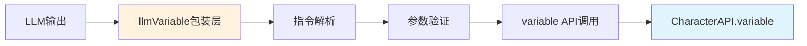

# LLMVariable 包装层实现

> **核心定位**：`CharacterAPI.llmVariable` 是 [`CharacterAPI.variable`](../variable/index.md) 的**纯包装层**，专注于解析LLM输出的结构化指令并转换为 [`variable`](../variable/index.md) API调用。

---

## 🎯 设计理念

### 职责边界 ⭐⭐⭐



**明确的职责划分**：

| 模块 | 职责 | 不负责 |
|------|------|--------|
| **llmVariable** | • 解析LLM指令格式<br/>• 路径安全验证<br/>• 回调函数管理<br/>• 初始化流程编排 | • 变量存储<br/>• 作用域管理<br/>• 平台适配<br/>• 事件派发 |
| **variable** | • 变量CRUD操作<br/>• 作用域管理<br/>• 平台适配<br/>• 事件派发 | • 指令解析<br/>• LLM交互 |

---

## 📋 指令格式规范

### 支持的指令格式 ⭐⭐⭐

#### **推荐：JSON格式** ✨（黄金标准）

**为什么选择JSON？**
- ✅ **解析简单**：原生`JSON.parse()`，零解析成本
- ✅ **类型明确**：支持所有JSON类型，无需推断
- ✅ **结构清晰**：易于理解和调试
- ✅ **LLM友好**：LLM最擅长生成JSON格式
- ✅ **易于扩展**：只需添加新的`op`类型

```json
// 单条指令
{
  "op": "assign",
  "path": ["player", "level"],
  "value": 2,
  "old": 1,
  "reason": "升级"
}

// 批量指令
[
  {"op": "assign", "path": ["player", "level"], "value": 2},
  {"op": "assign", "path": ["player", "hp"], "value": 120},
  {"op": "callback", "path": ["showMessage"], "value": ["恭喜升级！"]}
]
```

#### **兼容：MVU格式**（向后兼容）

```javascript
// 现有的 _.set() 格式
_.set('player.hp', 100, 80); // 玩家受到伤害
_.get('player.level');
_.delete('temp_data');
_.merge('player', {level: 1}, {level: 2});
_.push('inventory', {id: 'sword'});
_.callback('showMessage', '恭喜升级！');
```

### JSON指令类型定义 ⭐⭐⭐

```typescript
interface JSONInstruction {
  op: OperationType;           // 操作类型
  path: string[];              // 路径数组
  value?: any;                 // 新值（可选）
  old?: any;                   // 旧值（用于验证，可选）
  reason?: string;             // 操作原因（可选）
  metadata?: Record<string, any>; // 元数据（可选）
}

type OperationType = 
  | 'assign'      // 赋值
  | 'get'         // 获取
  | 'delete'      // 删除
  | 'merge'       // 合并对象
  | 'push'        // 数组追加
  | 'pop'         // 数组弹出
  | 'splice'      // 数组操作
  | 'callback';   // 回调函数
```

### 操作类型详解 ⭐⭐⭐

#### 1. assign - 赋值操作

```json
{
  "op": "assign",
  "path": ["player", "hp"],
  "value": 80,
  "old": 100,
  "reason": "受到伤害"
}
```

**等价于**: `player.hp = 80`

#### 2. get - 获取值

```json
{
  "op": "get",
  "path": ["player", "hp"]
}
```

**等价于**: `return player.hp`

#### 3. delete - 删除

```json
{
  "op": "delete",
  "path": ["temp", "data"]
}
```

**等价于**: `delete temp.data` 或设置为 `null`

#### 4. merge - 深度合并

```json
{
  "op": "merge",
  "path": ["player"],
  "value": {
    "level": 2,
    "exp": 100
  }
}
```

**等价于**: `player = { ...player, level: 2, exp: 100 }`

#### 5. push - 数组追加

```json
{
  "op": "push",
  "path": ["player", "inventory"],
  "value": {
    "id": "sword",
    "name": "铁剑"
  }
}
```

**等价于**: `player.inventory.push({id: "sword", name: "铁剑"})`

#### 6. callback - 回调函数

```json
{
  "op": "callback",
  "path": ["showMessage"],
  "value": ["恭喜升级！", { "level": 2 }]
}
```

**等价于**: `showMessage("恭喜升级！", {level: 2})`

---

## 🔧 核心实现

### LLMVariableManager 类 ⭐⭐⭐

```typescript
class LLMVariableManager {
  private variableManager: VariableManager;  // ← 依赖 CharacterAPI.variable
  private callbacks: Map<string, Function>;
  private initRules: InitRule[];
  private stats: ParseStats;
  private translator: InstructionTranslator;

  constructor(variableManager: VariableManager) {
    this.variableManager = variableManager;  // 注入variable模块
    this.callbacks = new Map();
    this.initRules = [];
    this.stats = this.createEmptyStats();
    this.translator = new HybridTranslator(); // 支持JSON和MVU格式
  }

  /**
   * 解析并执行LLM输出的指令 ⭐⭐⭐
   * 核心流程：解析 → 验证 → 调用variable API
   */
  async parse(llmOutput: string): Promise<ParseResult> {
    const startTime = performance.now();
    const operations: Operation[] = [];
    const errors: ParseError[] = [];

    try {
      // 1. 提取并解析指令（支持JSON和MVU格式）
      const instructions = this.translator.extractAndParse(llmOutput);
      
      // 2. 逐条验证并执行
      for (const instruction of instructions) {
        try {
          // 验证指令合法性
          this.validateInstruction(instruction);
          
          // 执行指令
          const operation = await this.executeInstruction(instruction);
          operations.push(operation);
        } catch (error) {
          errors.push({
            instruction,
            error: error.message,
            line: instruction.lineNumber
          });
        }
      }

      // 3. 更新统计信息
      this.updateStats(operations, performance.now() - startTime);

      // 4. 触发解析完成事件
      CharacterAPI.events.emit('llm:instruction:parsed', {
        operations,
        errors,
        timestamp: Date.now(),
        metadata: {
          parseTime: performance.now() - startTime
        }
      });

      return {
        success: errors.length === 0,
        operations,
        errors,
        metadata: {
          totalInstructions: instructions.length,
          successCount: operations.filter(op => op.success).length,
          failureCount: errors.length,
          timestamp: Date.now()
        }
      };
    } catch (error) {
      CharacterAPI.events.emit('llm:instruction:error', {
        error: error.message,
        timestamp: Date.now()
      });
      
      throw error;
    }
  }

  /**
   * 执行单条指令 ⭐⭐⭐
   * 关键：所有变量操作都通过 this.variableManager 调用
   */
  private async executeInstruction(instruction: Instruction): Promise<Operation> {
    const { type, path, oldValue, newValue, args } = instruction;

    let result: any;
    let success = true;
    let error: string | undefined;

    try {
      switch (type) {
        case 'assign':
          // ← 调用 variable.update()
          result = await this.variableManager.update(
            this.pathToObject(path, newValue),
            { scope: this.inferScope(path) }
          );
          success = result.success;
          break;

        case 'get':
          // ← 调用 variable.get()
          result = await this.variableManager.get(path);
          success = result.success;
          break;

        case 'delete':
          // ← 通过 variable.update() 设置为 null
          result = await this.variableManager.update(
            this.pathToObject(path, null),
            { scope: this.inferScope(path) }
          );
          success = result.success;
          break;

        case 'merge':
          // ← 利用 variable.update() 的深度合并能力
          const current = await this.variableManager.get(path);
          if (current.success && typeof current.data === 'object') {
            result = await this.variableManager.update(
              this.pathToObject(path, { ...current.data, ...newValue }),
              { scope: this.inferScope(path) }
            );
            success = result.success;
          }
          break;

        case 'push':
          // ← 获取数组后追加，再更新
          const arr = await this.variableManager.get(path);
          if (arr.success && Array.isArray(arr.data)) {
            result = await this.variableManager.update(
              this.pathToObject(path, [...arr.data, newValue]),
              { scope: this.inferScope(path) }
            );
            success = result.success;
          }
          break;

        case 'callback':
          // 回调函数执行（不涉及variable）
          const callbackName = path;
          const callback = this.callbacks.get(callbackName);
          if (callback) {
            result = await callback(...(args || []));
            success = true;
          } else {
            throw new Error(`Callback '${callbackName}' not registered`);
          }
          break;

        default:
          throw new Error(`Unknown instruction type: ${type}`);
      }

      // 触发执行完成事件
      CharacterAPI.events.emit('llm:instruction:executed', {
        operation: {
          type,
          path,
          oldValue,
          newValue,
          success,
          result
        },
        timestamp: Date.now()
      });

    } catch (err) {
      success = false;
      error = err.message;
      
      CharacterAPI.events.emit('llm:instruction:error', {
        instruction,
        error: err.message,
        timestamp: Date.now()
      });
    }

    return {
      type,
      path,
      oldValue,
      newValue,
      reason: instruction.reason,
      success,
      error,
      result
    };
  }

  /**
   * 注册JavaScript回调函数 ⭐⭐⭐
   */
  registerCallback(name: string, callback: Function): void {
    if (typeof callback !== 'function') {
      throw new Error(`Callback must be a function, got ${typeof callback}`);
    }
    
    // 可选：限制回调名称格式（安全考虑）
    if (!/^[a-zA-Z_][a-zA-Z0-9_]*$/.test(name)) {
      throw new Error('Invalid callback name format');
    }
    
    this.callbacks.set(name, callback);
  }

  /**
   * 配置初始化规则 ⭐⭐⭐
   */
  async setInitRules(rules: InitRule[]): Promise<void> {
    this.initRules = rules;
    
    // 可选：持久化到变量系统
    await this.variableManager.update({
      '_llm_init_rules': rules
    }, { scope: VariableScope.SCRIPT });
  }

  /**
   * 执行初始化 ⭐⭐⭐
   * 核心：使用 variable.batch() 批量初始化
   */
  async initialize(): Promise<InitResult> {
    const initialized: string[] = [];
    const skipped: string[] = [];
    const errors: InitError[] = [];

    try {
      // 构建批量操作
      const operations: VariableOperation[] = [];

      for (const rule of this.initRules) {
        try {
          // 检查条件
          const shouldInit = await this.checkInitCondition(rule);
          
          if (shouldInit) {
            operations.push({
              type: 'set',
              key: rule.path,
              value: rule.value,
              scope: rule.scope || VariableScope.CHARACTER
            });
            initialized.push(rule.path);
          } else {
            skipped.push(rule.path);
          }
        } catch (error) {
          errors.push({
            path: rule.path,
            error: error.message
          });
        }
      }

      // ← 调用 variable.batch() 批量初始化
      if (operations.length > 0) {
        const results = await this.variableManager.batch(operations);
        
        // 检查结果
        results.forEach((result, index) => {
          if (!result.success) {
            errors.push({
              path: operations[index].key,
              error: result.error || 'Unknown error'
            });
          }
        });
      }

      // 触发初始化完成事件
      CharacterAPI.events.emit('llm:initialized', {
        initialized,
        skipped,
        errors,
        timestamp: Date.now()
      });

      return {
        success: errors.length === 0,
        initialized,
        skipped,
        errors
      };
    } catch (error) {
      CharacterAPI.events.emit('llm:instruction:error', {
        error: error.message,
        context: 'initialization',
        timestamp: Date.now()
      });
      
      throw error;
    }
  }

  /**
   * 获取解析统计 ⭐⭐
   */
  getStats(): ParseStats {
    return { ...this.stats };
  }

  // ========== 验证与安全 ==========

  /**
   * 验证指令 ⭐⭐⭐
   */
  private validateInstruction(instruction: Instruction): void {
    // 1. 验证操作类型
    const validOps = ['assign', 'get', 'delete', 'merge', 'push', 'pop', 'callback'];
    if (!validOps.includes(instruction.type)) {
      throw new Error(`Invalid operation type: ${instruction.type}`);
    }

    // 2. 验证路径
    this.validatePath(instruction.path);

    // 3. 验证必需字段
    const requiredFields = this.getRequiredFields(instruction.type);
    for (const field of requiredFields) {
      if (!(field in instruction)) {
        throw new Error(`Missing required field: ${field}`);
      }
    }
  }

  /**
   * 安全验证路径 ⭐⭐⭐
   */
  private validatePath(path: string): void {
    if (!path || typeof path !== 'string') {
      throw new Error('Invalid path: must be a non-empty string');
    }

    // 防止原型链污染
    if (path.includes('__proto__') || 
        path.includes('constructor') || 
        path.includes('prototype')) {
      throw new Error('Potential prototype pollution detected');
    }

    // 防止路径遍历攻击
    if (path.includes('..')) {
      throw new Error('Path traversal not allowed');
    }

    // 可选：限制路径深度
    const depth = path.split('.').length;
    if (depth > 10) {
      throw new Error('Path too deep (max 10 levels)');
    }
  }

  // ========== 辅助方法 ==========

  /**
   * 检查初始化条件
   */
  private async checkInitCondition(rule: InitRule): Promise<boolean> {
    const { condition, path, scope } = rule;

    // 'always' - 总是初始化
    if (condition === 'always') {
      return true;
    }

    // ← 调用 variable.get() 检查当前值
    const current = await this.variableManager.get(path, scope);

    // 'missing' - 变量不存在时初始化
    if (condition === 'missing') {
      return !current.success || current.data === null || current.data === undefined;
    }

    // 'once' - 检查是否已初始化过
    if (condition === 'once') {
      const initFlag = await this.variableManager.get(
        `_llm_init_flag_${path}`,
        VariableScope.SCRIPT
      );
      return !initFlag.success || !initFlag.data;
    }

    // 自定义函数条件
    if (typeof condition === 'function') {
      return condition(current.success ? current.data : undefined);
    }

    return false;
  }

  /**
   * 将路径和值转换为对象
   */
  private pathToObject(path: string, value: any): Record<string, any> {
    const keys = path.split('.');
    const result: any = {};
    let current = result;

    for (let i = 0; i < keys.length - 1; i++) {
      current[keys[i]] = {};
      current = current[keys[i]];
    }

    current[keys[keys.length - 1]] = value;
    return result;
  }

  /**
   * 从路径推断作用域
   */
  private inferScope(path: string): VariableScope {
    const firstKey = path.split('.')[0];
    
    // 简单的启发式规则
    if (firstKey.startsWith('global_')) return VariableScope.GLOBAL;
    if (firstKey.startsWith('chat_')) return VariableScope.CHAT;
    if (firstKey.startsWith('_')) return VariableScope.SCRIPT;
    
    return VariableScope.CHARACTER;  // 默认
  }

  /**
   * 获取操作所需的必需字段
   */
  private getRequiredFields(op: string): string[] {
    const fieldMap: Record<string, string[]> = {
      assign: ['value'],
      get: [],
      delete: [],
      merge: ['value'],
      push: ['value'],
      pop: [],
      callback: ['value']
    };

    return fieldMap[op] || [];
  }

  /**
   * 更新统计信息
   */
  private updateStats(operations: Operation[], parseTime: number): void {
    this.stats.totalParsed++;
    this.stats.totalOperations += operations.length;
    
    const successCount = operations.filter(op => op.success).length;
    this.stats.successRate = 
      (this.stats.successRate * (this.stats.totalParsed - 1) + 
       (successCount / operations.length)) / this.stats.totalParsed;

    operations.forEach(op => {
      this.stats.operationTypes[op.type] = 
        (this.stats.operationTypes[op.type] || 0) + 1;
    });

    this.stats.averageParseTime = 
      (this.stats.averageParseTime * (this.stats.totalParsed - 1) + parseTime) / 
      this.stats.totalParsed;
  }

  /**
   * 创建空统计对象
   */
  private createEmptyStats(): ParseStats {
    return {
      totalParsed: 0,
      totalOperations: 0,
      successRate: 0,
      operationTypes: {},
      averageParseTime: 0
    };
  }
}
```

---

## 🔄 混合格式翻译器

### HybridTranslator 类 ⭐⭐⭐

支持JSON和MVU两种格式的自动识别和解析：

```typescript
/**
 * 混合格式翻译器
 * 自动识别JSON格式和MVU格式
 */
class HybridTranslator implements InstructionTranslator {
  private jsonParser: JSONParser;
  private mvuParser: MVUParser;

  constructor() {
    this.jsonParser = new JSONParser();
    this.mvuParser = new MVUParser();
  }

  /**
   * 提取并解析指令 ⭐⭐⭐
   */
  extractAndParse(llmOutput: string): Instruction[] {
    const instructions: Instruction[] = [];

    // 1. 尝试JSON格式（优先）
    try {
      const jsonInstructions = this.jsonParser.parse(llmOutput);
      if (jsonInstructions.length > 0) {
        instructions.push(...jsonInstructions);
      }
    } catch (error) {
      // JSON解析失败，继续尝试MVU格式
    }

    // 2. 尝试MVU格式（兼容）
    try {
      const mvuInstructions = this.mvuParser.parse(llmOutput);
      if (mvuInstructions.length > 0) {
        instructions.push(...mvuInstructions);
      }
    } catch (error) {
      // MVU解析也失败
    }

    return instructions;
  }
}

/**
 * JSON格式解析器 ⭐⭐⭐
 */
class JSONParser {
  parse(text: string): Instruction[] {
    const instructions: Instruction[] = [];
    const jsonBlocks = this.extractJSONBlocks(text);

    for (const block of jsonBlocks) {
      try {
        const parsed = JSON.parse(block);
        const items = Array.isArray(parsed) ? parsed : [parsed];
        
        items.forEach(item => {
          if (this.isValidJSONInstruction(item)) {
            instructions.push(this.jsonToInstruction(item));
          }
        });
      } catch (error) {
        // 忽略无效的JSON块
      }
    }

    return instructions;
  }

  /**
   * 提取JSON块
   */
  private extractJSONBlocks(text: string): string[] {
    const blocks: string[] = [];

    // 模式1: Markdown JSON代码块
    const markdownPattern = /```json\s*\n([\s\S]*?)\n```/g;
    let match;
    while ((match = markdownPattern.exec(text)) !== null) {
      blocks.push(match[1].trim());
    }

    // 模式2: 直接的JSON对象（包含"op"字段）
    const directPattern = /\{[^{}]*"op"\s*:\s*"[^"]+"[^{}]*\}/g;
    while ((match = directPattern.exec(text)) !== null) {
      blocks.push(match[0]);
    }

    // 模式3: JSON数组
    const arrayPattern = /\[\s*\{[^[\]]*"op"\s*:\s*"[^"]+"[^[\]]*\}[^[\]]*\]/g;
    while ((match = arrayPattern.exec(text)) !== null) {
      blocks.push(match[0]);
    }

    return [...new Set(blocks)];
  }

  /**
   * 验证JSON指令
   */
  private isValidJSONInstruction(obj: any): boolean {
    return (
      typeof obj === 'object' &&
      obj !== null &&
      'op' in obj &&
      'path' in obj &&
      Array.isArray(obj.path)
    );
  }

  /**
   * JSON转内部指令格式
   */
  private jsonToInstruction(json: JSONInstruction): Instruction {
    return {
      type: json.op,
      path: json.path.join('.'),
      oldValue: json.old,
      newValue: json.value,
      args: json.op === 'callback' ? (Array.isArray(json.value) ? json.value : [json.value]) : undefined,
      reason: json.reason
    };
  }
}

/**
 * MVU格式解析器 ⭐⭐
 */
class MVUParser {
  parse(text: string): Instruction[] {
    const instructions: Instruction[] = [];
    const regex = /_(\.set|\.get|\.delete|\.merge|\.push|\.callback)\s*\((.*?)\)\s*;(?:\s*\/\/\s*(.*))?/g;
    
    let match;
    while ((match = regex.exec(text)) !== null) {
      const type = match[1].substring(1); // 去掉前面的'.'
      const argsStr = match[2];
      const reason = match[3]?.trim();
      
      try {
        const args = this.parseArguments(argsStr);
        instructions.push({
          type,
          ...this.parseInstructionArgs(type, args),
          reason
        });
      } catch (error) {
        // 忽略解析失败的指令
      }
    }
    
    return instructions;
  }

  /**
   * 解析指令参数
   */
  private parseInstructionArgs(type: string, args: any[]): Partial<Instruction> {
    switch (type) {
      case 'set':
      case 'merge':
        return {
          path: args[0],
          oldValue: args[1],
          newValue: args[2]
        };
      
      case 'get':
      case 'delete':
        return {
          path: args[0]
        };
      
      case 'push':
        return {
          path: args[0],
          newValue: args[1]
        };
      
      case 'callback':
        return {
          path: args[0],
          args: args.slice(1)
        };
      
      default:
        throw new Error(`Unknown instruction type: ${type}`);
    }
  }

  /**
   * 解析参数字符串
   */
  private parseArguments(argsStr: string): any[] {
    try {
      return JSON.parse(`[${argsStr}]`);
    } catch {
      // 简单的字符串分割回退
      return argsStr.split(',').map(arg => {
        arg = arg.trim();
        if ((arg.startsWith('"') && arg.endsWith('"')) || 
            (arg.startsWith("'") && arg.endsWith("'"))) {
          return arg.slice(1, -1);
        }
        const num = Number(arg);
        if (!isNaN(num)) return num;
        if (arg === 'true') return true;
        if (arg === 'false') return false;
        if (arg === 'null') return null;
        return arg;
      });
    }
  }
}
```

---

## 🔗 与 Variable 模块的集成

### 依赖注入模式 ⭐⭐⭐

```typescript
// CharacterAPI 初始化时的集成
class CharacterAPI {
  static variable: VariableManager;
  static llmVariable: LLMVariableManager;

  static async init() {
    // 1. 初始化 variable 模块
    const adapter = await createPlatformAdapter();
    this.variable = new VariableManager(adapter);

    // 2. 将 variable 注入到 llmVariable
    this.llmVariable = new LLMVariableManager(this.variable);

    console.log('CharacterAPI initialized with llmVariable support');
  }
}
```

### API 调用映射 ⭐⭐⭐

| LLM指令 | llmVariable处理 | variable API调用 | 说明 |
|---------|----------------|-----------------|------|
| `_.set('a.b', 1, 2)` | 解析路径、验证 | [`variable.update({a:{b:2}})`](../variable/wrapper.md#核心接口) | 基础设置 |
| `_.get('a.b')` | 解析路径 | [`variable.get('a.b')`](../variable/wrapper.md#核心接口) | 获取值 |
| `_.delete('a.b')` | 解析路径 | [`variable.update({a:{b:null}})`](../variable/wrapper.md#核心接口) | 删除=设为null |
| `_.merge('a', {}, {c:3})` | 深度合并 | [`variable.update()`](../variable/wrapper.md#核心接口) | 利用update的合并 |
| 初始化多个变量 | 构建operations | [`variable.batch(ops)`](../variable/wrapper.md#核心接口) | 批量操作 |

---

## 📊 完整使用示例

### 示例1：基础变量操作 ⭐⭐⭐

```typescript
// LLM输出（JSON格式）
const llmOutput = `
好的，我已经记录下来了。

\`\`\`json
[
  {
    "op": "assign",
    "path": ["player", "name"],
    "value": "张三",
    "reason": "设置玩家名字"
  },
  {
    "op": "assign",
    "path": ["player", "level"],
    "value": 1,
    "reason": "初始等级"
  },
  {
    "op": "assign",
    "path": ["player", "hp"],
    "value": 100,
    "reason": "初始生命值"
  }
]
\`\`\`
`;

// 解析并执行
const result = await CharacterAPI.llmVariable.parse(llmOutput);

// 内部调用 variable.update() 或优化为 batch()
// 等价于：
// await CharacterAPI.variable.update({
//   player: {
//     name: '张三',
//     level: 1,
//     hp: 100
//   }
// });

console.log('解析结果:', result);
// {
//   success: true,
//   operations: [
//     { type: 'assign', path: 'player.name', success: true },
//     { type: 'assign', path: 'player.level', success: true },
//     { type: 'assign', path: 'player.hp', success: true }
//   ],
//   errors: [],
//   metadata: { totalInstructions: 3, successCount: 3 }
// }
```

### 示例2：复杂场景与回调 ⭐⭐⭐

```typescript
// 注册回调
CharacterAPI.llmVariable.registerCallback('onLevelUp', (player) => {
  console.log(`恭喜升级！当前等级：${player.level}`);
  playLevelUpAnimation();
  showAchievement('升级达人');
});

CharacterAPI.llmVariable.registerCallback('showMessage', (msg, options) => {
  if (options?.important) {
    alert(msg);
  } else {
    console.log(msg);
  }
});

// LLM输出（混合JSON和文本）
const llmOutput = `
你成功击败了哥布林，获得了50点经验值！

\`\`\`json
[
  {
    "op": "assign",
    "path": ["player", "exp"],
    "value": 150,
    "old": 100,
    "reason": "获得经验"
  },
  {
    "op": "assign",
    "path": ["player", "level"],
    "value": 6,
    "old": 5,
    "reason": "升级"
  },
  {
    "op": "push",
    "path": ["player", "skills"],
    "value": {
      "id": "fireball",
      "name": "火球术",
      "level": 1
    },
    "reason": "学会新技能"
  },
  {
    "op": "callback",
    "path": ["onLevelUp"],
    "value": [{ "level": 6 }]
  },
  {
    "op": "callback",
    "path": ["showMessage"],
    "value": ["恭喜你升级到6级！", { "important": true }]
  }
]
\`\`\`
`;

// 解析执行
await CharacterAPI.llmVariable.parse(llmOutput);
```

### 示例3：初始化系统 ⭐⭐⭐

```typescript
// 配置初始化规则
await CharacterAPI.llmVariable.setInitRules([
  {
    path: 'game.started',
    value: true,
    condition: 'once'  // 只初始化一次
  },
  {
    path: 'player',
    value: {
      name: '冒险者',
      level: 1,
      hp: 100,
      mp: 50,
      inventory: []
    },
    condition: 'missing'  // 变量不存在时才初始化
  },
  {
    path: 'world.time',
    value: { day: 1, hour: 6 },
    condition: 'always'  // 每次都重新初始化
  },
  {
    path: 'player.gold',
    value: 1000,
    condition: (current) => current === undefined || current < 10  // 自定义条件
  }
]);

// 触发初始化
const initResult = await CharacterAPI.llmVariable.initialize();

console.log('初始化结果:', initResult);
// {
//   success: true,
//   initialized: ['game.started', 'player', 'world.time', 'player.gold'],
//   skipped: [],
//   errors: []
// }

// 内部调用：
// await CharacterAPI.variable.batch([
//   { type: 'set', key: 'game.started', value: true },
//   { type: 'set', key: 'player', value: {...} },
//   { type: 'set', key: 'world.time', value: {...} },
//   { type: 'set', key: 'player.gold', value: 1000 }
// ]);
```

---

## ⚠️ 安全性与验证

### 路径验证 ⭐⭐⭐

```typescript
private validatePath(path: string): void {
  // 1. 基础验证
  if (!path || typeof path !== 'string') {
    throw new Error('Invalid path');
  }

  // 2. 防止原型链污染
  const dangerousKeywords = ['__proto__', 'constructor', 'prototype'];
  if (dangerousKeywords.some(kw => path.includes(kw))) {
    throw new Error('Potential prototype pollution');
  }

  // 3. 防止路径遍历
  if (path.includes('..')) {
    throw new Error('Path traversal not allowed');
  }

  // 4. 深度限制
  if (path.split('.').length > 10) {
    throw new Error('Path too deep');
  }

  // 5. 字符白名单（可选）
  if (!/^[a-zA-Z0-9._]+$/.test(path)) {
    throw new Error('Path contains invalid characters');
  }
}
```

### 回调白名单 ⭐⭐⭐

```typescript
registerCallback(name: string, callback: Function): void {
  // 1. 类型检查
  if (typeof callback !== 'function') {
    throw new Error('Callback must be a function');
  }
  
  // 2. 名称格式验证
  if (!/^[a-zA-Z_][a-zA-Z0-9_]*$/.test(name)) {
    throw new Error('Invalid callback name format');
  }
  
  // 3. 黑名单检查（可选）
  const blacklist = ['eval', 'Function', '__proto__'];
  if (blacklist.includes(name)) {
    throw new Error('Callback name not allowed');
  }
  
  this.callbacks.set(name, callback);
}
```

---

## 📈 性能优化

### 批量操作优化 ⭐⭐

```typescript
async parse(llmOutput: string): Promise<ParseResult> {
  const instructions = this.translator.extractAndParse(llmOutput);
  
  // 优化：将连续的set操作合并为batch
  const setOps = instructions.filter(i => i.type === 'assign');
  
  if (setOps.length > 3) {
    // 转换为 variable.batch() 调用
    const batchOps = setOps.map(op => ({
      type: 'set' as const,
      key: op.path,
      value: op.newValue,
      scope: this.inferScope(op.path)
    }));
    
    await this.variableManager.batch(batchOps);
    
    // 其他指令逐个执行
    const otherOps = instructions.filter(i => i.type !== 'assign');
    for (const op of otherOps) {
      await this.executeInstruction(op);
    }
  } else {
    // 少量操作直接逐个执行
    for (const op of instructions) {
      await this.executeInstruction(op);
    }
  }
}
```

---

## 🔔 事件系统集成

### 标准事件 ⭐⭐⭐

```typescript
// 指令解析完成
CharacterAPI.events.on('llm:instruction:parsed', (payload) => {
  console.log('解析完成:', {
    operations: payload.operations.length,
    errors: payload.errors.length,
    parseTime: payload.metadata.parseTime
  });
});

// 指令执行完成
CharacterAPI.events.on('llm:instruction:executed', (payload) => {
  console.log('执行完成:', payload.operation);
});

// 指令执行错误
CharacterAPI.events.on('llm:instruction:error', (payload) => {
  console.error('执行错误:', payload.error);
});

// 初始化完成
CharacterAPI.events.on('llm:initialized', (payload) => {
  console.log('初始化完成:', {
    initialized: payload.initialized,
    skipped: payload.skipped
  });
});
```

---

## 📚 类型定义

### 核心类型 ⭐⭐⭐

```typescript
interface ParseResult {
  success: boolean;
  operations: Operation[];
  errors: ParseError[];
  metadata: {
    totalInstructions: number;
    successCount: number;
    failureCount: number;
    timestamp: number;
  };
}

interface Operation {
  type: string;
  path: string;
  oldValue?: any;
  newValue?: any;
  reason?: string;
  success: boolean;
  error?: string;
  result?: any;
}

interface InitRule {
  path: string;
  value: any;
  condition: 'always' | 'once' | 'missing' | ((current: any) => boolean);
  scope?: VariableScope;
}

interface InitResult {
  success: boolean;
  initialized: string[];
  skipped: string[];
  errors: InitError[];
}

interface ParseStats {
  totalParsed: number;
  totalOperations: number;
  successRate: number;
  operationTypes: Record<string, number>;
  averageParseTime: number;
}
```

---

## 📖 相关文档

- **规则注入系统**：[`adapter.md`](./adapter.md) - 如何向LLM注入规则
- **平台特性分析**：[`platform.md`](./platform.md) - 世界书系统与MVU机制
- **应用层集成**：[`application.md`](./application.md) - Vue/Pinia集成
- **Variable模块**：[`CharacterAPI.variable`](../variable/index.md) - 底层变量操作
- **Event模块**：[`CharacterAPI.events`](../event/index.md) - 事件系统

---

> **关键设计原则**：
> 1. ✅ **单一职责**：只做指令解析，不做变量存储
> 2. ✅ **完全依赖**：所有变量操作通过 [`variable`](../variable/index.md) 完成
> 3. ✅ **安全优先**：严格验证路径和参数
> 4. ✅ **性能考虑**：利用 [`batch()`](../variable/wrapper.md#核心接口) 优化批量操作
> 5. ✅ **格式兼容**：支持JSON（推荐）和MVU（兼容）两种格式