# 🔌 适配层：正则规则归一化与平台桥接

> **文档定位**：定义正则适配器的设计规范，实现平台正则到标准正则的转换与桥接。

---

## 📋 目录

1. [适配层职责与目标](#适配层职责与目标)
2. [核心接口设计](#核心接口设计)
3. [规则映射与转换](#规则映射与转换)
4. [TavernHelper适配器实现](#tavernhelper适配器实现)
5. [能力协商与降级](#能力协商与降级)
6. [错误处理策略](#错误处理策略)
7. [测试与验证](#测试与验证)

---

## 适配层职责与目标

### 🎯 核心职责

适配层作为平台层与包装层之间的桥梁，主要负责：

1. **规则归一化** ⭐⭐⭐
   - 将平台特定字段转换为标准字段
   - 统一规则格式和命名约定
   - 补充缺失的默认值

2. **双向规则桥接** ⭐⭐⭐
   - 平台规则 → 标准规则：读取平台数据并转换
   - 标准规则 → 平台规则：将标准格式写回平台

3. **CRUD操作适配** ⭐⭐⭐
   - 封装平台原生API调用
   - 提供统一的增删改查接口
   - 处理平台特定的限制和要求

4. **能力协商** ⭐⭐
   - 检测平台支持的特性
   - 对不支持的功能进行降级
   - 提供能力发现接口

### 📊 架构定位

```mermaid
graph TB
    subgraph "包装层 Wrapper"
        W1[RegexManager]
        W2[统一API]
    end
    
    subgraph "适配层 Adapter ⭐⭐⭐"
        A1[规则格式转换]
        A2[字段映射]
        A3[CRUD适配]
        A4[能力协商]
    end
    
    subgraph "平台层 Platform"
        P1[TavernHelper API]
        P2[平台原生数据]
    end
    
    W1 --> A1
    W2 --> A2
    A1 --> A3
    A2 --> A4
    A3 --> P1
    A4 --> P2
    
    style A1 fill:#e1f5fe
    style A2 fill:#fff3e0
    style A3 fill:#f3e5f5
    style A4 fill:#e8f5e9
```



---

## 核心接口设计

### 1. RegexAdapter 接口 ⭐⭐⭐

**职责**：定义正则适配器的标准接口契约。

```typescript
/**
 * 正则适配器接口
 * 负责平台正则与标准正则之间的双向转换
 */
interface RegexAdapter {
  /**
   * 获取正则规则列表
   * @param options 过滤选项
   */
  getRegexes(options?: RegexConfig): Promise<RegexRule[]>;
  
  /**
   * 获取单个正则规则
   * @param id 规则ID
   */
  getRegex(id: string): Promise<RegexRule | null>;
  
  /**
   * 添加正则规则
   * @param rule 规则定义（无需ID）
   */
  addRegex(rule: Omit<RegexRule, 'id'>): Promise<RegexRule>;
  
  /**
   * 更新正则规则
   * @param id 规则ID
   * @param updates 要更新的字段
   */
  updateRegex(id: string, updates: Partial<RegexRule>): Promise<RegexRule>;
  
  /**
   * 删除正则规则
   * @param id 规则ID
   */
  deleteRegex(id: string): Promise<void>;
  
  /**
   * 批量更新正则规则
   * @param updater 更新函数
   */
  updateRegexes(updater: (rules: RegexRule[]) => RegexRule[]): Promise<RegexRule[]>;
  
  /**
   * 完全替换正则规则列表
   * @param rules 新的规则列表
   * @param options 替换选项
   */
  replaceRegexes(rules: RegexRule[], options?: { scope?: 'global' | 'character' }): Promise<void>;
  
  /**
   * 对文本应用正则处理
   * @param text 原始文本
   * @param options 处理选项
   */
  formatText(text: string, options: FormatTextOptions): Promise<string>;
  
  /**
   * 检查角色正则是否启用
   */
  isCharacterRegexEnabled(): Promise<boolean>;
  
  /**
   * 启用/禁用角色正则
   * @param enabled 是否启用
   */
  setCharacterRegexEnabled(enabled: boolean): Promise<void>;
  
  /**
   * 获取适配器支持的能力
   */
  getCapabilities(): Promise<RegexCapabilities>;
}
```

### 2. 类型定义 ⭐⭐⭐

```typescript
/** 正则配置选项 */
interface RegexConfig {
  scope?: 'global' | 'character' | 'all';
  enabled?: boolean | 'all';
  validate?: boolean;
}

/** 格式化文本选项 */
interface FormatTextOptions {
  source: 'user_input' | 'ai_output' | 'slash_command' | 'world_info';
  destination: 'display' | 'prompt';
  depth?: number;
  character_name?: string;
  apply_rules?: string[];
  skip_rules?: string[];
}

/** 能力声明 */
interface RegexCapabilities {
  supports: {
    scopes: {
      global: boolean;
      character: boolean;
    };
    features: {
      depth_filter: boolean;
      run_on_edit: boolean;
      batch_update: boolean;
      real_time_format: boolean;
    };
    sources: {
      user_input: boolean;
      ai_output: boolean;
      slash_command: boolean;
      world_info: boolean;
    };
  };
}
```

---

## 规则映射与转换

### 📋 字段映射表

| 标准字段 | TavernHelper 字段 | 转换说明 |
|---------|------------------|---------|
| [`name`](./index.md#regexrule---正则规则) | [`script_name`](../../resource/TAVERNHELPER.md#酒馆正则) | 直接映射 |
| [`pattern`](./index.md#regexrule---正则规则) | [`find_regex`](../../resource/TAVERNHELPER.md#酒馆正则) | 直接映射 |
| [`replacement`](./index.md#regexrule---正则规则) | [`replace_string`](../../resource/TAVERNHELPER.md#酒馆正则) | 直接映射 |
| [`flags`](./index.md#regexrule---正则规则) | 无对应字段 | 从 pattern 提取或默认 'g' |
| 其他字段 | 相同命名 | 直接复制 |

### 🔄 转换实现

```typescript
/**
 * 规则转换器
 * 处理平台格式与标准格式之间的转换
 */
class RegexRuleConverter {
  /**
   * 平台规则 → 标准规则
   */
  toStandardFormat(platformRule: TavernRegex): RegexRule {
    return {
      id: platformRule.id,
      name: platformRule.script_name,
      enabled: platformRule.enabled,
      scope: platformRule.scope,
      pattern: this.extractPattern(platformRule.find_regex),
      replacement: platformRule.replace_string,
      flags: this.extractFlags(platformRule.find_regex),
      source: platformRule.source,
      destination: platformRule.destination,
      min_depth: platformRule.min_depth,
      max_depth: platformRule.max_depth,
      run_on_edit: platformRule.run_on_edit,
    };
  }
  
  /**
   * 标准规则 → 平台规则
   */
  toPlatformFormat(standardRule: RegexRule): TavernRegex {
    return {
      id: standardRule.id,
      script_name: standardRule.name,
      enabled: standardRule.enabled,
      scope: standardRule.scope,
      find_regex: this.buildFindRegex(standardRule.pattern, standardRule.flags),
      replace_string: standardRule.replacement,
      source: standardRule.source,
      destination: standardRule.destination,
      min_depth: standardRule.min_depth,
      max_depth: standardRule.max_depth,
      run_on_edit: standardRule.run_on_edit || false,
    };
  }
  
  /**
   * 提取正则模式（去除标志）
   */
  private extractPattern(findRegex: string): string {
    // 如果是 /pattern/flags 格式
    if (findRegex.startsWith('/')) {
      const lastSlash = findRegex.lastIndexOf('/');
      if (lastSlash > 0) {
        return findRegex.substring(1, lastSlash);
      }
    }
    return findRegex;
  }
  
  /**
   * 提取正则标志
   */
  private extractFlags(findRegex: string): string {
    // 如果是 /pattern/flags 格式
    if (findRegex.startsWith('/')) {
      const lastSlash = findRegex.lastIndexOf('/');
      if (lastSlash > 0) {
        const flags = findRegex.substring(lastSlash + 1);
        return flags || 'g';
      }
    }
    return 'g';
  }
  
  /**
   * 构建 find_regex（pattern + flags）
   */
  private buildFindRegex(pattern: string, flags?: string): string {
    // TavernHelper 接受纯字符串或 /pattern/flags 格式
    // 为了兼容性，使用纯字符串格式
    return pattern;
  }
}
```

---

## TavernHelper适配器实现

### 完整适配器类 ⭐⭐⭐

```typescript
/**
 * TavernHelper 正则适配器
 * 实现平台正则与标准正则的双向转换
 */
class TavernHelperRegexAdapter implements RegexAdapter {
  private converter: RegexRuleConverter;
  
  constructor() {
    this.converter = new RegexRuleConverter();
  }
  
  /**
   * 获取正则规则列表
   */
  async getRegexes(options?: RegexConfig): Promise<RegexRule[]> {
    try {
      // 调用平台API
      const platformRegexes = getTavernRegexes({
        scope: options?.scope || 'all',
        enable_state: this.mapEnabledState(options?.enabled),
      });
      
      // 转换为标准格式
      return platformRegexes.map(r => this.converter.toStandardFormat(r));
    } catch (error) {
      console.error('Error getting regexes from platform:', error);
      throw new Error('获取正则列表失败');
    }
  }
  
  /**
   * 获取单个正则规则
   */
  async getRegex(id: string): Promise<RegexRule | null> {
    try {
      const allRegexes = await this.getRegexes();
      return allRegexes.find(r => r.id === id) || null;
    } catch (error) {
      console.error(`Error getting regex ${id}:`, error);
      throw new Error(`获取正则规则失败: ${id}`);
    }
  }
  
  /**
   * 添加正则规则
   */
  async addRegex(rule: Omit<RegexRule, 'id'>): Promise<RegexRule> {
    try {
      // 生成ID
      const id = this.generateId();
      const fullRule: RegexRule = { ...rule, id };
      
      // 转换为平台格式
      const platformRule = this.converter.toPlatformFormat(fullRule);
      
      // 使用批量更新添加规则
      await updateTavernRegexesWith((regexes) => {
        return [...regexes, platformRule];
      });
      
      return fullRule;
    } catch (error) {
      console.error('Error adding regex:', error);
      throw new Error('添加正则规则失败');
    }
  }
  
  /**
   * 更新正则规则
   */
  async updateRegex(id: string, updates: Partial<RegexRule>): Promise<RegexRule> {
    try {
      let updatedRule: RegexRule | null = null;
      
      await updateTavernRegexesWith((regexes) => {
        return regexes.map(r => {
          if (r.id === id) {
            // 转换为标准格式
            const standardRule = this.converter.toStandardFormat(r);
            
            // 应用更新
            const merged = { ...standardRule, ...updates };
            updatedRule = merged;
            
            // 转回平台格式
            return this.converter.toPlatformFormat(merged);
          }
          return r;
        });
      });
      
      if (!updatedRule) {
        throw new Error(`规则不存在: ${id}`);
      }
      
      return updatedRule;
    } catch (error) {
      console.error(`Error updating regex ${id}:`, error);
      throw new Error(`更新正则规则失败: ${id}`);
    }
  }
  
  /**
   * 删除正则规则
   */
  async deleteRegex(id: string): Promise<void> {
    try {
      await updateTavernRegexesWith((regexes) => {
        return regexes.filter(r => r.id !== id);
      });
    } catch (error) {
      console.error(`Error deleting regex ${id}:`, error);
      throw new Error(`删除正则规则失败: ${id}`);
    }
  }
  
  /**
   * 批量更新正则规则
   */
  async updateRegexes(updater: (rules: RegexRule[]) => RegexRule[]): Promise<RegexRule[]> {
    try {
      let updatedStandardRules: RegexRule[] = [];
      
      await updateTavernRegexesWith((platformRegexes) => {
        // 转换为标准格式
        const standardRules = platformRegexes.map(r => 
          this.converter.toStandardFormat(r)
        );
        
        // 应用更新函数
        updatedStandardRules = updater(standardRules);
        
        // 转回平台格式
        return updatedStandardRules.map(r => 
          this.converter.toPlatformFormat(r)
        );
      });
      
      return updatedStandardRules;
    } catch (error) {
      console.error('Error updating regexes in batch:', error);
      throw new Error('批量更新正则规则失败');
    }
  }
  
  /**
   * 完全替换正则规则列表
   */
  async replaceRegexes(
    rules: RegexRule[],
    options?: { scope?: 'global' | 'character' }
  ): Promise<void> {
    try {
      // 转换为平台格式
      const platformRules = rules.map(r => this.converter.toPlatformFormat(r));
      
      // 调用平台API
      await replaceTavernRegexes(platformRules, {
        scope: options?.scope,
      });
    } catch (error) {
      console.error('Error replacing regexes:', error);
      throw new Error('替换正则列表失败');
    }
  }
  
  /**
   * 对文本应用正则处理
   */
  async formatText(text: string, options: FormatTextOptions): Promise<string> {
    try {
      // 调用平台API
      return formatAsTavernRegexedString(
        text,
        options.source,
        options.destination,
        {
          depth: options.depth,
          character_name: options.character_name,
        }
      );
    } catch (error) {
      console.error('Error formatting text:', error);
      throw new Error('文本格式化失败');
    }
  }
  
  /**
   * 检查角色正则是否启用
   */
  async isCharacterRegexEnabled(): Promise<boolean> {
    try {
      return await isCharacterTavernRegexesEnabled();
    } catch (error) {
      console.error('Error checking character regex enabled:', error);
      throw new Error('检查角色正则状态失败');
    }
  }
  
  /**
   * 启用/禁用角色正则
   */
  async setCharacterRegexEnabled(enabled: boolean): Promise<void> {
    try {
      // TavernHelper 没有直接的设置API
      // 需要通过其他方式实现（如修改角色数据）
      console.warn('setCharacterRegexEnabled not fully implemented in TavernHelper');
    } catch (error) {
      console.error('Error setting character regex enabled:', error);
      throw new Error('设置角色正则状态失败');
    }
  }
  
  /**
   * 获取适配器能力
   */
  async getCapabilities(): Promise<RegexCapabilities> {
    return {
      supports: {
        scopes: {
          global: true,
          character: true,
        },
        features: {
          depth_filter: true,
          run_on_edit: true,
          batch_update: true,
          real_time_format: true,
        },
        sources: {
          user_input: true,
          ai_output: true,
          slash_command: true,
          world_info: true,
        },
      },
    };
  }
  
  /**
   * 映射启用状态
   */
  private mapEnabledState(enabled?: boolean | 'all'): 'all' | 'enabled' | 'disabled' {
    if (enabled === true) return 'enabled';
    if (enabled === false) return 'disabled';
    return 'all';
  }
  
  /**
   * 生成唯一ID
   */
  private generateId(): string {
    return `regex-${Date.now()}-${Math.random().toString(36).substr(2, 9)}`;
  }
}
```

---

## 能力协商与降级

### 1. 能力检测 ⭐⭐⭐

```typescript
/**
 * 能力检测器
 * 检测平台支持的正则功能
 */
class RegexCapabilityDetector {
  /**
   * 检测平台能力
   */
  async detectCapabilities(): Promise<RegexCapabilities> {
    const capabilities: RegexCapabilities = {
      supports: {
        scopes: {
          global: await this.detectGlobalScope(),
          character: await this.detectCharacterScope(),
        },
        features: {
          depth_filter: await this.detectDepthFilter(),
          run_on_edit: await this.detectRunOnEdit(),
          batch_update: await this.detectBatchUpdate(),
          real_time_format: await this.detectRealTimeFormat(),
        },
        sources: {
          user_input: await this.detectSource('user_input'),
          ai_output: await this.detectSource('ai_output'),
          slash_command: await this.detectSource('slash_command'),
          world_info: await this.detectSource('world_info'),
        },
      },
    };
    
    return capabilities;
  }
  
  /**
   * 检测全局作用域支持
   */
  private async detectGlobalScope(): Promise<boolean> {
    try {
      // 尝试获取全局正则
      getTavernRegexes({ scope: 'global' });
      return true;
    } catch {
      return false;
    }
  }
  
  /**
   * 检测角色作用域支持
   */
  private async detectCharacterScope(): Promise<boolean> {
    try {
      // 尝试获取角色正则
      getTavernRegexes({ scope: 'character' });
      return true;
    } catch {
      return false;
    }
  }
  
  /**
   * 检测深度过滤支持
   */
  private async detectDepthFilter(): Promise<boolean> {
    try {
      const regexes = getTavernRegexes();
      // 检查是否有规则使用 min_depth/max_depth
      return regexes.some(r => 
        r.min_depth !== undefined || r.max_depth !== undefined
      );
    } catch {
      return false;
    }
  }
  
  /**
   * 检测编辑时执行支持
   */
  private async detectRunOnEdit(): Promise<boolean> {
    try {
      const regexes = getTavernRegexes();
      // 检查是否有规则使用 run_on_edit
      return regexes.some(r => r.run_on_edit !== undefined);
    } catch {
      return false;
    }
  }
  
  /**
   * 检测批量更新支持
   */
  private async detectBatchUpdate(): Promise<boolean> {
    try {
      // 检查是否存在 updateTavernRegexesWith 函数
      return typeof updateTavernRegexesWith === 'function';
    } catch {
      return false;
    }
  }
  
  /**
   * 检测实时格式化支持
   */
  private async detectRealTimeFormat(): Promise<boolean> {
    try {
      // 检查是否存在 formatAsTavernRegexedString 函数
      return typeof formatAsTavernRegexedString === 'function';
    } catch {
      return false;
    }
  }
  
  /**
   * 检测特定 source 支持
   */
  private async detectSource(source: string): Promise<boolean> {
    try {
      const regexes = getTavernRegexes();
      // 检查是否有规则使用该 source
      return regexes.some(r => r.source && r.source[source as keyof typeof r.source]);
    } catch {
      return false;
    }
  }
}
```

### 2. 降级策略 ⭐⭐

```typescript
/**
 * 降级处理器
 * 对不支持的功能进行优雅降级
 */
class RegexDegradationHandler {
  constructor(private capabilities: RegexCapabilities) {}
  
  /**
   * 降级规则
   */
  degradeRule(rule: RegexRule): RegexRule {
    const degraded = { ...rule };
    
    // 如果不支持角色作用域，转为全局
    if (!this.capabilities.supports.scopes.character && rule.scope === 'character') {
      console.warn(`Rule ${rule.id}: character scope not supported, using global`);
      degraded.scope = 'global';
    }
    
    // 如果不支持深度过滤，移除深度限制
    if (!this.capabilities.supports.features.depth_filter) {
      if (rule.min_depth !== undefined || rule.max_depth !== undefined) {
        console.warn(`Rule ${rule.id}: depth filter not supported, ignoring`);
        degraded.min_depth = null;
        degraded.max_depth = null;
      }
    }
    
    // 如果不支持 run_on_edit，设为 false
    if (!this.capabilities.supports.features.run_on_edit && rule.run_on_edit) {
      console.warn(`Rule ${rule.id}: run_on_edit not supported, disabling`);
      degraded.run_on_edit = false;
    }
    
    // 如果不支持特定 source，禁用该 source
    Object.keys(rule.source).forEach(key => {
      const sourceKey = key as keyof typeof rule.source;
      if (!this.capabilities.supports.sources[sourceKey] && rule.source[sourceKey]) {
        console.warn(`Rule ${rule.id}: source ${key} not supported, disabling`);
        degraded.source[sourceKey] = false;
      }
    });
    
    return degraded;
  }
  
  /**
   * 批量降级规则
   */
  degradeRules(rules: RegexRule[]): RegexRule[] {
    return rules.map(r => this.degradeRule(r));
  }
}
```

### 3. 带能力检测的适配器 ⭐⭐⭐

```typescript
/**
 * 带能力检测的适配器包装
 */
class CapabilityAwareRegexAdapter implements RegexAdapter {
  private adapter: RegexAdapter;
  private capabilities: RegexCapabilities | null = null;
  private degradationHandler: RegexDegradationHandler | null = null;
  
  constructor(adapter: RegexAdapter) {
    this.adapter = adapter;
  }
  
  /**
   * 初始化能力检测
   */
  async initialize(): Promise<void> {
    this.capabilities = await this.adapter.getCapabilities();
    this.degradationHandler = new RegexDegradationHandler(this.capabilities);
  }
  
  /**
   * 获取规则（自动降级）
   */
  async getRegexes(options?: RegexConfig): Promise<RegexRule[]> {
    await this.ensureInitialized();
    const rules = await this.adapter.getRegexes(options);
    return this.degradationHandler!.degradeRules(rules);
  }
  
  /**
   * 添加规则（自动降级）
   */
  async addRegex(rule: Omit<RegexRule, 'id'>): Promise<RegexRule> {
    await this.ensureInitialized();
    const degraded = this.degradationHandler!.degradeRule(rule as RegexRule);
    return await this.adapter.addRegex(degraded);
  }
  
  // ... 其他方法类似实现 ...
  
  /**
   * 确保已初始化
   */
  private async ensureInitialized(): Promise<void> {
    if (!this.capabilities) {
      await this.initialize();
    }
  }
  
  /**
   * 获取能力
   */
  async getCapabilities(): Promise<RegexCapabilities> {
    await this.ensureInitialized();
    return this.capabilities!;
  }
  
  // 代理其他方法
  async getRegex(id: string): Promise<RegexRule | null> {
    return this.adapter.getRegex(id);
  }
  
  async updateRegex(id: string, updates: Partial<RegexRule>): Promise<RegexRule> {
    return this.adapter.updateRegex(id, updates);
  }
  
  async deleteRegex(id: string): Promise<void> {
    return this.adapter.deleteRegex(id);
  }
  
  async updateRegexes(updater: (rules: RegexRule[]) => RegexRule[]): Promise<RegexRule[]> {
    return this.adapter.updateRegexes(updater);
  }
  
  async replaceRegexes(rules: RegexRule[], options?: { scope?: 'global' | 'character' }): Promise<void> {
    return this.adapter.replaceRegexes(rules, options);
  }
  
  async formatText(text: string, options: FormatTextOptions): Promise<string> {
    return this.adapter.formatText(text, options);
  }
  
  async isCharacterRegexEnabled(): Promise<boolean> {
    return this.adapter.isCharacterRegexEnabled();
  }
  
  async setCharacterRegexEnabled(enabled: boolean): Promise<void> {
    return this.adapter.setCharacterRegexEnabled(enabled);
  }
}
```

---

## 错误处理策略

### 1. 错误分类 ⭐⭐⭐

```typescript
/**
 * 正则错误类型
 */
enum RegexErrorType {
  PLATFORM_ERROR = 'PLATFORM_ERROR',
  VALIDATION_ERROR = 'VALIDATION_ERROR',
  NOT_FOUND = 'NOT_FOUND',
  PERMISSION_DENIED = 'PERMISSION_DENIED',
  CONVERSION_ERROR = 'CONVERSION_ERROR',
}

/**
 * 正则错误类
 */
class RegexError extends Error {
  constructor(
    public type: RegexErrorType,
    message: string,
    public details?: any
  ) {
    super(message);
    this.name = 'RegexError';
  }
}
```

### 2. 错误处理包装 ⭐⭐

```typescript
/**
 * 错误处理装饰器
 */
function withErrorHandling<T extends (...args: any[]) => Promise<any>>(
  fn: T,
  errorContext: string
): T {
  return (async (...args: any[]) => {
    try {
      return await fn(...args);
    } catch (error: any) {
      // 分类错误
      if (error.message?.includes('not found')) {
        throw new RegexError(
          RegexErrorType.NOT_FOUND,
          `${errorContext}: 资源不存在`,
          error
        );
      }
      
      if (error.message?.includes('permission')) {
        throw new RegexError(
          RegexErrorType.PERMISSION_DENIED,
          `${errorContext}: 权限不足`,
          error
        );
      }
      
      if (error.message?.includes('invalid')) {
        throw new RegexError(
          RegexErrorType.VALIDATION_ERROR,
          `${errorContext}: 数据验证失败`,
          error
        );
      }
      
      // 默认为平台错误
      throw new RegexError(
        RegexErrorType.PLATFORM_ERROR,
        `${errorContext}: ${error.message || '操作失败'}`,
        error
      );
    }
  }) as T;
}

// 使用示例
class SafeRegexAdapter implements RegexAdapter {
  private adapter: RegexAdapter;
  
  constructor(adapter: RegexAdapter) {
    this.adapter = adapter;
  }
  
  getRegexes = withErrorHandling(
    this.adapter.getRegexes.bind(this.adapter),
    '获取正则列表'
  );
  
  addRegex = withErrorHandling(
    this.adapter.addRegex.bind(this.adapter),
    '添加正则规则'
  );
  
  // ... 其他方法类似 ...
}
```

---

## 测试与验证

### ✅ 单元测试清单

```typescript
describe('TavernHelperRegexAdapter', () => {
  let adapter: TavernHelperRegexAdapter;
  
  beforeEach(() => {
    adapter = new TavernHelperRegexAdapter();
  });
  
  describe('规则转换', () => {
    it('应该正确转换平台规则到标准格式', () => {
      const platformRule: TavernRegex = {
        id: 'test-1',
        script_name: '测试规则',
        enabled: true,
        scope: 'global',
        find_regex: '\\d+',
        replace_string: 'NUM',
        source: {
          user_input: false,
          ai_output: true,
          slash_command: false,
          world_info: false,
        },
        destination: {
          display: true,
          prompt: false,
        },
        min_depth: null,
        max_depth: null,
        run_on_edit: false,
      };
      
      const converter = new RegexRuleConverter();
      const standardRule = converter.toStandardFormat(platformRule);
      
      expect(standardRule.name).toBe('测试规则');
      expect(standardRule.pattern).toBe('\\d+');
      expect(standardRule.replacement).toBe('NUM');
    });
    
    it('应该正确提取正则标志', () => {
      const converter = new RegexRuleConverter();
      
      // 测试带标志的格式
      const rule1 = converter.toStandardFormat({
        id: 'test',
        script_name: 'test',
        find_regex: '/\\d+/gi',
        // ... 其他字段
      } as TavernRegex);
      
      expect(rule1.flags).toBe('gi');
      
      // 测试纯字符串格式
      const rule2 = converter.toStandardFormat({
        id: 'test',
        script_name: 'test',
        find_regex: '\\d+',
        // ... 其他字段
      } as TavernRegex);
      
      expect(rule2.flags).toBe('g');
    });
  });
  
  describe('CRUD操作', () => {
    it('应该成功获取正则列表', async () => {
      const regexes = await adapter.getRegexes();
      expect(Array.isArray(regexes)).toBe(true);
    });
    
    it('应该成功添加正则规则', async () => {
      const newRule = await adapter.addRegex({
        name: '新规则',
        enabled: true,
        scope: 'global',
        pattern: 'test',
        replacement: 'TEST',
        source: {
          user_input: false,
          ai_output: true,
          slash_command: false,
          world_info: false,
        },
        destination: {
          display: true,
          prompt: false,
        },
      });
      
      expect(newRule.id).toBeDefined();
      expect(newRule.name).toBe('新规则');
    });
    
    it('应该成功更新正则规则', async () => {
      // 先添加一个规则
      const added = await adapter.addRegex({
        name: '原规则',
        pattern: 'old',
        replacement: 'OLD',
        // ... 其他字段
      });
      
      // 更新规则
      const updated = await adapter.updateRegex(added.id, {
        name: '新规则',
        pattern: 'new',
      });
      
      expect(updated.name).toBe('新规则');
      expect(updated.pattern).toBe('new');
    });
    
    it('应该成功删除正则规则', async () => {
      // 先添加一个规则
      const added = await adapter.addRegex({
        name: '待删除',
        pattern: 'test',
        replacement: 'TEST',
        // ... 其他字段
      });
      
      // 删除规则
      await adapter.deleteRegex(added.id);
      
      // 验证已删除
      const found = await adapter.getRegex(added.id);
      expect(found).toBeNull();
    });
  });
  
  describe('能力检测', () => {
    it('应该返回正确的能力声明', async () => {
      const capabilities = await adapter.getCapabilities();
      
      expect(capabilities.supports.scopes.global).toBe(true);
      expect(capabilities.supports.features.batch_update).toBe(true);
    });
  });
  
  describe('文本处理', () => {
    it('应该成功应用正则处理文本', async () => {
      const result = await adapter.formatText(
        '*微笑* 你好！',
        {
          source: 'ai_output',
          destination: 'display',
        }
      );
      
      expect(typeof result).toBe('string');
    });
  });
});
```

---

## 🔗 相关资源

- **平台分析**：[`platform.md`](./platform.md) - TavernHelper 正则能力
- **包装层**：[`wrapper.md`](./wrapper.md) - 统一正则API
- **应用层**：[`application.md`](./application.md) - Vue集成
- **RFC规范**：[`CHARACTER_API_RFC.md`](/CHARACTER_API_RFC#_4-8-正则系统-characterapi-regex-⭐⭐)

---

## 📊 性能考虑

### 转换性能

| 操作 | 时间复杂度 | 说明 |
|------|-----------|------|
| 单规则转换 | O(1) | 简单字段映射 |
| 批量转换 | O(n) | n为规则数量 |
| 标志提取 | O(1) | 字符串操作 |

### 优化建议

1. **缓存转换结果**：对频繁访问的规则缓存转换结果
2. **批量操作**：尽量使用批量API减少调用次数
3. **延迟初始化**：按需初始化能力检测
4. **错误恢复**：实现自动重试机制

---

> **📖 文档状态**：本文档定义了正则适配层的完整设计规范，包括接口定义、规则转换、能力协商和错误处理策略。

<style scoped>
.vp-doc h2 {
  margin-top: 2rem;
  padding-top: 1rem;
  border-top: 1px solid var(--vp-c-divider);
}

.vp-doc table {
  font-size: 0.9em;
}
</style>