# 🎨 应用层：Vue 组件正则集成

> **文档定位**：提供 Vue 3 应用层的正则系统集成方案，包括组合式 API、响应式处理和最佳实践。

---

## 📋 目录

1. [应用层职责与目标](#应用层职责与目标)
2. [Vue Composition API 集成](#vue-composition-api-集成)
3. [正则规则管理组件](#正则规则管理组件)
4. [实用组合式函数](#实用组合式函数)
5. [文本预览与测试](#文本预览与测试)
6. [完整组件示例](#完整组件示例)
7. [最佳实践](#最佳实践)

---

## 应用层职责与目标

### 🎯 核心职责

应用层负责将正则系统集成到 Vue 应用中，主要包括：

1. **响应式集成** ⭐⭐⭐
   - 将正则数据转换为响应式状态
   - 自动触发 UI 更新
   - 与 Vue 响应式系统无缝集成

2. **规则编辑界面** ⭐⭐⭐
   - 提供友好的规则编辑器
   - 实时预览正则效果
   - 支持批量操作

3. **文本处理可视化** ⭐⭐
   - 显示正则应用前后对比
   - 高亮匹配部分
   - 实时预览处理结果

4. **错误提示与校验** ⭐⭐
   - 实时校验正则语法
   - 友好的错误提示
   - 防止无效输入

### 📊 架构定位

```mermaid
graph TB
    subgraph "Vue 应用层 ⭐⭐"
        V1[正则编辑器组件]
        V2[规则列表组件]
        V3[文本预览组件]
        V4[组合式函数]
    end
    
    subgraph "包装层"
        W1[RegexManager]
    end
    
    V1 --> V4
    V2 --> V4
    V3 --> V4
    V4 --> W1
    
    style V1 fill:#42b883
    style V2 fill:#42b883
    style V3 fill:#42b883
    style V4 fill:#35495e
```



---

## Vue Composition API 集成

### 1. 基础正则钩子 ⭐⭐⭐

```typescript
import { ref, onMounted, onUnmounted } from 'vue';
import type { Ref } from 'vue';

/**
 * 使用正则管理器
 * 提供基础的正则CRUD操作
 */
export function useRegexManager() {
  const regexManager = inject<RegexManager>('regexManager');
  
  if (!regexManager) {
    throw new Error('RegexManager not provided');
  }
  
  return regexManager;
}

/**
 * 使用正则列表
 * 响应式的正则规则列表
 */
export function useRegexList(options?: {
  scope?: 'global' | 'character' | 'all';
  enabled?: boolean | 'all';
  autoRefresh?: boolean;
}) {
  const regexManager = useRegexManager();
  const regexes = ref<RegexRule[]>([]);
  const loading = ref(false);
  const error = ref<string | null>(null);
  
  /**
   * 加载正则列表
   */
  const loadRegexes = async () => {
    loading.value = true;
    error.value = null;
    
    try {
      regexes.value = await regexManager.getRegexes({
        scope: options?.scope,
        enabled: options?.enabled,
      });
    } catch (err: any) {
      error.value = err.message || '加载正则列表失败';
      console.error('Error loading regexes:', err);
    } finally {
      loading.value = false;
    }
  };
  
  /**
   * 刷新列表
   */
  const refresh = () => {
    return loadRegexes();
  };
  
  // 初始加载
  onMounted(() => {
    loadRegexes();
  });
  
  // 可选：定时刷新
  if (options?.autoRefresh) {
    const interval = setInterval(loadRegexes, 30000);
    onUnmounted(() => clearInterval(interval));
  }
  
  return {
    regexes: readonly(regexes),
    loading: readonly(loading),
    error: readonly(error),
    refresh,
  };
}
```

### 2. 正则规则编辑 ⭐⭐⭐

```typescript
/**
 * 使用正则规则编辑
 * 提供规则的增删改操作
 */
export function useRegexEditor() {
  const regexManager = useRegexManager();
  const saving = ref(false);
  const error = ref<string | null>(null);
  
  /**
   * 添加规则
   */
  const addRegex = async (rule: Omit<RegexRule, 'id'>): Promise<RegexRule | null> => {
    saving.value = true;
    error.value = null;
    
    try {
      const newRule = await regexManager.addRegex(rule);
      return newRule;
    } catch (err: any) {
      error.value = err.message || '添加规则失败';
      console.error('Error adding regex:', err);
      return null;
    } finally {
      saving.value = false;
    }
  };
  
  /**
   * 更新规则
   */
  const updateRegex = async (
    id: string,
    updates: Partial<RegexRule>
  ): Promise<RegexRule | null> => {
    saving.value = true;
    error.value = null;
    
    try {
      const updatedRule = await regexManager.updateRegex(id, updates);
      return updatedRule;
    } catch (err: any) {
      error.value = err.message || '更新规则失败';
      console.error('Error updating regex:', err);
      return null;
    } finally {
      saving.value = false;
    }
  };
  
  /**
   * 删除规则
   */
  const deleteRegex = async (id: string): Promise<boolean> => {
    saving.value = true;
    error.value = null;
    
    try {
      await regexManager.deleteRegex(id);
      return true;
    } catch (err: any) {
      error.value = err.message || '删除规则失败';
      console.error('Error deleting regex:', err);
      return false;
    } finally {
      saving.value = false;
    }
  };
  
  /**
   * 校验正则模式
   */
  const validatePattern = (pattern: string, flags?: string) => {
    return regexManager.validatePattern(pattern, flags);
  };
  
  return {
    saving: readonly(saving),
    error: readonly(error),
    addRegex,
    updateRegex,
    deleteRegex,
    validatePattern,
  };
}
```

### 3. 文本预览 ⭐⭐⭐

```typescript
/**
 * 使用正则文本预览
 * 实时预览正则应用效果
 */
export function useRegexPreview() {
  const regexManager = useRegexManager();
  const processing = ref(false);
  const originalText = ref('');
  const processedText = ref('');
  const error = ref<string | null>(null);
  
  /**
   * 预览文本处理
   */
  const preview = async (
    text: string,
    options: FormatTextOptions
  ): Promise<void> => {
    processing.value = true;
    error.value = null;
    originalText.value = text;
    
    try {
      processedText.value = await regexManager.formatText(text, options);
    } catch (err: any) {
      error.value = err.message || '文本处理失败';
      processedText.value = text;
      console.error('Error processing text:', err);
    } finally {
      processing.value = false;
    }
  };
  
  /**
   * 测试单个规则
   */
  const testRule = async (
    text: string,
    rule: RegexRule
  ): Promise<string> => {
    try {
      const regex = new RegExp(rule.pattern, rule.flags || 'g');
      return text.replace(regex, rule.replacement);
    } catch (err: any) {
      console.error('Error testing rule:', err);
      return text;
    }
  };
  
  /**
   * 清除预览
   */
  const clear = () => {
    originalText.value = '';
    processedText.value = '';
    error.value = null;
  };
  
  return {
    processing: readonly(processing),
    originalText: readonly(originalText),
    processedText: readonly(processedText),
    error: readonly(error),
    preview,
    testRule,
    clear,
  };
}
```

---

## 正则规则管理组件

### 规则列表组件 ⭐⭐⭐

```vue
<template>
  <div class="regex-list">
    <div class="list-header">
      <h3>正则规则列表</h3>
      
      <div class="filters">
        <select v-model="scopeFilter">
          <option value="all">全部作用域</option>
          <option value="global">全局</option>
          <option value="character">角色</option>
        </select>
        
        <select v-model="enabledFilter">
          <option value="all">全部状态</option>
          <option value="true">仅启用</option>
          <option value="false">仅禁用</option>
        </select>
        
        <button @click="refresh" :disabled="loading">
          {{ loading ? '加载中...' : '刷新' }}
        </button>
        
        <button @click="showAddDialog = true" class="primary">
          添加规则
        </button>
      </div>
    </div>
    
    <div v-if="error" class="error-message">
      {{ error }}
    </div>
    
    <div v-if="loading" class="loading">
      加载中...
    </div>
    
    <div v-else class="rules-container">
      <div
        v-for="rule in filteredRegexes"
        :key="rule.id"
        class="rule-item"
        :class="{ disabled: !rule.enabled }"
      >
        <div class="rule-header">
          <input
            type="checkbox"
            :checked="rule.enabled"
            @change="toggleEnabled(rule.id, !rule.enabled)"
          />
          <span class="rule-name">{{ rule.name }}</span>
          <span class="rule-scope" :class="rule.scope">
            {{ rule.scope === 'global' ? '全局' : '角色' }}
          </span>
        </div>
        
        <div class="rule-content">
          <div class="rule-pattern">
            <strong>模式：</strong>
            <code>{{ rule.pattern }}</code>
            <span v-if="rule.flags" class="flags">{{ rule.flags }}</span>
          </div>
          <div class="rule-replacement">
            <strong>替换：</strong>
            <code>{{ rule.replacement || '(空)' }}</code>
          </div>
        </div>
        
        <div class="rule-config">
          <div class="config-item">
            <strong>来源：</strong>
            <span v-if="rule.source.user_input">用户输入</span>
            <span v-if="rule.source.ai_output">AI输出</span>
            <span v-if="rule.source.slash_command">斜杠命令</span>
            <span v-if="rule.source.world_info">世界书</span>
          </div>
          <div class="config-item">
            <strong>目标：</strong>
            <span v-if="rule.destination.display">显示</span>
            <span v-if="rule.destination.prompt">提示词</span>
          </div>
          <div v-if="rule.min_depth !== null || rule.max_depth !== null" class="config-item">
            <strong>深度：</strong>
            {{ rule.min_depth ?? 0 }} - {{ rule.max_depth ?? '∞' }}
          </div>
        </div>
        
        <div class="rule-actions">
          <button @click="editRule(rule)" class="edit">编辑</button>
          <button @click="testRule(rule)" class="test">测试</button>
          <button @click="deleteRule(rule.id)" class="delete">删除</button>
        </div>
      </div>
      
      <div v-if="filteredRegexes.length === 0" class="empty-state">
        暂无正则规则
      </div>
    </div>
    
    <!-- 添加/编辑对话框 -->
    <RegexEditorDialog
      v-if="showAddDialog || editingRule"
      :rule="editingRule"
      @save="handleSave"
      @cancel="handleCancel"
    />
  </div>
</template>

<script setup lang="ts">
import { ref, computed } from 'vue';
import { useRegexList, useRegexEditor } from '@/composables/useRegex';

// 状态管理
const scopeFilter = ref<'all' | 'global' | 'character'>('all');
const enabledFilter = ref<'all' | 'true' | 'false'>('all');
const showAddDialog = ref(false);
const editingRule = ref<RegexRule | null>(null);

// 正则列表
const { regexes, loading, error, refresh } = useRegexList({
  scope: 'all',
  enabled: 'all',
});

// 编辑器
const { updateRegex, deleteRegex: deleteRegexFn } = useRegexEditor();

// 过滤后的规则列表
const filteredRegexes = computed(() => {
  return regexes.value.filter(rule => {
    // 作用域过滤
    if (scopeFilter.value !== 'all' && rule.scope !== scopeFilter.value) {
      return false;
    }
    
    // 启用状态过滤
    if (enabledFilter.value !== 'all') {
      const enabled = enabledFilter.value === 'true';
      if (rule.enabled !== enabled) {
        return false;
      }
    }
    
    return true;
  });
});

// 切换启用状态
const toggleEnabled = async (id: string, enabled: boolean) => {
  await updateRegex(id, { enabled });
  await refresh();
};

// 编辑规则
const editRule = (rule: RegexRule) => {
  editingRule.value = rule;
};

// 测试规则
const testRule = (rule: RegexRule) => {
  // 打开测试对话框
  console.log('测试规则:', rule);
};

// 删除规则
const deleteRule = async (id: string) => {
  if (confirm('确定要删除这个规则吗？')) {
    const success = await deleteRegexFn(id);
    if (success) {
      await refresh();
    }
  }
};

// 保存规则
const handleSave = async () => {
  showAddDialog.value = false;
  editingRule.value = null;
  await refresh();
};

// 取消编辑
const handleCancel = () => {
  showAddDialog.value = false;
  editingRule.value = null;
};
</script>

<style scoped>
.regex-list {
  padding: 1rem;
}

.list-header {
  display: flex;
  justify-content: space-between;
  align-items: center;
  margin-bottom: 1rem;
}

.filters {
  display: flex;
  gap: 0.5rem;
}

.rules-container {
  display: flex;
  flex-direction: column;
  gap: 1rem;
}

.rule-item {
  border: 1px solid #ddd;
  border-radius: 4px;
  padding: 1rem;
  background: white;
}

.rule-item.disabled {
  opacity: 0.6;
  background: #f9f9f9;
}

.rule-header {
  display: flex;
  align-items: center;
  gap: 0.5rem;
  margin-bottom: 0.5rem;
}

.rule-name {
  font-weight: bold;
  flex: 1;
}

.rule-scope {
  padding: 0.25rem 0.5rem;
  border-radius: 4px;
  font-size: 0.875rem;
}

.rule-scope.global {
  background: #e3f2fd;
  color: #1976d2;
}

.rule-scope.character {
  background: #f3e5f5;
  color: #7b1fa2;
}

.rule-content {
  margin-bottom: 0.5rem;
}

.rule-pattern,
.rule-replacement {
  margin-bottom: 0.25rem;
}

code {
  background: #f5f5f5;
  padding: 0.125rem 0.25rem;
  border-radius: 2px;
  font-family: monospace;
}

.flags {
  color: #666;
  font-size: 0.875rem;
  margin-left: 0.25rem;
}

.rule-config {
  display: flex;
  gap: 1rem;
  margin-bottom: 0.5rem;
  font-size: 0.875rem;
  color: #666;
}

.config-item span {
  margin-right: 0.5rem;
  padding: 0.125rem 0.375rem;
  background: #f0f0f0;
  border-radius: 2px;
}

.rule-actions {
  display: flex;
  gap: 0.5rem;
  justify-content: flex-end;
}

button {
  padding: 0.375rem 0.75rem;
  border: 1px solid #ddd;
  border-radius: 4px;
  background: white;
  cursor: pointer;
}

button:hover {
  background: #f5f5f5;
}

button.primary {
  background: #42b883;
  color: white;
  border-color: #42b883;
}

button.delete {
  color: #d32f2f;
  border-color: #d32f2f;
}

button.delete:hover {
  background: #ffebee;
}

.error-message {
  padding: 0.75rem;
  background: #ffebee;
  border: 1px solid #ef5350;
  border-radius: 4px;
  color: #c62828;
  margin-bottom: 1rem;
}

.empty-state {
  text-align: center;
  padding: 2rem;
  color: #999;
}
</style>
```

---

## 实用组合式函数

### 1. 批量操作 ⭐⭐⭐

```typescript
/**
 * 使用批量正则操作
 */
export function useRegexBatchOps() {
  const regexManager = useRegexManager();
  const processing = ref(false);
  
  /**
   * 批量启用规则
   */
  const enableMultiple = async (ids: string[]): Promise<boolean> => {
    processing.value = true;
    
    try {
      await regexManager.updateRegexes((rules) => {
        return rules.map(rule => {
          if (ids.includes(rule.id)) {
            return { ...rule, enabled: true };
          }
          return rule;
        });
      });
      return true;
    } catch (error) {
      console.error('Error enabling multiple regexes:', error);
      return false;
    } finally {
      processing.value = false;
    }
  };
  
  /**
   * 批量禁用规则
   */
  const disableMultiple = async (ids: string[]): Promise<boolean> => {
    processing.value = true;
    
    try {
      await regexManager.updateRegexes((rules) => {
        return rules.map(rule => {
          if (ids.includes(rule.id)) {
            return { ...rule, enabled: false };
          }
          return rule;
        });
      });
      return true;
    } catch (error) {
      console.error('Error disabling multiple regexes:', error);
      return false;
    } finally {
      processing.value = false;
    }
  };
  
  /**
   * 批量删除规则
   */
  const deleteMultiple = async (ids: string[]): Promise<boolean> => {
    processing.value = true;
    
    try {
      await regexManager.updateRegexes((rules) => {
        return rules.filter(rule => !ids.includes(rule.id));
      });
      return true;
    } catch (error) {
      console.error('Error deleting multiple regexes:', error);
      return false;
    } finally {
      processing.value = false;
    }
  };
  
  /**
   * 批量修改作用域
   */
  const changeScope = async (
    ids: string[],
    newScope: 'global' | 'character'
  ): Promise<boolean> => {
    processing.value = true;
    
    try {
      await regexManager.updateRegexes((rules) => {
        return rules.map(rule => {
          if (ids.includes(rule.id)) {
            return { ...rule, scope: newScope };
          }
          return rule;
        });
      });
      return true;
    } catch (error) {
      console.error('Error changing scope:', error);
      return false;
    } finally {
      processing.value = false;
    }
  };
  
  return {
    processing: readonly(processing),
    enableMultiple,
    disableMultiple,
    deleteMultiple,
    changeScope,
  };
}
```

### 2. 规则搜索 ⭐⭐

```typescript
/**
 * 使用正则规则搜索
 */
export function useRegexSearch() {
  const { regexes } = useRegexList();
  const searchQuery = ref('');
  
  /**
   * 搜索结果
   */
  const searchResults = computed(() => {
    if (!searchQuery.value.trim()) {
      return regexes.value;
    }
    
    const query = searchQuery.value.toLowerCase();
    
    return regexes.value.filter(rule => {
      // 搜索名称
      if (rule.name.toLowerCase().includes(query)) {
        return true;
      }
      
      // 搜索模式
      if (rule.pattern.toLowerCase().includes(query)) {
        return true;
      }
      
      // 搜索替换字符串
      if (rule.replacement.toLowerCase().includes(query)) {
        return true;
      }
      
      return false;
    });
  });
  
  /**
   * 清除搜索
   */
  const clearSearch = () => {
    searchQuery.value = '';
  };
  
  return {
    searchQuery,
    searchResults,
    clearSearch,
  };
}
```

### 3. 规则导入导出 ⭐⭐

```typescript
/**
 * 使用正则导入导出
 */
export function useRegexImportExport() {
  const regexManager = useRegexManager();
  
  /**
   * 导出规则为JSON
   */
  const exportToJSON = async (
    scope?: 'global' | 'character'
  ): Promise<string> => {
    try {
      const regexes = await regexManager.getRegexes({ scope });
      return JSON.stringify(regexes, null, 2);
    } catch (error) {
      console.error('Error exporting regexes:', error);
      throw new Error('导出失败');
    }
  };
  
  /**
   * 从JSON导入规则
   */
  const importFromJSON = async (json: string): Promise<boolean> => {
    try {
      const regexes: RegexRule[] = JSON.parse(json);
      
      // 验证数据格式
      if (!Array.isArray(regexes)) {
        throw new Error('无效的数据格式');
      }
      
      // 添加所有规则
      for (const regex of regexes) {
        const { id, ...ruleWithoutId } = regex;
        await regexManager.addRegex(ruleWithoutId);
      }
      
      return true;
    } catch (error: any) {
      console.error('Error importing regexes:', error);
      throw new Error(`导入失败: ${error.message}`);
    }
  };
  
  /**
   * 下载为文件
   */
  const downloadAsFile = async (
    filename: string = 'regexes.json',
    scope?: 'global' | 'character'
  ): Promise<void> => {
    try {
      const json = await exportToJSON(scope);
      const blob = new Blob([json], { type: 'application/json' });
      const url = URL.createObjectURL(blob);
      
      const a = document.createElement('a');
      a.href = url;
      a.download = filename;
      a.click();
      
      URL.revokeObjectURL(url);
    } catch (error) {
      console.error('Error downloading file:', error);
      throw new Error('下载失败');
    }
  };
  
  /**
   * 从文件导入
   */
  const importFromFile = async (file: File): Promise<boolean> => {
    try {
      const text = await file.text();
      return await importFromJSON(text);
    } catch (error) {
      console.error('Error importing from file:', error);
      throw new Error('导入文件失败');
    }
  };
  
  return {
    exportToJSON,
    importFromJSON,
    downloadAsFile,
    importFromFile,
  };
}
```

---

## 文本预览与测试

### 文本预览组件 ⭐⭐⭐

```vue
<template>
  <div class="regex-preview">
    <h3>文本预览</h3>
    
    <div class="preview-controls">
      <div class="control-group">
        <label>来源：</label>
        <select v-model="source">
          <option value="user_input">用户输入</option>
          <option value="ai_output">AI输出</option>
          <option value="slash_command">斜杠命令</option>
          <option value="world_info">世界书</option>
        </select>
      </div>
      
      <div class="control-group">
        <label>目标：</label>
        <select v-model="destination">
          <option value="display">显示</option>
          <option value="prompt">提示词</option>
        </select>
      </div>
      
      <div class="control-group">
        <label>深度：</label>
        <input v-model.number="depth" type="number" min="0" />
      </div>
      
      <button @click="handlePreview" :disabled="!testText || processing">
        {{ processing ? '处理中...' : '预览' }}
      </button>
    </div>
    
    <div class="preview-area">
      <div class="preview-section">
        <h4>原始文本</h4>
        <textarea
          v-model="testText"
          placeholder="输入要测试的文本..."
          rows="8"
        ></textarea>
      </div>
      
      <div class="preview-section">
        <h4>处理后文本</h4>
        <div class="processed-text">
          {{ processedText || '(未处理)' }}
        </div>
        
        <div v-if="changesDetected" class="changes-info">
          <strong>检测到变化：</strong>
          原文本 {{ originalLength }} 字符 → 处理后 {{ processedLength }} 字符
          ({{ changePercentage }}%)
        </div>
      </div>
    </div>
    
    <div v-if="error" class="error-message">
      {{ error }}
    </div>
    
    <!-- 差异对比 -->
    <div v-if="showDiff" class="diff-view">
      <h4>详细对比</h4>
      <div class="diff-content">
        <div class="diff-line" v-for="(line, index) in diffLines" :key="index">
          <span :class="line.type">{{ line.content }}</span>
        </div>
      </div>
    </div>
  </div>
</template>

<script setup lang="ts">
import { ref, computed } from 'vue';
import { useRegexPreview } from '@/composables/useRegex';

const { processing, processedText, error, preview } = useRegexPreview();

const testText = ref('');
const source = ref<'user_input' | 'ai_output' | 'slash_command' | 'world_info'>('ai_output');
const destination = ref<'display' | 'prompt'>('display');
const depth = ref(0);
const showDiff = ref(false);

// 计算属性
const originalLength = computed(() => testText.value.length);
const processedLength = computed(() => processedText.value.length);

const changesDetected = computed(() => {
  return testText.value !== processedText.value && processedText.value !== '';
});

const changePercentage = computed(() => {
  if (!changesDetected.value) return '0';
  const diff = Math.abs(processedLength.value - originalLength.value);
  const percent = (diff / originalLength.value) * 100;
  return percent.toFixed(1);
});

// 差异行
const diffLines = computed(() => {
  if (!changesDetected.value) return [];
  
  const original = testText.value.split('\n');
  const processed = processedText.value.split('\n');
  const lines: Array<{ type: string; content: string }> = [];
  
  const maxLength = Math.max(original.length, processed.length);
  
  for (let i = 0; i < maxLength; i++) {
    const origLine = original[i] || '';
    const procLine = processed[i] || '';
    
    if (origLine === procLine) {
      lines.push({ type: 'unchanged', content: origLine });
    } else {
      if (origLine) {
        lines.push({ type: 'removed', content: `- ${origLine}` });
      }
      if (procLine) {
        lines.push({ type: 'added', content: `+ ${procLine}` });
      }
    }
  }
  
  return lines;
});

// 预览处理
const handlePreview = async () => {
  if (!testText.value) return;
  
  await preview(testText.value, {
    source: source.value,
    destination: destination.value,
    depth: depth.value,
  });
};
</script>

<style scoped>
.regex-preview {
  padding: 1rem;
}

.preview-controls {
  display: flex;
  gap: 1rem;
  margin-bottom: 1rem;
  align-items: center;
}

.control-group {
  display: flex;
  align-items: center;
  gap: 0.5rem;
}

.control-group label {
  font-weight: bold;
  min-width: 50px;
}

.preview-area {
  display: grid;
  grid-template-columns: 1fr 1fr;
  gap: 1rem;
  margin-bottom: 1rem;
}

.preview-section {
  border: 1px solid #ddd;
  border-radius: 4px;
  padding: 1rem;
}

.preview-section h4 {
  margin: 0 0 0.5rem 0;
}

textarea {
  width: 100%;
  padding: 0.5rem;
  border: 1px solid #ddd;
  border-radius: 4px;
  font-family: monospace;
  resize: vertical;
}

.processed-text {
  min-height: 200px;
  padding: 0.5rem;
  background: #f9f9f9;
  border: 1px solid #ddd;
  border-radius: 4px;
  white-space: pre-wrap;
  font-family: monospace;
}

.changes-info {
  margin-top: 0.5rem;
  padding: 0.5rem;
  background: #e3f2fd;
  border-radius: 4px;
  font-size: 0.875rem;
}

.diff-view {
  border: 1px solid #ddd;
  border-radius: 4px;
  padding: 1rem;
  margin-top: 1rem;
}

.diff-content {
  font-family: monospace;
  font-size: 0.875rem;
}

.diff-line {
  padding: 0.125rem 0;
}

.diff-line .removed {
  background: #ffebee;
  color: #c62828;
}

.diff-line .added {
  background: #e8f5e9;
  color: #2e7d32;
}

.diff-line .unchanged {
  color: #666;
}

.error-message {
  padding: 0.75rem;
  background: #ffebee;
  border: 1px solid #ef5350;
  border-radius: 4px;
  color: #c62828;
  margin-top: 1rem;
}
</style>
```

---

## 完整组件示例

### 正则管理器应用 ⭐⭐⭐

```vue
<template>
  <div class="regex-manager-app">
    <header class="app-header">
      <h1>正则表达式管理器</h1>
      
      <div class="header-actions">
        <button @click="showImportDialog = true">导入</button>
        <button @click="handleExport">导出</button>
        <button @click="showPreviewDialog = true" class="primary">
          文本预览
        </button>
      </div>
    </header>
    
    <div class="app-content">
      <!-- 侧边栏 -->
      <aside class="sidebar">
        <div class="search-box">
          <input
            v-model="searchQuery"
            type="search"
            placeholder="搜索规则..."
          />
        </div>
        
        <div class="stats">
          <div class="stat-item">
            <span class="stat-label">总规则数：</span>
            <span class="stat-value">{{ totalCount }}</span>
          </div>
          <div class="stat-item">
            <span class="stat-label">已启用：</span>
            <span class="stat-value">{{ enabledCount }}</span>
          </div>
          <div class="stat-item">
            <span class="stat-label">全局：</span>
            <span class="stat-value">{{ globalCount }}</span>
          </div>
          <div class="stat-item">
            <span class="stat-label">角色：</span>
            <span class="stat-value">{{ characterCount }}</span>
          </div>
        </div>
        
        <div class="batch-actions">
          <h3>批量操作</h3>
          <button
            @click="batchEnable"
            :disabled="selectedIds.length === 0"
          >
            启用选中
          </button>
          <button
            @click="batchDisable"
            :disabled="selectedIds.length === 0"
          >
            禁用选中
          </button>
          <button
            @click="batchDelete"
            :disabled="selectedIds.length === 0"
            class="danger"
          >
            删除选中
          </button>
        </div>
      </aside>
      
      <!-- 主内容区 -->
      <main class="main-content">
        <RegexList
          v-model:selected="selectedIds"
          :search-query="searchQuery"
        />
      </main>
    </div>
    
    <!-- 对话框 -->
    <RegexPreviewDialog
      v-if="showPreviewDialog"
      @close="showPreviewDialog = false"
    />
    
    <ImportDialog
      v-if="showImportDialog"
      @close="showImportDialog = false"
      @imported="handleImported"
    />
  </div>
</template>

<script setup lang="ts">
import { ref, computed } from 'vue';
import { useRegexList, useRegexBatchOps, useRegexImportExport } from '@/composables/useRegex';
import RegexList from './RegexList.vue';
import RegexPreviewDialog from './RegexPreviewDialog.vue';
import ImportDialog from './ImportDialog.vue';

// 状态
const searchQuery = ref('');
const selectedIds = ref<string[]>([]);
const showPreviewDialog = ref(false);
const showImportDialog = ref(false);

// 正则列表
const { regexes, refresh } = useRegexList();

// 批量操作
const { enableMultiple, disableMultiple, deleteMultiple } = useRegexBatchOps();

// 导入导出
const { downloadAsFile } = useRegexImportExport();

// 统计信息
const totalCount = computed(() => regexes.value.length);
const enabledCount = computed(() => regexes.value.filter(r => r.enabled).length);
const globalCount = computed(() => regexes.value.filter(r => r.scope === 'global').length);
const characterCount = computed(() => regexes.value.filter(r => r.scope === 'character').length);

// 批量操作处理
const batchEnable = async () => {
  await enableMultiple(selectedIds.value);
  selectedIds.value = [];
  await refresh();
};

const batchDisable = async () => {
  await disableMultiple(selectedIds.value);
  selectedIds.value = [];
  await refresh();
};

const batchDelete = async () => {
  if (confirm(`确定要删除 ${selectedIds.value.length} 个规则吗？`)) {
    await deleteMultiple(selectedIds.value);
    selectedIds.value = [];
    await refresh();
  }
};

// 导出处理
const handleExport = async () => {
  try {
    await downloadAsFile('regexes.json');
  } catch (error: any) {
    alert(`导出失败: ${error.message}`);
  }
};

// 导入完成处理
const handleImported = async () => {
  await refresh();
};
</script>

<style scoped>
.regex-manager-app {
  height: 100vh;
  display: flex;
  flex-direction: column;
}

.app-header {
  display: flex;
  justify-content: space-between;
  align-items: center;
  padding: 1rem 2rem;
  background: #42b883;
  color: white;
}

.app-header h1 {
  margin: 0;
  font-size: 1.5rem;
}

.header-actions {
  display: flex;
  gap: 0.5rem;
}

.header-actions button {
  padding: 0.5rem 1rem;
  border: 1px solid white;
  border-radius: 4px;
  background: transparent;
  color: white;
  cursor: pointer;
}

.header-actions button.primary {
  background: white;
  color: #42b883;
  border-color: white;
}

.app-content {
  flex: 1;
  display: grid;
  grid-template-columns: 250px 1fr;
  overflow: hidden;
}

.sidebar {
  border-right: 1px solid #ddd;
  padding: 1rem;
  overflow-y: auto;
}

.search-box {
  margin-bottom: 1rem;
}

.search-box input {
  width: 100%;
  padding: 0.5rem;
  border: 1px solid #ddd;
  border-radius: 4px;
}

.stats {
  margin-bottom: 2rem;
  padding: 1rem;
  background: #f9f9f9;
  border-radius: 4px;
}

.stat-item {
  display: flex;
  justify-content: space-between;
  margin-bottom: 0.5rem;
}

.stat-value {
  font-weight: bold;
  color: #42b883;
}

.batch-actions h3 {
  font-size: 1rem;
  margin-bottom: 0.5rem;
}

.batch-actions button {
  width: 100%;
  margin-bottom: 0.5rem;
  padding: 0.5rem;
  border: 1px solid #ddd;
  border-radius: 4px;
  background: white;
  cursor: pointer;
}

.batch-actions button:disabled {
  opacity: 0.5;
  cursor: not-allowed;
}

.batch-actions button.danger {
  color: #d32f2f;
  border-color: #d32f2f;
}

.main-content {
  overflow-y: auto;
  padding: 1rem;
}
</style>
```

---

## 最佳实践

### 1. 提供全局RegexManager ⭐⭐⭐

```typescript
// main.ts
import { createApp } from 'vue';
import App from './App.vue';
import { TavernHelperRegexAdapter } from './adapters/TavernHelperRegexAdapter';
import { RegexManagerImpl } from './managers/RegexManager';

const app = createApp(App);

// 创建全局正则管理器
const adapter = new TavernHelperRegexAdapter();
const regexManager = new RegexManagerImpl(adapter, { debug: true });

// 提供给所有组件
app.provide('regexManager', regexManager);

app.mount('#app');
```

### 2. 错误边界处理 ⭐⭐

```typescript
// 使用 try-catch 包装异步操作
const safeOperation = async <T>(
  operation: () => Promise<T>,
  errorMessage: string
): Promise<T | null> => {
  try {
    return await operation();
  } catch (error: any) {
    console.error(errorMessage, error);
    // 显示用户友好的错误提示
    alert(`${errorMessage}: ${error.message}`);
    return null;
  }
};

// 使用示例
const handleSave = async () => {
  const result = await safeOperation(
    () => regexManager.addRegex(newRule),
    '保存规则失败'
  );
  
  if (result) {
    // 成功处理
    await refresh();
  }
};
```

### 3. 性能优化 ⭐⭐

```typescript
import { useDebounceFn } from '@vueuse/core';

// 防抖搜索
const debouncedSearch = useDebounceFn((query: string) => {
  searchQuery.value = query;
}, 300);

// 虚拟滚动（大列表）
import { useVirtualList } from '@vueuse/core';

const { list, containerProps, wrapperProps } = useVirtualList(
  regexes,
  {
    itemHeight: 100,
  }
);
```

---

## 🔗 相关资源

- **包装层**：[`wrapper.md`](./wrapper.md) - RegexManager 实现
- **适配层**：[`adapter.md`](./adapter.md) - 正则适配器
- **平台层**：[`platform.md`](./platform.md) - TavernHelper 能力
- **Vue文档**：[Vue 3 Composition API](https://vuejs.org/guide/extras/composition-api-faq.html)
- **VueUse**：[VueUse 工具库](https://vueuse.org/)

---

> **📖 文档状态**：本文档提供了 Vue 3 应用层的正则系统集成完整方案，包括组合式 API、组件示例和实用工具函数。

<style scoped>
.vp-doc h2 {
  margin-top: 2rem;
  padding-top: 1rem;
  border-top: 1px solid var(--vp-c-divider);
}
</style>