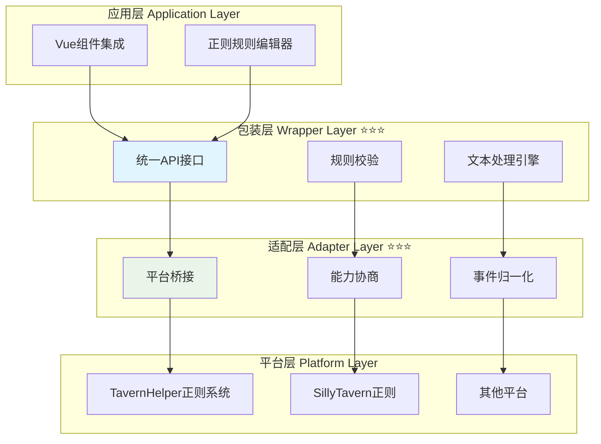

# 🔍 Regex - 正则系统模块

> **核心功能**：跨平台正则表达式管理与文本处理系统
> **必要性**：⭐⭐ **推荐** - 文本处理和内容过滤场景

## 📋 快速导航

| 文档 | 说明 | 推荐度 |
|------|------|--------|
| [**包装层实现**](./wrapper.md) | 核心API接口与业务逻辑 | ⭐⭐⭐ 必读 |
| [**适配层设计**](./adapter.md) | 平台差异封装与能力协商 | ⭐⭐⭐ 必读 |
| [**平台特性分析**](./platform.md) | 底层能力调研与对比 | ⭐⭐ 推荐 |
| [**应用层集成**](./application.md) | Vue/Pinia集成指南 | ⭐⭐ 推荐 |
| [**高级应用实现**](./advanced-application.md) | 复杂场景与性能优化 | ⭐ 可选 |

---

## 🎯 模块概述

正则系统模块 ([`CharacterAPI.regex`](/CHARACTER_API_RFC#_4-8-正则系统-characterapi-regex-⭐⭐)) 提供统一的正则表达式管理接口，用于文本的匹配、替换和过滤操作。

### ✅ 核心特性

- ✅ **统一的正则管理**：跨平台的正则表达式CRUD操作
- ✅ **灵活的匹配规则**：支持source/destination双维度配置
- ✅ **作用域控制**：全局(global)和角色(character)两种作用域
- ✅ **深度过滤**：支持按消息深度应用不同正则
- ✅ **实时应用**：formatText实时对文本应用正则处理
- ✅ **批量管理**：支持批量获取、更新和替换正则规则

### 🏗️ 四层架构



---

## 🔧 核心类型定义

### RegexRule - 正则规则

```typescript
interface RegexRule {
  id: string;                    // 规则唯一标识
  name: string;                  // 规则名称
  enabled: boolean;              // 是否启用
  scope: 'global' | 'character'; // 作用域
  pattern: string;               // 正则表达式模式
  replacement: string;           // 替换字符串
  flags?: string;                // 正则标志(i,g,m等)
  
  // 应用范围配置
  source: {
    user_input: boolean;         // 应用于用户输入
    ai_output: boolean;          // 应用于AI输出
    slash_command: boolean;      // 应用于斜杠命令
    world_info: boolean;         // 应用于世界书
  };
  
  destination: {
    display: boolean;            // 应用于显示
    prompt: boolean;             // 应用于提示词
  };
  
  // 深度控制
  min_depth?: number | null;     // 最小深度
  max_depth?: number | null;     // 最大深度
  
  // 执行控制
  run_on_edit?: boolean;         // 编辑时是否执行
}
```

### RegexConfig - 配置选项

```typescript
interface RegexConfig {
  scope?: 'global' | 'character' | 'all';  // 作用域过滤
  enabled?: boolean | 'all';               // 启用状态过滤
  validate?: boolean;                      // 是否校验正则合法性
}
```

### FormatTextOptions - 格式化选项

```typescript
interface FormatTextOptions {
  source: 'user_input' | 'ai_output' | 'slash_command' | 'world_info';
  destination: 'display' | 'prompt';
  depth?: number;                // 消息深度
  character_name?: string;       // 角色名称(用于character作用域)
  apply_rules?: string[];        // 仅应用指定ID的规则
  skip_rules?: string[];         // 跳过指定ID的规则
}
```

---

## 🚀 核心接口概览

### RegexManager - 正则管理器

```typescript
interface RegexManager {
  /** 获取正则规则列表 */
  getRegexes(options?: RegexConfig): Promise<RegexRule[]>;
  
  /** 获取单个正则规则 */
  getRegex(id: string): Promise<RegexRule | null>;
  
  /** 添加正则规则 */
  addRegex(rule: Omit<RegexRule, 'id'>): Promise<RegexRule>;
  
  /** 更新正则规则 */
  updateRegex(id: string, updates: Partial<RegexRule>): Promise<RegexRule>;
  
  /** 删除正则规则 */
  deleteRegex(id: string): Promise<void>;
  
  /** 批量更新正则规则 */
  updateRegexes(updater: (rules: RegexRule[]) => RegexRule[]): Promise<RegexRule[]>;
  
  /** 完全替换正则规则列表 */
  replaceRegexes(rules: RegexRule[], options?: { scope?: 'global' | 'character' }): Promise<void>;
  
  /** 对文本应用正则处理 */
  formatText(text: string, options: FormatTextOptions): Promise<string>;
  
  /** 检查角色正则是否启用 */
  isCharacterRegexEnabled(): Promise<boolean>;
  
  /** 启用/禁用角色正则 */
  setCharacterRegexEnabled(enabled: boolean): Promise<void>;
  
  /** 校验正则表达式 */
  validatePattern(pattern: string, flags?: string): { valid: boolean; error?: string };
  
  /** 能力发现 */
  getCapabilities?(): Promise<RegexCapabilities>;
}
```

### RegexCapabilities - 能力协商

```typescript
interface RegexCapabilities {
  supports: {
    scopes: {
      global: boolean;
      character: boolean;
    };
    features: {
      depth_filter: boolean;      // 深度过滤
      run_on_edit: boolean;       // 编辑时执行
      batch_update: boolean;      // 批量更新
      real_time_format: boolean;  // 实时格式化
    };
    sources: {
      user_input: boolean;
      ai_output: boolean;
      slash_command: boolean;
      world_info: boolean;
    };
  };
}
```

---

## 💡 使用示例

### 基础使用

```typescript
// 初始化
await CharacterAPI.init();

// 获取所有启用的全局正则
const globalRegexes = await CharacterAPI.regex.getRegexes({
  scope: 'global',
  enabled: true
});

// 添加新的正则规则
const newRegex = await CharacterAPI.regex.addRegex({
  name: '隐藏动作描述',
  enabled: true,
  scope: 'global',
  pattern: '\\*[^*]+\\*',
  replacement: '',
  source: {
    user_input: false,
    ai_output: true,
    slash_command: false,
    world_info: false
  },
  destination: {
    display: true,
    prompt: false
  }
});

// 对文本应用正则处理
const processed = await CharacterAPI.regex.formatText(
  '*微笑* 你好！',
  {
    source: 'ai_output',
    destination: 'display'
  }
);
// 结果: " 你好！"
```

### 批量更新

```typescript
// 启用所有包含特定关键词的正则
await CharacterAPI.regex.updateRegexes((rules) => {
  return rules.map(rule => {
    if (rule.name.includes('过滤')) {
      return { ...rule, enabled: true };
    }
    return rule;
  });
});
```

### 深度过滤

```typescript
// 添加仅应用于最近3条消息的正则
await CharacterAPI.regex.addRegex({
  name: '最近消息过滤',
  enabled: true,
  scope: 'global',
  pattern: '\\[敏感词\\]',
  replacement: '[***]',
  min_depth: 0,
  max_depth: 3,
  source: {
    user_input: true,
    ai_output: true,
    slash_command: false,
    world_info: false
  },
  destination: {
    display: true,
    prompt: true
  }
});
```

---

## 🔄 事件系统集成

正则操作会触发标准事件：

```typescript
// 正则规则变化事件
CharacterAPI.events.on('regex:changed', (payload) => {
  console.log('正则规则已更新:', payload.rules);
});

// 正则应用事件
CharacterAPI.events.on('regex:applied', (payload) => {
  console.log('正则已应用:', {
    original: payload.original,
    processed: payload.processed,
    rules_applied: payload.rulesApplied
  });
});

// 错误事件
CharacterAPI.events.on('regex:error', (error) => {
  console.error('正则操作错误:', error);
});
```

---

## 📊 应用场景

### 🎭 内容过滤

```typescript
// 隐藏特定格式的内容
await CharacterAPI.regex.addRegex({
  name: '隐藏括号注释',
  pattern: '\\([^)]+\\)',
  replacement: '',
  // ... 其他配置
});
```

### 🔄 内容替换

```typescript
// 替换特定词汇
await CharacterAPI.regex.addRegex({
  name: '术语统一',
  pattern: '魔法',
  replacement: '咒术',
  flags: 'gi',  // 全局不区分大小写
  // ... 其他配置
});
```

### 🎨 格式美化

```typescript
// 格式化输出文本
await CharacterAPI.regex.addRegex({
  name: '引号统一',
  pattern: '"([^"]+)"',
  replacement: '「$1」',
  // ... 其他配置
});
```

---

## ⚠️ 平台兼容性

| 平台 | 支持程度 | 说明 |
|------|---------|------|
| **TavernHelper** | ✅ 完整支持 | 原生正则系统，所有功能可用 |
| **SillyTavern** | ✅ 完整支持 | 内置正则系统，功能对齐 |
| **其他平台** | ⚠️ 部分支持 | 通过适配层实现基础功能 |

### 降级策略

- ❌ **不支持深度过滤**：忽略 min_depth/max_depth 字段
- ❌ **不支持作用域**：所有规则视为全局规则
- ❌ **不支持source/destination细分**：统一应用于所有场景

---

## 💡 最佳实践

### ✅ 推荐做法

- **合理使用作用域**：全局规则用于通用处理，角色规则用于特定角色
- **启用深度过滤**：避免对历史消息重复应用正则
- **谨慎使用替换**：确保replacement不会破坏文本结构
- **批量更新优化**：使用 [`updateRegexes()`](./wrapper.md#updateregexes) 而非多次单独更新
- **校验正则合法性**：使用 [`validatePattern()`](./wrapper.md#validatepattern) 避免无效正则

### ❌ 避免的做法

- ❌ 避免过于复杂的正则表达式
- ❌ 避免频繁调用 [`replaceRegexes()`](./wrapper.md#replaceregexes)（会重新加载聊天）
- ❌ 避免在正则中使用捕获组而不使用替换
- ❌ 避免正则规则间的相互冲突

---

## 🔗 相关文档

### 核心文档
- [RFC 主文档 - 正则系统章节](/CHARACTER_API_RFC#_4-8-正则系统-characterapi-regex-⭐⭐)
- [TavernHelper 正则文档](../../resource/TAVERNHELPER.md#酒馆正则)

### 模块文档
- [包装层实现](./wrapper.md) - 核心业务逻辑
- [适配层设计](./adapter.md) - 平台差异封装
- [平台特性分析](./platform.md) - 底层能力调研

### 相关模块
- [Event 模块](../event/) - 事件系统集成
- [Variable 模块](../variable/) - 变量存储正则配置

---

## 📈 性能考虑

### 性能优化建议

1. **缓存正则对象**：避免重复编译正则表达式
2. **延迟应用**：仅在需要时才应用正则处理
3. **规则排序**：按使用频率排序规则列表
4. **惰性匹配**：使用非贪婪匹配避免性能问题

### 性能监控

```typescript
// 监控正则处理性能
CharacterAPI.events.on('regex:applied', (payload) => {
  if (payload.duration > 100) {
    console.warn('正则处理耗时过长:', payload);
  }
});
```

---

<style scoped>
.vp-doc h2 {
  margin-top: 2rem;
  padding-top: 1rem;
  border-top: 1px solid var(--vp-c-divider);
}
</style>