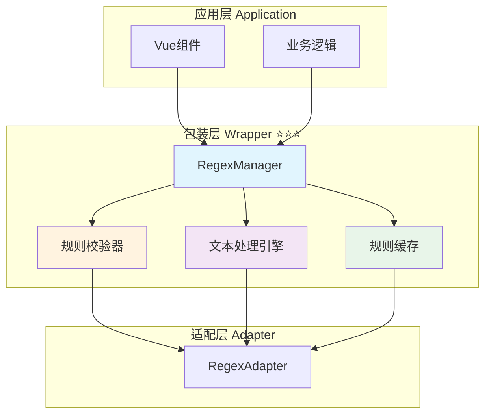

# 📦 包装层：统一正则管理器实现

> **文档定位**：定义包装层正则管理器的完整实现，提供统一的正则API接口和规则管理。

---

## 📋 目录

1. [包装层职责与目标](#包装层职责与目标)
2. [核心接口实现](#核心接口实现)
3. [RegexManager 完整实现](#regexmanager-完整实现)
4. [规则校验与转换](#规则校验与转换)
5. [文本处理引擎](#文本处理引擎)
6. [批量操作优化](#批量操作优化)
7. [使用示例与最佳实践](#使用示例与最佳实践)

---

## 包装层职责与目标

### 🎯 核心职责

包装层作为应用层与适配层之间的桥梁，主要负责：

1. **统一正则API** ⭐⭐⭐
   - 提供简洁一致的正则管理接口
   - 隐藏底层适配器的复杂性
   - 确保类型安全和接口稳定性

2. **规则校验与转换** ⭐⭐⭐
   - 校验正则表达式的合法性
   - 转换字段命名（如 [`script_name`](../../resource/TAVERNHELPER.md#酒馆正则) → [`name`](./index.md#regexrule---正则规则)）
   - 补充默认值和必填字段

3. **文本处理引擎** ⭐⭐⭐
   - 高效的正则应用算法
   - 支持深度过滤和作用域控制
   - 缓存编译的正则对象

4. **批量操作优化** ⭐⭐
   - 提供高效的批量更新接口
   - 减少不必要的平台调用
   - 优化性能和响应速度

### 📊 架构定位



---

## 核心接口实现

### 1. RegexManager 接口定义 ⭐⭐⭐

```typescript
/**
 * 正则管理器接口
 * 提供统一的正则表达式管理能力
 */
interface RegexManager {
  /**
   * 获取正则规则列表
   * @param options 过滤选项
   */
  getRegexes(options?: RegexConfig): Promise<RegexRule[]>;
  
  /**
   * 获取单个正则规则
   * @param id 规则ID
   */
  getRegex(id: string): Promise<RegexRule | null>;
  
  /**
   * 添加正则规则
   * @param rule 规则定义（无需ID）
   */
  addRegex(rule: Omit<RegexRule, 'id'>): Promise<RegexRule>;
  
  /**
   * 更新正则规则
   * @param id 规则ID
   * @param updates 要更新的字段
   */
  updateRegex(id: string, updates: Partial<RegexRule>): Promise<RegexRule>;
  
  /**
   * 删除正则规则
   * @param id 规则ID
   */
  deleteRegex(id: string): Promise<void>;
  
  /**
   * 批量更新正则规则
   * @param updater 更新函数
   */
  updateRegexes(updater: (rules: RegexRule[]) => RegexRule[]): Promise<RegexRule[]>;
  
  /**
   * 完全替换正则规则列表
   * @param rules 新的规则列表
   * @param options 替换选项
   */
  replaceRegexes(rules: RegexRule[], options?: { scope?: 'global' | 'character' }): Promise<void>;
  
  /**
   * 对文本应用正则处理
   * @param text 原始文本
   * @param options 处理选项
   */
  formatText(text: string, options: FormatTextOptions): Promise<string>;
  
  /**
   * 检查角色正则是否启用
   */
  isCharacterRegexEnabled(): Promise<boolean>;
  
  /**
   * 启用/禁用角色正则
   * @param enabled 是否启用
   */
  setCharacterRegexEnabled(enabled: boolean): Promise<void>;
  
  /**
   * 校验正则表达式
   * @param pattern 正则模式
   * @param flags 正则标志
   */
  validatePattern(pattern: string, flags?: string): { valid: boolean; error?: string };
  
  /**
   * 获取适配器能力
   */
  getCapabilities?(): Promise<RegexCapabilities>;
}
```

### 2. 类型定义 ⭐⭐⭐

```typescript
/** 正则规则 */
interface RegexRule {
  id: string;
  name: string;
  enabled: boolean;
  scope: 'global' | 'character';
  pattern: string;
  replacement: string;
  flags?: string;
  
  source: {
    user_input: boolean;
    ai_output: boolean;
    slash_command: boolean;
    world_info: boolean;
  };
  
  destination: {
    display: boolean;
    prompt: boolean;
  };
  
  min_depth?: number | null;
  max_depth?: number | null;
  run_on_edit?: boolean;
}

/** 配置选项 */
interface RegexConfig {
  scope?: 'global' | 'character' | 'all';
  enabled?: boolean | 'all';
  validate?: boolean;
}

/** 格式化选项 */
interface FormatTextOptions {
  source: 'user_input' | 'ai_output' | 'slash_command' | 'world_info';
  destination: 'display' | 'prompt';
  depth?: number;
  character_name?: string;
  apply_rules?: string[];
  skip_rules?: string[];
}

/** 能力声明 */
interface RegexCapabilities {
  supports: {
    scopes: {
      global: boolean;
      character: boolean;
    };
    features: {
      depth_filter: boolean;
      run_on_edit: boolean;
      batch_update: boolean;
      real_time_format: boolean;
    };
    sources: {
      user_input: boolean;
      ai_output: boolean;
      slash_command: boolean;
      world_info: boolean;
    };
  };
}
```

---

## RegexManager 完整实现

### 核心实现类 ⭐⭐⭐

```typescript
/**
 * 正则管理器实现
 * 基于适配器模式，提供统一的正则管理能力
 */
class RegexManagerImpl implements RegexManager {
  /** 适配器实例 */
  private adapter: RegexAdapter;
  
  /** 正则对象缓存 */
  private regexCache: Map<string, RegExp> = new Map();
  
  /** 调试模式 */
  private debugMode: boolean = false;
  
  /**
   * 构造函数
   * @param adapter 正则适配器实例
   * @param options 配置选项
   */
  constructor(
    adapter: RegexAdapter,
    options?: {
      debug?: boolean;
    }
  ) {
    this.adapter = adapter;
    this.debugMode = options?.debug || false;
  }
  
  /**
   * 获取正则规则列表
   */
  async getRegexes(options?: RegexConfig): Promise<RegexRule[]> {
    try {
      const rules = await this.adapter.getRegexes(options);
      
      // 可选：校验规则
      if (options?.validate) {
        return rules.filter(rule => {
          const validation = this.validatePattern(rule.pattern, rule.flags);
          if (!validation.valid) {
            console.warn(`Invalid regex rule ${rule.id}:`, validation.error);
            return false;
          }
          return true;
        });
      }
      
      return rules;
    } catch (error) {
      console.error('Error getting regexes:', error);
      throw error;
    }
  }
  
  /**
   * 获取单个正则规则
   */
  async getRegex(id: string): Promise<RegexRule | null> {
    try {
      return await this.adapter.getRegex(id);
    } catch (error) {
      console.error(`Error getting regex ${id}:`, error);
      throw error;
    }
  }
  
  /**
   * 添加正则规则
   */
  async addRegex(rule: Omit<RegexRule, 'id'>): Promise<RegexRule> {
    // 校验正则表达式
    const validation = this.validatePattern(rule.pattern, rule.flags);
    if (!validation.valid) {
      throw new Error(`Invalid regex pattern: ${validation.error}`);
    }
    
    try {
      const newRule = await this.adapter.addRegex(rule);
      this.debugLog('addRegex', newRule.id, newRule.name);
      return newRule;
    } catch (error) {
      console.error('Error adding regex:', error);
      throw error;
    }
  }
  
  /**
   * 更新正则规则
   */
  async updateRegex(id: string, updates: Partial<RegexRule>): Promise<RegexRule> {
    // 如果更新了pattern，校验新的正则
    if (updates.pattern !== undefined) {
      const validation = this.validatePattern(updates.pattern, updates.flags);
      if (!validation.valid) {
        throw new Error(`Invalid regex pattern: ${validation.error}`);
      }
      
      // 清除缓存
      this.clearRegexCache(id);
    }
    
    try {
      const updatedRule = await this.adapter.updateRegex(id, updates);
      this.debugLog('updateRegex', id, updates);
      return updatedRule;
    } catch (error) {
      console.error(`Error updating regex ${id}:`, error);
      throw error;
    }
  }
  
  /**
   * 删除正则规则
   */
  async deleteRegex(id: string): Promise<void> {
    try {
      await this.adapter.deleteRegex(id);
      this.clearRegexCache(id);
      this.debugLog('deleteRegex', id);
    } catch (error) {
      console.error(`Error deleting regex ${id}:`, error);
      throw error;
    }
  }
  
  /**
   * 批量更新正则规则
   */
  async updateRegexes(updater: (rules: RegexRule[]) => RegexRule[]): Promise<RegexRule[]> {
    try {
      const currentRules = await this.getRegexes();
      const updatedRules = updater(currentRules);
      
      // 校验所有更新后的规则
      for (const rule of updatedRules) {
        const validation = this.validatePattern(rule.pattern, rule.flags);
        if (!validation.valid) {
          throw new Error(`Invalid regex in batch update (${rule.id}): ${validation.error}`);
        }
      }
      
      const result = await this.adapter.updateRegexes(() => updatedRules);
      
      // 清除所有缓存
      this.regexCache.clear();
      
      this.debugLog('updateRegexes', 'batch', updatedRules.length);
      return result;
    } catch (error) {
      console.error('Error updating regexes in batch:', error);
      throw error;
    }
  }
  
  /**
   * 完全替换正则规则列表
   */
  async replaceRegexes(
    rules: RegexRule[],
    options?: { scope?: 'global' | 'character' }
  ): Promise<void> {
    // 校验所有规则
    for (const rule of rules) {
      const validation = this.validatePattern(rule.pattern, rule.flags);
      if (!validation.valid) {
        throw new Error(`Invalid regex in replacement (${rule.id}): ${validation.error}`);
      }
    }
    
    try {
      await this.adapter.replaceRegexes(rules, options);
      this.regexCache.clear();
      this.debugLog('replaceRegexes', options?.scope || 'all', rules.length);
    } catch (error) {
      console.error('Error replacing regexes:', error);
      throw error;
    }
  }
  
  /**
   * 对文本应用正则处理
   */
  async formatText(text: string, options: FormatTextOptions): Promise<string> {
    try {
      // 获取适用的规则
      const rules = await this.getApplicableRules(options);
      
      let result = text;
      
      // 依次应用每个规则
      for (const rule of rules) {
        try {
          result = this.applyRule(result, rule);
        } catch (error) {
          console.error(`Error applying regex rule ${rule.id}:`, error);
          // 继续处理其他规则
        }
      }
      
      this.debugLog('formatText', options, { original: text.length, processed: result.length });
      return result;
    } catch (error) {
      console.error('Error formatting text:', error);
      throw error;
    }
  }
  
  /**
   * 检查角色正则是否启用
   */
  async isCharacterRegexEnabled(): Promise<boolean> {
    try {
      return await this.adapter.isCharacterRegexEnabled();
    } catch (error) {
      console.error('Error checking character regex enabled:', error);
      throw error;
    }
  }
  
  /**
   * 启用/禁用角色正则
   */
  async setCharacterRegexEnabled(enabled: boolean): Promise<void> {
    try {
      await this.adapter.setCharacterRegexEnabled(enabled);
      this.debugLog('setCharacterRegexEnabled', enabled);
    } catch (error) {
      console.error('Error setting character regex enabled:', error);
      throw error;
    }
  }
  
  /**
   * 校验正则表达式
   */
  validatePattern(pattern: string, flags?: string): { valid: boolean; error?: string } {
    try {
      new RegExp(pattern, flags);
      return { valid: true };
    } catch (error: any) {
      return {
        valid: false,
        error: error.message || '无效的正则表达式'
      };
    }
  }
  
  /**
   * 获取适配器能力
   */
  async getCapabilities(): Promise<RegexCapabilities> {
    if (this.adapter.getCapabilities) {
      return await this.adapter.getCapabilities();
    }
    
    // 默认能力
    return {
      supports: {
        scopes: {
          global: true,
          character: false,
        },
        features: {
          depth_filter: false,
          run_on_edit: false,
          batch_update: true,
          real_time_format: true,
        },
        sources: {
          user_input: true,
          ai_output: true,
          slash_command: false,
          world_info: false,
        },
      },
    };
  }
  
  /**
   * 获取适用的规则列表
   */
  private async getApplicableRules(options: FormatTextOptions): Promise<RegexRule[]> {
    const allRules = await this.getRegexes({ enabled: true });
    
    return allRules.filter(rule => {
      // 检查 source
      if (!rule.source[options.source]) {
        return false;
      }
      
      // 检查 destination
      if (!rule.destination[options.destination]) {
        return false;
      }
      
      // 检查深度范围
      if (options.depth !== undefined) {
        if (rule.min_depth !== null && rule.min_depth !== undefined && options.depth < rule.min_depth) {
          return false;
        }
        if (rule.max_depth !== null && rule.max_depth !== undefined && options.depth > rule.max_depth) {
          return false;
        }
      }
      
      // 检查 apply_rules 白名单
      if (options.apply_rules && !options.apply_rules.includes(rule.id)) {
        return false;
      }
      
      // 检查 skip_rules 黑名单
      if (options.skip_rules && options.skip_rules.includes(rule.id)) {
        return false;
      }
      
      return true;
    });
  }
  
  /**
   * 应用单个规则
   */
  private applyRule(text: string, rule: RegexRule): string {
    const regex = this.getCompiledRegex(rule);
    return text.replace(regex, rule.replacement);
  }
  
  /**
   * 获取编译的正则对象（带缓存）
   */
  private getCompiledRegex(rule: RegexRule): RegExp {
    const cacheKey = `${rule.id}:${rule.pattern}:${rule.flags || ''}`;
    
    if (!this.regexCache.has(cacheKey)) {
      const regex = new RegExp(rule.pattern, rule.flags);
      this.regexCache.set(cacheKey, regex);
    }
    
    return this.regexCache.get(cacheKey)!;
  }
  
  /**
   * 清除指定规则的缓存
   */
  private clearRegexCache(ruleId: string): void {
    const keysToDelete: string[] = [];
    
    for (const key of this.regexCache.keys()) {
      if (key.startsWith(`${ruleId}:`)) {
        keysToDelete.push(key);
      }
    }
    
    keysToDelete.forEach(key => this.regexCache.delete(key));
  }
  
  /**
   * 调试日志
   */
  private debugLog(action: string, ...args: any[]): void {
    if (this.debugMode) {
      console.log(`[RegexManager] ${action}`, ...args);
    }
  }
}
```

---

## 规则校验与转换

### 1. 规则校验器 ⭐⭐⭐

```typescript
/**
 * 正则规则校验器
 */
class RegexRuleValidator {
  /**
   * 校验完整规则
   */
  validateRule(rule: Partial<RegexRule>): { valid: boolean; errors: string[] } {
    const errors: string[] = [];
    
    // 校验必填字段
    if (!rule.name || rule.name.trim() === '') {
      errors.push('规则名称不能为空');
    }
    
    if (!rule.pattern) {
      errors.push('正则模式不能为空');
    } else {
      // 校验正则语法
      try {
        new RegExp(rule.pattern, rule.flags);
      } catch (error: any) {
        errors.push(`正则语法错误: ${error.message}`);
      }
    }
    
    if (rule.replacement === undefined) {
      errors.push('替换字符串不能为空（可以是空字符串）');
    }
    
    // 校验 scope
    if (rule.scope && !['global', 'character'].includes(rule.scope)) {
      errors.push('作用域必须是 global 或 character');
    }
    
    // 校验 source
    if (rule.source) {
      const validSources = ['user_input', 'ai_output', 'slash_command', 'world_info'];
      const hasAtLeastOneSource = validSources.some(s => rule.source![s as keyof typeof rule.source]);
      if (!hasAtLeastOneSource) {
        errors.push('至少需要启用一个 source');
      }
    }
    
    // 校验 destination
    if (rule.destination) {
      if (!rule.destination.display && !rule.destination.prompt) {
        errors.push('至少需要启用一个 destination');
      }
    }
    
    // 校验深度范围
    if (rule.min_depth !== undefined && rule.min_depth !== null && rule.min_depth < 0) {
      errors.push('min_depth 不能为负数');
    }
    
    if (rule.max_depth !== undefined && rule.max_depth !== null && rule.max_depth < 0) {
      errors.push('max_depth 不能为负数');
    }
    
    if (
      rule.min_depth !== undefined && rule.min_depth !== null &&
      rule.max_depth !== undefined && rule.max_depth !== null &&
      rule.min_depth > rule.max_depth
    ) {
      errors.push('min_depth 不能大于 max_depth');
    }
    
    return {
      valid: errors.length === 0,
      errors,
    };
  }
  
  /**
   * 补充默认值
   */
  fillDefaults(rule: Partial<RegexRule>): Partial<RegexRule> {
    return {
      enabled: true,
      scope: 'global',
      flags: 'g',
      source: {
        user_input: false,
        ai_output: true,
        slash_command: false,
        world_info: false,
      },
      destination: {
        display: true,
        prompt: false,
      },
      run_on_edit: false,
      ...rule,
    };
  }
}
```

### 2. 字段转换器 ⭐⭐

```typescript
/**
 * 字段转换器
 * 处理不同命名约定之间的转换
 */
class RegexFieldConverter {
  /**
   * 平台格式 → 标准格式
   */
  toStandardFormat(platformRule: any): RegexRule {
    return {
      id: platformRule.id,
      name: platformRule.script_name || platformRule.name,
      enabled: platformRule.enabled ?? true,
      scope: platformRule.scope || 'global',
      pattern: platformRule.find_regex || platformRule.pattern,
      replacement: platformRule.replace_string ?? platformRule.replacement ?? '',
      flags: this.extractFlags(platformRule),
      source: platformRule.source || this.getDefaultSource(),
      destination: platformRule.destination || this.getDefaultDestination(),
      min_depth: platformRule.min_depth,
      max_depth: platformRule.max_depth,
      run_on_edit: platformRule.run_on_edit ?? false,
    };
  }
  
  /**
   * 标准格式 → 平台格式
   */
  toPlatformFormat(standardRule: RegexRule): any {
    return {
      id: standardRule.id,
      script_name: standardRule.name,
      enabled: standardRule.enabled,
      scope: standardRule.scope,
      find_regex: standardRule.pattern,
      replace_string: standardRule.replacement,
      source: standardRule.source,
      destination: standardRule.destination,
      min_depth: standardRule.min_depth,
      max_depth: standardRule.max_depth,
      run_on_edit: standardRule.run_on_edit,
    };
  }
  
  /**
   * 提取正则标志
   */
  private extractFlags(rule: any): string | undefined {
    if (rule.flags) return rule.flags;
    
    // 尝试从 find_regex 或 pattern 中提取
    const pattern = rule.find_regex || rule.pattern;
    if (typeof pattern === 'string' && pattern.startsWith('/')) {
      const match = pattern.match(/\/([gimsuvy]*)$/);
      return match ? match[1] : 'g';
    }
    
    return 'g';
  }
  
  /**
   * 默认 source
   */
  private getDefaultSource() {
    return {
      user_input: false,
      ai_output: true,
      slash_command: false,
      world_info: false,
    };
  }
  
  /**
   * 默认 destination
   */
  private getDefaultDestination() {
    return {
      display: true,
      prompt: false,
    };
  }
}
```

---

## 文本处理引擎

### 高性能文本处理 ⭐⭐⭐

```typescript
/**
 * 文本处理引擎
 * 优化的正则应用算法
 */
class RegexTextProcessor {
  private regexCache: Map<string, RegExp> = new Map();
  
  /**
   * 批量应用正则规则
   */
  processText(
    text: string,
    rules: RegexRule[],
    options?: {
      stopOnError?: boolean;
      logErrors?: boolean;
    }
  ): string {
    let result = text;
    const errors: Array<{ rule: string; error: string }> = [];
    
    for (const rule of rules) {
      try {
        result = this.applySingleRule(result, rule);
      } catch (error: any) {
        const errorInfo = {
          rule: rule.id,
          error: error.message || '应用规则失败',
        };
        
        errors.push(errorInfo);
        
        if (options?.logErrors) {
          console.error(`Error applying rule ${rule.id}:`, error);
        }
        
        if (options?.stopOnError) {
          throw new Error(`规则应用失败 (${rule.id}): ${error.message}`);
        }
      }
    }
    
    return result;
  }
  
  /**
   * 应用单个规则
   */
  private applySingleRule(text: string, rule: RegexRule): string {
    const regex = this.getOrCompileRegex(rule);
    return text.replace(regex, rule.replacement);
  }
  
  /**
   * 获取或编译正则（带缓存）
   */
  private getOrCompileRegex(rule: RegexRule): RegExp {
    const cacheKey = this.getCacheKey(rule);
    
    if (!this.regexCache.has(cacheKey)) {
      const regex = new RegExp(rule.pattern, rule.flags || 'g');
      this.regexCache.set(cacheKey, regex);
    }
    
    return this.regexCache.get(cacheKey)!;
  }
  
  /**
   * 生成缓存键
   */
  private getCacheKey(rule: RegexRule): string {
    return `${rule.id}:${rule.pattern}:${rule.flags || 'g'}`;
  }
  
  /**
   * 清除缓存
   */
  clearCache(): void {
    this.regexCache.clear();
  }
  
  /**
   * 清除特定规则的缓存
   */
  clearRuleCache(ruleId: string): void {
    const keysToDelete: string[] = [];
    
    for (const key of this.regexCache.keys()) {
      if (key.startsWith(`${ruleId}:`)) {
        keysToDelete.push(key);
      }
    }
    
    keysToDelete.forEach(key => this.regexCache.delete(key));
  }
}
```

---

## 批量操作优化

### 1. 批量更新优化 ⭐⭐⭐

```typescript
/**
 * 批量操作助手
 */
class RegexBatchOperations {
  constructor(private manager: RegexManager) {}
  
  /**
   * 批量启用规则
   */
  async enableRules(ruleIds: string[]): Promise<RegexRule[]> {
    return await this.manager.updateRegexes((rules) => {
      return rules.map(rule => {
        if (ruleIds.includes(rule.id)) {
          return { ...rule, enabled: true };
        }
        return rule;
      });
    });
  }
  
  /**
   * 批量禁用规则
   */
  async disableRules(ruleIds: string[]): Promise<RegexRule[]> {
    return await this.manager.updateRegexes((rules) => {
      return rules.map(rule => {
        if (ruleIds.includes(rule.id)) {
          return { ...rule, enabled: false };
        }
        return rule;
      });
    });
  }
  
  /**
   * 批量修改作用域
   */
  async changeScope(
    ruleIds: string[],
    newScope: 'global' | 'character'
  ): Promise<RegexRule[]> {
    return await this.manager.updateRegexes((rules) => {
      return rules.map(rule => {
        if (ruleIds.includes(rule.id)) {
          return { ...rule, scope: newScope };
        }
        return rule;
      });
    });
  }
  
  /**
   * 批量设置深度范围
   */
  async setDepthRange(
    ruleIds: string[],
    minDepth: number | null,
    maxDepth: number | null
  ): Promise<RegexRule[]> {
    return await this.manager.updateRegexes((rules) => {
      return rules.map(rule => {
        if (ruleIds.includes(rule.id)) {
          return {
            ...rule,
            min_depth: minDepth,
            max_depth: maxDepth,
          };
        }
        return rule;
      });
    });
  }
  
  /**
   * 按名称批量操作
   */
  async updateByName(
    namePattern: RegExp,
    updates: Partial<RegexRule>
  ): Promise<RegexRule[]> {
    return await this.manager.updateRegexes((rules) => {
      return rules.map(rule => {
        if (namePattern.test(rule.name)) {
          return { ...rule, ...updates };
        }
        return rule;
      });
    });
  }
}
```

### 2. 事务式更新 ⭐⭐

```typescript
/**
 * 事务式正则更新
 * 支持回滚
 */
class RegexTransaction {
  private backup: RegexRule[] | null = null;
  
  constructor(private manager: RegexManager) {}
  
  /**
   * 开始事务
   */
  async begin(): Promise<void> {
    this.backup = await this.manager.getRegexes();
  }
  
  /**
   * 提交事务
   */
  async commit(): Promise<void> {
    this.backup = null;
  }
  
  /**
   * 回滚事务
   */
  async rollback(): Promise<void> {
    if (!this.backup) {
      throw new Error('No transaction to rollback');
    }
    
    await this.manager.replaceRegexes(this.backup);
    this.backup = null;
  }
  
  /**
   * 执行事务操作
   */
  async execute<T>(
    operation: () => Promise<T>
  ): Promise<T> {
    await this.begin();
    
    try {
      const result = await operation();
      await this.commit();
      return result;
    } catch (error) {
      await this.rollback();
      throw error;
    }
  }
}

// 使用示例
const transaction = new RegexTransaction(regexManager);

await transaction.execute(async () => {
  // 批量操作，任何失败都会回滚
  await regexManager.updateRegex('rule-1', { enabled: false });
  await regexManager.updateRegex('rule-2', { pattern: 'new-pattern' });
  await regexManager.deleteRegex('rule-3');
});
```

---

## 使用示例与最佳实践

### 1. 基础使用 ⭐⭐⭐

```typescript
// 创建正则管理器
const adapter = new TavernHelperRegexAdapter();
const regexManager = new RegexManagerImpl(adapter, { debug: true });

// 获取所有启用的全局正则
const globalRegexes = await regexManager.getRegexes({
  scope: 'global',
  enabled: true
});

// 添加新规则
const newRule = await regexManager.addRegex({
  name: '隐藏动作描述',
  enabled: true,
  scope: 'global',
  pattern: '\\*[^*]+\\*',
  replacement: '',
  source: {
    user_input: false,
    ai_output: true,
    slash_command: false,
    world_info: false
  },
  destination: {
    display: true,
    prompt: false
  }
});

// 对文本应用正则
const processed = await regexManager.formatText(
  '*微笑* 你好！',
  {
    source: 'ai_output',
    destination: 'display'
  }
);
console.log(processed); // " 你好！"
```

### 2. 批量管理 ⭐⭐⭐

```typescript
// 启用所有包含"过滤"的规则
await regexManager.updateRegexes((rules) => {
  return rules.map(rule => {
    if (rule.name.includes('过滤')) {
      return { ...rule, enabled: true };
    }
    return rule;
  });
});

// 使用批量操作助手
const batchOps = new RegexBatchOperations(regexManager);

// 批量禁用指定规则
await batchOps.disableRules(['rule-1', 'rule-2', 'rule-3']);

// 批量设置深度范围
await batchOps.setDepthRange(['rule-4', 'rule-5'], 0, 3);
```

### 3. 文本处理 ⭐⭐⭐

```typescript
// 高性能文本处理
const processor = new RegexTextProcessor();

const rules = await regexManager.getRegexes({ enabled: true });
const processed = processor.processText(originalText, rules, {
  stopOnError: false,
  logErrors: true
});
```

### 4. 规则校验 ⭐⭐

```typescript
// 校验规则
const validator = new RegexRuleValidator();

const ruleToValidate: Partial<RegexRule> = {
  name: '测试规则',
  pattern: '\\d+',
  replacement: 'NUM',
  scope: 'global'
};

const validation = validator.validateRule(ruleToValidate);

if (!validation.valid) {
  console.error('规则验证失败:', validation.errors);
} else {
  // 补充默认值
  const completeRule = validator.fillDefaults(ruleToValidate);
  await regexManager.addRegex(completeRule as Omit<RegexRule, 'id'>);
}
```

---

## 🔗 相关资源

- **适配层**：[`adapter.md`](./adapter.md) - 正则适配器实现
- **平台层**：[`platform.md`](./platform.md) - TavernHelper正则能力
- **应用层**：[`application.md`](./application.md) - Vue组件集成
- **RFC规范**：[`CHARACTER_API_RFC.md`](/CHARACTER_API_RFC#_4-8-正则系统-characterapi-regex-⭐⭐)

---

## 📊 性能基准

### 操作性能指标

| 操作 | 时间复杂度 | 说明 |
|------|-----------|------|
| [`getRegexes()`](./index.md#getregexes) | O(n) | n为规则数量 |
| [`getRegex()`](./index.md#getregex) | O(1) | 直接查找 |
| [`addRegex()`](./index.md#addregex) | O(1) | 单规则添加 |
| [`updateRegex()`](./index.md#updateregex) | O(1) | 单规则更新 |
| [`deleteRegex()`](./index.md#deleteregex) | O(1) | 单规则删除 |
| [`updateRegexes()`](./index.md#updateregexes) | O(n) | 批量更新 |
| [`formatText()`](./index.md#formattext) | O(n*m) | n为规则数，m为文本长度 |

### 内存占用

- 每个编译的正则对象：约100-500字节
- 100个规则的缓存：约10-50KB
- 建议规则总数：< 200

### 优化建议

1. **使用批量操作**：优先使用 [`updateRegexes()`](./index.md#updateregexes) 而非多次单独更新
2. **缓存利用**：编译的正则对象会自动缓存
3. **规则排序**：按使用频率排序规则列表
4. **避免复杂正则**：减少回溯，使用简单高效的模式

---

> **📖 文档状态**：本文档提供了正则管理器包装层的完整实现，包括核心接口、规则校验、文本处理引擎和批量操作优化。

<style scoped>
.vp-doc h2 {
  margin-top: 2rem;
  padding-top: 1rem;
  border-top: 1px solid var(--vp-c-divider);
}
</style>