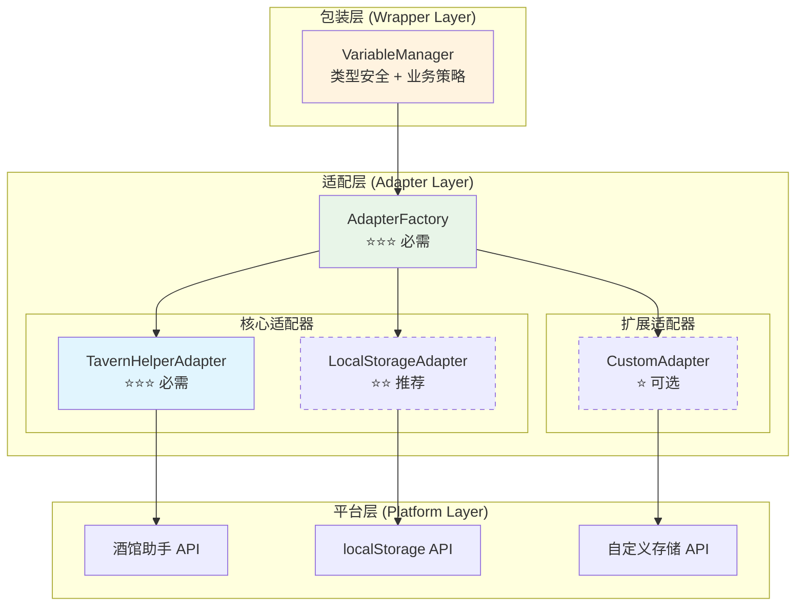

# 🔌 CharacterAPI.variable 平台适配层 RFC

> **职责**：将各平台底层差异抹平为统一语义，支撑跨平台变量存储的标准化接口
> **目标**：实现"包装=规范、能力协商、事件标准化"的适配层架构

## 📋 快速导航

| 组件 | 职责 | 推荐度 | 适用场景 | 跳转 |
|------|------|--------|----------|------|
| **SPI 合同** | 标准接口定义 | ⭐⭐⭐ **必需** | 所有平台实现 | [→](#🎯-spi-合同标准接口) |
| **TavernHelper 适配器** | 酒馆助手平台对接 | ⭐⭐⭐ **必需** | 酒馆助手环境 | [→](#🚀-tavernhelper-适配器) |
| **LocalStorage 适配器** | 浏览器存储对接 | ⭐⭐ **推荐** | Web 环境备选 | [→](#💾-localstorage-适配器) |
| **工厂注册系统** | 平台检测与创建 | ⭐⭐⭐ **必需** | 自动平台选择 | [→](#🏭-工厂注册与加载) |
| **能力协商机制** | 运行时能力发现 | ⭐⭐ **推荐** | 功能降级处理 | [→](#⚙️-能力协商与事件标准化) |
| **错误标准化** | 统一错误处理 | ⭐⭐ **推荐** | 错误恢复建议 | [→](#🚨-错误语义与恢复建议) |

## 🎯 架构概览



## 💡 **实施策略**

### 🎯 **推荐架构**

```typescript
// 默认导出最佳实践版本
export { VariableAdapterFactory as AdapterFactory };
export { TavernHelperAdapter } from './adapters/tavern-helper';
```


---

## 🎯 SPI 合同（标准接口）

### VariableScope ⭐⭐⭐
>
> **职责**：定义变量作用域枚举
> **必要性**：**绝对必需** - 所有适配器必须支持的作用域标准

#### 核心特性

- ✅ 标准化作用域定义
- ✅ 包含 DEFAULT 作用域兜底
- ✅ 支持平台特定映射

#### 接口概览

```typescript
export enum VariableScope {
  CHAT = 'chat',
  GLOBAL = 'global', 
  CHARACTER = 'character',
  MESSAGE = 'message',
  SCRIPT = 'script',
  DEFAULT = 'default'
}
```

> 📖 **完整实现参考**：[附录 A.1](#a1-类型与接口完整拷贝)

### VariableAdapter 接口 ⭐⭐⭐
>
> **职责**：适配器标准合同定义
> **必要性**：**绝对必需** - 所有平台适配器的统一接口

#### 核心特性

- ✅ 统一的 Promise 返回形态
- ✅ 标准化的结果结构 (`VariableResult/BatchResult`)
- ✅ 能力声明与协商支持
- ✅ 生命周期管理 (`initialize/dispose`)

#### 接口概览

```typescript
export interface VariableAdapter {
  readonly platform: string;
  readonly capabilities: PlatformCapabilities;
  
  // 生命周期
  initialize(): Promise<void>;
  dispose(): Promise<void>;
  
  // 基础操作
  get(key: string, scope?: VariableScope): Promise<VariableResult<string>>;
  set(key: string, value: string, scope?: VariableScope): Promise<VariableResult<void>>;
  delete(key: string, scope?: VariableScope): Promise<VariableResult<void>>;
  exists(key: string, scope?: VariableScope): Promise<VariableResult<boolean>>;
  
  // 批量操作
  getMany(keys: string[], scope?: VariableScope): Promise<BatchResult<string>>;
  setMany(variables: Record<string, string>, scope?: VariableScope): Promise<BatchResult<void>>;
  deleteMany(keys: string[], scope?: VariableScope): Promise<BatchResult<void>>;
  
  // 高级操作
  getAll(scope?: VariableScope): Promise<VariableResult<Record<string, string>>>;
  clear(scope?: VariableScope): Promise<VariableResult<void>>;
  getKeys(scope?: VariableScope): Promise<VariableResult<string[]>>;
  
  // 能力查询
  getSupportedScopes(): VariableScope[];
  isScopeSupported(scope: VariableScope): boolean;
  
  // 事件支持（可选）
  on?(event: string, callback: Function): void;
  off?(event: string, callback: Function): void;
}
```

> 📖 **完整实现参考**：[附录 A.1](#a1-类型与接口完整拷贝)

---

## 🚀 TavernHelper 适配器

### 组件概述 ⭐⭐⭐
>
> **职责**：对接酒馆助手原生 API，提供完整的变量存储能力
> **必要性**：**绝对必需** - 酒馆助手环境的主要适配器

#### 核心特性

- ✅ 完整的作用域支持（chat/global/character/message/script）
- ✅ 原生批量操作支持
- ✅ 异步操作与持久化
- ✅ 类型检查与容量限制

#### 能力矩阵

```typescript
readonly capabilities: PlatformCapabilities = {
  scopes: [VariableScope.CHAT, VariableScope.GLOBAL, VariableScope.CHARACTER, 
           VariableScope.MESSAGE, VariableScope.SCRIPT],
  async: true,
  batch: true,
  persistence: true,
  typeCheck: true,
  maxKeyLength: 1000,
  maxValueSize: 1024 * 1024
};
```

#### 使用示例

```typescript
// 自动检测并创建
const adapter = adapterFactory.create('tavernHelper');
await adapter.initialize();

// 基础操作
const result = await adapter.set('player.name', '张三', VariableScope.CHAT);
const value = await adapter.get('player.name', VariableScope.CHAT);

// 批量操作
const batch = await adapter.setMany({
  'player.level': '10',
  'player.gold': '1000'
}, VariableScope.CHAT);
```

> 📖 **完整实现参考**：[附录 A.2](#a2-tavernhelper-适配器完整拷贝)

---

## 💾 LocalStorage 适配器

### 组件概述 ⭐⭐
>
> **职责**：基于浏览器 localStorage 的备选存储方案
> **必要性**：**推荐** - Web 环境下的兜底方案

#### 核心特性

- ✅ 作用域前缀隔离
- ✅ 同步转异步包装
- ✅ 容量限制检测
- ⚠️ 批量操作模拟实现

#### 能力矩阵

```typescript
readonly capabilities: PlatformCapabilities = {
  scopes: [VariableScope.DEFAULT, VariableScope.GLOBAL, VariableScope.CHAT],
  async: false, // 同步API，包装为异步
  batch: false, // 模拟批量操作
  persistence: true,
  typeCheck: false,
  maxValueSize: 5 * 1024 * 1024 // 5MB localStorage限制
};
```

#### 使用场景

- 🎯 **主要场景**：酒馆助手 API 不可用时的备选方案
- 🎯 **适用环境**：浏览器环境、开发测试
- ⚠️ **限制**：容量限制、无原生批量操作

> 📖 **完整实现参考**：[附录 A.3](#a3-localstorage-适配器完整拷贝)

---

## 🏭 工厂注册与加载

### AdapterFactory ⭐⭐⭐
>
> **职责**：统一的适配器创建、检测与缓存管理
> **必要性**：**绝对必需** - 平台无关的适配器获取入口

#### 核心特性

- ✅ 自动平台检测
- ✅ 优先级排序
- ✅ 实例缓存管理
- ✅ 运行时注册

#### 检测策略

```typescript
private registerDefaultAdapters(): void {
  // 高优先级：酒馆助手
  this.register('tavernHelper', TavernHelperAdapter, () => {
    return typeof getVariable === 'function' &&
           typeof setVariable === 'function' &&
           typeof deleteVariable === 'function';
  }, 100);

  // 低优先级：localStorage 兜底
  this.register('localStorage', LocalStorageAdapter, () => {
    return typeof localStorage !== 'undefined';
  }, 10);
}
```

#### 使用流程

```typescript
// 自动检测最佳适配器
const adapter = adapterFactory.create();
await adapter.initialize();

// 指定平台适配器
const tavernAdapter = adapterFactory.create('tavernHelper');
await tavernAdapter.initialize();

// 查询可用平台
const platforms = adapterFactory.getRegisteredPlatforms();
console.log('可用平台:', platforms);
```

> 📖 **完整实现参考**：[附录 A.4](#a4-工厂实现完整拷贝)

---

## ⚙️ 能力协商与事件标准化

### 能力协商机制 ⭐⭐
>
> **职责**：运行时能力发现与功能降级处理
> **必要性**：**推荐** - 提升跨平台兼容性

#### 能力矩阵对比

| 能力 | TavernHelper | LocalStorage | 自定义存储 |
|------|--------------|--------------|------------|
| 多作用域 | ✅ 完整支持 | ⚠️ 部分支持 | 🔧 可配置 |
| 异步操作 | ✅ 原生支持 | ⚠️ 包装实现 | 🔧 可配置 |
| 批量操作 | ✅ 原生支持 | ❌ 模拟实现 | 🔧 可配置 |
| 持久化 | ✅ 原生支持 | ✅ 原生支持 | 🔧 可配置 |
| 类型检查 | ✅ 原生支持 | ❌ 不支持 | 🔧 可配置 |

#### 降级策略示例

```typescript
// 包装层根据能力进行降级
if (!adapter.capabilities.batch) {
  // 降级为单个操作
  for (const [key, value] of Object.entries(variables)) {
    await adapter.set(key, value, scope);
  }
} else {
  // 使用原生批量操作
  await adapter.setMany(variables, scope);
}
```

### 事件标准化 ⭐⭐
>
> **职责**：统一变量变更事件的派发与处理
> **必要性**：**推荐** - 支持响应式变量管理

#### 标准事件结构

```typescript
interface VariableChangeEvent {
  scope: VariableScope;
  key: string;
  oldValue?: string;
  newValue?: string;
  metadata: {
    operation: 'set' | 'delete' | 'clear';
    timestamp: number;
    platform: string;
    affectedKeys?: string[];
  };
}
```

---

## 🚨 错误语义与恢复建议

### 错误标准化 ⭐⭐
>
> **职责**：将平台特定错误映射为统一错误码与恢复建议
> **必要性**：**推荐** - 提升错误处理体验

#### 错误类型定义

```typescript
export enum VariableErrorCode {
  PLATFORM_NOT_AVAILABLE = 'PLATFORM_NOT_AVAILABLE',
  INVALID_SCOPE = 'INVALID_SCOPE',
  KEY_TOO_LONG = 'KEY_TOO_LONG',
  VALUE_TOO_LARGE = 'VALUE_TOO_LARGE',
  STORAGE_QUOTA_EXCEEDED = 'STORAGE_QUOTA_EXCEEDED',
  PERMISSION_DENIED = 'PERMISSION_DENIED',
  NETWORK_ERROR = 'NETWORK_ERROR',
  UNKNOWN_ERROR = 'UNKNOWN_ERROR'
}
```

#### 恢复建议映射

| 错误类型 | 恢复建议 | 是否可重试 |
|----------|----------|------------|
| `PLATFORM_NOT_AVAILABLE` | 请检查平台环境是否正确 | ❌ |
| `INVALID_SCOPE` | 请使用支持的作用域类型 | ❌ |
| `STORAGE_QUOTA_EXCEEDED` | 请清理存储空间或减少数据大小 | ❌ |
| `PERMISSION_DENIED` | 请检查存储权限设置 | ❌ |
| `NETWORK_ERROR` | 请检查网络连接并重试 | ✅ |
| `UNKNOWN_ERROR` | 请联系技术支持 | ✅ |

> 📖 **完整实现参考**：[附录 A.5](#a5-错误与处理完整拷贝)

---

## 🔗 与包装层的衔接

### 职责分离 ⭐⭐⭐
>
> **适配层职责**：翻译 + 能力声明 + 错误标准化
> **包装层职责**：语义统一 + 策略增强 + 事件/日志规范化

#### 衔接点设计

```typescript
// 适配层提供标准接口
const adapter = adapterFactory.create();

// 包装层注入适配器
const manager = new VariableManager(adapter);
const typedManager = new TypedVariableManager(adapter);
const reactiveManager = new ReactiveVariableManager(adapter);
```

#### 事件桥接建议

- 包装层在 `set/setMany/delete/deleteMany/clear` 后比对旧值并派发 `state:changed`
- 事件负载包含：scope/key/oldValue/newValue/metadata

---

## 🛣️ 路线图与扩展

### 近期规划 ⭐⭐

- **能力扩展**：补充 `getCapabilities(): Promise<VariableCapabilities>` 方法
- **新平台支持**：按 SPI 接口实现新适配器并注册，遵循开闭原则
- **性能优化**：批量操作的性能基准测试与优化

### 长期规划 ⭐

- **深度特性**：加密/TTL/备份/校验在包装层统一实现
- **监控集成**：适配器性能监控与告警
- **插件化架构**：支持第三方适配器插件

### 建议能力结构

```typescript
export interface VariableCapabilities {
  supports: {
    scopes: { 
      chat: boolean; 
      global: boolean; 
      character: boolean; 
      message: boolean; 
      script: boolean; 
      default?: boolean 
    };
    batch: boolean;
    backup: boolean;
    validation: boolean;
    encryption: boolean;
    ttl: boolean;
    watch: boolean;
    persistence: boolean;
    async: boolean;
  };
}
```

---

## 📝 总结

### 🎯 **核心价值**

- **统一接口**：抹平平台差异，提供一致的开发体验
- **能力协商**：运行时发现与降级，最大化平台兼容性
- **错误标准化**：统一错误语义，提供恢复建议
- **可扩展性**：开闭原则，支持新平台无缝接入

### 💡 **最佳实践**

1. **优先使用工厂模式**：`adapterFactory.create()` 自动选择最佳适配器
2. **能力检查优先**：使用前检查 `adapter.capabilities` 避免不支持的操作
3. **错误处理标准化**：使用 `ErrorHandler.standardizeError()` 统一错误处理
4. **生命周期管理**：确保调用 `initialize()` 和 `dispose()` 方法

### 🔄 **架构保证**

- 适配层承担"翻译 + 能力声明 + 错误标准化"
- 包装层承担"语义统一 + 策略增强 + 事件/日志规范化"
- 由此保证变量模块跨平台行为一致、可协商、可诊断、可替换

---

## 📚 附录：完整实现代码

### A.1 类型与接口（完整拷贝）

```typescript
// 变量作用域枚举（含 DEFAULT）
export enum VariableScope {
  CHAT = 'chat',
  GLOBAL = 'global',
  CHARACTER = 'character',
  MESSAGE = 'message',
  SCRIPT = 'script',
  DEFAULT = 'default'
}

// 变量操作结果
export interface VariableResult<T = any> {
  success: boolean;
  data?: T;
  error?: string;
  platform: string;
}

// 批量操作结果
export interface BatchResult<T = any> {
  success: boolean;
  results: Record<string, VariableResult<T>>;
  errors: string[];
  platform: string;
}

// 平台能力描述
export interface PlatformCapabilities {
  scopes: VariableScope[];
  async: boolean;
  batch: boolean;
  persistence: boolean;
  typeCheck: boolean;
  maxKeyLength?: number;
  maxValueSize?: number;
}

// 变量适配器接口
export interface VariableAdapter {
  readonly platform: string;
  readonly capabilities: PlatformCapabilities;

  initialize(): Promise<void>;
  dispose(): Promise<void>;

  get(key: string, scope?: VariableScope): Promise<VariableResult<string>>;
  set(key: string, value: string, scope?: VariableScope): Promise<VariableResult<void>>;
  delete(key: string, scope?: VariableScope): Promise<VariableResult<void>>;
  exists(key: string, scope?: VariableScope): Promise<VariableResult<boolean>>;

  getMany(keys: string[], scope?: VariableScope): Promise<BatchResult<string>>;
  setMany(variables: Record<string, string>, scope?: VariableScope): Promise<BatchResult<void>>;
  deleteMany(keys: string[], scope?: VariableScope): Promise<BatchResult<void>>;

  getAll(scope?: VariableScope): Promise<VariableResult<Record<string, string>>>;
  clear(scope?: VariableScope): Promise<VariableResult<void>>;
  getKeys(scope?: VariableScope): Promise<VariableResult<string[]>>;

  getSupportedScopes(): VariableScope[];
  isScopeSupported(scope: VariableScope): boolean;

  on?(event: string, callback: Function): void;
  off?(event: string, callback: Function): void;
}

// 工厂接口与注册
export interface AdapterFactory {
  create(platform?: string): VariableAdapter;
  detect(): string;
  register(platform: string, adapterClass: new () => VariableAdapter): void;
}

export type PlatformDetector = () => boolean;

export interface AdapterRegistration {
  platform: string;
  detector: PlatformDetector;
  adapterClass: new () => VariableAdapter;
  priority: number;
}
```

### A.2 TavernHelper 适配器（完整拷贝）

```typescript
export class TavernHelperAdapter implements VariableAdapter {
  readonly platform = 'tavernHelper';
  readonly capabilities: PlatformCapabilities = {
    scopes: [
      VariableScope.CHAT,
      VariableScope.GLOBAL,
      VariableScope.CHARACTER,
      VariableScope.MESSAGE,
      VariableScope.SCRIPT
    ],
    async: true,
    batch: true,
    persistence: true,
    typeCheck: true,
    maxKeyLength: 1000,
    maxValueSize: 1024 * 1024
  };

  async initialize(): Promise<void> {
    if (!this.isAvailable()) {
      throw new Error('酒馆助手API不可用');
    }
  }

  async dispose(): Promise<void> {}

  private isAvailable(): boolean {
    return typeof getVariable === 'function' &&
           typeof setVariable === 'function' &&
           typeof deleteVariable === 'function';
  }

  private mapScope(scope?: VariableScope): string {
    if (!scope) return 'chat';
    switch (scope) {
      case VariableScope.CHAT: return 'chat';
      case VariableScope.GLOBAL: return 'global';
      case VariableScope.CHARACTER: return 'character';
      case VariableScope.MESSAGE: return 'message';
      case VariableScope.SCRIPT: return 'script';
      default: return 'chat';
    }
  }

  async get(key: string, scope?: VariableScope): Promise<VariableResult<string>> {
    try {
      const mappedScope = this.mapScope(scope);
      const value = await getVariable(key, mappedScope);
      return { success: true, data: value, platform: this.platform };
    } catch (error) {
      return { success: false, error: error instanceof Error ? error.message : String(error), platform: this.platform };
    }
  }

  async set(key: string, value: string, scope?: VariableScope): Promise<VariableResult<void>> {
    try {
      const mappedScope = this.mapScope(scope);
      await setVariable(key, value, mappedScope);
      return { success: true, platform: this.platform };
    } catch (error) {
      return { success: false, error: error instanceof Error ? error.message : String(error), platform: this.platform };
    }
  }

  async delete(key: string, scope?: VariableScope): Promise<VariableResult<void>> {
    try {
      const mappedScope = this.mapScope(scope);
      await deleteVariable(key, mappedScope);
      return { success: true, platform: this.platform };
    } catch (error) {
      return { success: false, error: error instanceof Error ? error.message : String(error), platform: this.platform };
    }
  }

  async exists(key: string, scope?: VariableScope): Promise<VariableResult<boolean>> {
    const result = await this.get(key, scope);
    return { success: true, data: result.success && result.data !== undefined, platform: this.platform };
  }

  async getMany(keys: string[], scope?: VariableScope): Promise<BatchResult<string>> {
    try {
      const mappedScope = this.mapScope(scope);
      const values = await getVariables(keys, mappedScope);
      const results: Record<string, VariableResult<string>> = {};
      for (const key of keys) {
        results[key] = { success: true, data: values[key], platform: this.platform };
      }
      return { success: true, results, errors: [], platform: this.platform };
    } catch (error) {
      const msg = error instanceof Error ? error.message : String(error);
      const results: Record<string, VariableResult<string>> = {};
      for (const key of keys) results[key] = { success: false, error: msg, platform: this.platform };
      return { success: false, results, errors: [msg], platform: this.platform };
    }
  }

  async setMany(variables: Record<string, string>, scope?: VariableScope): Promise<BatchResult<void>> {
    try {
      const mappedScope = this.mapScope(scope);
      await setVariables(variables, mappedScope);
      const results: Record<string, VariableResult<void>> = {};
      for (const k of Object.keys(variables)) results[k] = { success: true, platform: this.platform };
      return { success: true, results, errors: [], platform: this.platform };
    } catch (error) {
      const msg = error instanceof Error ? error.message : String(error);
      const results: Record<string, VariableResult<void>> = {};
      for (const k of Object.keys(variables)) results[k] = { success: false, error: msg, platform: this.platform };
      return { success: false, results, errors: [msg], platform: this.platform };
    }
  }

  async deleteMany(keys: string[], scope?: VariableScope): Promise<BatchResult<void>> {
    try {
      const mappedScope = this.mapScope(scope);
      await deleteVariables(keys, mappedScope);
      const results: Record<string, VariableResult<void>> = {};
      for (const k of keys) results[k] = { success: true, platform: this.platform };
      return { success: true, results, errors: [], platform: this.platform };
    } catch (error) {
      const msg = error instanceof Error ? error.message : String(error);
      const results: Record<string, VariableResult<void>> = {};
      for (const k of keys) results[k] = { success: false, error: msg, platform: this.platform };
      return { success: false, results, errors: [msg], platform: this.platform };
    }
  }

  async getAll(scope?: VariableScope): Promise<VariableResult<Record<string, string>>> {
    try {
      const mappedScope = this.mapScope(scope);
      const variables = await getAllVariables(mappedScope);
      return { success: true, data: variables, platform: this.platform };
    } catch (error) {
      return { success: false, error: error instanceof Error ? error.message : String(error), platform: this.platform };
    }
  }

  async clear(scope?: VariableScope): Promise<VariableResult<void>> {
    try {
      const all = await this.getAll(scope);
      if (!all.success || !all.data) return all as unknown as VariableResult<void>;
      const keys = Object.keys(all.data);
      if (keys.length > 0) await this.deleteMany(keys, scope);
      return { success: true, platform: this.platform };
    } catch (error) {
      return { success: false, error: error instanceof Error ? error.message : String(error), platform: this.platform };
    }
  }

  async getKeys(scope?: VariableScope): Promise<VariableResult<string[]>> {
    const all = await this.getAll(scope);
    if (!all.success) return { success: false, error: all.error, platform: this.platform };
    return { success: true, data: Object.keys(all.data || {}), platform: this.platform };
  }

  getSupportedScopes(): VariableScope[] {
    return [...this.capabilities.scopes];
  }
  isScopeSupported(scope: VariableScope): boolean {
    return this.capabilities.scopes.includes(scope);
  }
}
```

### A.3 LocalStorage 适配器（完整拷贝）

```typescript
export class LocalStorageAdapter implements VariableAdapter {
  readonly platform = 'localStorage';
  readonly capabilities: PlatformCapabilities = {
    scopes: [VariableScope.DEFAULT, VariableScope.GLOBAL, VariableScope.CHAT],
    async: false,
    batch: false,
    persistence: true,
    typeCheck: false,
    maxValueSize: 5 * 1024 * 1024
  };

  private keyPrefix = 'tavern_vars_';

  async initialize(): Promise<void> {
    if (typeof localStorage === 'undefined') throw new Error('localStorage不可用');
  }
  async dispose(): Promise<void> {}

  private getScopedKey(key: string, scope?: VariableScope): string {
    const s = scope || VariableScope.DEFAULT;
    return `${this.keyPrefix}${s}:${key}`;
  }

  async get(key: string, scope?: VariableScope): Promise<VariableResult<string>> {
    try {
      const k = this.getScopedKey(key, scope);
      const v = localStorage.getItem(k);
      return { success: true, data: v || undefined, platform: this.platform };
    } catch (error) {
      return { success: false, error: error instanceof Error ? error.message : String(error), platform: this.platform };
    }
  }

  async set(key: string, value: string, scope?: VariableScope): Promise<VariableResult<void>> {
    try {
      const k = this.getScopedKey(key, scope);
      localStorage.setItem(k, value);
      return { success: true, platform: this.platform };
    } catch (error) {
      return { success: false, error: error instanceof Error ? error.message : String(error), platform: this.platform };
    }
  }

  async delete(key: string, scope?: VariableScope): Promise<VariableResult<void>> {
    try {
      const k = this.getScopedKey(key, scope);
      localStorage.removeItem(k);
      return { success: true, platform: this.platform };
    } catch (error) {
      return { success: false, error: error instanceof Error ? error.message : String(error), platform: this.platform };
    }
  }

  async exists(key: string, scope?: VariableScope): Promise<VariableResult<boolean>> {
    const r = await this.get(key, scope);
    return { success: true, data: r.success && r.data !== undefined, platform: this.platform };
  }

  async getMany(keys: string[], scope?: VariableScope): Promise<BatchResult<string>> {
    const results: Record<string, VariableResult<string>> = {};
    const errors: string[] = [];
    for (const k of keys) {
      const r = await this.get(k, scope);
      results[k] = r;
      if (!r.success && r.error) errors.push(r.error);
    }
    return { success: errors.length === 0, results, errors, platform: this.platform };
  }

  async getAll(scope?: VariableScope): Promise<VariableResult<Record<string, string>>> {
    try {
      const s = scope || VariableScope.DEFAULT;
      const prefix = `${this.keyPrefix}${s}:`;
      const out: Record<string, string> = {};
      for (let i = 0; i < localStorage.length; i++) {
        const k = localStorage.key(i);
        if (k && k.startsWith(prefix)) {
          const actualKey = k.substring(prefix.length);
          const v = localStorage.getItem(k);
          if (v !== null) out[actualKey] = v;
        }
      }
      return { success: true, data: out, platform: this.platform };
    } catch (error) {
      return { success: false, error: error instanceof Error ? error.message : String(error), platform: this.platform };
    }
  }

  getSupportedScopes(): VariableScope[] { return [...this.capabilities.scopes]; }
  isScopeSupported(scope: VariableScope): boolean { return this.capabilities.scopes.includes(scope); }
}
```

### A.4 工厂实现（完整拷贝）

```typescript
export class VariableAdapterFactory implements AdapterFactory {
  private registrations: AdapterRegistration[] = [];
  private cache = new Map<string, VariableAdapter>();

  constructor() { this.registerDefaultAdapters(); }

  private registerDefaultAdapters(): void {
    this.register('tavernHelper', TavernHelperAdapter, () => {
      return typeof getVariable === 'function' &&
             typeof setVariable === 'function' &&
             typeof deleteVariable === 'function';
    }, 100);

    this.register('localStorage', LocalStorageAdapter, () => {
      return typeof localStorage !== 'undefined';
    }, 10);
  }

  register(platform: string, adapterClass: new () => VariableAdapter, detector: PlatformDetector, priority: number = 0): void {
    const reg: AdapterRegistration = { platform, detector, adapterClass, priority };
    const idx = this.registrations.findIndex(r => r.priority < priority);
    if (idx === -1) this.registrations.push(reg);
    else this.registrations.splice(idx, 0, reg);
  }

  detect(): string {
    for (const r of this.registrations) {
      try { if (r.detector()) return r.platform; } catch (e) { console.warn(`平台检测失败 ${r.platform}:`, e); }
    }
    throw new Error('未找到可用的变量存储平台');
  }

  create(platform?: string): VariableAdapter {
    const p = platform || this.detect();
    if (this.cache.has(p)) return this.cache.get(p)!;
    const reg = this.registrations.find(r => r.platform === p);
    if (!reg) throw new Error(`未找到平台适配器: ${p}`);
    const adapter = new reg.adapterClass();
    this.cache.set(p, adapter);
    return adapter;
  }

  getRegisteredPlatforms(): string[] { return this.registrations.map(r => r.platform); }
  clearCache(): void { this.cache.clear(); }
}

// 全局工厂实例
export const adapterFactory = new VariableAdapterFactory();
```

### A.5 错误与处理（完整拷贝）

```typescript
export enum VariableErrorCode {
  PLATFORM_NOT_AVAILABLE = 'PLATFORM_NOT_AVAILABLE',
  INVALID_SCOPE = 'INVALID_SCOPE',
  KEY_TOO_LONG = 'KEY_TOO_LONG',
  VALUE_TOO_LARGE = 'VALUE_TOO_LARGE',
  STORAGE_QUOTA_EXCEEDED = 'STORAGE_QUOTA_EXCEEDED',
  PERMISSION_DENIED = 'PERMISSION_DENIED',
  NETWORK_ERROR = 'NETWORK_ERROR',
  UNKNOWN_ERROR = 'UNKNOWN_ERROR'
}

export class VariableError extends Error {
  constructor(
    public code: VariableErrorCode,
    message: string,
    public platform: string,
    public originalError?: Error
  ) {
    super(message);
    this.name = 'VariableError';
  }
}

export class ErrorHandler {
  static standardizeError(error: any, platform: string, operation: string): VariableError {
    if (error instanceof VariableError) return error;

    let code = VariableErrorCode.UNKNOWN_ERROR;
    let message = `${operation}操作失败`;

    if (error instanceof Error) {
      message = error.message;
      if (error.message.includes('quota') || error.message.includes('storage')) {
        code = VariableErrorCode.STORAGE_QUOTA_EXCEEDED;
      } else if (error.message.includes('permission')) {
        code = VariableErrorCode.PERMISSION_DENIED;
      } else if (error.message.includes('network') || error.message.includes('fetch')) {
        code = VariableErrorCode.NETWORK_ERROR;
      } else if (error.message.includes('scope')) {
        code = VariableErrorCode.INVALID_SCOPE;
      }
    }

    return new VariableError(code, message, platform, error instanceof Error ? error : undefined);
  }

  static isRetryable(error: VariableError): boolean {
    return [VariableErrorCode.NETWORK_ERROR, VariableErrorCode.UNKNOWN_ERROR].includes(error.code);
  }

  static getRecoveryAction(error: VariableError): string {
    switch (error.code) {
      case VariableErrorCode.PLATFORM_NOT_AVAILABLE: return '请检查平台环境是否正确';
      case VariableErrorCode.INVALID_SCOPE: return '请使用支持的作用域类型';
      case VariableErrorCode.STORAGE_QUOTA_EXCEEDED: return '请清理存储空间或减少数据大小';
      case VariableErrorCode.PERMISSION_DENIED: return '请检查存储权限设置';
      case VariableErrorCode.NETWORK_ERROR: return '请检查网络连接并重试';
      default: return '请联系技术支持';
    }
  }
}
```

### A.6 测试基类（完整拷贝）

```typescript
export abstract class AdapterTestSuite {
  protected adapter!: VariableAdapter;
  abstract createAdapter(): VariableAdapter;

  async setup(): Promise<void> {
    this.adapter = this.createAdapter();
    await this.adapter.initialize();
  }

  async teardown(): Promise<void> { await this.adapter.dispose(); }

  async testBasicOperations(): Promise<void> {
    const setResult = await this.adapter.set('test_key', 'test_value');
    expect(setResult.success).toBe(true);

    const getResult = await this.adapter.get('test_key');
    expect(getResult.success).toBe(true);
    expect(getResult.data).toBe('test_value');

    const existsResult = await this.adapter.exists('test_key');
    expect(existsResult.success).toBe(true);
    expect(existsResult.data).toBe(true);

    const deleteResult = await this.adapter.delete('test_key');
    expect(deleteResult.success).toBe(true);

    const getAfterDeleteResult = await this.adapter.get('test_key');
    expect(getAfterDeleteResult.data).toBeUndefined();
  }

  async testBatchOperations(): Promise<void> {
    if (!this.adapter.capabilities.batch) return;
    const variables = { 'batch_key1': 'value1', 'batch_key2': 'value2', 'batch_key3': 'value3' };
    const setBatch = await this.adapter.setMany(variables);
    expect(setBatch.success).toBe(true);
    const getBatch = await this.adapter.getMany(Object.keys(variables));
    expect(getBatch.success).toBe(true);
    for (const [k, v] of Object.entries(variables)) expect(getBatch.results[k].data).toBe(v);
  }

  async testScopeSupport(): Promise<void> {
    const scopes = this.adapter.getSupportedScopes();
    for (const s of scopes) {
      const setResult = await this.adapter.set('scope_test', 'value', s);
      expect(setResult.success).toBe(true);
      const getResult = await this.adapter.get('scope_test', s);
      expect(getResult.success).toBe(true);
      expect(getResult.data).toBe('value');
      await this.adapter.delete('scope_test', s);
    }
  }
}
