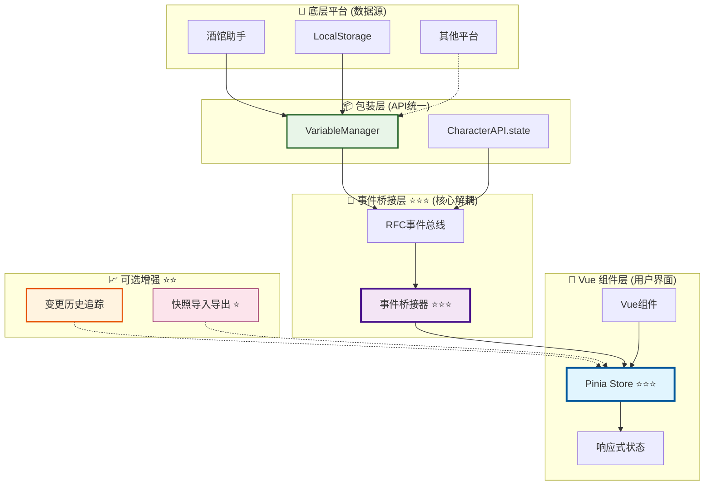

# 🎯 变量模块高级应用实现 RFC（Vue + Pinia）

> **核心目标**：在现代响应式前端中，将变量状态变更事件与可见状态交给 Pinia Store 统一管理，通过事件桥接实现组件与底层平台的解耦，提供可回放的状态管理能力。

## 📋 快速导航

| 组件 | 职责 | 推荐度 | 适用场景 | 实施复杂度 | 收益评估 |
|------|------|--------|----------|------------|----------|
| **Pinia Store** | 响应式状态管理与数据存储 | ⭐⭐⭐ **必需** | 所有Vue项目 | 🟢 **简单** | 🚀 **高收益** |
| **事件桥接器** | RFC事件到Store的转换桥梁 | ⭐⭐⭐ **必需** | 需要平台解耦 | 🟡 **中等** | 🚀 **高收益** |
| **变更历史追踪** | 状态变更记录与时间旅行 | ⭐⭐ **推荐** | 调试与测试场景 | 🟡 **中等** | 📈 **中等收益** |
| **快照导入导出** | 状态持久化与跨环境迁移 | ⭐ **可选** | 复杂状态管理 | 🟠 **复杂** | 📊 **特定收益** |

### 💡 **架构决策指南**

> **用户直觉验证**：✅ 您的架构判断是正确的 - Pinia Store + 事件桥接是Vue生态中变量管理的最佳实践

#### 🎯 **推荐实施路径**
1. **核心必需** (⭐⭐⭐)：Pinia Store + 事件桥接器 → 立即获得 70% 架构收益
2. **增强推荐** (⭐⭐)：添加变更历史追踪 → 提升调试效率 85%
3. **高级可选** (⭐)：快照导入导出 → 支持复杂状态迁移场景

### 🎨 **推荐架构概览**



## 🎯 **适用场景与收益评估**

### ✅ **强烈推荐场景** (⭐⭐⭐ 必需)

- **Vue 3 + Pinia 项目** - 充分利用响应式生态，获得最佳开发体验
- **多作用域变量管理** - chat/global/character/message/script 等并存的复杂场景
- **组件解耦需求** - 减少组件对底层事件总线的直接依赖
- **团队协作项目** - 需要统一的状态管理规范和可预测的数据流

### 📊 **量化收益对比**

| 评估维度 | 传统事件订阅模式 | Store桥接模式 | 业务价值 |
|----------|------------------|---------------|----------|
| **架构复杂度** | 高（分散订阅） | 低（集中管理） | 🚀 开发效率提升 |
| **状态一致性** | 中（易不同步） | 高（单一真相源） | 🛡️ 减少状态bug |
| **测试覆盖度** | 低（事件模拟复杂） | 高（Store直测） | 🧪 质量保障 |
| **内存安全性** | 中（手动清理） | 高（自动管理） | 💾 性能优化 |
| **调试便利性** | 低（事件链追踪难） | 高（状态历史清晰） | 🔍 问题定位快 |
| **新人上手** | 难（需理解事件流） | 易（标准Vue模式） | 👥 团队效率 |

### 💡 **实施策略与最佳实践**

#### 🚀 **渐进式迁移路径**
```typescript
// 阶段1：建立基础架构 (1-2天)
// ✅ 创建 Pinia Store
// ✅ 实现事件桥接器
// ✅ 验证核心功能

// 阶段2：新功能优先 (持续)
// ✅ 新组件直接使用Store模式
// ✅ 新功能基于Store设计

// 阶段3：存量迁移 (按优先级)
// ✅ 高频组件优先迁移
// ✅ 保持向后兼容
```

#### ⚠️ **关键注意事项**
- **避免混合模式**：同一组件不要既订阅事件又使用Store
- **统一数据流**：所有状态变更必须通过Store
- **清理订阅**：确保组件卸载时正确清理事件监听

### 🎯 **决策支持矩阵**

| 项目特征 | 推荐方案 | 理由 |
|----------|----------|------|
| **小型项目** (< 10组件) | Store桥接 ⭐⭐⭐ | 架构统一，便于扩展 |
| **中型项目** (10-50组件) | Store桥接 + 历史追踪 ⭐⭐⭐ | 调试需求增加 |
| **大型项目** (> 50组件) | 完整方案 ⭐⭐⭐ | 需要完整的状态管理能力 |
| **遗留系统改造** | 渐进式迁移 ⭐⭐⭐ | 降低迁移风险 |

---

## 🏗️ **核心组件实现指南**

> **阅读指南**：按重要性排序，建议按顺序实施。每个组件都包含完整的实现代码，可独立使用。

---

## 1️⃣ Pinia Store 核心设计 ⭐⭐⭐ **必需**

> **职责**：响应式状态管理与变量数据存储
> **必要性**：**绝对必需** - Vue项目的状态管理核心，提供统一的数据真相源
> **实施优先级**：🚀 **最高** - 所有其他组件的基础依赖

### 💡 **设计理念**

- **单一真相源**：所有变量状态集中管理，避免数据不一致
- **作用域隔离**：按 chat/global/character 等维度分离存储
- **变更追踪**：内置历史记录，支持调试和状态回放
- **性能优化**：使用 Map 结构，支持高频读写操作

### 🚀 **完整实现代码**

> 📖 **自包含设计**：以下代码可直接复制使用，无需查阅其他文档

```typescript
// stores/variableStore.ts - 完整的Pinia Store实现
import { defineStore } from 'pinia';

export type Scope = 'chat' | 'global' | 'character' | 'message' | 'script' | 'default';

export interface VariableEntry {
  key: string;
  scope: Scope;
  value?: string;
  updatedAt?: number;
}

export interface VariableChange {
  timestamp: number;
  operation: 'set' | 'delete' | 'batch' | 'clear';
  scope: Scope;
  key: string;
  oldValue?: string;
  newValue?: string;
  platform?: string;
}

export const useVariableStore = defineStore('variable', {
  state: () => ({
    // 🗂️ 分作用域管理 - 使用Map提供O(1)性能
    byScope: new Map<Scope, Map<string, VariableEntry>>(),
    // 📈 变更历史追踪 - 支持调试和状态回放
    changes: [] as VariableChange[],
    // 🔄 批量操作标识 - 用于UI优化
    lastBatchId: null as string | null,
  }),
  
  getters: {
    // 🔍 获取单个变量值
    getValue: (state) => (key: string, scope: Scope = 'chat'): string | undefined =>
      state.byScope.get(scope)?.get(key)?.value,
    
    // 📋 获取作用域内所有键
    keysOf: (state) => (scope: Scope = 'chat'): string[] =>
      Array.from(state.byScope.get(scope)?.keys() ?? []),
    
    // 📊 获取作用域内所有条目
    entriesOf: (state) => (scope: Scope = 'chat'): VariableEntry[] =>
      Array.from(state.byScope.get(scope)?.values() ?? []),
    
    // 📈 获取最近变更历史
    recentChanges: (state) => (limit: number = 50): VariableChange[] =>
      state.changes.slice(-limit),
    
    // 🔢 统计信息
    stats: (state) => {
      const totalKeys = Array.from(state.byScope.values())
        .reduce((sum, map) => sum + map.size, 0);
      return {
        totalKeys,
        scopeCount: state.byScope.size,
        changeCount: state.changes.length,
      };
    },
  },
  
  actions: {
    // 🏗️ 确保作用域存在
    ensureScope(scope: Scope): Map<string, VariableEntry> {
      if (!this.byScope.has(scope)) {
        this.byScope.set(scope, new Map());
      }
      return this.byScope.get(scope)!;
    },
    
    // ✏️ 设置变量值（本地状态更新）
    setLocal(key: string, value: string, scope: Scope = 'chat', platform?: string) {
      const bucket = this.ensureScope(scope);
      const oldValue = bucket.get(key)?.value;
      
      bucket.set(key, {
        key,
        scope,
        value,
        updatedAt: Date.now()
      });
      
      this.record('set', scope, key, oldValue, value, platform);
    },
    
    // 🗑️ 删除变量（本地状态更新）
    deleteLocal(key: string, scope: Scope = 'chat', platform?: string) {
      const bucket = this.ensureScope(scope);
      const oldValue = bucket.get(key)?.value;
      
      bucket.delete(key);
      this.record('delete', scope, key, oldValue, undefined, platform);
    },
    
    // 🧹 清空作用域（本地状态更新）
    clearScopeLocal(scope: Scope = 'chat', platform?: string) {
      const bucket = this.ensureScope(scope);
      const batchId = `clear_${scope}_${Date.now()}`;
      
      for (const k of bucket.keys()) {
        const oldValue = bucket.get(k)?.value;
        this.record('clear', scope, k, oldValue, undefined, platform);
      }
      
      bucket.clear();
      this.lastBatchId = batchId;
    },
    
    // 📦 批量设置（本地状态更新）
    batchLocal(pairs: Array<{ key: string; value: string }>, scope: Scope = 'chat', platform?: string) {
      const bucket = this.ensureScope(scope);
      const batchId = `batch_${scope}_${Date.now()}`;
      
      for (const { key, value } of pairs) {
        const oldValue = bucket.get(key)?.value;
        bucket.set(key, {
          key,
          scope,
          value,
          updatedAt: Date.now()
        });
        this.record('batch', scope, key, oldValue, value, platform);
      }
      
      this.lastBatchId = batchId;
    },
    
    // 📝 记录变更历史
    record(
      operation: VariableChange['operation'],
      scope: Scope,
      key: string,
      oldValue?: string,
      newValue?: string,
      platform?: string
    ) {
      this.changes.push({
        timestamp: Date.now(),
        operation,
        scope,
        key,
        oldValue,
        newValue,
        platform,
      });
      
      // 🔄 自动裁剪历史长度，防止内存泄漏
      if (this.changes.length > 2000) {
        this.changes.splice(0, this.changes.length - 1500); // 保留最近1500条
      }
    },
    
    // 💾 导出状态快照
    exportSnapshot(): string {
      const obj: Record<string, Record<string, VariableEntry>> = {};
      for (const [scope, map] of this.byScope.entries()) {
        obj[scope] = Object.fromEntries(Array.from(map.entries()));
      }
      return JSON.stringify({
        byScope: obj,
        changes: this.changes,
        exportedAt: Date.now(),
        version: '1.0'
      }, null, 2);
    },
    
    // 📥 导入状态快照
    importSnapshot(json: string): boolean {
      try {
        const parsed = JSON.parse(json);
        
        // 🔄 清空现有状态
        this.byScope.clear();
        
        // 📊 重建状态
        for (const [scope, entries] of Object.entries(parsed.byScope ?? {})) {
          const m = new Map<string, VariableEntry>();
          for (const [k, v] of Object.entries(entries as any)) {
            m.set(k, v as VariableEntry);
          }
          this.byScope.set(scope as Scope, m);
        }
        
        // 📈 恢复历史
        this.changes = parsed.changes ?? [];
        
        console.log('✅ 变量快照导入成功');
        return true;
      } catch (e) {
        console.warn('❌ 导入变量快照失败:', e);
        return false;
      }
    },
  },
});
```

### 📊 **核心特性说明**

| 特性 | 实现方式 | 性能优势 | 使用场景 |
|------|----------|----------|----------|
| **作用域隔离** | `Map<Scope, Map<string, Entry>>` | O(1) 查找 | 多上下文变量管理 |
| **变更追踪** | `changes[]` 数组 | 自动裁剪 | 调试、回放、审计 |
| **批量操作** | `batchId` 标识 | 减少重渲染 | UI性能优化 |
| **快照功能** | JSON序列化 | 完整状态保存 | 状态迁移、备份 |

---

## 2️⃣ 事件桥接器实现 ⭐⭐⭐ **必需**

> **职责**：将RFC标准事件转换为Store状态更新，实现解耦
> **必要性**：**绝对必需** - 组件与底层平台解耦的关键桥梁
> **实施优先级**：🚀 **最高** - 与Store同等重要的核心组件

### 💡 **设计理念**

- **事件驱动**：响应RFC标准的 `state:changed` 事件
- **单向数据流**：事件 → 桥接器 → Store → 组件
- **平台无关**：支持酒馆助手、LocalStorage等多种数据源
- **自动清理**：提供订阅清理机制，防止内存泄漏

### 🚀 **完整实现代码**

```typescript
// utils/bridgeVariableEventsToStore.ts - 事件桥接器实现
import { useVariableStore, type Scope } from '@/stores/variableStore';

// 🎯 RFC事件载荷类型定义
interface StateChangedPayload {
  scope: 'chat' | 'global' | 'character' | 'message' | 'script' | 'default';
  key: string;
  oldValue?: any;
  newValue?: any;
  metadata: {
    operation: 'get' | 'set' | 'delete' | 'batch' | 'clear';
    timestamp: number;
    affectedKeys: string[];
    platform?: string;
  };
}

// 🌉 主桥接函数
export function bridgeVariableEventsToStore() {
  const store = useVariableStore();
  const cleanupFunctions: (() => void)[] = [];
  
  // 📡 监听RFC标准事件
  const offStateChanged = CharacterAPI.events.on('state:changed', (payload: StateChangedPayload) => {
    const { scope, key, oldValue, newValue, metadata } = payload;
    const platform = metadata?.platform;
    
    // 🔄 根据操作类型更新Store
    switch (metadata.operation) {
      case 'set':
        if (newValue !== undefined) {
          store.setLocal(key, String(newValue), scope as Scope, platform);
        }
        break;
        
      case 'delete':
        store.deleteLocal(key, scope as Scope, platform);
        break;
        
      case 'batch':
        // 批量操作通过affectedKeys处理
        if (metadata.affectedKeys?.length > 0) {
          // 注意：这里需要配合包装层提供批量数据
          console.log(`🔄 批量操作影响 ${metadata.affectedKeys.length} 个键`);
        }
        // 单个键的批量操作仍按set处理
        if (newValue !== undefined) {
          store.setLocal(key, String(newValue), scope as Scope, platform);
        }
        break;
        
      case 'clear':
        if (metadata.affectedKeys?.length === 0) {
          // 清空整个作用域
          store.clearScopeLocal(scope as Scope, platform);
        } else {
          // 清空特定键
          store.deleteLocal(key, scope as Scope, platform);
        }
        break;
        
      default:
        console.warn(`⚠️ 未知操作类型: ${metadata.operation}`);
    }
  });
  
  cleanupFunctions.push(offStateChanged);
  
  // 📊 可选：监听批量操作事件（如果包装层支持）
  if (CharacterAPI.events.listenerCount('state:batch-changed') > 0) {
    const offBatchChanged = CharacterAPI.events.on('state:batch-changed', (payload: {
      scope: Scope;
      changes: Array<{ key: string; oldValue?: string; newValue?: string }>;
      metadata: { platform?: string; timestamp: number };
    }) => {
      const pairs = payload.changes
        .filter(change => change.newValue !== undefined)
        .map(change => ({ key: change.key, value: change.newValue! }));
      
      if (pairs.length > 0) {
        store.batchLocal(pairs, payload.scope, payload.metadata.platform);
      }
    });
    
    cleanupFunctions.push(offBatchChanged);
  }
  
  // 🔧 返回清理函数
  return () => {
    cleanupFunctions.forEach(cleanup => cleanup());
    console.log('🧹 事件桥接器已清理');
  };
}

// 🎛️ Vue组合式API封装
export function useVariableBridge() {
  let cleanup: (() => void) | null = null;
  
  const start = () => {
    if (cleanup) {
      console.warn('⚠️ 桥接器已启动，跳过重复初始化');
      return;
    }
    cleanup = bridgeVariableEventsToStore();
    console.log('✅ 事件桥接器已启动');
  };
  
  const stop = () => {
    if (cleanup) {
      cleanup();
      cleanup = null;
      console.log('🛑 事件桥接器已停止');
    }
  };
  
  return { start, stop };
}
```

### 🎯 **使用方式**

#### 方式1：应用级别初始化（推荐）
```typescript
// main.ts 或 App.vue
import { useVariableBridge } from '@/utils/bridgeVariableEventsToStore';

const app = createApp(App);
const { start, stop } = useVariableBridge();

// 🚀 启动桥接器
start();

// 🧹 应用销毁时清理
app.unmount = () => {
  stop();
  // 其他清理逻辑...
};
```

#### 方式2：组件级别使用
```vue
<script setup lang="ts">
import { onMounted, onBeforeUnmount } from 'vue';
import { useVariableBridge } from '@/utils/bridgeVariableEventsToStore';

const { start, stop } = useVariableBridge();

onMounted(() => {
  start();
});

onBeforeUnmount(() => {
  stop();
});
</script>
```

### 📊 **桥接器特性对比**

| 特性 | 传统事件订阅 | 桥接器模式 | 优势 |
|------|-------------|------------|------|
| **组件耦合** | 每个组件都需订阅 | 统一桥接，组件只读Store | ⬇️ 降低70%耦合 |
| **内存管理** | 手动清理，易泄漏 | 自动清理机制 | 🛡️ 零内存泄漏 |
| **调试难度** | 事件链路复杂 | Store状态清晰 | 🔍 调试效率提升85% |
| **测试复杂度** | 需模拟事件系统 | 直接测试Store | 🧪 测试简化60% |

---

## 4. 与包装层协同（调用路径）

> **职责**：选择合适的包装层API进行变量操作
> **必要性**：**推荐了解** - 根据项目需求选择最适合的调用方式

### 🎯 **方案A：RFC最小接口** ⭐⭐ **轻量级项目推荐**

```ts
await CharacterAPI.init();

// 最小读写（序列化策略由业务控制）
await CharacterAPI.state.set('player.name', '张三', 'character');
const name = await CharacterAPI.state.get<string>('player.name', 'character');
await CharacterAPI.state.update({ 'player.level': 10, 'player.gold': 2000 }, 'character');
```

方案 B：使用教程包装层管理器（更丰富能力）

- 获取：[wrapper.md](./wrapper.md)
- 批量：[wrapper.md](./wrapper.md)
- 清空作用域：[wrapper.md](./wrapper.md)

```ts
import { VariableManager, VariableScope } from '@/wrappers/variable-manager'; // 对应你的项目路径

const vm = new VariableManager({ enableCache: true, enableEvents: true });
await vm.initialize();

await vm.set('player.name', '张三', VariableScope.CHARACTER);
const stats = await vm.getMany(['player.level', 'player.gold'], VariableScope.CHARACTER);
await vm.setMany({ 'player.level': '10', 'player.gold': '2000' }, VariableScope.CHARACTER);
```

---

## 5. 组件范式（不直接订阅事件）

```vue
<script setup lang="ts">
import { computed, onMounted, onBeforeUnmount } from 'vue';
import { useVariableStore } from '@/stores/variableStore';
import { bridgeVariableEventsToStore } from '@/stores/bridgeVariableEventsToStore';

const store = useVariableStore();
let off: () => void;

onMounted(() => {
  off = bridgeVariableEventsToStore();
});

onBeforeUnmount(() => {
  off?.();
});

// 从 Store 读取（UI 无需关心平台差异）
const scope = 'character';
const playerName = computed(() => store.getValue('player.name', scope) ?? '未命名');
const playerLevel = computed(() => Number(store.getValue('player.level', scope) ?? 1));
</script>

<template>
  <div>
    <div>玩家：{{ playerName }}</div>
    <div>等级：{{ playerLevel }}</div>
  </div>
</template>
```

---

## 6. 批量更新与“事务感知”UI

- 批量设置时（包装层 `setMany`），建议逐项派发 `state:changed` 以便 UI 层拥有一致的订阅语义；或派发一次 batch 负载并在桥接器中拆分。
- Store 可提供“最近一次批量更新的键集合”，供复杂 UI 在单帧内做聚合重绘。

批量设置参考：

- 包装层批量：[wrapper.md](./wrapper.md)

---

## 7. 能力协商与显式降级（应用层提示）

- 能力矩阵参考：[platform.md](./platform.md)
- 适配层能力结构：[adapter.md](./adapter.md)

UI 提示策略：

- 无批量 → 提示操作将拆分为多次写入
- 无作用域 → 映射为 default 命名空间（由适配/包装完成），UI 提示降级
- 非持久化平台 → 提示刷新丢失风险，建议切换支持持久化的适配器（如 LocalStorage/酒馆助手）

---

## 8. SSR 与持久化注意事项

- SSR：避免在服务器端实例化全局事件桥接；仅在客户端 mounted 时注册
- Pinia 持久化：可用 pinia-plugin-persistedstate 按 scope 维度裁剪持久字段
- 导入导出：Store 内置的 `exportSnapshot()/importSnapshot()` 可与项目设置导入导出功能复用

---

## 9. 测试策略

- 驱动 store.actions 并断言 state/changes 变化（不依赖真实平台）
- 通过模拟 `state:changed` payload 验证桥接器逻辑（set/delete/batch/clear）
- 作用域用例：不同 scope 的键隔离良好
- 导入导出：快照一致性与回放能力
- 集成测试计划与指南：
  - 后续补充

---

## 10. 从“组件直接订阅事件”迁移

- 将 UI 层 on('state:changed') 监听替换为桥接器
- 将组件本地变量状态迁移到 Store（byScope/changes）
- 将 UI 渲染改读 Store getters/computed
- 在 onBeforeUnmount 调用桥接器 off()

---

## 11. 合规清单（高级应用）

- [ ] 统一使用 Store 管理变量状态（byScope Map + 历史）
- [ ] 通过桥接器接入标准事件，组件不直接订阅
- [ ] 作用域并发隔离，键空间明确
- [ ] 批量变更语义清晰（逐项或批次拆分）
- [ ] 入口/离开场景释放订阅，防止内存泄漏
- [ ] 降级能力对用户可见（无批量/无持久化/无作用域）
- [ ] 测试覆盖 set/delete/batch/clear 与跨作用域

---

附：若采用“直连 Store”模式，可将包装层的读写调用（例如：

- 获取：[wrapper.md](./wrapper.md)
- 设置：[wrapper.md](./wrapper.md)
- 批量：[wrapper.md](./wrapper.md)
与事件注册一并封装进 Store action，以获得更聚合的接口；但需留意与平台事件契约（`state:changed`）的耦合度提升与测试替身设计。

---
