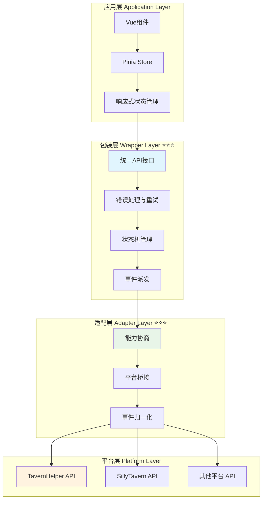

# CharacterAPI.variable 变量操作与数据管理 RFC

> **🎯 核心目标**：提供统一、可扩展的变量操作接口，封装平台差异，支持作用域管理、批量操作、数据校验等高级特性。

---

## 📋 快速导航

| 组件层次 | 职责 | 推荐度 | 适用场景 | 文档链接 |
|---------|------|--------|----------|----------|
| **包装层实现** | 统一API接口、错误处理、状态管理 | ⭐⭐⭐ **必需** | 所有变量操作场景 | [`wrapper.md`](./wrapper.md) |
| **平台适配层** | 平台差异封装、能力协商、事件桥接 | ⭐⭐⭐ **必需** | 跨平台兼容 | [`adapter.md`](./adapter.md) |
| **底层平台特性** | 原生API能力分析、平台特性对比 | ⭐⭐ **推荐** | 平台开发者 | [`platform.md`](./platform.md) |
| **应用层集成** | Vue/Pinia集成、UI响应式更新 | ⭐⭐ **推荐** | 前端应用开发 | [`application.md`](./application.md) |
| **高级应用实现** | 复杂业务场景、性能优化 | ⭐ **可选扩展** | 高级定制需求 | [`advanced-application.md`](./advanced-application.md) |

---

## 🏗️ 架构设计



> **💡 架构说明**：
>
> - **实线组件**：核心必需层，提供基础功能
> - **虚线组件**：可选扩展层，提供增强功能
> - **蓝色标注**：⭐⭐⭐ 必需组件，所有场景都需要
> - **绿色标注**：⭐⭐ 推荐组件，大多数场景建议使用

---

## 🚀 核心特性概览

### VariableManager ⭐⭐⭐
>
> **职责**：提供统一的变量操作接口，封装平台差异
> **必要性**：**绝对必需** - 所有变量操作的核心入口

#### 核心特性

- ✅ 统一的 get/set/update 接口
- ✅ 多作用域支持（chat/global/character/message/script）
- ✅ 批量操作与事务支持
- ✅ 数据校验与类型安全
- ✅ 自动错误处理与重试

#### 接口概览

```typescript
interface VariableManager {
  get<T>(keys: string | string[], scope?: VariableScope): Promise<VariableResult<T>>;
  update(variables: Record<string, any>, options?: VariableConfig): Promise<VariableResult>;
  batch(operations: VariableOperation[]): Promise<VariableResult[]>;
  watch(key: string, callback: VariableWatcher['callback']): () => void;
}
```

> 📖 **完整实现参考**：[包装层实现](./wrapper.md)

### PlatformAdapter ⭐⭐⭐
>
> **职责**：封装平台差异，提供统一的底层接口
> **必要性**：**绝对必需** - 跨平台兼容的基础

#### 核心特性

- ✅ 平台能力自动检测
- ✅ 运行时能力协商
- ✅ 优雅降级策略
- ✅ 事件系统桥接

#### 接口概览

```typescript
interface PlatformAdapter {
  getCapabilities(): Promise<VariableCapabilities>;
  get(key: string, scope: VariableScope): Promise<any>;
  set(key: string, value: any, scope: VariableScope): Promise<void>;
  batch(operations: BatchOperation[]): Promise<void>;
}
```

> 📖 **完整实现参考**：[适配层实现](./adapter.md)

### ReactiveStore ⭐⭐
>
> **职责**：提供响应式状态管理，与Vue/Pinia集成
> **必要性**：**推荐使用** - 前端应用的最佳实践

#### 核心特性

- ✅ Vue 3 Composition API 集成
- ✅ Pinia 状态管理
- ✅ 自动UI更新
- ✅ 开发者工具支持

> 📖 **完整实现参考**：[应用层集成](./application.md)

---

## 💡 实施策略

### 推荐实施路径

```typescript
// 1. 初始化适配器（自动检测平台）
const adapter = await createPlatformAdapter();

// 2. 创建变量管理器
const variableManager = new VariableManager(adapter);

// 3. 集成到应用（可选）
const { useVariableStore } = createVariableStore(variableManager);
```


---

## 🔧 核心类型定义

### 作用域枚举

```typescript
enum VariableScope {
  CHAT = 'chat',           // 对话级别变量
  GLOBAL = 'global',       // 全局变量
  CHARACTER = 'character', // 角色变量
  MESSAGE = 'message',     // 消息级别变量
  SCRIPT = 'script'        // 脚本变量
}
```

### 操作配置

```typescript
interface VariableConfig {
  scope?: VariableScope;    // 作用域
  validation?: boolean;     // 数据校验
  backup?: boolean;         // 备份原始数据
  encryption?: boolean;     // 数据加密
  ttl?: number;            // 生存时间（毫秒）
}
```

### 结果封装

```typescript
interface VariableResult<T = any> {
  success: boolean;
  data?: T;
  error?: string;
  metadata: {
    scope: VariableScope;
    timestamp: number;
    operation: 'get' | 'set' | 'delete' | 'batch';
    affectedKeys: string[];
  };
}
```

### 能力协商

```typescript
interface VariableCapabilities {
  supports: {
    scopes: {
      chat: boolean;
      global: boolean;
      character: boolean;
      message: boolean;
      script: boolean;
    };
    features: {
      batch: boolean;        // 批量操作
      backup: boolean;       // 数据备份
      validation: boolean;   // 数据校验
      encryption: boolean;   // 数据加密
      ttl: boolean;         // 生存时间
      watch: boolean;       // 变量监听
    };
  };
}
```

---

## 🎮 快速开始

### 基础使用

```typescript
// 初始化
await CharacterAPI.init();

// 获取变量
const result = await CharacterAPI.variable.get<{ name: string; level: number }>('player');
if (result.success) {
  console.log('玩家数据:', result.data);
}

// 更新变量
await CharacterAPI.variable.update({
  player: { name: '张三', level: 10 }
}, { scope: VariableScope.CHAT, backup: true });

// 批量操作
await CharacterAPI.variable.batch([
  { type: 'set', key: 'hp', value: 100 },
  { type: 'set', key: 'mp', value: 50 },
  { type: 'delete', key: 'temp_data' }
]);
```

### 响应式集成（Vue）

```typescript
// 在 Vue 组件中使用
const { variables, updateVariable, watchVariable } = useVariableStore();

// 响应式获取
const playerData = computed(() => variables.value.player);

// 监听变化
watchVariable('player', (newValue, oldValue) => {
  console.log('玩家数据变化:', { newValue, oldValue });
});
```

---

## 📚 详细文档

### 核心实现文档

- **包装层实现** ⭐⭐⭐：[`wrapper.md`](./wrapper.md) - 统一API接口与核心逻辑
- **平台适配层** ⭐⭐⭐：[`adapter.md`](./adapter.md) - 平台差异封装与能力协商
- **底层平台特性** ⭐⭐：[`platform.md`](./platform.md) - 各平台原生能力分析

### 应用集成文档

- **应用层集成** ⭐⭐：[`application.md`](./application.md) - Vue/Pinia集成指南
- **高级应用实现** ⭐：[`advanced-application.md`](./advanced-application.md) - 复杂场景与性能优化

### 相关资源

- 教程章节：后续补充
- RFC总览：[CHARACTER_API_RFC](../CHARACTER_API_RFC.md)
- 生成模块索引：[generation](../landing/generation/index.md)

---

## 🧪 测试与验证

### 测试策略

- **单元测试**：各层组件独立测试
- **集成测试**：跨层交互测试
- **平台测试**：多平台兼容性验证
- **性能测试**：大量数据操作性能

### 验收标准

- ✅ 所有作用域操作正确性
- ✅ 批量操作事务一致性
- ✅ 错误处理完整性
- ✅ 事件派发准确性
- ✅ 能力协商与降级正确性

> 📖 **详细测试指南**：后续补充

---

## 🔄 事件系统

### 标准事件

```typescript
// 变量变化事件
CharacterAPI.events.on('state:changed', (payload) => {
  console.log('变量变化:', {
    scope: payload.scope,
    key: payload.key,
    oldValue: payload.oldValue,
    newValue: payload.newValue,
    metadata: payload.metadata
  });
});

// 错误事件
CharacterAPI.events.on('variable:error', (error) => {
  console.error('变量操作错误:', error);
});
```

### 事件负载结构

```typescript
interface VariableChangeEvent {
  scope: VariableScope;
  key: string;
  oldValue: any;
  newValue: any;
  metadata: {
    operation: string;
    timestamp: number;
    affectedKeys: string[];
  };
}
```

---

## ⚠️ 注意事项

### 平台兼容性

- **TavernHelper**：完整支持所有特性
- **SillyTavern**：部分特性需要降级
- **其他平台**：通过适配器扩展支持

### 性能考虑

- 批量操作优于单个操作
- 合理使用缓存机制
- 避免频繁的全量获取

### 安全建议

- 敏感数据启用加密选项
- 合理设置TTL避免数据泄露
- 使用数据校验防止注入

---
