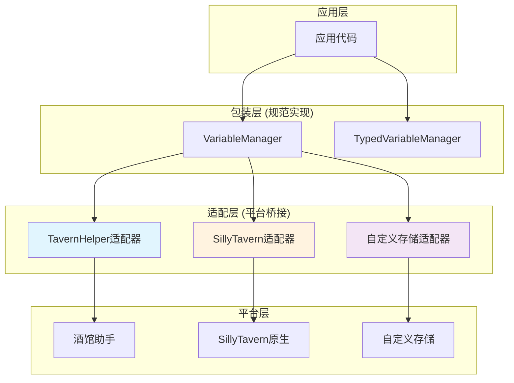

# CharacterAPI.variable 底层平台特性与能力协商 RFC

> **文档目标**：为变量系统的平台适配层提供完整的特性分析、能力协商策略和实现指导，实现"包装=规范"的一致性行为。

## 📋 快速导航

| 平台组件 | 职责 | 推荐度 | 适用场景 | 跳转 |
|----------|------|--------|----------|------|
| **酒馆助手检测** | 识别TavernHelper环境 | ⭐⭐⭐ **必需** | 所有TH项目 | [#平台检测](#平台检测与识别) |
| **能力矩阵映射** | 统一平台差异 | ⭐⭐⭐ **必需** | 跨平台兼容 | [#能力矩阵](#能力矩阵与差异映射) |
| **作用域标准化** | 统一变量作用域语义 | ⭐⭐⭐ **必需** | 变量管理 | [#作用域语义](#标准作用域语义) |
| **事件标准化** | 统一变更通知 | ⭐⭐ **推荐** | 状态观察 | [#事件标准化](#标准化事件与日志) |
| **错误处理** | 平台错误归一化 | ⭐⭐ **推荐** | 错误诊断 | [#错误标准化](#降级与异常标准化) |
| **自定义存储适配** | 扩展存储后端 | ⭐ **可选** | 特殊需求 | [#自定义存储](#自定义存储适配) |

## 🎯 核心设计理念

### 包装层等于规范
适配层不仅转换平台API，更要确保行为一致性：
- **统一语义**：相同操作在不同平台产生相同结果
- **标准事件**：变量变更统一派发 `state:changed` 事件
- **能力协商**：显式声明支持能力，透明降级不支持功能
- **可观察性**：完整的操作日志与错误追踪

### 平台无关抽象
- **最小接口**：仅暴露变量CRUD的核心能力
- **能力发现**：运行时检测平台特性，动态适配
- **优雅降级**：不支持的功能透明降级并记录日志

## 🏗️ 平台架构概览



## 🔍 平台检测与识别

### ⭐⭐⭐ 酒馆助手环境检测
> **职责**：识别TavernHelper运行环境并获取版本信息
> **必要性**：**绝对必需** - 所有TH项目的基础

#### 核心特性
- ✅ 检测全局函数可用性（[`getVariable()`](#getvariable)、[`setVariable()`](#setvariable)等）
- ✅ 验证批量操作支持（[`getVariables()`](#getvariables)、[`setVariables()`](#setvariables)等）
- ✅ 作用域能力探测（支持的[`VariableScope`](#variablescope)类型）

#### 检测策略
```typescript
function detectTavernHelper(): PlatformDetectionResult {
  const requiredFunctions = [
    'getVariable', 'setVariable', 'deleteVariable',
    'getVariables', 'setVariables', 'deleteVariables', 'getAllVariables'
  ];
  
  const available = requiredFunctions.every(fn => typeof window[fn] === 'function');
  
  return {
    platform: 'TavernHelper',
    available,
    version: available ? detectTHVersion() : null,
    capabilities: available ? probeTHCapabilities() : null
  };
}
```

> 📖 **完整实现参考**：[附录A.1 - 平台检测实现](#a1-平台检测实现)

### ⭐⭐ SillyTavern原生检测
> **职责**：检测SillyTavern原生变量支持
> **必要性**：**推荐** - 为非TH环境提供基础支持

#### 核心特性
- ✅ 检测 `window.variables` 对象可用性
- ✅ 基础读写能力验证
- ⚠️ 仅支持全局作用域，需适配层模拟其他作用域

#### 检测策略
```typescript
function detectSillyTavernNative(): PlatformDetectionResult {
  const hasVariables = typeof window.variables === 'object';
  
  return {
    platform: 'SillyTavernNative',
    available: hasVariables,
    version: hasVariables ? 'native' : null,
    capabilities: hasVariables ? {
      scopes: ['global'],
      async: false,
      batch: false,
      persistence: false
    } : null
  };
}
```

### 💡 **实施策略**
```typescript
// 优先级检测顺序
const detectionOrder = [
  detectTavernHelper,      // 最高优先级
  detectSillyTavernNative, // 回退选项
  detectCustomStorage      // 自定义适配
];

export function detectPlatform(): PlatformInfo {
  for (const detector of detectionOrder) {
    const result = detector();
    if (result.available) {
      return result;
    }
  }
  throw new Error('未检测到支持的变量平台');
}
```

## 📊 能力矩阵与差异映射

### 平台能力对比

| 能力维度 | 酒馆助手 | SillyTavern原生 | 自定义存储 | 说明 |
|----------|----------|-----------------|------------|------|
| **作用域支持** | ⭐⭐⭐ 完整 | ⭐ 仅全局 | ⭐⭐ 可配置 | 支持的[`VariableScope`](#variablescope)类型 |
| **异步操作** | ⭐⭐⭐ 原生异步 | ⭐ 同步包装 | ⭐⭐⭐ 原生异步 | Promise接口支持 |
| **批量操作** | ⭐⭐⭐ 原生支持 | ❌ 需模拟 | ⭐⭐ 可选 | 批量读写性能 |
| **持久化** | ⭐⭐⭐ 自动持久 | ❌ 会话级 | ⭐⭐⭐ 可配置 | 数据持久化能力 |
| **类型安全** | ⭐⭐ 字符串 | ⭐⭐ 字符串 | ⭐⭐⭐ 可定制 | 类型约束支持 |

### 能力协商接口

```typescript
interface PlatformCapabilities {
  // 支持的作用域集合
  scopes: VariableScope[] | 'all';
  
  // 异步操作支持
  async: boolean;
  
  // 批量操作支持
  batch: {
    get: boolean;
    set: boolean;
    delete: boolean;
  };
  
  // 持久化支持
  persistence: boolean;
  
  // 类型约束支持
  typeConstraints: boolean;
  
  // 事件支持
  events: {
    stateChanged: boolean;
    beforeChange: boolean;
    afterChange: boolean;
  };
}
```


## 🏷️ 标准作用域语义

### ⭐⭐⭐ 作用域类型定义
> **职责**：统一变量作用域语义，确保跨平台一致性
> **必要性**：**绝对必需** - 变量管理的基础

```typescript
type VariableScope = 'chat' | 'global' | 'character' | 'message' | 'script';
```

### 作用域特性详解

| 作用域 | 生命周期 | 共享范围 | 典型用途 | 持久化 |
|--------|----------|----------|----------|--------|
| **`global`** | 跨聊天持久 | 全局共享 | 用户设置、应用配置 | ✅ 永久 |
| **`character`** | 角色绑定 | 特定角色 | 角色关系、角色数据 | ✅ 角色级 |
| **`chat`** | 聊天会话 | 当前聊天 | 对话状态、临时数据 | ✅ 会话级 |
| **`script`** | 脚本运行期 | 当前脚本 | 脚本变量、执行状态 | ❌ 临时 |
| **`message`** | 消息级别 | 单条消息 | 消息元数据、临时计算 | ❌ 临时 |

### 跨平台映射策略

```typescript
const scopeMappingStrategies = {
  // 酒馆助手：完整支持
  TavernHelper: {
    chat: 'chat',
    global: 'global', 
    character: 'character',
    message: 'message',
    script: 'script'
  },
  
  // SillyTavern原生：仅全局，其他用前缀模拟
  SillyTavernNative: {
    chat: (key) => `chat:${getCurrentChatId()}:${key}`,
    global: (key) => key,
    character: (key) => `char:${getCurrentCharId()}:${key}`,
    message: (key) => `msg:${getCurrentMsgId()}:${key}`,
    script: (key) => `script:${getScriptId()}:${key}`
  },
  
  // 自定义存储：可配置映射
  CustomStorage: 'configurable'
};
```

## 📡 标准化事件与日志

### ⭐⭐ 变量变更事件
> **职责**：统一变量变更通知，支持状态观察与复盘
> **必要性**：**推荐** - 提升可观察性和调试能力

#### 标准事件格式
```typescript
interface VariableChangeEvent {
  type: 'state:changed';
  payload: {
    scope: VariableScope;
    key: string;
    oldValue: string | undefined;
    newValue: string | undefined;
    operation: 'set' | 'delete' | 'batch_set' | 'batch_delete';
    timestamp: number;
    metadata?: {
      source: string;        // 操作来源
      platform: string;      // 平台标识
      generation_id?: string; // 关联的生成ID
    };
  };
}
```

#### 事件派发策略
```typescript
class VariableEventEmitter {
  private emitStateChanged(change: VariableChangeEvent['payload']) {
    // 统一事件派发
    window.dispatchEvent(new CustomEvent('state:changed', {
      detail: change
    }));
    
    // 兼容现有事件系统
    if (typeof eventEmit === 'function') {
      eventEmit('VARIABLE_CHANGED', change);
    }
  }
  
  // 包装原生操作，自动派发事件
  async setVariableWithEvent(key: string, value: string, scope: VariableScope) {
    const oldValue = await this.getVariable(key, scope);
    await this.setVariable(key, value, scope);
    
    this.emitStateChanged({
      scope, key, oldValue, newValue: value,
      operation: 'set',
      timestamp: Date.now(),
      metadata: { source: 'api', platform: this.platformName }
    });
  }
}
```

### 📝 操作日志标准
```typescript
interface VariableOperationLog {
  timestamp: number;
  operation: string;
  scope: VariableScope;
  key?: string;
  success: boolean;
  duration_ms: number;
  platform: string;
  error?: {
    code: string;
    message: string;
    stack?: string;
  };
  metadata?: Record<string, any>;
}
```

## ⚠️ 降级与异常标准化

### ⭐⭐ 错误标准化
> **职责**：将平台特定错误转换为标准错误格式
> **必要性**：**推荐** - 统一错误处理和诊断

#### 标准错误类型
```typescript
enum VariableErrorCode {
  // 平台错误
  PLATFORM_NOT_AVAILABLE = 'PLATFORM_NOT_AVAILABLE',
  PLATFORM_VERSION_INCOMPATIBLE = 'PLATFORM_VERSION_INCOMPATIBLE',
  
  // 作用域错误
  SCOPE_NOT_SUPPORTED = 'SCOPE_NOT_SUPPORTED',
  SCOPE_ACCESS_DENIED = 'SCOPE_ACCESS_DENIED',
  
  // 变量错误
  VARIABLE_NOT_FOUND = 'VARIABLE_NOT_FOUND',
  VARIABLE_READ_ONLY = 'VARIABLE_READ_ONLY',
  VARIABLE_TYPE_MISMATCH = 'VARIABLE_TYPE_MISMATCH',
  
  // 操作错误
  BATCH_OPERATION_FAILED = 'BATCH_OPERATION_FAILED',
  OPERATION_TIMEOUT = 'OPERATION_TIMEOUT',
  
  // 通用错误
  UNKNOWN_ERROR = 'UNKNOWN_ERROR'
}

interface StandardVariableError {
  code: VariableErrorCode;
  message: string;
  platform: string;
  operation: string;
  context?: {
    scope?: VariableScope;
    key?: string;
    value?: string;
  };
  originalError?: Error;
  timestamp: number;
}
```

#### 错误映射策略
```typescript
class ErrorStandardizer {
  static standardize(error: any, platform: string, operation: string): StandardVariableError {
    const base = {
      platform,
      operation,
      timestamp: Date.now(),
      originalError: error
    };
    
    // 酒馆助手错误映射
    if (platform === 'TavernHelper') {
      if (error.message?.includes('scope')) {
        return { ...base, code: VariableErrorCode.SCOPE_NOT_SUPPORTED, message: '不支持的作用域' };
      }
      if (error.message?.includes('not found')) {
        return { ...base, code: VariableErrorCode.VARIABLE_NOT_FOUND, message: '变量不存在' };
      }
    }
    
    // SillyTavern原生错误映射
    if (platform === 'SillyTavernNative') {
      if (error.name === 'ReferenceError') {
        return { ...base, code: VariableErrorCode.PLATFORM_NOT_AVAILABLE, message: '变量系统不可用' };
      }
    }
    
    // 默认错误
    return {
      ...base,
      code: VariableErrorCode.UNKNOWN_ERROR,
      message: error.message || '未知错误'
    };
  }
}
```

### 能力降级策略

| 不支持的能力 | 降级策略 | 日志记录 |
|-------------|----------|----------|
| **批量操作** | 循环调用单项操作 | `WARN: 批量操作降级为循环调用` |
| **特定作用域** | 映射到支持的作用域 | `INFO: 作用域 ${scope} 映射为 ${fallback}` |
| **异步操作** | 包装为Promise | `INFO: 同步操作包装为异步` |
| **事件通知** | 静默跳过 | `WARN: 平台不支持事件，跳过通知` |

## 🔧 自定义存储适配

### ⭐ 扩展存储后端
> **职责**：支持LocalStorage、IndexedDB、Remote API等自定义存储
> **必要性**：**可选** - 特殊场景下的存储需求

#### 适配器接口
```typescript
interface CustomStorageAdapter {
  name: string;
  
  // 能力声明
  getCapabilities(): PlatformCapabilities;
  
  // 基础操作
  get(key: string, scope: VariableScope): Promise<string | undefined>;
  set(key: string, value: string, scope: VariableScope): Promise<void>;
  delete(key: string, scope: VariableScope): Promise<void>;
  
  // 批量操作（可选）
  getMultiple?(keys: string[], scope: VariableScope): Promise<Record<string, string | undefined>>;
  setMultiple?(variables: Record<string, string>, scope: VariableScope): Promise<void>;
  deleteMultiple?(keys: string[], scope: VariableScope): Promise<void>;
  
  // 作用域操作
  getAllInScope(scope: VariableScope): Promise<Record<string, string>>;
  clearScope(scope: VariableScope): Promise<void>;
  
  // 生命周期
  initialize?(): Promise<void>;
  cleanup?(): Promise<void>;
}
```

#### LocalStorage适配器示例
```typescript
class LocalStorageAdapter implements CustomStorageAdapter {
  name = 'LocalStorage';
  
  getCapabilities(): PlatformCapabilities {
    return {
      scopes: ['global', 'chat', 'character'], // 不支持临时作用域
      async: true,
      batch: { get: true, set: true, delete: true },
      persistence: true,
      typeConstraints: false,
      events: { stateChanged: true, beforeChange: false, afterChange: false }
    };
  }
  
  private getScopedKey(key: string, scope: VariableScope): string {
    return `variable:${scope}:${key}`;
  }
  
  async get(key: string, scope: VariableScope): Promise<string | undefined> {
    const scopedKey = this.getScopedKey(key, scope);
    return localStorage.getItem(scopedKey) || undefined;
  }
  
  async set(key: string, value: string, scope: VariableScope): Promise<void> {
    const scopedKey = this.getScopedKey(key, scope);
    localStorage.setItem(scopedKey, value);
  }
  
  // ... 其他方法实现
}
```

## 💡 实施指导与最佳实践

### 适配层实现检查清单
- [ ] ✅ 实现平台检测函数
- [ ] ✅ 声明完整的能力矩阵
- [ ] ✅ 处理所有作用域映射
- [ ] ✅ 实现错误标准化
- [ ] ✅ 支持事件派发（如果平台支持）
- [ ] ✅ 添加操作日志记录
- [ ] ✅ 实现能力降级策略
- [ ] ✅ 编写单元测试

### 性能优化建议
1. **批量操作优先**：优先使用平台原生批量API
2. **缓存能力检测**：避免重复检测平台能力
3. **异步操作合并**：合并连续的变量操作
4. **错误快速失败**：不支持的操作立即返回错误

### 调试与诊断
```typescript
// 启用详细日志
window.VARIABLE_DEBUG = true;

// 查看平台能力
console.log(await VariableManager.getCapabilities());

// 监听变量变更
window.addEventListener('state:changed', (event) => {
  console.log('变量变更:', event.detail);
});
```

---

## 📚 附录：完整代码实现

### A.1 平台检测实现

```typescript
// 平台检测结果接口
interface PlatformDetectionResult {
  platform: string;
  available: boolean;
  version: string | null;
  capabilities: PlatformCapabilities | null;
}

// 酒馆助手检测
function detectTavernHelper(): PlatformDetectionResult {
  const requiredFunctions = [
    'getVariable', 'setVariable', 'deleteVariable',
    'getVariables', 'setVariables', 'deleteVariables', 'getAllVariables'
  ];
  
  const available = requiredFunctions.every(fn => typeof window[fn] === 'function');
  
  if (!available) {
    return { platform: 'TavernHelper', available: false, version: null, capabilities: null };
  }
  
  return {
    platform: 'TavernHelper',
    available: true,
    version: detectTHVersion(),
    capabilities: {
      scopes: ['chat', 'global', 'character', 'message', 'script'],
      async: true,
      batch: { get: true, set: true, delete: true },
      persistence: true,
      typeConstraints: false,
      events: { stateChanged: true, beforeChange: false, afterChange: false }
    }
  };
}

// 版本检测
function detectTHVersion(): string {
  // 尝试通过特定API检测版本
  if (typeof window.getTavernHelperVersion === 'function') {
    return window.getTavernHelperVersion();
  }
  
  // 通过功能特性推断版本
  if (typeof window.getVariables === 'function') {
    return '>=1.0.0';
  }
  
  return 'unknown';
}

// SillyTavern原生检测
function detectSillyTavernNative(): PlatformDetectionResult {
  const hasVariables = typeof window.variables === 'object' && window.variables !== null;
  
  if (!hasVariables) {
    return { platform: 'SillyTavernNative', available: false, version: null, capabilities: null };
  }
  
  return {
    platform: 'SillyTavernNative',
    available: true,
    version: 'native',
    capabilities: {
      scopes: ['global'], // 仅支持全局作用域
      async: false,       // 同步操作
      batch: { get: false, set: false, delete: false },
      persistence: false, // 不持久化
      typeConstraints: false,
      events: { stateChanged: false, beforeChange: false, afterChange: false }
    }
  };
}

// 统一平台检测
export function detectPlatform(): PlatformDetectionResult {
  const detectors = [
    detectTavernHelper,
    detectSillyTavernNative
  ];
  
  for (const detector of detectors) {
    const result = detector();
    if (result.available) {
      return result;
    }
  }
  
  throw new Error('未检测到支持的变量平台');
}
```

### A.2 作用域类型定义

```typescript
// 变量作用域枚举
type VariableScope = 'chat' | 'global' | 'character' | 'message' | 'script';

// 作用域特性描述
const scopeFeatures: Record<VariableScope, {
  persistence: string;
  sharing: string;
  useCase: string;
  lifetime: string;
}> = {
  global: {
    persistence: '跨聊天持久化',
    sharing: '所有聊天共享',
    useCase: '用户设置、全局配置',
    lifetime: '永久'
  },
  character: {
    persistence: '与角色绑定',
    sharing: '特定角色',
    useCase: '角色关系、角色数据',
    lifetime: '角色级'
  },
  chat: {
    persistence: '聊天会话期间',
    sharing: '当前聊天',
    useCase: '对话状态、临时数据',
    lifetime: '会话级'
  },
  script: {
    persistence: '脚本运行期间',
    sharing: '当前脚本',
    useCase: '脚本变量、执行状态',
    lifetime: '临时'
  },
  message: {
    persistence: '消息级别',
    sharing: '单条消息',
    useCase: '临时计算、消息元数据',
    lifetime: '临时'
  }
};

// 作用域支持检测
function getSupportedScopes(platform: string): VariableScope[] {
  switch (platform) {
    case 'TavernHelper':
      return ['chat', 'global', 'character', 'message', 'script'];
    case 'SillyTavernNative':
      return ['global'];
    default:
      return ['global'];
  }
}
```

### A.3 能力协商实现

```typescript
// 平台能力接口
interface PlatformCapabilities {
  scopes: VariableScope[] | 'all';
  async: boolean;
  batch: {
    get: boolean;
    set: boolean;
    delete: boolean;
  };
  persistence: boolean;
  typeConstraints: boolean;
  events: {
    stateChanged: boolean;
    beforeChange: boolean;
    afterChange: boolean;
  };
}

// 能力协商器
class CapabilityNegotiator {
  static negotiate(
    requested: Partial<PlatformCapabilities>,
    available: PlatformCapabilities
  ): {
    granted: PlatformCapabilities;
    degraded: string[];
    warnings: string[];
  } {
    const degraded: string[] = [];
    const warnings: string[] = [];
    
    // 作用域协商
    let grantedScopes: VariableScope[];
    if (requested.scopes) {
      const requestedScopes = Array.isArray(requested.scopes) ? requested.scopes : 
        ['chat', 'global', 'character', 'message', 'script'];
      const availableScopes = Array.isArray(available.scopes) ? available.scopes :
        ['chat', 'global', 'character', 'message', 'script'];
      
      grantedScopes = requestedScopes.filter(scope => availableScopes.includes(scope));
      const unsupportedScopes = requestedScopes.filter(scope => !availableScopes.includes(scope));
      
      if (unsupportedScopes.length > 0) {
        degraded.push(`不支持的作用域: ${unsupportedScopes.join(', ')}`);
        warnings.push(`作用域 ${unsupportedScopes.join(', ')} 将被忽略或映射到支持的作用域`);
      }
    } else {
      grantedScopes = Array.isArray(available.scopes) ? available.scopes :
        ['chat', 'global', 'character', 'message', 'script'];
    }
    
    // 批量操作协商
    const grantedBatch = {
      get: (requested.batch?.get ?? true) && available.batch.get,
      set: (requested.batch?.set ?? true) && available.batch.set,
      delete: (requested.batch?.delete ?? true) && available.batch.delete
    };
    
    if (requested.batch) {
      if (requested.batch.get && !available.batch.get) {
        degraded.push('批量获取操作不支持，将降级为循环调用');
      }
      if (requested.batch.set && !available.batch.set) {
        degraded.push('批量设置操作不支持，将降级为循环调用');
      }
      if (requested.batch.delete && !available.batch.delete) {
        degraded.push('批量删除操作不支持，将降级为循环调用');
      }
    }
    
    return {
      granted: {
        scopes: grantedScopes,
        async: available.async,
        batch: grantedBatch,
        persistence: available.persistence,
        typeConstraints: available.typeConstraints,
        events: available.events
      },
      degraded,
      warnings
    };
  }
}
```

### A.4 错误处理实现

```typescript
// 标准错误类
class StandardVariableError extends Error {
  constructor(
    public code: VariableErrorCode,
    message: string,
    public platform: string,
    public operation: string,
    public context?: {
      scope?: VariableScope;
      key?: string;
      value?: string;
    },
    public originalError?: Error
  ) {
    super(message);
    this.name = 'StandardVariableError';
    this.timestamp = Date.now();
  }
  
  public timestamp: number;
  
  toJSON() {
    return {
      name: this.name,
      code: this.code,
      message: this.message,
      platform: this.platform,
      operation: this.operation,
      context: this.context,
      timestamp: this.timestamp,
      stack: this.stack
    };
  }
}

// 错误处理器
class VariableErrorHandler {
  static handle(error: any, platform: string, operation: string, context?: any): StandardVariableError {
    // 如果已经是标准错误，直接返回
    if (error instanceof StandardVariableError) {
      return error;
    }
    
    // 根据平台和错误类型进行映射
    const standardError = this.mapError(error, platform, operation, context);
    
    // 记录错误日志
    this.logError(standardError);
    
    return standardError;
  }
  
  private static mapError(error: any, platform: string, operation: string, context?: any): StandardVariableError {
    // 酒馆助手错误映射
    if (platform === 'TavernHelper') {
      if (error.message?.includes('scope not supported')) {
        return new StandardVariableError(
          VariableErrorCode.SCOPE_NOT_SUPPORTED,
          `作用域 ${context?.scope} 不被支持`,
          platform,
          operation,
          context,
          error
        );
      }
      
      if (error.message?.includes('variable not found')) {
        return new StandardVariableError(
          VariableErrorCode.VARIABLE_NOT_FOUND,
          `变量 ${context?.key} 不存在`,
          platform,
          operation,
          context,
          error
        );
      }
    }
    
    // SillyTavern原生错误映射
    if (platform === 'SillyTavernNative') {
      if (error.name === 'ReferenceError' && error.message?.includes('variables')) {
        return new StandardVariableError(
          VariableErrorCode.PLATFORM_NOT_AVAILABLE,
          '变量系统不可用，请检查SillyTavern配置',
          platform,
          operation,
          context,
          error
        );
      }
    }
    
    // 默认错误映射
    return new StandardVariableError(
      VariableErrorCode.UNKNOWN_ERROR,
      error.message || '未知错误',
      platform,
      operation,
      context,
      error
    );
  }
  
  private static logError(error: StandardVariableError): void {
    console.error('[VariableSystem]', {
      code: error.code,
      message: error.message,
      platform: error.platform,
      operation: error.operation,
      context: error.context,
      timestamp: new Date(error.timestamp).toISOString()
    });
    
    // 如果启用了详细调试，也输出原始错误
    if (window.VARIABLE_DEBUG) {
      console.error('[VariableSystem] Original error:', error.originalError);
    }
  }
}
```

### A.5 事件系统实现

```typescript
// 事件管理器
class VariableEventManager {
  private listeners: Map<string, Set<Function>> = new Map();
  
  // 监听事件
  on(eventName: string, callback: Function): () => void {
    if (!this.listeners.has(eventName)) {
      this.listeners.set(eventName, new Set());
    }
    
    this.listeners.get(eventName)!.add(callback);
    
    // 返回取消监听函数
    return () => {
      this.listeners.get(eventName)?.delete(callback);
    };
  }
  
  // 派发事件
  emit(eventName: string, payload: any): void {
    // 派发到内部监听器
    const listeners = this.listeners.get(eventName);
    if (listeners) {
      listeners.forEach(callback => {
        try {
          callback(payload);
        } catch (error) {
          console.error(`[VariableEventManager] Error in event listener for ${eventName}:`, error);
        }
      });
    }
    
    // 派发到DOM事件系统
    if (typeof window !== 'undefined') {
      window.dispatchEvent(new CustomEvent(eventName, { detail: payload }));
    }
    
    // 兼容酒馆助手事件系统
    if (typeof eventEmit === 'function') {
      eventEmit(eventName.toUpperCase().replace(':', '_'), payload);
    }
  }
  
  // 派发变量变更事件
  emitStateChanged(change: {
    scope: VariableScope;
    key: string;
    oldValue: string | undefined;
    newValue: string | undefined;
    operation: 'set' | 'delete' | 'batch_set' | 'batch_delete';
    metadata?: Record<string, any>;
  }): void {
    const payload = {
      ...change,
      timestamp: Date.now()
    };
    
    this.emit('state:changed', payload);
  }
}

// 全局事件管理器实例
export const variableEvents = new VariableEventManager();
```

---

## 🔗 相关文档

- **RFC总览**：[CharacterAPI RFC 规范](../CHARACTER_API_RFC.md)
- **适配器实现**：[变量适配器设计](adapter.md)
- **包装层设计**：[变量包装层实现](wrapper.md)
- **应用层指南**：[变量应用层开发](application.md)
- **RFC 核心文档**：[CharacterAPI RFC](../CHARACTER_API_RFC.md)

---

*本文档遵循RFC编写规范，提供完整的自包含实现指导。最后更新：2024年*