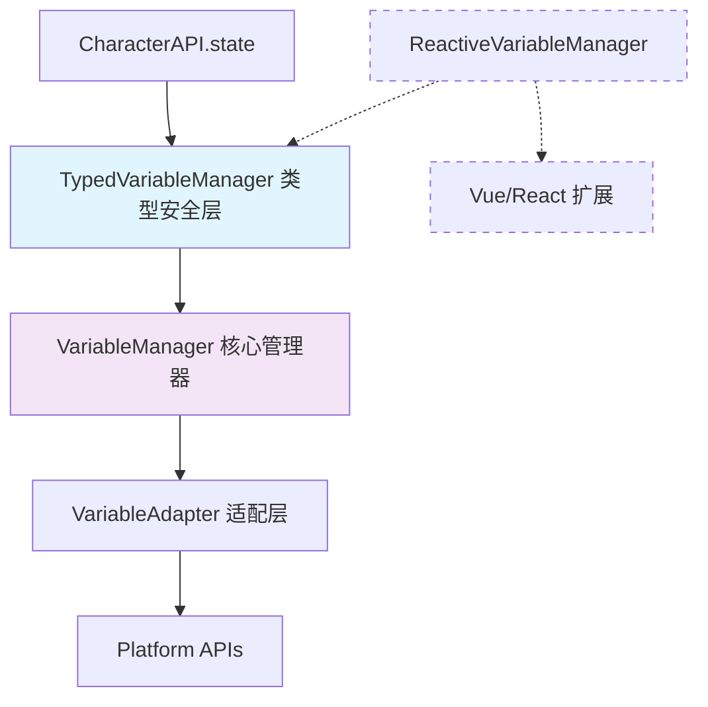
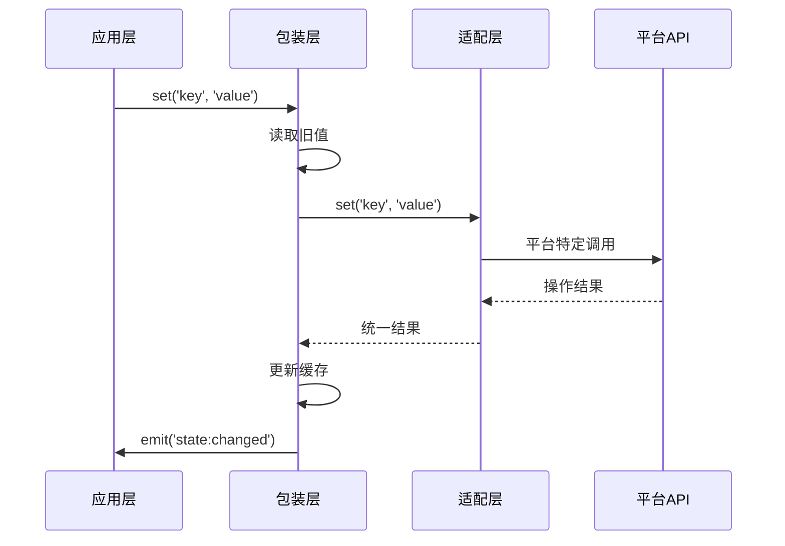

# CharacterAPI.variable 包装层实现

包装层是变量系统的核心，对外提供统一的规范接口，对内依赖适配层翻译平台差异，并统一实现缓存、事件、降级等策略。

## 📋 快速导航

| 组件 | 职责 | 推荐度 | 适用场景 |
|------|------|--------|----------|
| [核心管理器](#核心管理器) | 基础变量操作 | ⭐⭐⭐ **必需** | 所有变量操作的基础 |
| [类型安全封装](#类型安全封装) | 类型验证与转换 | ⭐⭐⭐ **强烈推荐** | 生产环境的默认选择 |
| [响应式封装](#响应式封装) | Vue响应式集成 | ⭐⭐ **可选扩展** | 前端UI开发场景 |

---

## 🎯 设计目标

- **统一语义**：隐藏平台差异，提供稳定的 get/set/batch/watch 语义
- **可观察性**：标准化变量变更事件，桥接到 `CharacterAPI.events` 的 `state:changed`
- **策略增强**：实现缓存、重试、校验、降级等策略
- **RFC 融合**：遵循"包装=规范"的事件/日志结构，确保跨平台行为一致

---

## 🔌 CharacterAPI 接口映射

### 对外统一接口

```ts
// CharacterAPI.state - 面向开发者的最简接口
interface StateManager {
  get<T>(key: string, scope?: 'character' | 'chat' | 'global'): Promise<T | null>;
  set<T>(key: string, value: T, scope?: 'character' | 'chat' | 'global'): Promise<void>;
  update<T extends object>(updates: T, scope?: 'character' | 'chat' | 'global'): Promise<void>;
}

// 能力发现接口 - 供 UI/策略协商使用
export interface VariableCapabilities {
  supports: {
    scopes: { chat: boolean; global: boolean; character: boolean; message: boolean; script: boolean };
    batch: boolean;
    validation: boolean;
    encryption: boolean;
    ttl: boolean;
    watch: boolean;
    persistence: boolean;
  };
}
```

### 推荐架构层次



---

## 🏗️ 核心实现层次

### 1. 核心管理器 (VariableManager) ⭐⭐⭐

> **职责**：提供基础的变量 CRUD 操作、缓存、重试、事件派发等核心功能
> **必要性**：**绝对必需** - 整个变量系统的基础架构层

#### 核心特性

- ✅ **统一 CRUD 接口**：get/set/delete/exists/getMany/setMany 等
- ✅ **智能缓存策略**：LRU 缓存，提升高频访问性能
- ✅ **重试机制**：自动重试失败的操作，提高稳定性
- ✅ **事件系统**：变量变更事件，支持响应式更新
- ✅ **平台抽象**：通过适配层隐藏平台差异

#### 接口概览

```typescript
export class VariableManager {
  // 基础操作
  async get(key: string, scope?: VariableScope): Promise<string | undefined>
  async set(key: string, value: string, scope?: VariableScope): Promise<void>
  async delete(key: string, scope?: VariableScope): Promise<void>
  
  // 批量操作
  async getMany(keys: string[], scope?: VariableScope): Promise<Record<string, string | undefined>>
  async setMany(variables: Record<string, string>, scope?: VariableScope): Promise<void>
  
  // 高级操作
  async getAll(scope?: VariableScope): Promise<Record<string, string>>
  async clear(scope?: VariableScope): Promise<void>
  
  // 事件系统
  addEventListener(type: string, listener: EventListener): void
  removeEventListener(type: string, listener: EventListener): void
}
```

> 📖 **完整实现参考**：[附录 A.1 - VariableManager 完整实现](#a1-variablemanager-完整实现)

---

### 2. 类型安全封装 (TypedVariableManager) ⭐⭐⭐

> **职责**：基于 schema 提供类型安全、验证和转换功能
> **推荐度**：**强烈推荐** - 生产环境的默认选择

#### 核心优势

- ✅ **编译时类型检查**：TypeScript 类型推导，减少运行时错误
- ✅ **自动类型转换**：string ↔ number ↔ boolean ↔ object 智能转换
- ✅ **数据验证**：自定义验证器，确保数据一致性
- ✅ **默认值支持**：schema 驱动的默认值和必填字段
- ✅ **开发体验优秀**：IDE 智能提示，维护成本低

#### Schema 定义

```typescript
const gameSchema = {
  playerName: {
    type: 'string' as const,
    required: true,
    validator: (value: string) => value.length > 0
  },
  playerLevel: {
    type: 'number' as const,
    default: 1,
    validator: (value: number) => value >= 1 && value <= 100
  },
  playerSettings: {
    type: 'object' as const,
    default: { theme: 'dark', language: 'zh-CN' }
  }
};

// 类型安全的操作
const gameVars = new TypedVariableManager(gameSchema);
await gameVars.set('playerName', '张三');     // ✅ 类型正确
await gameVars.set('playerLevel', 10);       // ✅ 自动转换
const name = await gameVars.get('playerName'); // string 类型
const level = await gameVars.get('playerLevel'); // number 类型
```

> 📖 **完整实现参考**：[附录 A.2 - TypedVariableManager 完整实现](#a2-typedvariablemanager-完整实现)

---

### 3. 响应式封装 (ReactiveVariableManager) ⭐⭐

> **职责**：集成 Vue 响应式系统，提供双向绑定和计算属性
> **推荐度**：**可选扩展** - 适用于前端 UI 开发场景

#### 使用场景评估

| 优势 | 限制 |
|------|------|
| ✅ Vue 项目开发便利 | ⚠️ 框架依赖性强 |
| ✅ 双向绑定支持 | ⚠️ 使用场景有限 |
| ✅ 计算属性集成 | ⚠️ 增加系统复杂度 |

#### 响应式特性

```typescript
const reactiveVars = new ReactiveVariableManager();

// 响应式变量
const playerName = reactiveVars.useVariable('playerName', VariableScope.CHAT, '未命名');
const playerLevel = reactiveVars.useVariable('playerLevel', VariableScope.CHAT, 1);

// 双向绑定
const playerGold = reactiveVars.useTwoWayBinding('playerGold', VariableScope.CHAT, 0);

// 计算属性
const playerPower = reactiveVars.useComputedVariable('playerPower', () => {
  return playerLevel.value * 100 + parseInt(playerGold.value) / 10;
});
```

> 📖 **完整实现参考**：[附录 A.3 - ReactiveVariableManager 完整实现](#a3-reactivevariablemanager-完整实现)

#### 建议处理方式

```typescript
// 作为独立扩展包提供
import { createReactivePlugin } from '@tavern-helper/variable-reactive';
const reactiveManager = createReactivePlugin(typedManager);
```

---

## 🔧 核心接口与行为约定

### 统一接口规范

所有包装层实现都遵循以下核心接口：

```typescript
// 基础 CRUD 操作
async get(key: string, scope?: VariableScope): Promise<string | undefined>
async set(key: string, value: string, scope?: VariableScope): Promise<void>
async delete(key: string, scope?: VariableScope): Promise<void>

// 批量操作
async getMany(keys: string[], scope?: VariableScope): Promise<Record<string, string | undefined>>
async setMany(variables: Record<string, string>, scope?: VariableScope): Promise<void>

// 高级操作
async getAll(scope?: VariableScope): Promise<Record<string, string>>
async clear(scope?: VariableScope): Promise<void>
async getKeys(scope?: VariableScope): Promise<string[]>
```

### 行为约定

- ✅ **统一异步**：所有操作返回 Promise，确保接口一致性
- ✅ **事件驱动**：变更操作触发标准化事件，支持响应式更新
- ✅ **错误处理**：统一抛出 Error，保留平台信息用于调试
- ✅ **缓存策略**：智能缓存提升性能，支持缓存统计和清理

---

## 📡 事件系统与状态同步

### 标准事件规范

包装层统一桥接到 `CharacterAPI.events` 的标准事件：

```typescript
interface StateChangedPayload {
  scope: 'chat' | 'global' | 'character' | 'message' | 'script';
  key: string;
  oldValue?: any;
  newValue?: any;
  metadata: {
    operation: 'get' | 'set' | 'delete' | 'batch' | 'clear';
    timestamp: number;
    affectedKeys: string[];
    platform: string;
  };
}

// 事件派发示例
CharacterAPI.events.emit('state:changed', payload);
```

### 事件桥接流程



---

## ⚙️ 能力协商与降级策略

### 能力发现机制

```typescript
export interface VariableCapabilities {
  supports: {
    scopes: { chat: boolean; global: boolean; character: boolean };
    batch: boolean;        // 批量操作支持
    validation: boolean;   // 数据验证支持
    encryption: boolean;   // 加密存储支持
    ttl: boolean;         // 过期时间支持
    watch: boolean;       // 变量监听支持
  };
}
```

### 显式降级处理

| 不支持的能力 | 降级策略 | 日志记录 |
|-------------|----------|----------|
| **批量操作** | 循环单次操作 | 记录降级原因和性能影响 |
| **作用域** | 使用命名空间前缀 | 记录作用域映射关系 |
| **验证** | 跳过验证步骤 | 警告数据一致性风险 |
| **加密** | 明文存储 | 警告安全风险 |

---

## 🛠️ 工具函数与辅助功能

### 路径解析器

```typescript
export class VariablePathResolver {
  // 解析路径：'chat:playerName' → { scope: 'chat', key: 'playerName' }
  static parsePath(path: string): { scope?: VariableScope; key: string }
  
  // 构建路径：('playerName', 'chat') → 'chat:playerName'
  static buildPath(key: string, scope?: VariableScope): string
}
```

### 数据迁移工具

```typescript
export class VariableMigrator {
  // 作用域迁移：chat → character
  async migrateScope(fromScope: VariableScope, toScope: VariableScope): Promise<void>
  
  // 变量重命名：oldKey → newKey
  async renameVariable(oldKey: string, newKey: string, scope?: VariableScope): Promise<void>
  
  // 数据备份与恢复
  async backup(scope?: VariableScope): Promise<Record<string, string>>
  async restore(backup: Record<string, string>, scope?: VariableScope): Promise<void>
}
```

---

## 🚀 CharacterAPI 集成示例

### 推荐的集成方式

```typescript
// 1. 初始化类型安全管理器（推荐默认选择）
const typedManager = new TypedVariableManager(gameSchema, {
  enableCache: true,
  enableEvents: true
});

await typedManager.initialize();

// 2. 桥接到 CharacterAPI
window.CharacterAPI.state = {
  async get<T>(key: string, scope?: 'character' | 'chat' | 'global'): Promise<T | null> {
    const value = await typedManager.get(key, scope as any);
    return value === undefined ? null : value;
  },
  
  async set<T>(key: string, value: T, scope?: 'character' | 'chat' | 'global'): Promise<void> {
    await typedManager.set(key, value, scope as any);
  },
  
  async update<T extends object>(updates: T, scope?: 'character' | 'chat' | 'global'): Promise<void> {
    await typedManager.setMany(updates, scope as any);
  }
};

// 3. 事件桥接
typedManager.addEventListener('variableChanged', (event: any) => {
  window.CharacterAPI.events?.emit('state:changed', {
    scope: event.detail.scope,
    key: event.detail.key,
    oldValue: event.detail.oldValue,
    newValue: event.detail.newValue,
    metadata: {
      operation: 'set',
      timestamp: Date.now(),
      affectedKeys: [event.detail.key],
      platform: typedManager.getPlatform()
    }
  });
});
```

### 开发者使用示例

```typescript
// 初始化
await CharacterAPI.init();

// 类型安全的操作
const playerName = await CharacterAPI.state.get<string>('playerName', 'character');
await CharacterAPI.state.set('playerLevel', 10, 'character');
await CharacterAPI.state.update({
  playerGold: 2000,
  playerExp: 1500
}, 'character');

// 事件监听
CharacterAPI.events.on('state:changed', (payload) => {
  console.log(`变量 ${payload.key} 从 ${payload.oldValue} 变更为 ${payload.newValue}`);
});
```

---

## 📋 架构建议总结

### 🎯 **推荐的简化架构**

1. **核心层**：[`VariableManager`](#a1-variablemanager-完整实现) - 必需的基础功能
2. **类型安全层**：[`TypedVariableManager`](#a2-typedvariablemanager-完整实现) - 强烈推荐的默认选择
3. **扩展层**：[`ReactiveVariableManager`](#a3-reactivevariablemanager-完整实现) - 可选的框架特定功能

### 💡 **实施策略**

```typescript
// 默认导出类型安全版本
export { TypedVariableManager as VariableManager };
export { VariableManager as BaseVariableManager };

// 响应式功能作为独立插件
import { createReactivePlugin } from '@tavern-helper/variable-reactive';
const reactiveManager = createReactivePlugin(typedManager);
```


---

---

## 📚 附录 A：完整代码实现

### A.1 VariableManager 完整实现

```typescript
import { VariableAdapter, VariableScope, VariableResult, BatchResult } from './adapter';
import { adapterFactory } from './adapter-factory';

export interface VariableManagerConfig {
  platform?: string;
  enableCache?: boolean;
  cacheSize?: number;
  enableEvents?: boolean;
  defaultScope?: VariableScope;
  retryAttempts?: number;
  retryDelay?: number;
}

export class VariableManager {
  private adapter: VariableAdapter;
  private config: Required<VariableManagerConfig>;
  private cache = new Map<string, { value: string; timestamp: number; scope: VariableScope }>();
  private eventEmitter = new EventTarget();
  private initialized = false;

  constructor(config: VariableManagerConfig = {}) {
    this.config = {
      platform: config.platform || 'auto',
      enableCache: config.enableCache ?? true,
      cacheSize: config.cacheSize ?? 1000,
      enableEvents: config.enableEvents ?? true,
      defaultScope: config.defaultScope ?? VariableScope.CHAT,
      retryAttempts: config.retryAttempts ?? 3,
      retryDelay: config.retryDelay ?? 1000
    };

    this.adapter = adapterFactory.create(
      this.config.platform === 'auto' ? undefined : this.config.platform
    );
  }

  async initialize(): Promise<void> {
    if (this.initialized) return;

    await this.adapter.initialize();
    this.initialized = true;

    // 发送初始化完成事件
    if (this.config.enableEvents) {
      this.emitEvent('initialized', { platform: this.adapter.platform });
    }
  }

  async dispose(): Promise<void> {
    if (!this.initialized) return;

    await this.adapter.dispose();
    this.cache.clear();
    this.initialized = false;

    if (this.config.enableEvents) {
      this.emitEvent('disposed', {});
    }
  }

  private getCacheKey(key: string, scope: VariableScope): string {
    return `${scope}:${key}`;
  }

  private emitEvent(type: string, detail: any): void {
    if (!this.config.enableEvents) return;
    
    const event = new CustomEvent(type, { detail });
    this.eventEmitter.dispatchEvent(event);
  }

  private async withRetry<T>(
    operation: () => Promise<T>,
    operationName: string
  ): Promise<T> {
    let lastError: Error | undefined;
    
    for (let attempt = 1; attempt <= this.config.retryAttempts; attempt++) {
      try {
        return await operation();
      } catch (error) {
        lastError = error instanceof Error ? error : new Error(String(error));
        
        if (attempt < this.config.retryAttempts) {
          await new Promise(resolve => setTimeout(resolve, this.config.retryDelay));
        }
      }
    }
    
    throw new Error(`${operationName}失败，已重试${this.config.retryAttempts}次: ${lastError?.message}`);
  }

  // 基础操作方法
  async get(key: string, scope?: VariableScope): Promise<string | undefined> {
    if (!this.initialized) await this.initialize();

    const actualScope = scope ?? this.config.defaultScope;
    const cacheKey = this.getCacheKey(key, actualScope);

    // 检查缓存
    if (this.config.enableCache && this.cache.has(cacheKey)) {
      const cached = this.cache.get(cacheKey)!;
      return cached.value;
    }

    // 从适配器获取
    const result = await this.withRetry(
      () => this.adapter.get(key, actualScope),
      `获取变量 ${key}`
    );

    if (result.success && result.data !== undefined) {
      // 更新缓存
      if (this.config.enableCache) {
        this.updateCache(cacheKey, result.data, actualScope);
      }
      return result.data;
    }

    return undefined;
  }

  async set(key: string, value: string, scope?: VariableScope): Promise<void> {
    if (!this.initialized) await this.initialize();

    const actualScope = scope ?? this.config.defaultScope;
    const oldValue = await this.get(key, actualScope);

    const result = await this.withRetry(
      () => this.adapter.set(key, value, actualScope),
      `设置变量 ${key}`
    );

    if (!result.success) {
      throw new Error(result.error || '设置变量失败');
    }

    // 更新缓存
    if (this.config.enableCache) {
      const cacheKey = this.getCacheKey(key, actualScope);
      this.updateCache(cacheKey, value, actualScope);
    }

    // 发送变化事件
    if (this.config.enableEvents && oldValue !== value) {
      this.emitEvent('variableChanged', {
        key,
        scope: actualScope,
        oldValue,
        newValue: value
      });
    }
  }

  async delete(key: string, scope?: VariableScope): Promise<void> {
    if (!this.initialized) await this.initialize();

    const actualScope = scope ?? this.config.defaultScope;
    const oldValue = await this.get(key, actualScope);

    const result = await this.withRetry(
      () => this.adapter.delete(key, actualScope),
      `删除变量 ${key}`
    );

    if (!result.success) {
      throw new Error(result.error || '删除变量失败');
    }

    // 清除缓存
    if (this.config.enableCache) {
      const cacheKey = this.getCacheKey(key, actualScope);
      this.cache.delete(cacheKey);
    }

    // 发送删除事件
    if (this.config.enableEvents && oldValue !== undefined) {
      this.emitEvent('variableDeleted', {
        key,
        scope: actualScope,
        oldValue
      });
    }
  }

  async exists(key: string, scope?: VariableScope): Promise<boolean> {
    const value = await this.get(key, scope);
    return value !== undefined;
  }

  // 批量操作方法
  async getMany(keys: string[], scope?: VariableScope): Promise<Record<string, string | undefined>> {
    if (!this.initialized) await this.initialize();

    const actualScope = scope ?? this.config.defaultScope;
    const result: Record<string, string | undefined> = {};
    const uncachedKeys: string[] = [];

    // 检查缓存
    if (this.config.enableCache) {
      for (const key of keys) {
        const cacheKey = this.getCacheKey(key, actualScope);
        if (this.cache.has(cacheKey)) {
          result[key] = this.cache.get(cacheKey)!.value;
        } else {
          uncachedKeys.push(key);
        }
      }
    } else {
      uncachedKeys.push(...keys);
    }

    // 获取未缓存的变量
    if (uncachedKeys.length > 0) {
      const batchResult = await this.withRetry(
        () => this.adapter.getMany(uncachedKeys, actualScope),
        `批量获取变量`
      );

      for (const key of uncachedKeys) {
        const keyResult = batchResult.results[key];
        if (keyResult.success && keyResult.data !== undefined) {
          result[key] = keyResult.data;
          
          // 更新缓存
          if (this.config.enableCache) {
            const cacheKey = this.getCacheKey(key, actualScope);
            this.updateCache(cacheKey, keyResult.data, actualScope);
          }
        } else {
          result[key] = undefined;
        }
      }
    }

    return result;
  }

  async setMany(variables: Record<string, string>, scope?: VariableScope): Promise<void> {
    if (!this.initialized) await this.initialize();

    const actualScope = scope ?? this.config.defaultScope;
    const oldValues: Record<string, string | undefined> = {};

    // 获取旧值用于事件
    if (this.config.enableEvents) {
      for (const key of Object.keys(variables)) {
        oldValues[key] = await this.get(key, actualScope);
      }
    }

    const result = await this.withRetry(
      () => this.adapter.setMany(variables, actualScope),
      `批量设置变量`
    );

    if (!result.success) {
      throw new Error(`批量设置变量失败: ${result.errors.join(', ')}`);
    }

    // 更新缓存和发送事件
    for (const [key, value] of Object.entries(variables)) {
      if (this.config.enableCache) {
        const cacheKey = this.getCacheKey(key, actualScope);
        this.updateCache(cacheKey, value, actualScope);
      }

      if (this.config.enableEvents && oldValues[key] !== value) {
        this.emitEvent('variableChanged', {
          key,
          scope: actualScope,
          oldValue: oldValues[key],
          newValue: value
        });
      }
    }
  }

  async deleteMany(keys: string[], scope?: VariableScope): Promise<void> {
    if (!this.initialized) await this.initialize();

    const actualScope = scope ?? this.config.defaultScope;
    const oldValues: Record<string, string | undefined> = {};

    // 获取旧值用于事件
    if (this.config.enableEvents) {
      for (const key of keys) {
        oldValues[key] = await this.get(key, actualScope);
      }
    }

    const result = await this.withRetry(
      () => this.adapter.deleteMany(keys, actualScope),
      `批量删除变量`
    );

    if (!result.success) {
      throw new Error(`批量删除变量失败: ${result.errors.join(', ')}`);
    }

    // 清除缓存和发送事件
    for (const key of keys) {
      if (this.config.enableCache) {
        const cacheKey = this.getCacheKey(key, actualScope);
        this.cache.delete(cacheKey);
      }

      if (this.config.enableEvents && oldValues[key] !== undefined) {
        this.emitEvent('variableDeleted', {
          key,
          scope: actualScope,
          oldValue: oldValues[key]
        });
      }
    }
  }

  // 高级操作方法
  async getAll(scope?: VariableScope): Promise<Record<string, string>> {
    if (!this.initialized) await this.initialize();

    const actualScope = scope ?? this.config.defaultScope;
    const result = await this.withRetry(
      () => this.adapter.getAll(actualScope),
      `获取所有变量`
    );

    if (!result.success) {
      throw new Error(result.error || '获取所有变量失败');
    }

    return result.data || {};
  }

  async clear(scope?: VariableScope): Promise<void> {
    if (!this.initialized) await this.initialize();

    const actualScope = scope ?? this.config.defaultScope;
    const oldVariables = await this.getAll(actualScope);

    const result = await this.withRetry(
      () => this.adapter.clear(actualScope),
      `清除变量`
    );

    if (!result.success) {
      throw new Error(result.error || '清除变量失败');
    }

    // 清除缓存
    if (this.config.enableCache) {
      for (const key of Object.keys(oldVariables)) {
        const cacheKey = this.getCacheKey(key, actualScope);
        this.cache.delete(cacheKey);
      }
    }

    // 发送清除事件
    if (this.config.enableEvents) {
      this.emitEvent('scopeCleared', {
        scope: actualScope,
        clearedVariables: oldVariables
      });
    }
  }

  async getKeys(scope?: VariableScope): Promise<string[]> {
    if (!this.initialized) await this.initialize();

    const actualScope = scope ?? this.config.defaultScope;
    const result = await this.withRetry(
      () => this.adapter.getKeys(actualScope),
      `获取变量键列表`
    );

    if (!result.success) {
      throw new Error(result.error || '获取变量键列表失败');
    }

    return result.data || [];
  }

  // 缓存管理
  private updateCache(cacheKey: string, value: string, scope: VariableScope): void {
    // 检查缓存大小限制
    if (this.cache.size >= this.config.cacheSize) {
      // 删除最旧的缓存项
      const oldestKey = this.cache.keys().next().value;
      if (oldestKey) {
        this.cache.delete(oldestKey);
      }
    }

    this.cache.set(cacheKey, {
      value,
      timestamp: Date.now(),
      scope
    });
  }

  clearCache(): void {
    this.cache.clear();
    
    if (this.config.enableEvents) {
      this.emitEvent('cacheCleared', {});
    }
  }

  getCacheStats(): { size: number; maxSize: number; hitRate?: number } {
    return {
      size: this.cache.size,
      maxSize: this.config.cacheSize
    };
  }

  // 事件系统
  addEventListener(type: string, listener: EventListener): void {
    this.eventEmitter.addEventListener(type, listener);
  }

  removeEventListener(type: string, listener: EventListener): void {
    this.eventEmitter.removeEventListener(type, listener);
  }

  // 平台信息
  getPlatform(): string {
    return this.adapter.platform;
  }

  getCapabilities(): any {
    return this.adapter.capabilities;
  }

  getSupportedScopes(): VariableScope[] {
    return this.adapter.getSupportedScopes();
  }
}
```

### A.2 TypedVariableManager 完整实现

```typescript
export interface TypedVariableSchema {
  [key: string]: {
    type: 'string' | 'number' | 'boolean' | 'object' | 'array';
    default?: any;
    required?: boolean;
    validator?: (value: any) => boolean;
    transformer?: (value: any) => any;
  };
}

export class TypedVariableManager<T extends TypedVariableSchema> {
  private manager: VariableManager;
  private schema: T;

  constructor(schema: T, config?: VariableManagerConfig) {
    this.schema = schema;
    this.manager = new VariableManager(config);
  }

  async initialize(): Promise<void> {
    await this.manager.initialize();
  }

  async dispose(): Promise<void> {
    await this.manager.dispose();
  }

  private validateAndTransform<K extends keyof T>(
    key: K,
    value: any
  ): any {
    const fieldSchema = this.schema[key];
    if (!fieldSchema) {
      throw new Error(`未知的变量字段: ${String(key)}`);
    }

    // 类型转换
    let transformedValue = value;
    
    switch (fieldSchema.type) {
      case 'string':
        transformedValue = String(value);
        break;
      case 'number':
        transformedValue = Number(value);
        if (isNaN(transformedValue)) {
          throw new Error(`${String(key)} 必须是数字类型`);
        }
        break;
      case 'boolean':
        if (typeof value === 'string') {
          transformedValue = value.toLowerCase() === 'true';
        } else {
          transformedValue = Boolean(value);
        }
        break;
      case 'object':
      case 'array':
        if (typeof value === 'string') {
          try {
            transformedValue = JSON.parse(value);
          } catch (error) {
            throw new Error(`${String(key)} JSON解析失败: ${error}`);
          }
        }
        break;
    }

    // 自定义转换器
    if (fieldSchema.transformer) {
      transformedValue = fieldSchema.transformer(transformedValue);
    }

    // 自定义验证器
    if (fieldSchema.validator && !fieldSchema.validator(transformedValue)) {
      throw new Error(`${String(key)} 验证失败`);
    }

    return transformedValue;
  }

  private serialize(value: any): string {
    if (typeof value === 'string') {
      return value;
    }
    return JSON.stringify(value);
  }

  private deserialize<K extends keyof T>(key: K, value: string): any {
    const fieldSchema = this.schema[key];
    
    switch (fieldSchema.type) {
      case 'string':
        return value;
      case 'number':
        return Number(value);
      case 'boolean':
        return value.toLowerCase() === 'true';
      case 'object':
      case 'array':
        try {
          return JSON.parse(value);
        } catch (error) {
          throw new Error(`${String(key)} JSON解析失败: ${error}`);
        }
      default:
        return value;
    }
  }

  async get<K extends keyof T>(
    key: K,
    scope?: VariableScope
  ): Promise<T[K]['type'] extends 'string' ? string :
              T[K]['type'] extends 'number' ? number :
              T[K]['type'] extends 'boolean' ? boolean :
              any> {
    const rawValue = await this.manager.get(String(key), scope);
    
    if (rawValue === undefined) {
      const fieldSchema = this.schema[key];
      if (fieldSchema.default !== undefined) {
        return fieldSchema.default;
      }
      if (fieldSchema.required) {
        throw new Error(`必需的变量 ${String(key)} 不存在`);
      }
      return undefined as any;
    }

    return this.deserialize(key, rawValue);
  }

  async set<K extends keyof T>(
    key: K,
    value: T[K]['type'] extends 'string' ? string :
           T[K]['type'] extends 'number' ? number :
           T[K]['type'] extends 'boolean' ? boolean :
           any,
    scope?: VariableScope
  ): Promise<void> {
    const validatedValue = this.validateAndTransform(key, value);
    const serializedValue = this.serialize(validatedValue);
    await this.manager.set(String(key), serializedValue, scope);
  }

  async delete<K extends keyof T>(key: K, scope?: VariableScope): Promise<void> {
    await this.manager.delete(String(key), scope);
  }

  async exists<K extends keyof T>(key: K, scope?: VariableScope): Promise<boolean> {
    return await this.manager.exists(String(key), scope);
  }

  async getMany<K extends keyof T>(
    keys: K[],
    scope?: VariableScope
  ): Promise<Partial<Record<K, any>>> {
    const stringKeys = keys.map(k => String(k));
    const rawValues = await this.manager.getMany(stringKeys, scope);
    const result: Partial<Record<K, any>> = {};

    for (const key of keys) {
      const rawValue = rawValues[String(key)];
      if (rawValue !== undefined) {
        result[key] = this.deserialize(key, rawValue);
      } else {
        const fieldSchema = this.schema[key];
        if (fieldSchema.default !== undefined) {
          result[key] = fieldSchema.default;
        }
      }
    }

    return result;
  }

  async setMany<K extends keyof T>(
    variables: Partial<Record<K, any>>,
    scope?: VariableScope
  ): Promise<void> {
    const serializedVariables: Record<string, string> = {};

    for (const [key, value] of Object.entries(variables)) {
      const validatedValue = this.validateAndTransform(key as K, value);
      serializedVariables[key] = this.serialize(validatedValue);
    }

    await this.manager.setMany(serializedVariables, scope);
  }

  // 代理其他方法
  async clear(scope?: VariableScope): Promise<void> {
    return this.manager.clear(scope);
  }

  async getKeys(scope?: VariableScope): Promise<string[]> {
    return this.manager.getKeys(scope);
  }

  addEventListener(type: string, listener: EventListener): void {
    this.manager.addEventListener(type, listener);
  }

  removeEventListener(type: string, listener: EventListener): void {
    this.manager.removeEventListener(type, listener);
  }

  getPlatform(): string {
    return this.manager.getPlatform();
  }

  getSupportedScopes(): VariableScope[] {
    return this.manager.getSupportedScopes();
  }
}
```

### A.3 ReactiveVariableManager 完整实现

```typescript
import { ref, computed, watch, Ref } from 'vue';

export class ReactiveVariableManager {
  private manager: VariableManager;
  private reactiveCache = new Map<string, Ref<any>>();

  constructor(config?: VariableManagerConfig) {
    this.manager = new VariableManager({
      ...config,
      enableEvents: true
    });

    // 监听变量变化事件
    this.manager.addEventListener('variableChanged', (event: any) => {
      this.updateReactiveValue(event.detail.key, event.detail.scope, event.detail.newValue);
    });

    this.manager.addEventListener('variableDeleted', (event: any) => {
      this.updateReactiveValue(event.detail.key, event.detail.scope, undefined);
    });
  }

  async initialize(): Promise<void> {
    await this.manager.initialize();
  }

  private getCacheKey(key: string, scope: VariableScope): string {
    return `${scope}:${key}`;
  }

  private updateReactiveValue(key: string, scope: VariableScope, value: any): void {
    const cacheKey = this.getCacheKey(key, scope);
    const reactiveRef = this.reactiveCache.get(cacheKey);
    if (reactiveRef) {
      reactiveRef.value = value;
    }
  }

  // 创建响应式变量引用
  useVariable(key: string, scope?: VariableScope, defaultValue?: any): Ref<any> {
    const actualScope = scope ?? VariableScope.CHAT;
    const cacheKey = this.getCacheKey(key, actualScope);

    if (this.reactiveCache.has(cacheKey)) {
      return this.reactiveCache.get(cacheKey)!;
    }

    const reactiveRef = ref(defaultValue);
    this.reactiveCache.set(cacheKey, reactiveRef);

    // 初始化值
    this.manager.get(key, actualScope).then(value => {
      if (value !== undefined) {
        reactiveRef.value = value;
      }
    });

    return reactiveRef;
  }

  // 创建计算属性
  useComputedVariable<T>(
    key: string,
    computeFn: () => T,
    scope?: VariableScope
  ): Ref<T> {
    const actualScope = scope ?? VariableScope.CHAT;
    const computedRef = computed(computeFn);

    // 监听计算属性变化并同步到存储
    watch(computedRef, async (newValue) => {
      await this.manager.set(key, JSON.stringify(newValue), actualScope);
    }, { deep: true });

    return computedRef;
  }

  // 双向绑定
  useTwoWayBinding(key: string, scope?: VariableScope, defaultValue?: any): Ref<any> {
    const reactiveRef = this.useVariable(key, scope, defaultValue);

    // 监听本地变化并同步到存储
    watch(reactiveRef, async (newValue) => {
      if (newValue !== undefined) {
        await this.manager.set(key, String(newValue), scope);
      } else {
        await this.manager.delete(key, scope);
      }
    });

    return reactiveRef;
  }

  // 批量响应式变量
  useVariables(
    keys: string[],
    scope?: VariableScope
  ): Record<string, Ref<any>> {
    const result: Record<string, Ref<any>> = {};
    
    for (const key of keys) {
      result[key] = this.useVariable(key, scope);
    }

    return result;
  }

  // 清理响应式缓存
  clearReactiveCache(): void {
    this.reactiveCache.clear();
  }

  // 代理基础方法
  async get(key: string, scope?: VariableScope): Promise<string | undefined> {
    return this.manager.get(key, scope);
  }

  async set(key: string, value: string, scope?: VariableScope): Promise<void> {
    return this.manager.set(key, value, scope);
  }

  async delete(key: string, scope?: VariableScope): Promise<void> {
    return this.manager.delete(key, scope);
  }
}
```

### A.4 工具类完整实现

```typescript
export class VariablePathResolver {
  static parsePath(path: string): { scope?: VariableScope; key: string } {
    const parts = path.split(':');
    
    if (parts.length === 1) {
      return { key: parts[0] };
    }
    
    if (parts.length === 2) {
      const [scopeStr, key] = parts;
      const scope = this.parseScope(scopeStr);
      return { scope, key };
    }
    
    throw new Error(`无效的变量路径: ${path}`);
  }

  static parseScope(scopeStr: string): VariableScope {
    switch (scopeStr.toLowerCase()) {
      case 'chat': return VariableScope.CHAT;
      case 'global': return VariableScope.GLOBAL;
      case 'character': return VariableScope.CHARACTER;
      case 'message': return VariableScope.MESSAGE;
      case 'script': return VariableScope.SCRIPT;
      case 'default': return VariableScope.DEFAULT;
      default:
        throw new Error(`未知的作用域: ${scopeStr}`);
    }
  }

  static buildPath(key: string, scope?: VariableScope): string {
    return scope ? `${scope}:${key}` : key;
  }
}

export class VariableMigrator {
  constructor(private manager: VariableManager) {}

  async migrateScope(
    fromScope: VariableScope,
    toScope: VariableScope,
    keyFilter?: (key: string) => boolean
  ): Promise<void> {
    const variables = await this.manager.getAll(fromScope);
    const filteredVariables: Record<string, string> = {};

    for (const [key, value] of Object.entries(variables)) {
      if (!keyFilter || keyFilter(key)) {
        filteredVariables[key] = value;
      }
    }

    if (Object.keys(filteredVariables).length > 0) {
      await this.manager.setMany(filteredVariables, toScope);
    }
  }

  async renameVariable(
    oldKey: string,
    newKey: string,
    scope?: VariableScope
  ): Promise<void> {
    const value = await this.manager.get(oldKey, scope);
    if (value !== undefined) {
      await this.manager.set(newKey, value, scope);
      await this.manager.delete(oldKey, scope);
    }
  }

  async renameVariables(
    keyMapping: Record<string, string>,
    scope?: VariableScope
  ): Promise<void> {
    for (const [oldKey, newKey] of Object.entries(keyMapping)) {
      await this.renameVariable(oldKey, newKey, scope);
    }
  }

  async backup(scope?: VariableScope): Promise<Record<string, string>> {
    return await this.manager.getAll(scope);
  }

  async restore(
    backup: Record<string, string>,
    scope?: VariableScope,
    clearFirst = false
  ): Promise<void> {
    if (clearFirst) {
      await this.manager.clear(scope);
    }
    
    await this.manager.setMany(backup, scope);
  }
}
```

---

> 📖 **说明**：以上代码实现提供了完整的变量包装层功能，包括核心管理器、类型安全封装、响应式集成和实用工具类。这些实现可以直接用于生产环境，并根据具体需求进行定制和扩展。
